# Airbnb 如何预测你的住宿价格

> 原文：<https://towardsdatascience.com/how-airbnb-can-predict-the-price-of-your-accommodation-62de288dbf86?source=collection_archive---------52----------------------->

## 训练回归模型以预测住宿价格

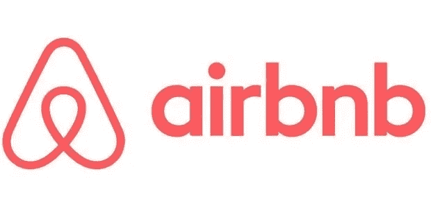

irbnb 是一个平台，它将租房的人和其他想租房的人联系起来。根据大量的广告，可以根据要出租的房产的特点假定一个典型的价格。

这一标准价格首先引起了房东的兴趣，他们将能够设定理想的租金价格，以最大限度地提高对其房产的需求，但也引起了那些将要出租公寓的人的兴趣，他们将了解他们希望出租的公寓相对于市场的位置。

在本文中，我们将一起了解如何创建一个模型，通过查看其特征来预测房地产的价格。为了做到这一点，我们将首先呈现我们拥有的数据，我们将清理它，然后我们将训练一个回归模型，我们将评估它。

# 数据集

数据集来自非常著名的数据集书店 Kaggle。它在柏林市收集了几年的广告。

我们将用于此分析的信息将与价格相关(价格、清洁费、额外人员费、保证金)、便利设施(是否有 wifi、洗衣机……)以及位置(经度、纬度)。

# 数据清理

数据清理是数据科学中最重要的事情之一。我们将在这里看到一些基本的例子。

## 价格

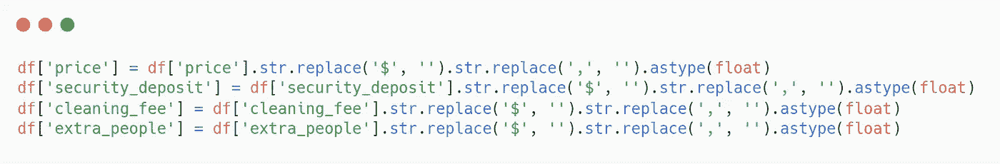

首先，对于价格，我们的训练算法需要格式为“51”而不是“51，00 $”的价格，因此我们将所有价格转换为所请求的格式。

> 函数 **replace** 只是将第一个参数替换为第二个参数。

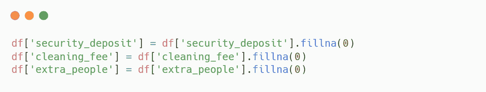

数据集中没有一些价格。如果我们没有价格值，就会导致错误。因此，我们认为，如果没有输入价格，则表明所有者希望从这项服务中免费获益。

> 函数 **fillna** 通过参数替换空值

## 舒适

便利设施功能是一个长长的列表，列出了公寓中所有可用的便利设施。所以我们要做些安排。

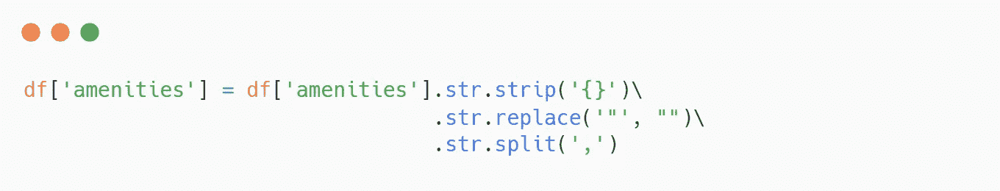

所以我们得到了一个有序的数组，我们可以很容易地把它可视化。

> 功能 **strip** 删除前导和尾随字符。

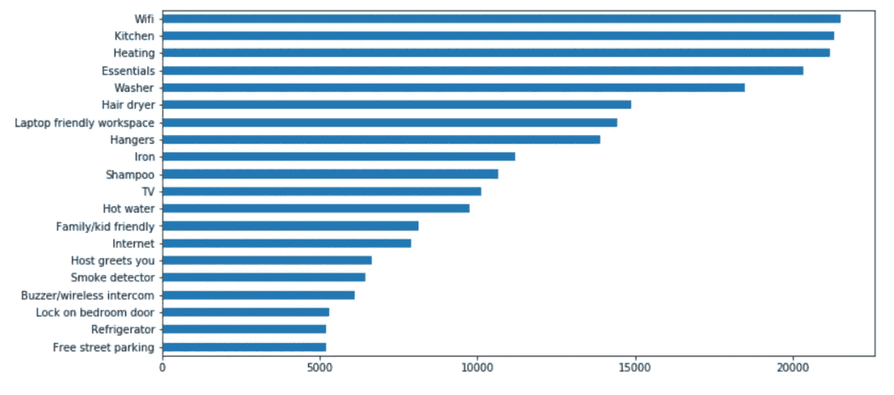

便利设施的分配。

我们可以在这里看到，Wifi、厨房、暖气和必需品都存在于大多数航空公司，比如超过 20，000 家航空公司拥有这些设施。所以似乎很明显，如果你的 airbnb 没有这些便利设施，价格会更低。

# 特征工程

从现有数据中创建新数据可以显著提高模型的性能。

当我们将 Airbnb 的价格与其位置进行比较时，我们可以很容易地看到，市中心的价格更贵。

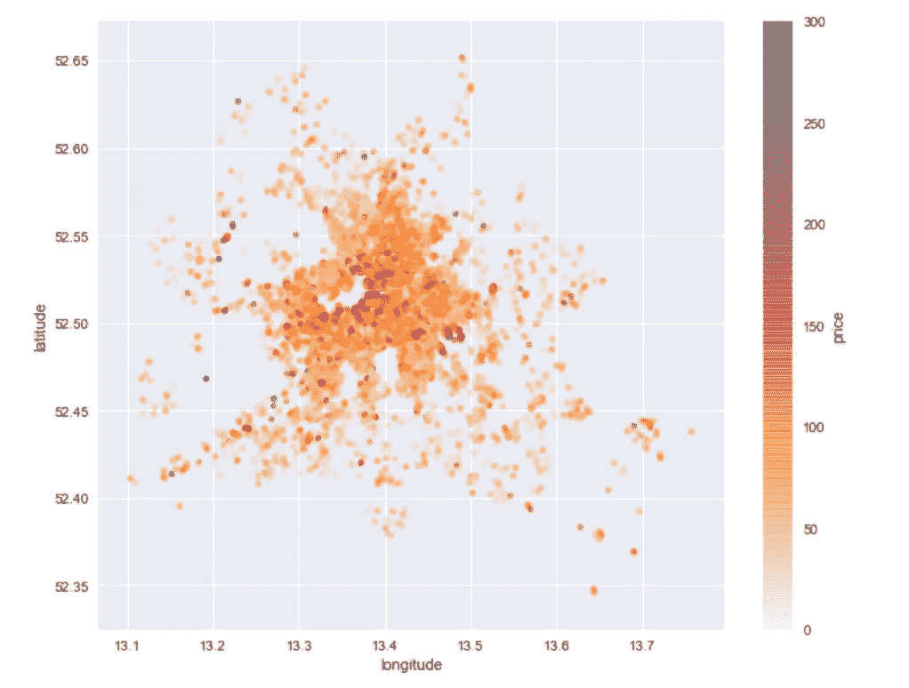

显然，离柏林市中心的距离对房产价格有直接影响。事实上，正如世界上所有的大城市一样，人们寻求靠近市中心，因此这些房产更受欢迎。

因此，我们将创建一个要素来计算公寓到柏林市中心的距离。

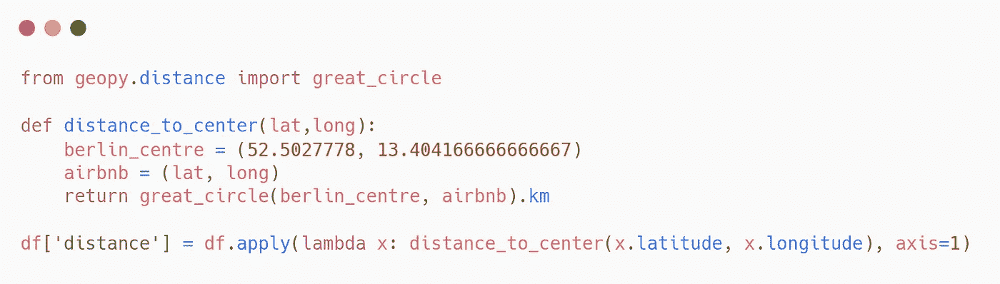

> **大圆**函数给出两点之间的直线距离。

# 建立模型

## 训练/测试分割

为了建立一个合适的模型，我们需要两组数据。一个用于训练我们的模型，另一个用于评分。
我们需要做的第一件事是分离特征和标签。

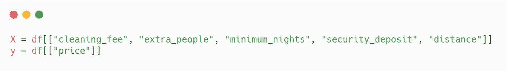

然后我们可以使用 scikit 学习库中的 **train_test_split** 函数来拆分我们的数据。

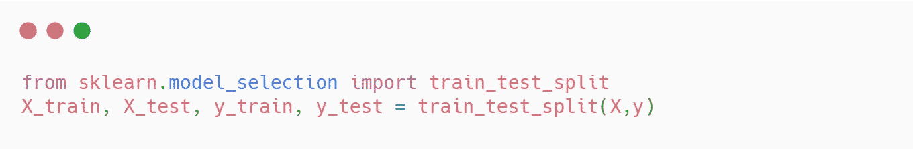

我们现在将尝试训练两个不同的模型来比较它们的性能。

## 随机森林回归量(RFR)

我们首先通过使用 scikit learn 实现非常简单地训练我们的模型。

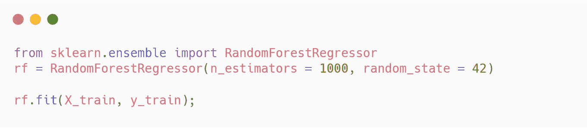

然后，我们用不同的指标对模型进行评分，这些指标将告诉我们模型的平均误差。

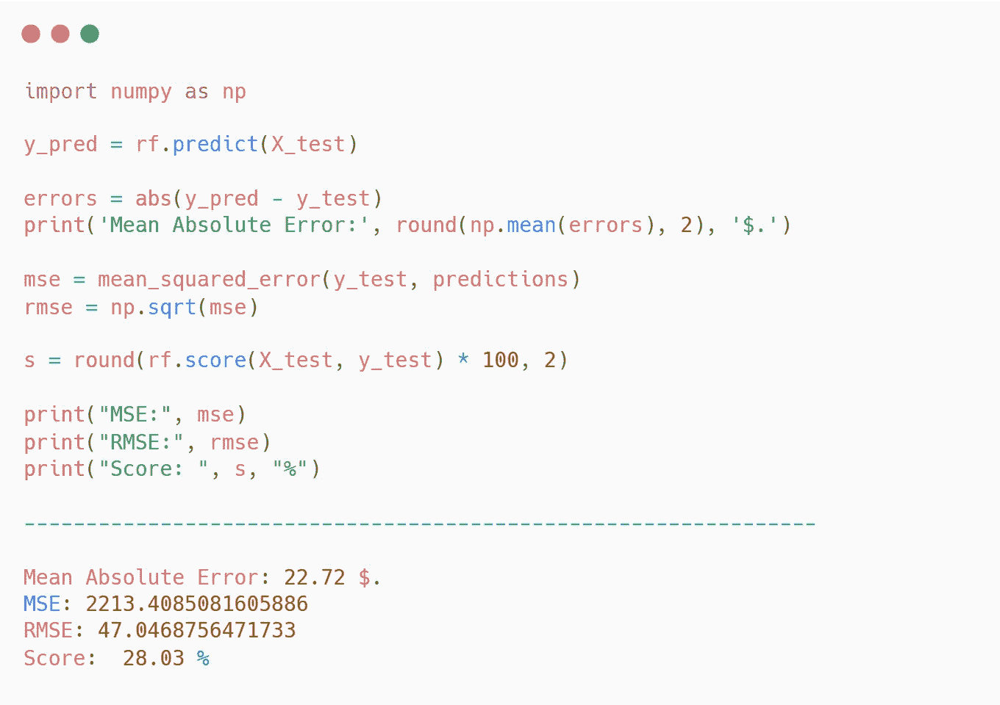

我们得到的平均房价为 22.72 美元，这意味着，平均而言，当我们试图猜测一套公寓的价格时，我们的模型错了 22.72 美元，这是值得尊敬的。

现在让我们尝试另一个模型，看看我们是否可以提高这个分数。

## XGBOOST

同样，我们将使用 scikit learn 的实现

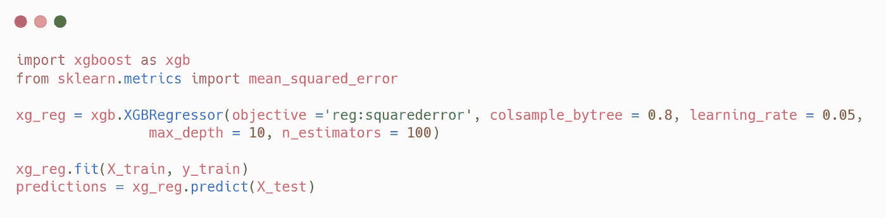

在训练完我们的模型之后，我们也可以尝试给我们的模型打分。

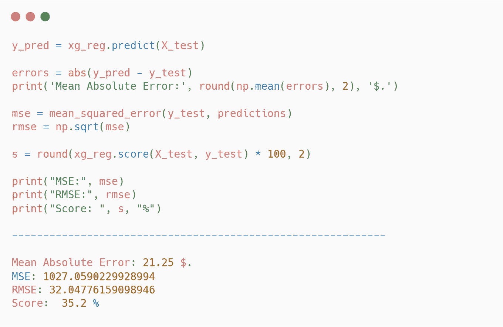

在这里，我们有一个超过 1 美元的 MAE 下降，这是非常令人鼓舞的。

# 结论

因此，我们在这里看到，在大约 15 分钟的时间里，通过一些想法，我们可以构建一个模型，该模型仅使用五个功能。

因此，很容易想象 Airbnb，像大多数在过去十年中创建的公司一样，在机器学习上投资很多。因此，该公司用更多的方法建立模型，这些方法不是试图将误差减少几美元，而是几美分。

因此，重要的是要认识到，甚至在你在平台上发布广告之前，它就知道将以什么价格出租。