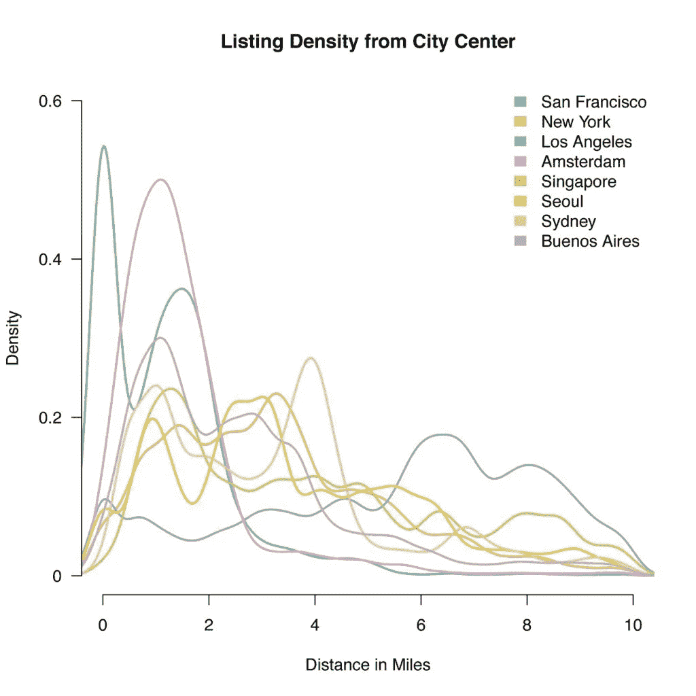
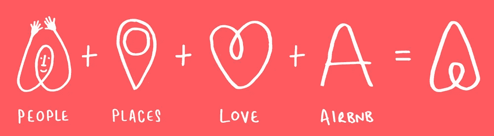

# Airbnb 如何利用位置数据改善客人体验

> 原文：<https://towardsdatascience.com/how-airbnb-leverages-location-data-for-improving-the-guest-experience-be66d47f56ec?source=collection_archive---------25----------------------->

## 一瞥位置如何在酒店行业扮演重要角色

[菲利奥斯·萨泽德斯](https://unsplash.com/@filios_sazeides?utm_source=medium&utm_medium=referral)在 [Unsplash](https://unsplash.com?utm_source=medium&utm_medium=referral) 上的照片

美式咖啡和意式浓缩咖啡对于星巴克、纽约和巴黎对于 Airbnb 的意义。Airbnb 通过为客人安排/提供寄宿家庭或当地体验，进入了“共享经济”的酒店业。Airbnb 是一个为*多余空间*服务的社区市场，有多余空间主人的人和去这些地区旅行的人可以在这里预订房子。

> Airbnb 是出于需要而诞生的。我们的房租一直在上涨。它诞生于一个问题。~ Jeo Gebbia，联合创始人

如果你是一个喜欢处理数字的人，你会惊讶地发现 Airbnb 在超过 191 个国家拥有超过 650，000 个主机的超过 300 万个房源。由于一些影响旅游业的因素，它在美国、法国、意大利、西班牙和英国最受欢迎，但旅行者可以在全球 98%的国家找到列表(住宿/体验)。

酒店业或共享经济正在他们的日常业务流程中利用位置分析。 [Locale](https://www.locale.ai/) 利用位置数据进行实时移动分析，帮助组织改善业务和客户体验。

让我们来看看 [Airbnb](https://www.airbnb.co.in/) 如何利用位置数据来扩展其业务并提供更好的客户体验。

# 位置相关性

我们当中有多少人知道 Bir 账单？

我自己最近也发现了这一点。Bir 是喜马偕尔邦的一个小而精致的村庄，以其修道院和滑翔伞/徒步旅行活动而闻名。

Airbnb 通过创造性地帮助人们在我们知之甚少的地方找到他们正在寻找的“本地”体验来弥合这些差距。他们的搜索算法结合各种信号，列出客人想要的体验或他们想要参观的地方，在这方面发挥了关键作用。

为了使他们的搜索和列表更加精确，Airbnb 使用了一种被称为“*列表质量分数*的东西，根据与搜索中心和客人评论的接近程度来列出地点。有趣的是， [Airbnb](https://www.airbnb.co.in/?locale=en&_set_bev_on_new_domain=1578718841_MzRiNDE2MzgwZGFj) 如何利用他们客人的声音，得出在用户搜索的位置预订的条件概率。[ [来源](https://medium.com/airbnb-engineering/location-relevance-at-airbnb-12c004247b07)

Airbnb wrt 距离搜索中心的密度[ [来源](https://medium.com/airbnb-engineering/location-relevance-at-airbnb-12c004247b07)

*例如，对华盛顿的 Clyde Hill 的搜索将因此滑向也搜索 Clyde Hill 的人通常会结束预订的街区，例如，Yarrow Point 或 Evergreen Point。*

# 更好的搜索排名

决定各个地方或体验如何在 Airbnb 上列出的因素与位置数据具有高度相关性。搜索排名算法帮助客人为他们的旅行找到完美的列表，主人找到非常适合他们的地方的客人。Airbnb 一直在通过调整一些信号，如智能定价、可见性和转换触发，来正确对待房地产经济。

当某个房源/地点位于*高需求区域*时，他们可以从 ***后期可见性*** 中受益(即您的地点可能会出现在搜索结果中，因为所有其他房源都已预订)。考虑到排名因素，一个好的位置和风险偏好的适当优化可能会对您的入住有利。

特定位置的转换触发器[ [源](https://higherbookings.com/airbnb-ranking-factors/)

# 智能定价

很大一部分 Airbnb 主持人将该网站视为额外收入，而不是他们的主要工作。80%的主人只在他们的家里、客房或度假屋租一个房间。Airbnb 对当地经济有着令人惊讶的积极影响，因为他们的客人停留时间是酒店客人的 2.4 倍，他们花费的钱是酒店客人的 2.3 倍，这些收入停留在紧密联系的社区内。

由[**Airbnb**](https://www.airbnb.co.in/?locale=en&_set_bev_on_new_domain=1577119690_MWQwODZkZmEyZjU0)**制作的官方视频展示了智能定价的实际运作方式:**

**主机(和 Airbnb)的整体盈利能力取决于多种因素，如主机可以投资的时间、先前的市场知识以及对变化的模式和季节性需求变化的相对响应能力。为了解决价格变化的问题，Airbnb 提出了一个改变游戏规则的解决方案，称为智能定价，它使用预测分析来得出任何给定一天的最佳价格。**

**此功能会根据实时变化的条件更改预订价格。**

> **影响智能定价的许多因素都有地理空间因素。住宿的位置、离公共交通的远近、季节和一个地区的便利设施等因素都会影响价格和预订。**

****

**罗马街区。来源:Airbnb**

# **建立信任**

**信任是“共享经济”的基本货币，也是我们所做的几乎所有事情的核心。Airbnb 正在通过提供三样东西来为其社区建立信任:安全、透明和支持。**

**有趣的是，科技在确保主人和客人之间的信任方面扮演着杠杆的角色。预测分析和行为分析相结合，用于评估每次列名的风险。风险可能是地点方面的，也可能是寄宿家庭/地方之前的任何可疑活动。为了避免这种情况，Airbnb 对客人和主人进行了许多背景调查，以确保他们没有任何犯罪记录。**

**布莱恩·切斯基强调了信任在共享经济中的重要性。用他自己的话说，**

> **我不是说全世界都会这样，但是有了 Airbnb，人们就睡在别人家里，别人的床上。因此，参与需要一定程度的信任，这与易贝或脸书不同。**

**[**Airbnb for Work**](https://www.airbnbforwork.com/) 为每个注册公司的旅行经理提供了一个仪表板，以跟踪他们遍布全球的员工。他们可以完全了解每个人目前正在旅行的地方和将来将要旅行的地方。**

**在这次 TED 演讲中，Joe Gebbia 讲述了他们是如何克服了 T4 对陌生人的偏见，并设计了一个平台来建立社区成员之间的信任。**

**这是人类的一种心理特征，我们相信那些在年龄、地点或地理上与我们高度相似的人。根据斯坦福大学对 Airbnb 的这个案例研究，只有当每个人在过去都有好的评价时，具有不同人口统计背景的人(主人/客人)才会倾向于信任对方。**

# **Airbnb 地图**

**人们通常很难相信 Airbnb 的制图师正忙着绘制世界地图。等等，什么？世界不是已经被 Google Maps、Waze、Foursquare(不一而足)绘制出来了吗？这不是假的，但 Airbnb 通过绘制世界各地的地图来找到它们与其他地点的关系，从而开始了解决大问题和难题的旅程。**

**有了 [Airbnb 地图](https://www.airbnb.co.in/map)，你可以追踪位于世界任何地方的 Airbnb 的实时活动。坐在你的房间里，你实际上可以看到有人飞过澳大利亚的大堡礁，或者有人在意大利的异国情调的民宿 Airbnb 登记入住，或者可能看到有人在巴黎享受真实的当地体验。**

**有一些具有文化意义的地区没有在地图上画出来。他们大多生活在当地社区的思想中，把这些地方叫做家。Airbnb 努力寻找和绘制这些地方，以便您知道您应该去世界上的哪个地方旅行，从而为您和您所爱的人创造一次完美的旅行！**

# **改善可持续旅游业**

**[健康旅行和健康目的地](https://news.airbnb.com/wp-content/uploads/sites/4/2018/05/Healthy-Travel-and-Healthy-Destinations.pdf)报告显示，Airbnb 通过其平台和社区模式帮助对抗大众旅游，促进可持续旅游。**

**航空旅馆鼓励地理多样性和客人的合理分布，以避免过度旅游。大多数抵达全球知名旅游目的地的客人都来自传统旅游区之外，Airbnb 房源中有 72%到 93%位于存在过度旅游风险的地区之外。这确保了与酒店相比，寄宿家庭不太集中，并导致客人的同质分散**

********

**不仅如此，游客对城市不同部分的看法在很大程度上影响了游客对特定地点/位置的流入。客人评论和评级的结合有助于人们决定他们的下一次寄宿家庭/体验。**

# **主人和客人接受**

**Airbnb 付出了很大的努力，以确保主机同样受益。他们通过设计更好的匹配算法使之成为可能，从而提高预订转化率。**

**对于客人在 Airbnb 的搜索引擎上输入的每个搜索查询，他们的模型都会计算相关主机想要满足客人请求的可能性(根据官方[数据](https://medium.com/airbnb-engineering/how-airbnb-uses-machine-learning-to-detect-host-preferences-18ce07150fa3)，这导致预订转化率增加了约 3.75%)，可以肯定地说，位置在其中起着非常关键的作用！**

**位置不仅仅是地图上的一个点。组织正在使用位置分析来扩大他们的业务。酒店业或共享经济也不例外。**