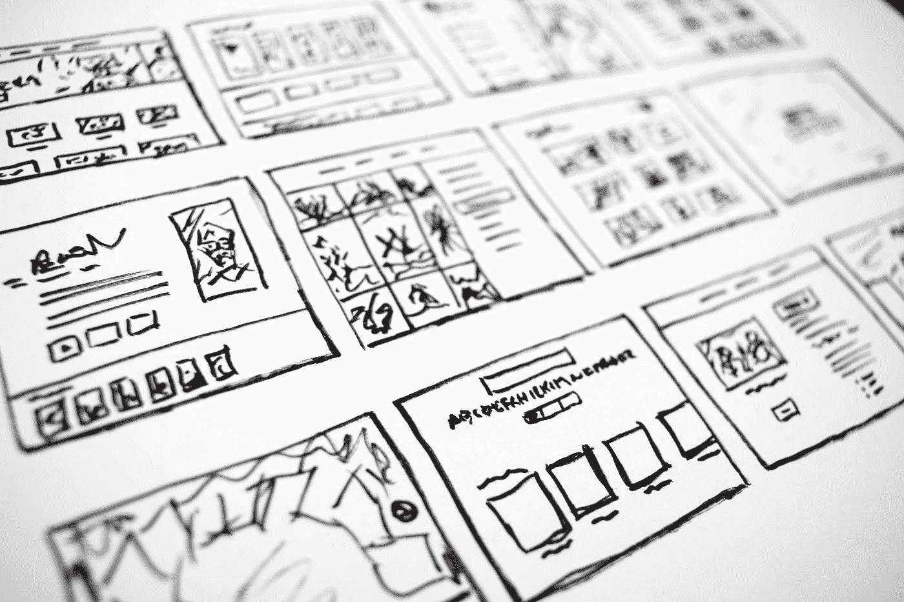
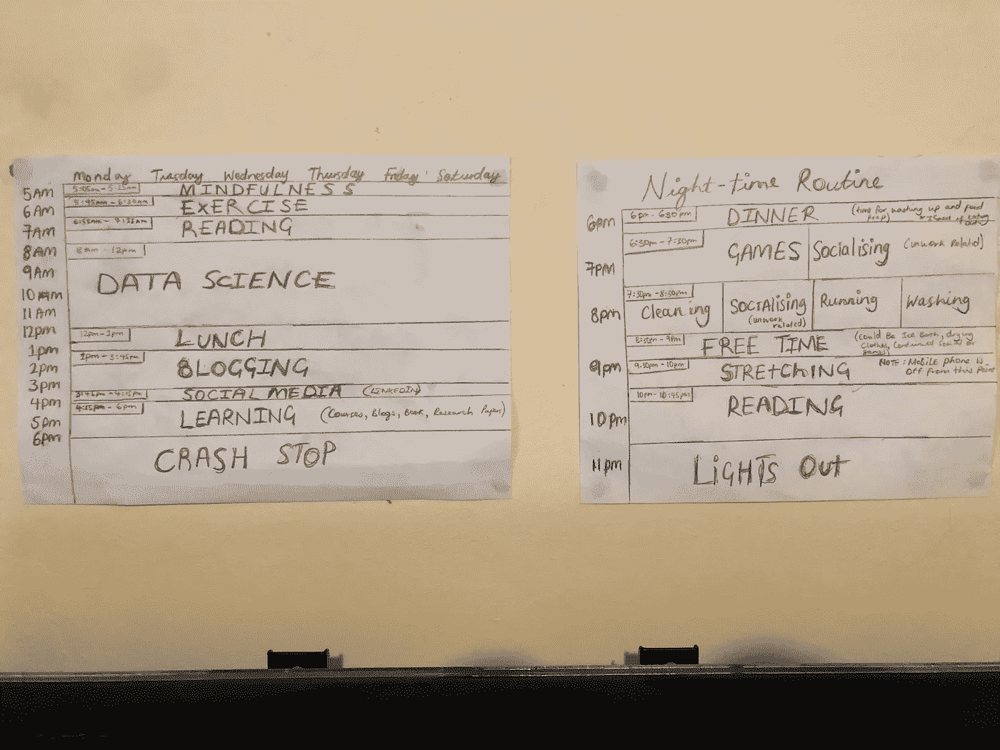

# 失业的数据科学家如何安排他们的一天

> 原文：<https://towardsdatascience.com/how-an-unemployed-data-scientist-structures-their-day-1712824e58fd?source=collection_archive---------11----------------------->

## [入门](https://towardsdatascience.com/tagged/getting-started)

## 维持秩序很重要

[的照片](https://unsplash.com/@halacious?utm_source=medium&utm_medium=referral)在[的 Unsplash](https://unsplash.com?utm_source=medium&utm_medium=referral) 上

## 介绍

让我们从陈述显而易见的事实开始…疫情正在发生，它正在影响市场。

我在 LinkedIn(包括我自己)上看到了大量“*开放工作*”的照片，更不用说那些创建帖子分享他们如何被解雇的故事并附上精美简历的大胆的人了——老实说，我赞扬他们所有人的大胆。我们不能忘记现在热衷于开始职业生涯的应届毕业生。

**很艰难！**

从技术上来说，我在本月 16 日之前仍然有工作，尽管实际上我从 3 月份就开始休假了。不用说，我需要为自己设定一个标准，以确保我做的事情能够从职业角度发展自己成为一名数据科学家——你可以在“ [*我如何在 8 个月内提升我的数据科学技能*](/how-i-levelled-up-my-data-science-skills-in-8-months-fae7897965ec) ”中了解更多关于我为确保这一点所做的具体事情。

 [## 我如何在 8 个月内提升我的数据科学技能

### 2020 年 3 月，我接到一个电话，通知我将暂时休假，直到另行通知——非正式的意思是我将…

towardsdatascience.com](/how-i-levelled-up-my-data-science-skills-in-8-months-fae7897965ec) 

当我第一次休假时，第一件对我来说变得明显的事情是**我需要订单**。我是那种需要为我的日子建立某种结构的人，清楚地知道那天我想完成什么——不，我不是在说待办事项清单。我觉得如果我没有条理，我的一天就会过去，在一天结束时，我会因为缺乏成就感而感到内疚，这很容易陷入自我怀疑的循环。

话虽如此，我认为有必要分享一下我目前是如何安排我的日子的，以此作为对其他数据科学家的一种思想激励，这些科学家目前因为某种原因而失业。

## 例行公事

我手工制作的时间表

上面是我制作的时间表的真实图像，我把它放在房间里的电视上方。当然，它并不严格，但我尽可能地遵循它，并做了一些修改。

**5.05–5.25:正念；5.45–6.30:练习**

> **注**:一起讨论这两个问题，因为它们同样重要

我们都知道在数据科学领域找工作的压力。很累。这还不包括你将要面临的所有拒绝(因为你将要被拒绝！).早上是我精力最充沛的时候，我相信如果我想度过富有成效的一天，让自己在精神和身体上处于一个良好的状态是很重要的。

正念的目标是让我在新的一天开始之前达到一种警觉、专注的放松状态，不加判断地刻意关注自己的想法和感觉。我发现这很有用，因为我觉得这让我能够活在当下，因此当我需要完成一些工作时，会让我感到更加投入。

锻炼是我用来强身健体的东西。我不太喜欢举重，我做健美操(包括自由式)，这需要很多能量。当我在训练时，我经常听播客(例如，走向数据科学播客、柴时间数据科学播客、数据科学的艺术家等)，但如果有一天我不想健身，我会有一个播放列表——这很粗略。

**6.55–7.55:读数**

我是那些每周读一本书的人之一，但这个位置不一定是放书的(虽然我去哪里都带着一本书，这样我可以在等待的时候挤出几页)。这个时间段是分配给阅读博客文章的。一天中，我通常会保存我在网上找到的有趣的博客帖子，这次我会阅读它们(因此我正在阅读我前一天保存的帖子)——我发现这让我做好了心理准备，因为我经常受到其他人工作的启发。

**8.00-12.00:数据科学**

如果我是志愿者/自由职业者，或者我有一个正在进行的个人项目，它适合这里。我相信，每当我在做一个编程任务时，我都应该划出一大块时间，这样我就可以真正地迷失在工作中——那种心流状态。

目前，我正在做一个个人项目，我在这个项目中使用机器学习来检测欺诈[。这个项目的目标不是获得一个准确的模型，相反，我更关注其他东西，如机器学习架构(批量训练，即时预测，在这个实例中通过 REST API 服务)，持续集成和部署管道，部署到没有容器的 PaaS(即 Heroku)，以及部署到 IaaS(即 AWS ECS)。](/using-machine-learning-to-detect-fraud-f204910389cf)

 [## 使用机器学习来检测欺诈

### 端到端机器学习项目的开始

towardsdatascience.com](/using-machine-learning-to-detect-fraud-f204910389cf) 

考虑到这一点，我打算把重点放在软件工程最佳实践上，因为我相信“ [*数据科学家应该知道软件工程最佳实践*](/data-scientist-should-know-software-engineering-best-practices-f964ec44cada) *”。*

 [## 数据科学家应该知道软件工程的最佳实践

### 成为不可或缺的数据科学家

towardsdatascience.com](/data-scientist-should-know-software-engineering-best-practices-f964ec44cada) 

**12.00–1.00:午餐**

是的，我不吃午饭。留出时间来分散注意力和集中注意力一样重要。我不打算深究其中的原因，但我想推荐的一本书是《 [*学习如何学习*](https://www.amazon.co.uk/Learning-How-Learn-Spending-Studying/dp/0143132547) 》。

> **注意**:我不做联盟营销，所以我购买一本书的任何链接都只是推荐，因为它对我有用。

**1.00–3.45:写博客**

我更喜欢坐在博客前，在一天之内写完所有的东西，所以我留出了 2 小时 45 分钟的时间来敲打按钮。

你可能在想"*你怎么会有时间为你的博客出主意呢？*"或"*如果需要编码怎么办？*”。简而言之，我在晚饭后有相当多的时间来做我请求的事情，即使它是作为其他事情被屏蔽的，但总的来说，我相信我需要一篇完整的文章来准确地回答这些问题。

**3.45–4.30:社交媒体**

这一点很重要，因为我一直在谈论建立一个数据科学网络。

> 人际关系很重要，但它不能代替努力工作！

我很感激我的博客帖子越来越受欢迎，自然会有人想和你聊聊，老实说，你遇到的酷人的数量令人惊讶。然而，当这消耗你的时候，它就成了一个问题。

是的，你想建立关系网，结识新朋友。是的，你想高质量地回答人们对你提出的所有问题。是的，你想在你的 feed 上看到猫的图片，但最终目标是将你自己发展成为一名精英数据科学家，因此你应该设定你的界限并坚持下去。

> **注意**:我也在午餐时间上社交媒体，尽管这通常更多是为了休闲和猫咪图片。

**4.15–6.00:学习**

如果我意识到我需要为我的项目学习一个新的框架，或者我正在参加一门课程，或者我正在阅读一篇研究论文，或者我想写一些我以前没有尝试过的东西……这些都在这里。

 [## 学习数据科学的 3 个阶段

### 了解学习的 3 个阶段，以及我们如何将其有效地应用于数据科学学习

towardsdatascience.com](/3-stages-of-learning-data-science-9a04e96ba415) 

**6.00:急停**

在这一点上，我已经从工作模式中解脱出来，除此之外的任何事情都是纯粹的休闲或承担责任。

现在我失业了，我利用这个时间(通常是 6.30-8.00)申请工作，因为我知道英国人将结束工作，我们可以进行更长/更深入的对话——这是如何关联的？我认为找工作的唯一途径不是填申请表。

## 包裹

在我看来，有一个结构是一天高效工作的基础。此外，在一个充满不确定性的时代，尤其是对于那些被解雇的人，我认为人们必须花时间考虑他们的精神和身体健康以及他们的职业生涯。“ [*得到一份数据科学的工作比以往任何时候都难*](/getting-a-data-science-job-is-harder-than-ever-fb796aae1922) ”并且在你发展自己的同时，需要一些[迫切的耐心](https://www.leadershipnow.com/leadingblog/2008/08/what_do_you_mean_urgent_patien.html)。作为一个失业的人，我向所有正在找工作的人致以最美好的祝愿。

保持活力，享受乐趣！

**p . s .**[Dhruvil Karani](https://medium.com/u/8f59d024f067?source=post_page-----1712824e58fd--------------------------------)写了一篇关于求职的精彩文章，我相信每个人都应该读一读——“[*在新冠肺炎中部被解雇并被聘为数据科学家*](/getting-fired-and-hired-as-a-data-scientist-in-the-middle-of-covid-19-2c6626556cf8) ”

 [## 被解雇，在新冠肺炎中部被聘为数据科学家

### 困难时期找工作的心得。

towardsdatascience.com](/getting-fired-and-hired-as-a-data-scientist-in-the-middle-of-covid-19-2c6626556cf8) 

让我们继续 LinkedIn 上的对话…

 [## Kurtis Pykes -人工智能作家-走向数据科学| LinkedIn

### 在世界上最大的职业社区 LinkedIn 上查看 Kurtis Pykes 的个人资料。Kurtis 有一个工作列在他们的…

www.linkedin.com](https://www.linkedin.com/in/kurtispykes/)