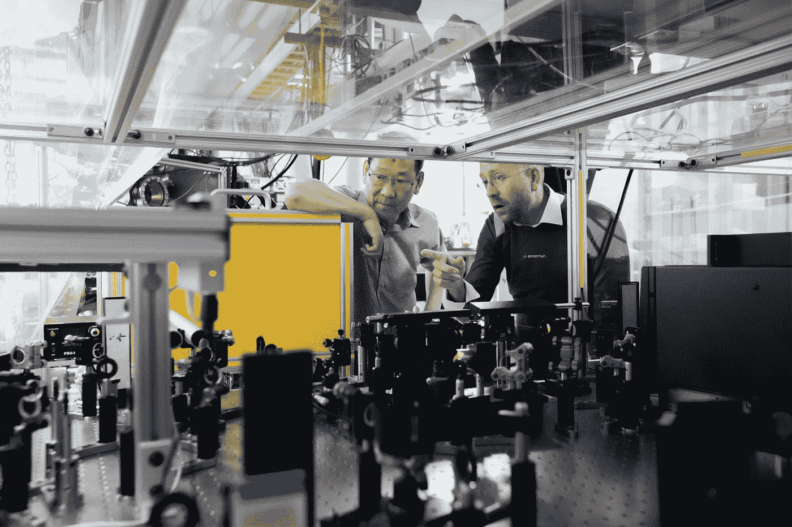

# 我是如何以及为什么从核心工程流转向数据科学家的

> 原文：<https://towardsdatascience.com/how-and-why-i-shifted-from-a-core-engineering-stream-to-one-of-a-data-scientist-437cb402e542?source=collection_archive---------53----------------------->

## 以及为什么不仅仅学习数据科学是个好主意

[信用](https://medium.com/r?url=https%3A%2F%2Funsplash.com%2F%40voodushevlyonniy%3Futm_source%3Dmedium%26utm_medium%3Dreferral)

在两年多一点的时间里，我从学习 Python 编程，到为客户构建仪表盘和管道，解决一系列机器学习和深度学习问题。当我开始我的职业生涯时，我开始了一份工作，这份工作利用了我的教育能力。我的背景是固体力学，并且在五年多的时间里获得了高级学位，我学习并不断地将我的基础知识应用于解决现实世界的问题，部分应用于基础研究。

随着时间的推移，我运行了更复杂的模拟，只是为了等待几天来优化它们，并寻找更好的方法来理解我所拥有的语料库。其他的困难是找到[最佳数量的材料组合](http://news.mit.edu/2020/neural-networks-optimize-materials-search-0326)，这将提供给实验者快速测试仅仅几个组合。然后我开始阅读一些文章，这些文章试图[将基础工程概念与统计学和数据科学结合起来，并取得了成功的结果](https://royalsocietypublishing.org/doi/10.1098/rsif.2017.0844)。这是我决定进行一次跳跃的时候，允许我自己利用我的领域知识，并用数据驱动的方法来赋予它。

# 目前的情况

即使你不是数据科学家，开始学习数据分析的基础知识，当然还有一点统计学，这也不是一个坏主意。它有助于以更好的方式分析您的数据，即使您的兴趣不是数据科学。例如，在一条生产装配线上，您会挑选多少样品进行质量测试，以准确代表您的整个生产批次？即使你的兴趣不在工程领域，统计学也是一个强大的工具，可以用来分析在[各种场景](https://www.robertniles.com/stats/margin.shtml)中呈现给你的数据。

解决正确的问题[照片致谢](https://unsplash.com?utm_source=medium&utm_medium=referral)

获得良好的教育资源也很容易，这是前所未有的好事情。开源教育和社区共享平台意味着有很多途径可以寻求帮助。从教育的“民主化”和获取新技术的最新发布的角度来看，这是非常好的。

另一方面，有很多人可以轻松地进行一些基本的特征工程，运行预测算法，并给出一些准确度分数。虽然这是一项巨大的资产，但随着自动化的到来，对它的需求将会迅速下降，并且[无代码或低代码威胁到一些开发人员的工作](https://analyticsindiamag.com/can-no-code-platforms-act-as-a-threat-for-developers-in-the-post-covid-world/)。据估计，到 2025 年，超过 60%的开发人员工作将实现自动化。当像 [this](https://www.datarobot.com/solutions/data-scientists/) 这样的工具承诺在几分钟内提供数据科学家花几个月时间做的事情时，在这个颠覆性的领域发展专业知识变得至关重要。

# 专业领域和应用

数据科学不是一系列旨在以机器人方式预测现象的行动。数据科学远不止于此，它是一个针对大量可能的问题得出明智答案的过程。

1.  ***正确的问题*** :要解决任何领域的问题，第一阶段就是提出正确的问题。我想解决什么问题？当我面前有太多更简单的选择时，还需要数据科学吗？给我的哪些数据是相关的，我可以扔掉看似无关的数据吗？我可以信任数据源吗？有没有自动化工具或更简单的工程解决方案可供我使用，来解决手头的问题？
2.  *:在一个充满自我激励的环境中，如果你熟悉这个行业，就更有可能找到正确的问题领域来解决。它帮助一个人从单纯的交易角色转变为行业中更不可或缺的一部分；一个能够从宏观的角度看到需要解决的问题，一个能够理解数据争论的本质的人。*

**

*[信用](https://imgs.xkcd.com/comics/machine_learning.png)*

*3. ***关注客户*** :与客户的有效沟通需要一个人在解释曲线之前先行一步。学习复杂的算法是美妙的，但是能够将所学转化为业务特定的结果并进行有效的沟通，是许多组织中普遍存在的差距。*

# *如何在一个动态的领域成功地操纵*

*新技术来来去去。当你掌握了一种算法，就会有新的算法出现。跟上每一个新出现的算法变成了一场无休止的竞赛。此外，还建议在一段时间内对这些算法的稳定性进行测试。从更简单但有效的架构开始是一种更好的方法，并且已经证明对生产来说是稳定的。*

*依靠久经考验的技术足以解决你在现实世界中遇到的大多数问题。相反，花点时间了解数据、数据收集过程、替代数据来源，并花更多时间与您的客户或同事相处，以更好地了解他们打算解决的问题。与此同时，有必要了解最近的发展，并磨练将支持你的领域的技能。*

*专注于获得一个被人们实际使用的模型远比模型精度增加 1%重要。在那些缓慢适应人工智能力量的行业中，首先展示这门子科学的力量是很重要的。这就是有效的沟通和“推销”你的技能的最重要的地方。一旦锚被牢牢固定，你就可以尝试更复杂的算法。*

*数据工程可能会越来越有价值久而久之。在演示文稿中展示漂亮的图表是大多数数据科学项目的目的。完全缺乏能够真正将项目投入生产并在一段时间内监控它们的数据科学家——端到端的管道。对手头的问题有一个更全面的了解，快速评估你可以使用的工具，在不影响工作真实性的情况下“完成任务”,这在商业中至关重要。因此，我的建议是应用简单的解决方案，从小处着手。仅在需要时使用复杂算法。*

# *总结想法*

*数据科学领域正在快速变化。我们与数据交互的方式将会发生巨大的变化。随着越来越多的自动化工具进入外行人的手中，对专业技能的需求将呈指数级增长，而这些专业技能是通过花费大量时间来解决工业问题而获得的。*

*数据科学工具就是工具。他们不是解决问题的人。要解决的问题比跑笔记本大得多。笔记本电脑是必不可少的，但只有一个更大的变速箱齿轮需要运行引擎与其他几个齿轮串联。还要记住，你不可能成为超人，学会解决问题所需的所有技能。大多数问题都是通过集思广益解决的。*

*当我从核心机械工程转向数据科学时，我决定仍然扎根于我通过正式渠道研究的领域，只是选择通过数据科学的附加工具来加强它。这使我能够用不熟悉这个行业的人难以理解的方式解决问题。*

*欢迎建设性的反馈！*