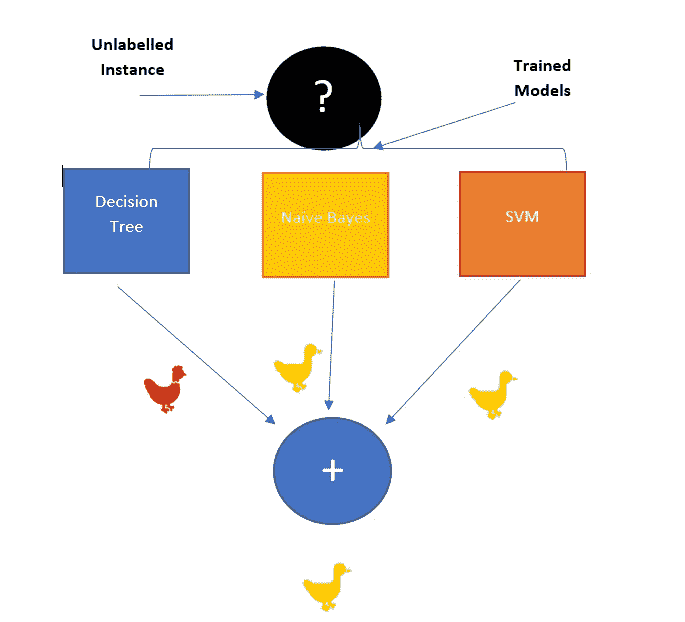
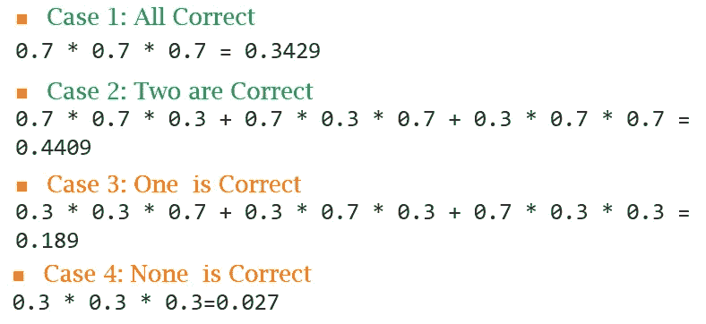
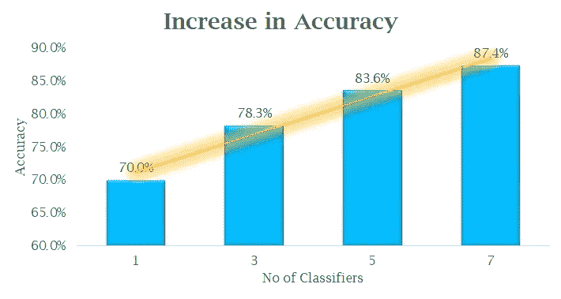
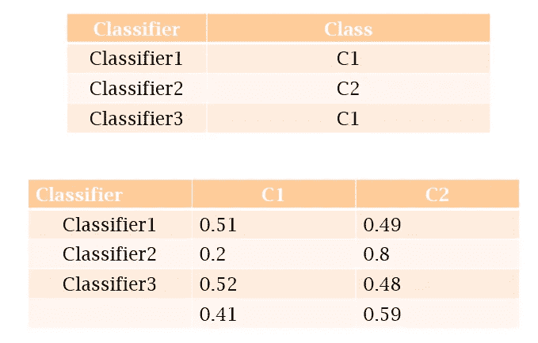
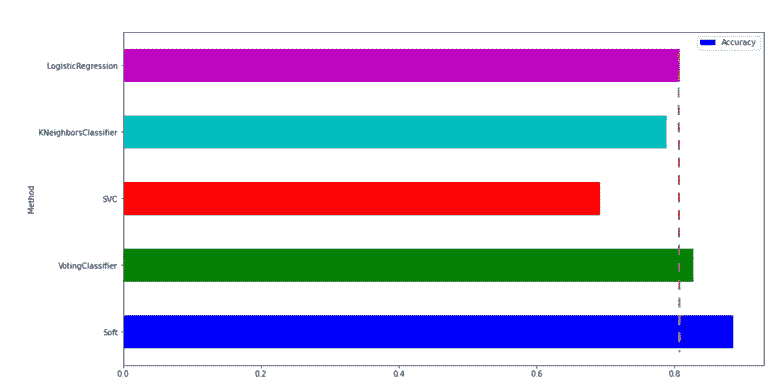

# 集合模型的方式和原因

> 原文：<https://towardsdatascience.com/how-and-why-of-the-ensemble-models-f869453bbe16?source=collection_archive---------43----------------------->

## 为什么群体智能会起作用？


图片来源:Unsplash([https://unsplash.com/photos/8I423fRMwjM](https://unsplash.com/photos/8I423fRMwjM))

受《谁想成为百万富翁》的启发，印度有一个著名的游戏节目叫做“KBC”。这有点像一个有多种答案选择的智力竞赛节目。如果参与者能够选择所有问题的正确选项，他或她可以赢得 1000 万印度卢比。如果他对任何问题不确定，参与者有一些选择。**其中一个选择是进行观众投票，由大多数人选择。**

这些问题可以是体育、神话、政治、音乐、电影、文化、科学等各种各样的主题。观众不是这类问题的专家。有趣的是，多数人的意见往往会成为正确的答案。**这是组装背后的核心概念。**

> 似乎是一个神奇的权利，让我们看看同样的数学直觉。

在 ML 的上下文中，使用下面的简单图表来呈现这个想法。现在每个人相当于一个分类器，就像观众是多样化的，分类器越不相关越好。



图 1:集合模型的基本工作原理(来源:作者)

我们将在同一组数据上训练三个分类器。现在在预测的时候，我们将检查大多数分类器在说什么。假设这是一个鸭对母鸡的问题。因为他们中的两个都说它是一只鸭子，所以集合模型的最终决定是鸭子。

比方说，我们有一个分类准确率为 70%的分类器。如果我们增加更多的分类器，那么它会增加吗？

让我们假设我们从 3 个人/分类器开始。如果任何时候他们中有两个以上的人对预测是正确的，通过多数表决，我们得到正确的结果。如果分类器是独立的，那么 C1 和 C3 正确而 C3 不正确的概率是. 7 * 7 * 3。让我们来看一个更一般化的计算



图 2:分类准确率的计算(来源:作者)

上图展示了所有情况，情况 1 和情况 2 是我们预测正确的地方。现在修正后的整体准确率为 0.3429 + 0.4409 即 78.38%。

> 试想一下，如果我们只是添加更多的分类器，分类准确率从 70%提高到 78.33%。

如果我们增加更多的分类器或人群中更多的人，准确性会进一步提高，如下图所示。



图 3:分类精度与分类器数量的关系(来源:作者)

**硬投票对软投票:-**

当所有分类器对最终预测都有相同的发言权时，这被称为硬投票，如图 1 所示，而如果我们考虑分类器在特定决策或一些其他方案中的可信度，以给不同的分类器不同的权重，这被称为软投票。



图 4:硬投票和软投票(来源:作者)

在第一种情况下，它是硬投票，所以只考虑标签，在软投票中，我们更关注预测概率。我们找到类的平均概率并决定。

> 软投票比硬投票更细粒度。

**某些实施的时间**


图片来源:【https://unsplash.com/photos/fYD54gVXFGM 

```
from sklearn.ensemble import VotingClassifier
from sklearn.linear_model import LogisticRegression
from sklearn.svm import SVC
from sklearn.neighbors import KNeighborsClassifier
#Initalize the classifier#Individual Classifiers
log_clf = LogisticRegression(random_state=42)
knn_clf = KNeighborsClassifier(n_neighbors=10)
svm_clf = SVC(gamma=”auto”, random_state=42, probability=True)#hardvoting
voting_clf = VotingClassifier(
 estimators=[(‘lr’, log_clf), (‘knn’, knn_clf), (‘svc’, svm_clf)],
 voting=’hard’)# Voting can be changed to ‘Soft’, however, the classifier must support predict the probability
#softvoting
voting_clf_soft = VotingClassifier(
 estimators=[(‘lr’, log_clf), (‘knn’, knn_clf), (‘svc’, svm_clf)],
 voting=’soft’)
```

结果如下图所示



图 5:个体分类器与集成分类器(来源:作者)

这个实验是在“声纳”数据上进行的，可以看出软投票和硬投票分类器比单个分类器带来了大约 7-8%的改进。

进一步的细节，你可以看看我们的[笔记本](https://www.kaggle.com/saptarsi/ensembling-part-1-sg)或者视频[这里](https://www.youtube.com/watch?v=qgoAYbIS1sU&t=583s)。

**结论:**

在本教程中，我们快速概述了群体智能是如何体现在合奏作品中的。我们讨论了软投票和硬投票。还有更流行的方法，如随机森林和 Boosting，这些方法改天会用到。

**参考文献:**

[1][https://towards data science . com/a-guide-to-ensemble-learning-d 3686 c 9 bed 9 a](/a-guide-to-ensemble-learning-d3686c9bed9a)

[2][https](https://mlwave.com/kaggle-ensembling-guide/)://ml wave . com/ka ggle-ensembling-guide/