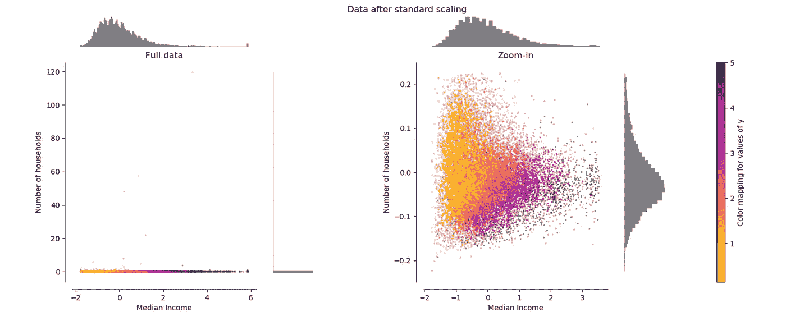
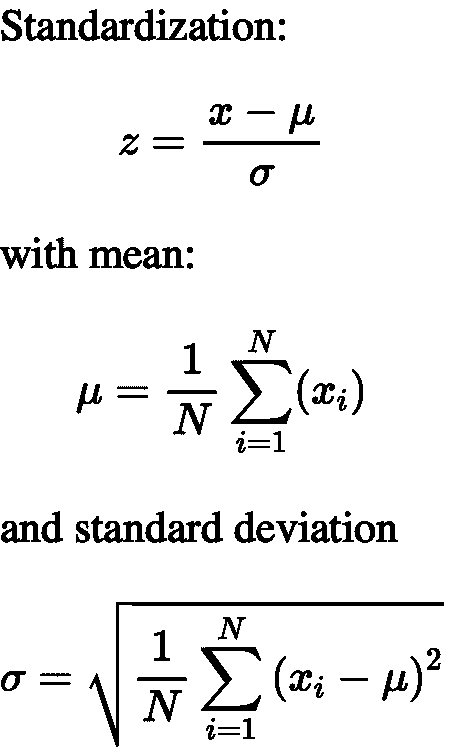

# 如何以及为什么标准化数据:python 教程

> 原文：<https://towardsdatascience.com/how-and-why-to-standardize-your-data-996926c2c832?source=collection_archive---------6----------------------->

## 在这篇文章中，我将解释为什么以及如何在 Python 中使用 scikit-learn 来应用标准化



图摘自:[https://sci kit-learn . org/stable/auto _ examples/preprocessing/plot _ all _ scaling . html](https://scikit-learn.org/stable/auto_examples/preprocessing/plot_all_scaling.html)。左侧子图:未缩放的数据。右侧子情节:转换后的数据。

你好。

这是我的第一篇中帖。我是一名电子和计算机工程师，目前正在完成生物医学工程和计算神经科学领域的博士研究。在过去的 4 年里，我一直在研究机器学习问题。我在网络上看到的一个非常普遍的问题是，在拟合机器学习模型之前，如何标准化数据以及为什么要这样做。

> scikit-learn 的`[StandardScaler](https://scikit-learn.org/stable/modules/generated/sklearn.preprocessing.StandardScaler.html)`是如何工作的？

一个人想到的第一个问题是:

> ***为什么首先要标准化？***

# **为什么要在拟合 ML 模型之前进行标准化？**

嗯，想法就是 ***简单的*** 。在不同尺度下测量的变量对模型拟合&模型学习函数的贡献不同，最终可能产生偏差。因此，为了处理这个潜在的问题，通常在模型拟合之前使用特征标准化(μ=0，σ=1)。

要使用`scikit-learn`来实现这一点，我们首先需要构建一个包含特性和样本的输入数组`X`，其中`X.shape`为`[number_of_samples, number_of_features]`。

请记住，所有的`scikit-learn`机器学习(ML)功能都期望输入一个具有该形状的`numpy`数组`X`，即行是样本，列是特征/变量。说到这里，让我们假设我们有一个矩阵`X`，其中每个**行/线**是一个**样本/观察值**，每个**列**是一个**变量/特征。**

**注** : *基于树的模型通常不依赖于缩放，但非树模型模型如 SVM、LDA 等。往往非常依赖它。*

如果你想在交互式路线图和活跃的学习社区的支持下自学数据科学，看看这个资源:[https://aigents.co/learn](https://aigents.co/learn)

# **方法核心**

主要思想是在应用任何机器学习模型之前，**将**即`μ = 0`和`σ = 1`标准化/规范化`X`、*的**特征/变量/列**、*、**。因此，`StandardScaler()`将**归一化特征**，即 X， ***的每一列单独*** ，这样每一列/特征/变量将有`μ = 0`和`σ = 1`。**



标准化程序的数学公式。图片由作者生成。

# **工作 Python 代码示例:**

```
from sklearn.preprocessing import StandardScaler
import numpy as np

# 4 samples/observations and 2 variables/features
X = np.array([[0, 0], [1, 0], [0, 1], [1, 1]])# the scaler object (model)
scaler = StandardScaler()# fit and transform the data
scaled_data = scaler.fit_transform(X) 

print(X)
[[0, 0],
 [1, 0],
 [0, 1],
 [1, 1]])

print(scaled_data)
[[-1\. -1.]
 [ 1\. -1.]
 [-1\.  1.]
 [ 1\.  1.]]
```

**验证每个特征(列)的平均值为 0:**

```
scaled_data.mean(axis = 0)
array([0., 0.])
```

**验证每个特征(列)的标准差为 1:**

```
scaled_data.std(axis = 0)
array([1., 1.])
```

# **视觉示例中变换的效果**


图摘自:[https://sci kit-learn . org/stable/auto _ examples/preprocessing/plot _ all _ scaling . html](https://scikit-learn.org/stable/auto_examples/preprocessing/plot_all_scaling.html)。左侧子图:未缩放的数据。右侧子情节:转换后的数据。

# 摘要

*   `StandardScaler`移除平均值，并将每个特征/变量缩放至单位方差。该操作以独立于**的方式**按特征**执行。**
*   `StandardScaler`可能受到**异常值**(如果它们存在于数据集中)的影响，因为它涉及每个特征的经验平均值和标准偏差的估计。

# 如何处理异常值

*   手动方式(不推荐):目视检查数据，并使用异常值剔除统计方法(如四分位距(IQR)阈值法)剔除异常值。
*   推荐方法:使用`[RobustScaler](https://scikit-learn.org/stable/modules/generated/sklearn.preprocessing.RobustScaler.html)`来缩放特征，但是在这种情况下，使用对异常值稳健的**统计。该缩放器根据**分位数** **范围**(默认为 **IQR** :四分位数间范围)移除**中值**和**缩放**数据。*IQR 是第一个四分位数(第 25 个四分位数)和第三个四分位数(第 75 个四分位数)之间的范围。***

今天就到这里吧！希望你喜欢这第一个帖子！下一个故事下周开始。敬请关注&注意安全。

# 请继续关注并支持我

如果你喜欢这篇文章并觉得它有用，请关注我，为我的故事鼓掌支持我！

## -我的邮件列表只需 5 秒:[https://seralouk.medium.com/subscribe](https://seralouk.medium.com/subscribe)

## -成为会员支持我:【https://seralouk.medium.com/membership

# **参考文献**

[1][https://sci kit-learn . org/stable/modules/generated/sk learn . preprocessing . standard scaler . html](https://scikit-learn.org/stable/modules/generated/sklearn.preprocessing.StandardScaler.html)

[2][https://sci kit-learn . org/stable/modules/generated/sk learn . preprocessing . robust scaler . html](https://scikit-learn.org/stable/modules/generated/sklearn.preprocessing.RobustScaler.html)

# 和我联系

*   **领英**:[https://www.linkedin.com/in/serafeim-loukas/](https://www.linkedin.com/in/serafeim-loukas/)
*   **研究之门**:[https://www.researchgate.net/profile/Serafeim_Loukas](https://www.researchgate.net/profile/Serafeim_Loukas)
*   **https://people.epfl.ch/serafeim.loukasEPFL 简介** :
*   **堆栈溢出【https://stackoverflow.com/users/5025009/seralouk】:**