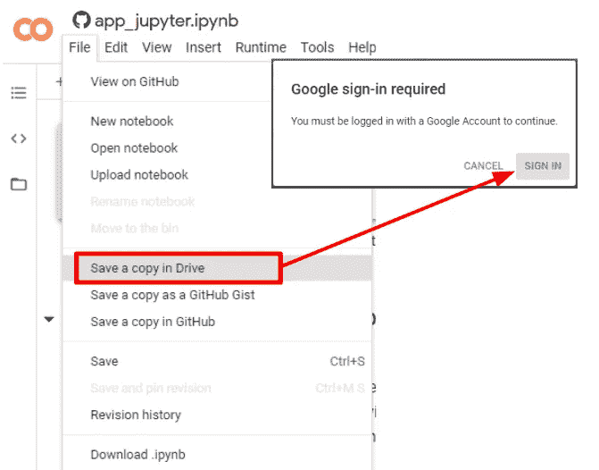
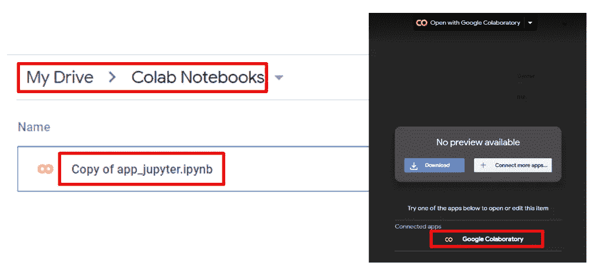
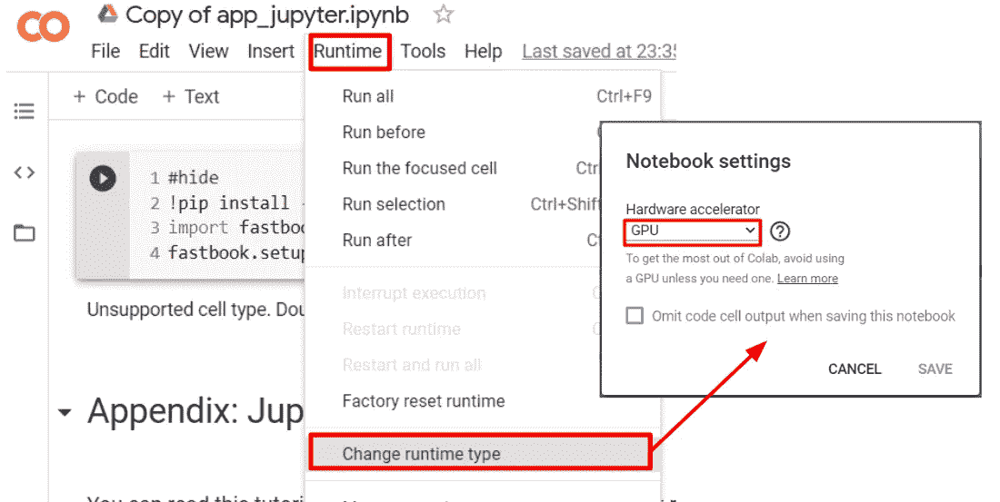
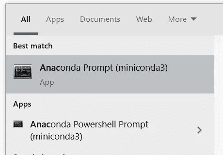

# 任何人如何在 Windows 上开始深度学习

> 原文：<https://towardsdatascience.com/how-anyone-can-get-started-with-deep-learning-on-windows-c08f5987579f?source=collection_archive---------34----------------------->

## 在一天内创建您自己的视觉识别应用程序。


杰森·斯特鲁尔在 [Unsplash](https://unsplash.com?utm_source=medium&utm_medium=referral) 上的照片

深度学习和人工智能是当今世界最热门的话题之一。我们看到越来越多的应用程序采用了深度学习:面部识别、语音识别(Siri、OK Google、Alexa)、[无人驾驶汽车](https://www.tesla.com/support/autopilot)，名单还在继续。因此，作为一名学生、新员工、团队经理、高级管理人员，我们很好奇:这种不断上升的人工智能技术浪潮最终会让我的工作或未来职业变得不那么相关吗？

这实际上是我多年前偶然发现深度学习世界的方式，并以我今天的位置结束:在这个研究领域攻读研究生学位。我们都习惯于以某种方式学习东西:在网上搜索信息，报名参加课程，在 YouTube 上观看教程。然而，关于这个主题的大量且不断增加的信息令人害怕，我们中的许多人很快放弃了对新的相关技能的追求。

在这里，我将分享我的经验，我认为这是开始深度学习最简单快捷的方法，并且能够在一天内**创建自己的视觉识别应用**。这是我做了几十个深度学习、数据科学、机器学习等在线课程后的个人看法。我推荐的是 [fast.ai](http://fast.ai) ，适合任何技能水平的人！(另外，你至少需要有一个谷歌账户——谁没有呢)

# **什么是 fast.ai**

这是一个在 [PyTorch](https://pytorch.org/) 之上编码的软件包，PyTorch 是一个用 Python 语言编码的深度学习框架。如果你没有理解那句话的任何一个部分，不要担心，我们在网络课程中谈论的材料在技术上不需要任何编码知识。fast.ai 的创建者发布了他们的在线学习课程，可以在[https://course.fast.ai/](https://course.fast.ai/)访问。前三节课(5 小时)将带您完成部署您自己的深度学习应用程序的步骤！


亚历山大·辛恩在 [Unsplash](https://unsplash.com?utm_source=medium&utm_medium=referral) 上的照片

对于更高级的从业者，你可以继续学习课程，了解关于深度学习的更复杂的细节。我可能会出版另一个系列，介绍本课程中每一课的关键要点和笔记，但让我们把它留到以后再说。

# 安装和设置…学习任何新技术最痛苦的一步

谢天谢地，多亏了云计算的奇迹，我们不用在你的电脑上安装任何软件就可以使用 fast.ai **！因此，Windows 用户有优势，因为大多数深度学习框架都是为在 Linux 上运行而构建的。以下是针对 fast.ai 包优化的选项，只需跳到您喜欢的部分或通读一遍即可找到不同之处！我只列出了完全免费的选项。(别担心，同学们)**

1.  [**Google Colab**](https://colab.research.google.com/) (需要 Google 账号)
2.  **在本地机器上安装** (Windows 测试，仅推荐高级用户使用)
3.  **纸张空间渐变**

# Google Colab

[Colab](https://colab.research.google.com/) 是 Google 推出的一项服务，提供免费的 GPU(！！)通过笔记本访问。要在 Colab 上开始使用 fast.ai，只需使用以下链接访问笔记本(对于希望继续学习本课程的高级用户，请遵循[https://course.fast.ai/](https://course.fast.ai/)的说明):

*   第一部分:朱庇特简介
*   [第二部分:fast.ai 简介](https://colab.research.google.com/github/fastai/fastbook/blob/master/01_intro.ipynb)
*   [第 3 部分:部署您的第一个应用](https://colab.research.google.com/github/fastai/fastbook/blob/master/02_production.ipynb)

这就像在观看课程的前 3 课视频时浏览三本笔记本一样简单！但是，使用 Colab 时需要注意以下事项:

1.  首先，单击文件>在驱动器中保存副本>登录(如果您尚未登录)。这可以确保您对笔记本所做的任何更改都可以从您自己的 Google Drive 帐户重新访问。



复制一份笔记本

2.制作一份拷贝应该会将您重定向到存储在您自己的 Google Drive 存储中的已拷贝笔记本。要再次访问它，只需进入我的驱动器> Colab 笔记本。默认情况下，复制的笔记本将存储在此文件夹中。

3.要打开，请双击感兴趣的笔记本，然后单击使用 Google 协作打开。轻松点。



从 Google Drive 访问您的笔记本

4.对于大多数深度学习框架来说，GPU 确实可以加快计算时间。谢天谢地，Google Colab 提供免费的 GPU 使用(高达 3GB 的 RAM)。确保 Colab 中的运行时类型设置为 GPU。



将运行时类型更改为 GPU

5.现在你准备好了！只需跟随 https://course.fast.ai/的视频讲座，你马上就能成为一名深度学习的学生。

# 在 Windows 上安装

在您自己的机器上安装会给您更多的灵活性。但是，这仅推荐给高级用户。fast.ai 推荐安装在基于 Linux 的操作系统上，但我们中的许多人不想经历双重启动或运行虚拟机的麻烦。我个人在 Windows 10、64 位机器上运行 fast.ai 包，使用以下步骤:

1.  [安装 Miniconda](https://docs.conda.io/en/latest/miniconda.html) (如果你已经安装了的话，Anaconda 也可以工作的很好)。确保选择正确的操作系统，并选择 Python 3.8 的选项。
2.  从 Windows 搜索栏中启动 Anaconda 提示符。



3.运行以下命令安装 fastai，然后在提示开始下载时输入“Y ”:

```
conda install -c fastai -c pytorch fastai jupyter notebook
```

4.安装完成后，在 Anaconda 提示符下运行以下命令来启动本地 Jupyter 笔记本服务器。

```
jupyter notebook
```

5.您的默认浏览器中应该会弹出一个窗口，或者您可以通过键入以下命令来访问它:

```
http://localhost:8888/?token='find_under_conda_prompt'
```

6.从 https://github.com/fastai/fastai下载一份 fast.ai 笔记本

7.访问笔记本，你就大功告成了！

深度学习入门真的很简单。现在，在综合课程和框架的帮助下，几乎任何人都可以做到。如果您有任何问题，或者任何步骤对您不起作用，请随时在下面留下您的评论！

# 参考

[](https://course.fast.ai/) [## 面向编码人员的实用深度学习

### 如果你准备好现在就开始，这里有一些方法。如果你想更多地了解本课程，请阅读…

course.fast.ai](https://course.fast.ai/) [](https://github.com/fastai/fastai) [## 法斯泰/法斯泰

### fastai 简化训练快速和准确的神经网络使用现代最佳实践重要:这份文件…

github.com](https://github.com/fastai/fastai) [](https://colab.research.google.com/) [## 谷歌联合实验室

### colab.research.google.com](https://colab.research.google.com/)  [## fastai:用于深度学习的分层 API

### fastai 是一个深度学习库，为从业者提供高级组件，可以快速轻松地…

arxiv.org](https://arxiv.org/abs/2002.04688)