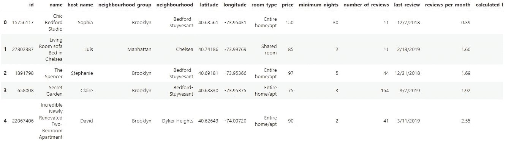
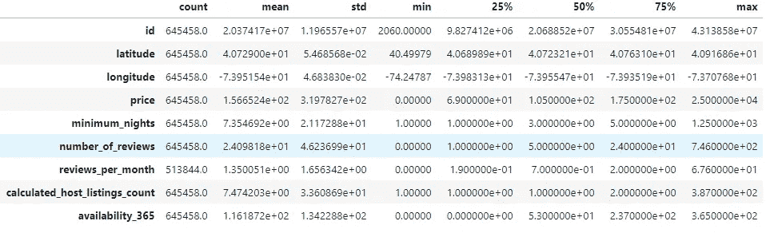
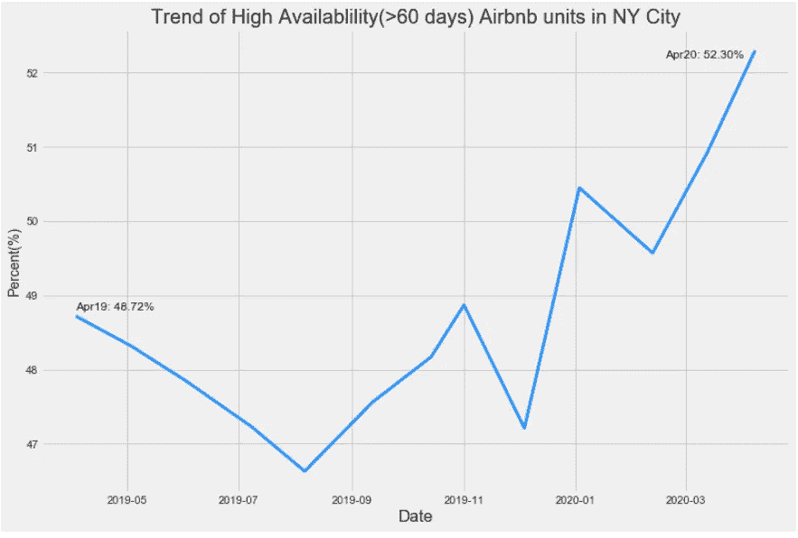
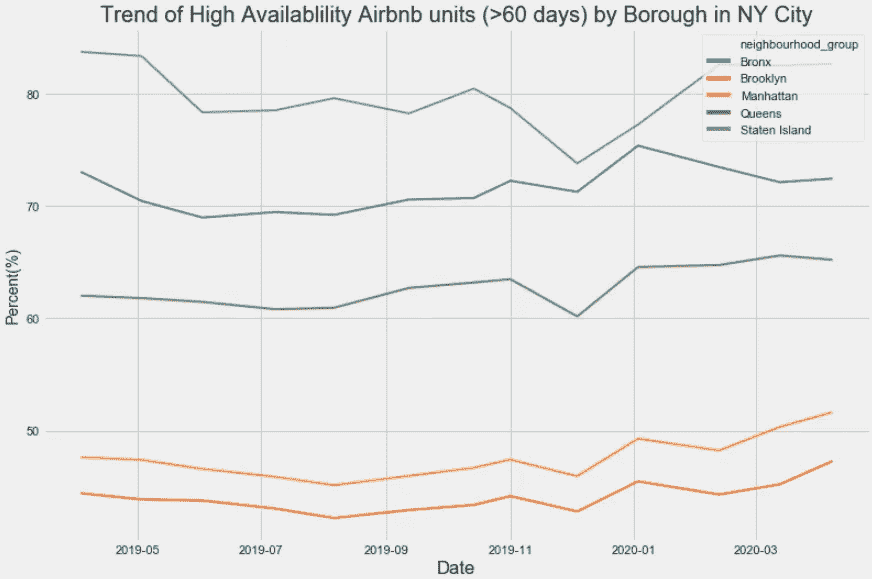
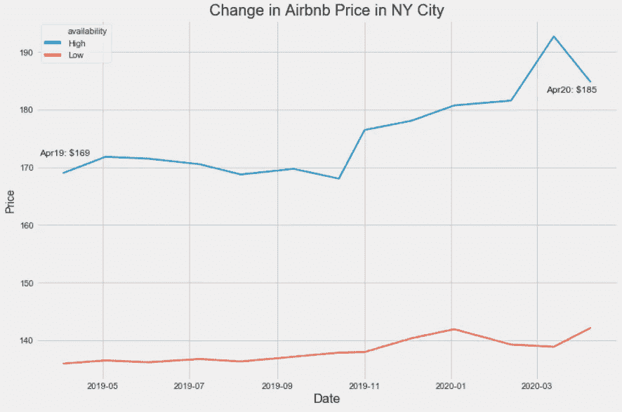
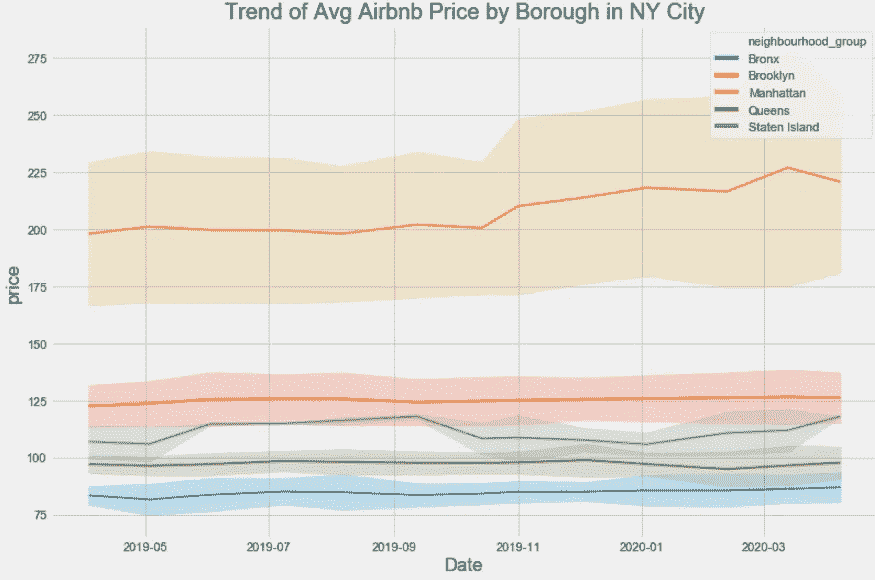
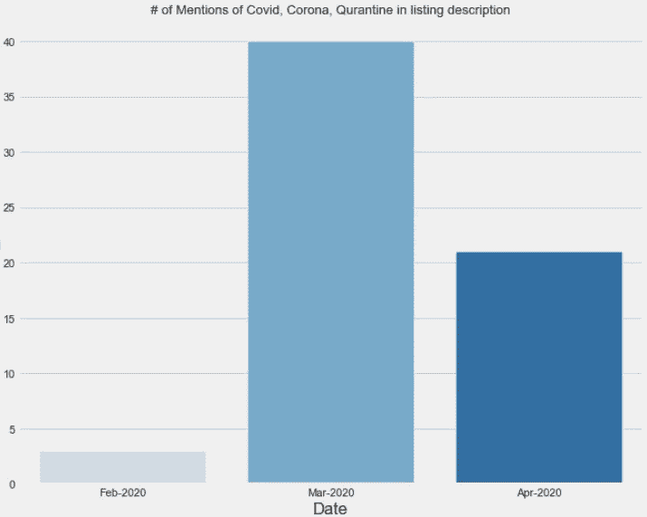
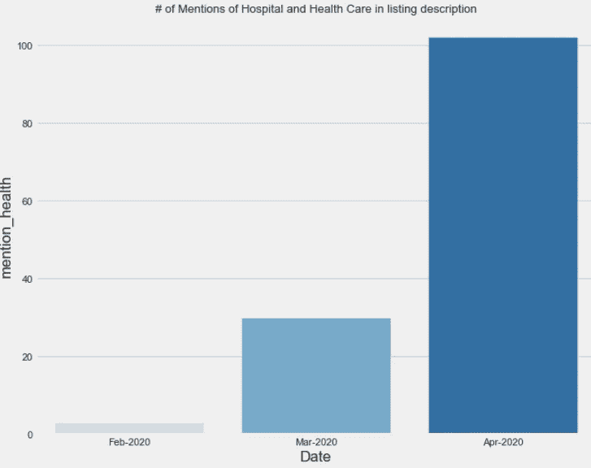
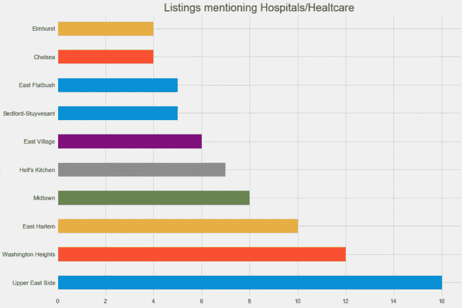
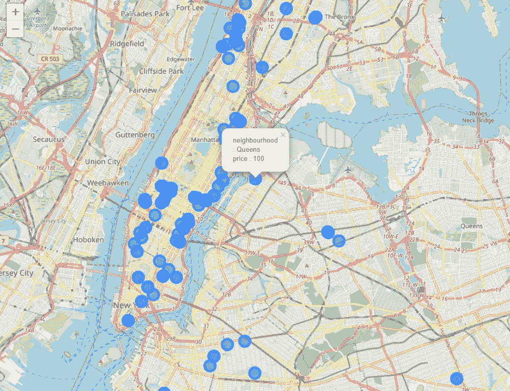

# 纽约的 Airbnb 房东如何适应新冠肺炎的生活？

> 原文：<https://towardsdatascience.com/how-are-airbnb-owners-in-ny-adopting-in-the-midst-of-covid-19-dc5548f4efd7?source=collection_archive---------63----------------------->

## 分析纽约 Airbnb 房源的可用性、价格和描述

众所周知，旅游业受到了新冠肺炎的严重影响。几天前，Discover 首席执行官详细介绍了与旅游类别相关的消费者支出基本上已降至零。这肯定会影响美国冠状病毒的中心纽约市的 Airbnb 主机。

 [## Discover card 首席执行官详细介绍了旅游类消费支出下降 99%的惊人降幅

### 很明显，美国人已经大幅放缓了他们的支出，因为许多行业在…

www.cnbc.com](https://www.cnbc.com/2020/04/24/discover-card-ceo-details-drop-in-spending-with-travel-down-99percent.html) 

## 数据

我对衡量新冠肺炎对纽约 Airbnb 主机的影响很感兴趣。2019 年 4 月至 2020 年 4 月(月度频率)的数据来源于 Airbnb 内部(listings.csv)。尽管列表文件提供了更详细的数据，但它有利于可视化，不需要太多的清理工作。数据中总共有 645，458 个列表。

 [## Airbnb 内部。为辩论添加数据。

### Airbnb 内部是一套独立的工具和开放的数据，允许你探索 Airbnb 是如何真正被用于…

insideairbnb.com](http://insideairbnb.com/get-the-data.html) 

列表数据快照

描述统计学

## **可用性趋势**

Airbnb 主机可以为他们的列表设置一个日历，这样它就可以在一年中的几天或几周或者全年可用(除非它已经被预订)。“高可用性”定义为每年可用时间超过 60 天，可以表示在数据被擦除时单元是空闲的。

从 2019 年 4 月到 2020 年 4 月，高可用性的百分比增加了近 4 个百分点。

当按区划分时，曼哈顿和布鲁克林等热门地区也显示出“高可用性”单元的增长趋势。

## 价格趋势

“高可用性”设备的平均价格在 4 月份降至 185 美元。这一下降主要是由曼哈顿的公寓引起的，Airbnb 在其他行政区的平均价格几乎保持不变。

## 列表描述的更改

到目前为止，这并不奇怪，有更多的单位在纽约，他们的价格已经下降。所以，问题是 Airbnb 的主人正在做什么来应对这种情况？

列表文件包含每个列表的描述。通过分析描述，我们可以感觉到主人对这种情况的反应。今年 3 月，提到“Covid”、“Corona”或“Quarantine”的列表开始出现。三月份的一些列表中提到了 Covid/Corona:舒适的皇后|豪华的 Bnb |干净&没有 Covid，传统的纽约绿洲-Corona 消毒，安静的花园 apt UWS，远离 Corona 病毒。

然而，提及 Covid/Corona 的列表在 4 月份有所减少。相反，包含“医院”、“医疗保健”或“健康”的列表开始增加。一个特别的清单把它的描述从三月份的“另一个海滩聚会/早餐”改成了四月份的“圣约翰医院员工/志愿者”。

## 纽约地图

截至 2020 年 4 月 8 日，这是包含“医院”或“医疗保健”的列表所在的前 10 个社区。

纽约市的地图，上面有提及医院/医疗保健等的列表。

## 摘要

不用说，对于 Airbnb 的主机来说，这是一个充满挑战的时代。Airbnb 推出了一项计划，为医护人员和急救人员提供住宿场所，同时安全地远离自己的家庭。在纽约，尽管提及医院/医疗保健等的列表的数量。仍然很小，我们可以看到业主为一线应急人员提供住宿的趋势越来越明显。说明 Airbnb 的主机正在适应目前的情况，把影响降到最低。