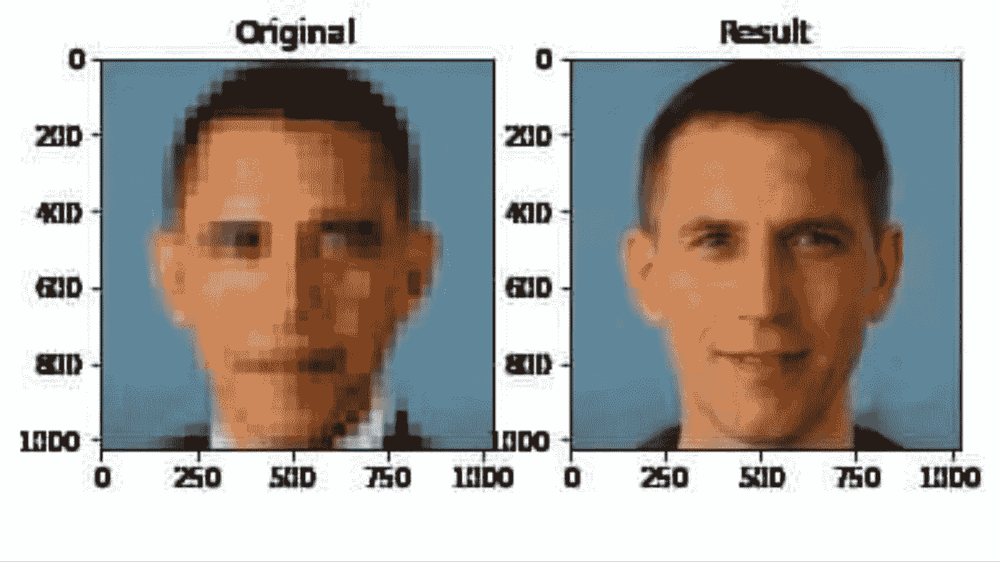

# 人工智能算法中的偏差

> 原文：<https://towardsdatascience.com/how-are-algorithms-biased-8449406aaa83?source=collection_archive---------14----------------------->

## 算法做它们被教导的事情。不幸的是，一些人无意中被隐藏在数据中的社会模式灌输了偏见和不道德的偏见。

第二次世界大战结束后，纽伦堡审判揭露了纳粹在医学研究中的暴行。在试验之后，医学科学建立了一套规则——纽伦堡法典——来控制未来涉及人类受试者的实验。《纽伦堡法典》影响了世界各地的医学伦理准则，就像那些甚至在 30 年后仍未遵循该法典的实验被曝光一样，比如臭名昭著的塔斯基吉梅毒实验。

人工智能实验和应用对用户的直接负面影响不像塔斯基吉和纳粹实验那样不人道，但面对压倒性和越来越多的算法对某些人口群体有偏见的证据，迟早要进行对话，这很重要。人工智能系统可能会因构建者、开发方式和最终部署方式而有所偏差。这就是所谓的算法偏差。

虽然数据科学尚未开发出自己的纽伦堡代码，但人工智能研究的社会影响已开始在一些课程中得到阐述。但即使辩论开始萌芽，仍然缺乏的是一个学科范围的讨论，以应对如何解决人工智能算法强化的社会和历史不平等问题。

我们是有缺陷的生物。我们做的每一个决定都包含某种偏见。然而，算法并没有被证明更好。理想情况下，我们希望我们的算法做出更明智的决策，没有偏见，以确保更好的社会正义，即社会中的个人和群体(如少数民族)有平等的机会获得资源，听到他们的声音，并在社会中得到代表。

当这些算法的工作是放大种族、社会和性别不平等，而不是减轻它；有必要评估这项技术的伦理后果和潜在的恶意。

这篇文章是由两个热点引发的:现在正在全球范围内肆虐的种族不平等讨论，以及 Yann LeCun 与 Timnit Gebru 在 Twitter 上的争吵，这是由于对巴拉克·奥巴马(左)的降采样图像的分歧，该图像被面部升采样机器学习(ML)模型描绘成一个白人男子的照片(右)。

一张奥巴马的去像素化照片被放大成一张白人男性的照片。*(感谢:@哈德曼鲁在推特上)*

这场(颇具爆炸性的)争论是由 LeCun 的这条推文引发的，他在推文中表示，由于训练算法的数据存在偏差，最终得到的人脸是一个白人。格布鲁尖锐地回应说，不能把 ML 系统的危害归结为有偏见的数据。

在大多数基线 ML 算法中，该模型更适合在各种数据点上最频繁出现的属性。例如，如果你要设计一个人工智能招聘工具来审查软件工程职位申请人的简历，你首先需要用一个过去候选人的数据集来训练它，该数据集包含诸如“经验”、“资格”、“持有的学位”、“过去的项目”等细节。对于每个数据点，招聘工具的算法都需要一个决策或“标签”，以便通过观察简历中的模式来“学习”如何为给定的申请人做出决策。

对于一个代表性性别差异很大的行业，有理由假设大多数数据点将是男性申请人。并且数据中的这种集体不平衡最终被算法解释为数据中的有用模式，而不是将被忽略的不期望的噪声。因此，它会告诉自己，男性候选人比女性候选人更受欢迎。

我希望这只是一个我用来证明我的观点的虚构的、夸张的例子。不是的。

LeCun 的评估没有错，因为在这种特定模型的情况下，在包含黑人面孔的数据集(而不是主要包含白人面孔的数据集)上训练模型不会产生如此荒谬的输出。但是，现代人工智能教父被拖入一场争吵(尽管不公平)的好处意味着，更多的研究人员现在将意识到他们的研究的影响。

这种误解显然源自对“偏见”一词的解释——在任何关于人工智能/人工智能的社会影响的讨论中，这个词似乎都被其自身的重量所压垮。

正如 Sebastian Raschka 所说，“ML 中的术语**偏差**严重超载”。它有多种感觉，可能会被彼此误解。

(1) **偏差**(如数学中的**偏差**单位)(2)【公平】**偏差**(也称为社会**偏差** ) (3) ML **偏差**(也称为归纳**偏差**)，这依赖于建立模型所采取的决策。)(4) **偏差**-损失函数的方差分解(5)数据集**偏差**(通常导致 2)

我想，当我们使用这些术语时，只要稍微精确一点，就可以弥补沟通中的许多差距。

更轻松的是，别说奥巴马了，这位模特甚至把一只狗的脸描绘成了一个白人男子的脸。它当然喜欢白人。

当然，学习算法也有超出数据偏差的归纳偏差。但如果数据有一点偏差，就会被这些系统放大，从而导致模型学习到高偏差。简而言之，创建一个 100%无偏见的数据集实际上是不可能的。任何由人类挑选的数据集都是精选的，并且是非穷尽的。我们的社会认知偏差会导致无意中挑选数据。这种有偏见的数据，当输入到数据变异模型(其决策受到所见数据的严重影响的模型)时，会对这些社会、种族、性别、文化和政治偏见进行编码，并将其融入 ML 模型。

一旦应用到产品中，这些问题就会加剧。几年前，Jacky Alciné [指出](https://twitter.com/jackyalcine/status/615329515909156865)谷歌照片[中的图像识别算法将他的黑人朋友归类为“大猩猩”](https://www.wired.com/story/when-it-comes-to-gorillas-google-photos-remains-blind/)谷歌为这个错误道歉，并保证会解决这个问题。然而，它没有提出一个适当的解决方案，而是简单地阻止了算法识别大猩猩。

像谷歌这样规模的公司无法提出解决方案似乎令人惊讶。但这只能表明，训练一个一致而公平的算法并不是一件容易的事情，尤其是当它没有在一组不同的类别上进行训练和测试时，这些类别按比例代表了不同的人口统计群体。

面部识别技术犯下可怕错误的另一个灾难性事件发生在上周，一次错误的面部识别匹配导致一名密歇根州男子因莫须有的罪行被捕。最近由[麻省理工](https://www.nytimes.com/2018/02/09/technology/facial-recognition-race-artificial-intelligence.html)和[国家标准与技术研究院](https://www.nytimes.com/2019/12/19/technology/facial-recognition-bias.html)或 NIST 进行的研究发现，尽管面部识别在白人男性身上效果很好，但对于其他人群来说效果不够好(误识别率可能会差 10 倍以上)，部分原因是用于开发底层数据库的图像缺乏多样性。

算法偏差的问题不仅限于图像/视频任务，它们也在语言任务中表现出来。

[语言总是被“定位”](https://web.stanford.edu/~mjkay/LifeOfLanguage.pdf)，也就是说，语言的理解依赖于外部参照，而接受者必须能够解析这些参照。因此，这意味着用于训练模型的文本携带关于作者和情况的潜在信息，尽管程度不同。

由于语言的情境性，任何语言数据集都不可避免地带有人口统计学偏见。例如，与美国人和欧洲人相比，一些语音到文本转录模型对于非裔美国人、阿拉伯人和南亚人往往具有更高的错误率。这是因为训练语音识别模型的语料库是由来自西方国家的人的话语支配的。这导致该系统擅长翻译欧洲和美国口音，但在转录世界其他地方的语音方面表现不佳。

这一领域的另一个例子是现有单词嵌入(通过神经网络学习)中的性别偏见，这表明女性与“较少大脑”的职业有更高的关联，而男性往往与据称“较多大脑”或更高收入的职业有关联。

在下表中，我们看到了[通用语句编码器](https://www.tensorflow.org/hub/modules/google/universal-sentence-encoder/1)嵌入模型中与各种职业相关的性别偏见分数。分数为正的职业是偏女性的职业，分数为负的职业是偏男性的职业。

*偏向女性得分最高的职业(左)和偏向男性得分最高的职业(右)(礼貌:*[https://developers . Google blog . com/2018/04/text-embedding-models-contain-bias . html](https://developers.googleblog.com/2018/04/text-embedding-models-contain-bias.html))

尽管人工智能研究人员很容易举起双手，免除自己的所有责任，但他们必须承认，他们——有意或无意地——为许多缺乏人工智能专业知识的公司构建了人工智能产品的基础层。这些公司，没有微调和调整模型的知识，使用预先训练的模型，因为它们是由 ML 研究人员(如 GloVe，BERT，ResNet，YOLO 等)在互联网上发布的。

部署这些模型而不明确地重新调整它们以解释人口统计学差异是危险的，并且可能导致排斥和过度概括人们的问题。责任止于研究人员，他们必须承担硬币另一面的责任。

也很容易归咎于数据而不是算法。(这让我想起了共和党在第二修正案辩论上的立场:“枪不杀人，人杀人。”只把责任归咎于数据是不负责任的，就像说一个种族主义的孩子不是种族主义者，因为他的种族主义父亲教会了他种族主义。

我们需要改进的不仅仅是数据，而是算法需要变得更稳健、更不敏感、更不容易受到数据的影响。这需要成为任何从事研究的人的责任。同时，消除数据偏差。

在现实世界中部署算法的指导问题应该总是“错误的答案会比没有答案更糟糕吗？”

***你可以在这里*** ***访问我的页面*** [**。我的碎碎念句柄是@**](https://karanpraharaj.github.io)****。****

# *参考*

*1) [面部识别准确，如果你是白人](/[)[https://www . nytimes . com/2018/02/09/technology/face-Recognition-race-artificial-intelligence . html](https://www.nytimes.com/2018/02/09/technology/facial-recognition-race-artificial-intelligence.html))作者史蒂夫·洛尔*

*2)堪萨斯州克里什纳普里亚。，Vangara，k .，King，m .，Albiero，v .，鲍耶，K. [在*IEEE 计算机视觉和模式识别会议(CVPR)研讨会上描述了人脸识别准确性相对于种族*](https://arxiv.org/pdf/1904.07325.pdf)的可变性，2019 年 6 月。*

*3) [语言的生命](https://web.stanford.edu/~mjkay/LifeOfLanguage.pdf)作者马丁·凯，斯坦福大学*

*4) [文本嵌入模型包含偏差。这就是为什么这很重要。本·帕克、约尼·哈尔彭、马里奥·瓜哈尔多-塞斯佩德斯&玛格丽特·米歇尔、谷歌人工智能](https://developers.googleblog.com/2018/04/text-embedding-models-contain-bias.html)*

*5) Bolukbasi，t .，Chang，KW。男人对于电脑程序员就像女人对于家庭主妇一样？*去偏置词嵌入神经信息处理系统进展 29，2016。**