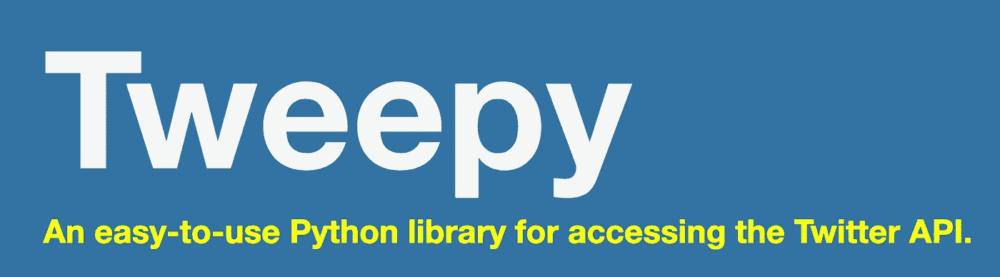
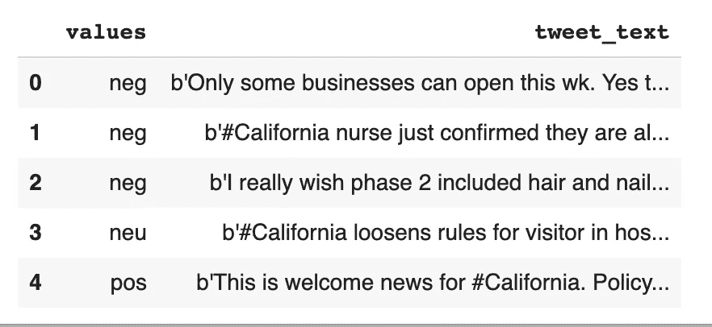
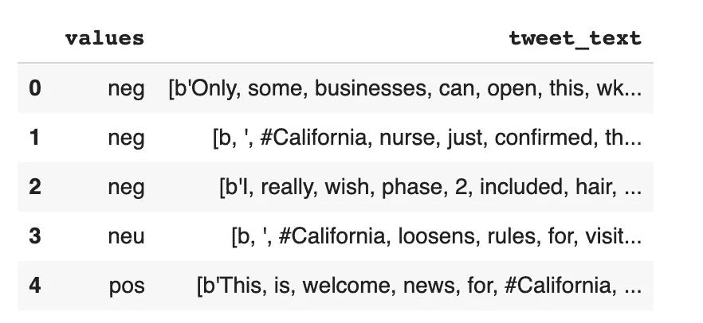
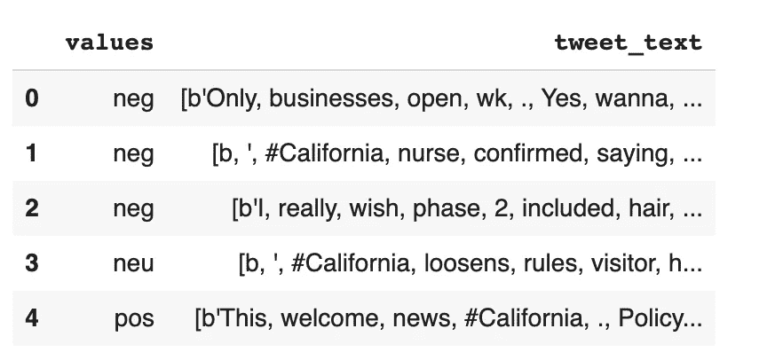
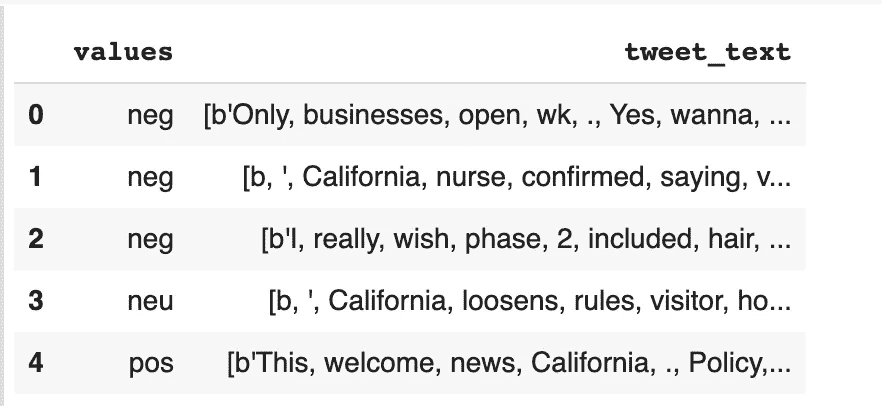
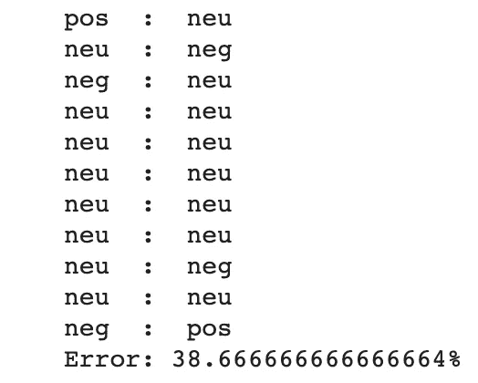
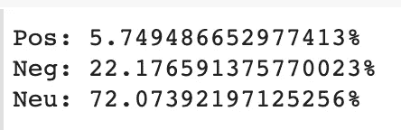
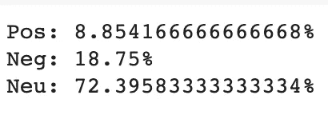
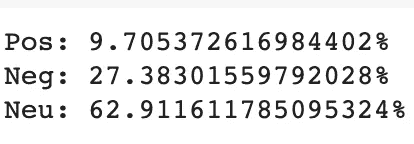

# 美国人对新冠肺炎的反应如何？

> 原文：<https://towardsdatascience.com/how-are-americans-reacting-to-covid-19-700eb4d5b597?source=collection_archive---------65----------------------->

## 使用 Twitter 和情感分析来回答这个问题


图片来源:推特

新冠肺炎疫情对整个世界构成了前所未有的挑战。由于确诊病例和死亡人数最多，美国是受病毒打击最严重的国家之一。随着各州开始部分重新开放，这个国家在这个问题上变得非常两极分化。一些人坚决支持这项措施，认为这对国家的经济健康非常重要。然而，其他人对此强烈反对，认为重新开放的人力成本是不合理的。在局势高度紧张的时候，我试图更好地了解美国人对新冠肺炎当前局势的真实感受。

为了回答这个问题，[斯里汉·梅迪博纳](https://medium.com/@smediboina1)和我一起从推特上搜集与新冠肺炎有关的推文，并对它们进行情感分析。为了了解美国各地的反应如何不同，我们使用了来自纽约、德克萨斯州和加利福尼亚州的推特。让我们进入项目吧！

# 获取 Twitter 数据



图片来源:Tweepy

在访问我们的 Twitter API 凭证之前，我们需要申请一个 Twitter 开发者帐户。一旦我们的应用程序被批准，我们就可以使用 Tweepy 访问 API 并下载一个标签的所有 tweets。调用`search_for_hashtag`函数允许我们快速抓取标签中的数据(#冠状病毒、#新冠肺炎、#纽约、#加州、#德克萨斯是我们使用的一些标签)。要更深入地了解 Tweepy，请查看这篇[文章](/tweepy-for-beginners-24baf21f2c25)。

我们使用朴素贝叶斯分类器进行情感分析，这需要标记数据，因为它是一种监督学习算法。因此，我们手动标记了来自这三个州的 500 条推文，总共 1500 条推文。每条推文要么负面情绪得分为-1，中性情绪得分为 0，正面情绪得分为 1。如果你有兴趣进行自己的分析，这里有一个[链接](https://github.com/Srihan-Mediboina/Twitter-Sentiment-Analysis)到数据。



加利福尼亚推特数据集的前 5 行

# 符号化

现在，我们通过将推文拆分成单独的单词(称为令牌)来对推文进行令牌化。没有令牌，我们就无法执行情感分析的后续步骤。当我们从自然语言工具包(`nltk`)中导入`TweetTokenizer`时，这个过程就变得简单了。`tokenize_tweets`函数只有两行代码，我们可以将它应用于数据帧来分解推文。`nltk`是一个非常强大的情感分析包，因此我们将在整篇文章中使用它。



令牌化后的 CA 数据集

# 停用词

停用词是常见的词，如“the”、“a”和“an”。因为这些词不能加深我们对文本情感的理解，我们把它们过滤掉。通过从`ntlk`导入停用词，这一步变得非常简单:`remove_stopwords`函数也是两行代码。



从我们的 California 数据集的前几行中删除的一些停用词包括“Some”、“can”、“just”和“for”。

# 清理文本

除了移除停用字词之外，我们还希望确保移除数据框中的任何随机字符。例如，在我们抓取推文后，csv 文件中出现了几个字符，如“x97”和“xa3”。通过迭代找到这些杂项字符后，我们将它们复制粘贴到`CleanTxt`函数中。然后，我们对每个数据帧应用该函数来移除它们。



正如我们所见，标签是被删除的最普遍的字符。通过清理文本，我们可以提高模型的性能。

# 词汇化

通常，指同一事物的词以不同的形式出现(例如。麻烦，困扰，困扰，麻烦本质上都是指麻烦)。通过对文本进行词条分类，我们将一个单词的各种词形变化组合在一起，作为该单词的词条(它在词典中的出现方式)进行分析。这个过程防止计算机将一个单词的不同形式误认为不同的单词。我们从`nltk`导入`WordNetLemmatizer`，并为此调用`lemmatize_tweets`函数。

# 主数据集

既然我们已经完成了预处理步骤，我们可以继续创建一个包含所有 1，500 条推文的主数据集。通过使用`df.itertuples`，我们可以将 dataframe 行作为元组进行迭代，以将`‘tweet text’`和`‘values’`属性添加到我们的数据集。然后，我们使用`random.shuffle` 打乱我们的数据集，以防止我们的模型成为过度拟合的牺牲品。

接下来，我们遍历所有的数据帧，并将每个单词添加到`all_words list`中。接下来，我们使用`nltk.FreqDist`来创建每个单词的频率分布。由于一些单词比其他单词更常见，我们希望确保使用最相关的单词来训练我们的朴素贝叶斯分类器。目前，每条推文都是一个单词列表。然而，我们可以将每条 tweet 表示为一个字典，而不是一个列表:关键字是单词特征，值是真或假，取决于 tweet 是否包含该单词特征。这个代表推文的字典被称为特征集。我们将为每条推文生成特征集，并在特征集上训练我们的朴素贝叶斯分类器。

# 训练/测试模型

feature_sets 将被分别分成 80/20 个训练集和测试集。在训练集上训练了朴素贝叶斯分类器之后，我们可以通过将它对推文情绪的预测(`results[i]`)与推文的标签情绪(`testing_set[i][0]`)进行比较来检查它的性能。



我们的输出在左边显示预测值，在右边显示实际值。40%的误差百分比非常高，这意味着我们的模型只有 5 次中的 3 次是准确的。一些可以使我们的模型更准确的改进是使用更大的训练集或使用验证集来测试不同的模型，然后选择最有效的模型。

# 使用模型

有了经过训练/测试的模型，我们现在可以用它来对一批新的推文进行预测。我们收集了更多的 tweets，并对新的数据帧执行了与之前相同的预处理步骤:`ca_new_df`、`ny_new_df`和`tx_new_df`。我们的分类器的预测存储在`results_new_ca`、`results_new_ny`和`results_new_tx`中。我们的最后一步是使用`sentiment_percent`函数来量化百分比。

```
sentiment_percent(results_new_ca)
```



```
sentiment_percent(results_new_ny)
```



```
sentiment_percent(results_new_tx)
```



在我们的结果中，加利福尼亚州只有大约 6%的推文是正面的，而德克萨斯州有大约 27%的推文是负面的。加州和纽约都有 73%的推文是中性的，其正负百分比相差约 4%。德克萨斯州的确有最多的负面推文，但他们也有最多的正面推文，约为 10%，因为他们的中立推文比例较低。重要的是要记住，我们的模型只有 60%的准确性，所以这些结果可能不是这些推文中表达的真实情绪的最大指示。

为了简洁起见，本文省略了一些代码。点击[此处](https://github.com/Srihan-Mediboina/Twitter-Sentiment-Analysis/blob/master/sentiment_analysis.ipynb)查看完整代码。

# 参考

[1]计算机科学频道，[使用 Python 的 Twitter 情绪分析](https://www.youtube.com/watch?v=ujId4ipkBio)，Youtube

[2]薇琪·钱， [Twitter 爬虫](https://gist.github.com/vickyqian/f70e9ab3910c7c290d9d715491cde44c)，Github

[3]Mohamed Afham，[使用 NLTK 的 Twitter 情感分析，Python](/twitter-sentiment-analysis-classification-using-nltk-python-fa912578614c) ，走向数据科学

[4]亚当·马伊穆达尔，[机器理解人类的钥匙](https://medium.com/@mr.adam.maj/machines-key-to-understanding-humans-how-i-used-natural-language-processing-to-analyze-human-9745d04e534b)，中型

感谢您阅读文章！我是 Roshan，16 岁，对人工智能的各种应用充满热情。在这个项目上，我与另一个对人工智能有浓厚兴趣的青少年斯里汉·梅迪博纳密切合作。

在 Linkedin 上联系我们:

[https://www.linkedin.com/in/roshan-adusumilli/](https://www.linkedin.com/in/roshan-adusumilli/)

[https://www.linkedin.com/in/srihanmediboina/](https://www.linkedin.com/in/srihanmediboina/)