# 亚洲发展中国家如何应对新冠肺炎？

> 原文：<https://towardsdatascience.com/how-are-countries-in-developing-asia-responding-to-covid-19-330616c70a44?source=collection_archive---------42----------------------->

## 使用 Pandas、Matplotlib 和 Seaborn 的探索性数据分析

杰森·库珀在 [Unsplash](https://unsplash.com?utm_source=medium&utm_medium=referral) 上的照片

新冠肺炎疫情严重打击了世界各地的各种经济体，全球影响估计在 6.1 万亿至 9.1 万亿美元之间，相当于全球国内生产总值(GDP)的 7.1%至 10.5%的损失。 [[1]](#_ftn1) 超过五分之一的全球损失发生在发展中的亚洲经济体，其影响可能高达 2 万亿美元，相当于发展中亚洲 GDP 的 8.5%。为了应对爆发引发的经济危机的不利影响，本区域当局制定了支持家庭、企业和其他部门的应对政策。

这篇文章着眼于亚洲发展中国家的新冠肺炎对策，内容如下:

1.  数据集
2.  一揽子应对政策的规模和分布
3.  为收入提供直接支持的措施
4.  其他措施
5.  菲律宾与其他国家相比表现如何？
6.  结论

*数据集*

本分析中使用的数据来自亚洲开发银行(亚行)的新冠肺炎政策数据库，该数据库收集了亚洲发展中国家当局为应对新冠肺炎而采取的经济措施和宣布或估计的货币量的信息。[【2】](#_ftn1)政策行为分为五类:a)支持货币市场的正常运行；b)鼓励私人创造信贷；c)向非金融部门提供直接长期贷款；d)对私营部门的股权要求；(e)为家庭和企业的收入提供直接支持。

*一揽子应对政策的规模和分布*

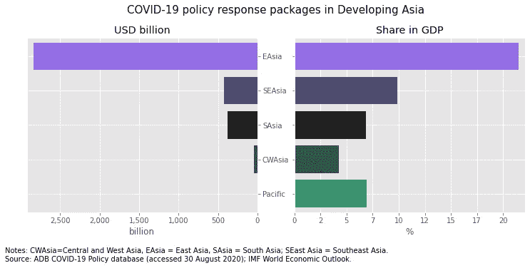

**图一。就包裹规模而言，东亚在该地区占主导地位。** *图片由作者提供。*

东亚拥有最大的一揽子政策应对措施，达到 2.8 万亿美元，是该地区其他国家总和的三倍多(图 1)。相对于 GDP，东亚国家的一揽子计划平均相当于 GDP 的 21.5%，也高于其他国家。

该地区最大的刺激来自东亚和东南亚国家，以及印度。中国以 2.4 万亿美元高居榜首，这几乎相当于东亚回应总额的 90%(图 2)。接下来是印度的 3630 亿美元，接下来是韩国的 2350 亿美元。就占 GDP 的份额而言，香港 1920 亿美元的反应是巨大的，占其 GDP 的一半以上。新加坡的应对措施相当于其 GDP 的 25.4%，而马来西亚为 21.5%。

**图二。** **中国的包裹最多无比巨大；最大的包裹来自东亚、东南亚和印度。**图片由作者提供。

跨区域甚至在次区域内，一揽子计划在国内生产总值中所占份额存在明显差异(图 3)。例如，东亚的四分位数范围为 14%至 17%，而中亚和西亚为 0.2%至 5%。在次区域内，东南亚国家的差异最明显，从 0.04%(老挝人民民主共和国)到 25%(新加坡)。另一方面，太平洋地区的异质性较低，低于或等于国内生产总值的 10%，马绍尔群岛是个例外。其他异常值包括东亚的香港和台湾以及中亚和西亚的哈萨克斯坦和格鲁吉亚。

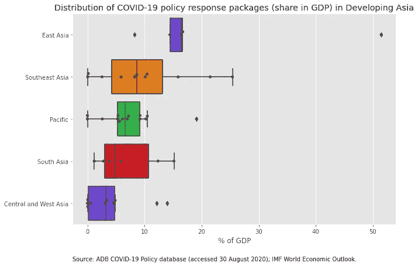

**图三。子区域之间和内部的包装尺寸有相当大的差异。**图片作者。

*为收入提供直接支持的措施*

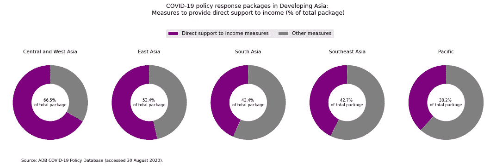

**图 4。应对政策主要致力于为收入提供直接支持。**图片由作者提供。

向家庭和企业的收入提供直接支持似乎是该地区一揽子计划的最重要目标(图 4)。整个集团投入了 1.9 万亿美元，用于向低收入家庭提供实物和现金转移、为医疗前线人员提供保险以及为低薪工人提供工资支持等措施。就人均收入而言，新加坡提供的收入支持最慷慨，人均收入超过 9，000 美元，其次是香港，人均收入超过 5，000 美元(图 5)。与此同时，在菲律宾，人均收入补助不到 100 美元。

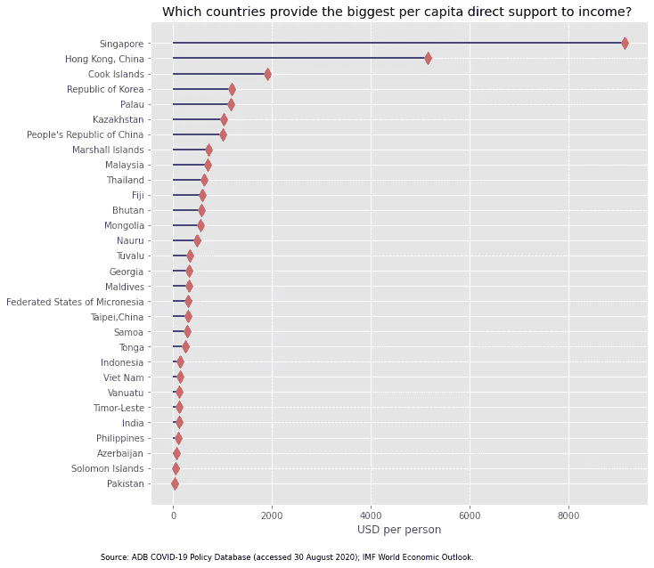

**图 5。新加坡和香港在提供收入支持方面最为慷慨。**图片由作者提供。

*其他措施*

除了提供收入支持，当局还重视确保货币市场的正常运转，鼓励私人信贷创造，并向家庭和企业提供直接的长期贷款(图 6)。另一方面，购买私营部门股票的措施在该地区的许多一揽子计划中作用较小。

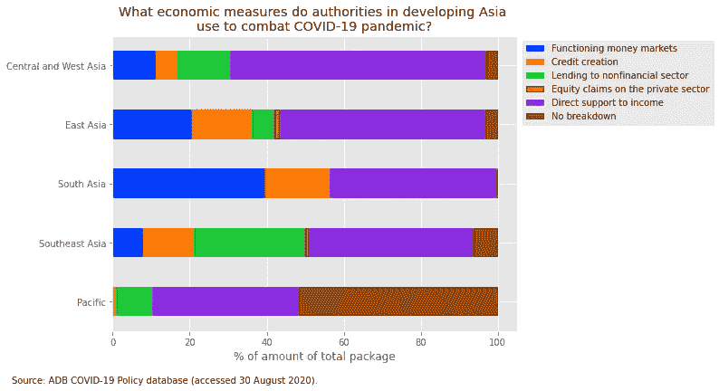

**图 6。当局采取的措施因其对金融体系、收入和债务的影响而异。**图片由作者提供。

东亚所有经济体都为提供流动性支持的措施投入了大量预算(图 7)。值得注意的是，香港增加了银行业的流动性，鼓励银行部署更灵活的流动性缓冲，并放宽了银行间的融资条件，占其一揽子计划总额的近 70%。大约五分之一的中国政策反应旨在扩大贷款设施，以帮助医疗用品和日用品制造商、微型、小型和中型企业以及农业部门的工人。

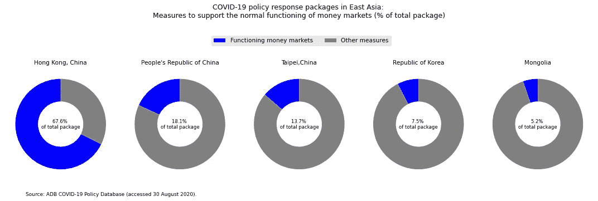

**图 7。东亚经济体提供流动性支持。**图片由作者提供。

在南亚，二级市场购买证券、降低利率和贷款担保在一揽子计划中占相当大的比例(图 8)。例如，尼泊尔的整个一揽子计划包括一个 20 亿美元的再融资基金，为愿意以优惠利率向包括中小企业在内的优先部门贷款的银行提供补贴信贷。在斯里兰卡，约五分之二的计划旨在实施新的信贷计划，以支持向受到疫情严重打击的建筑和其他行业发放贷款。

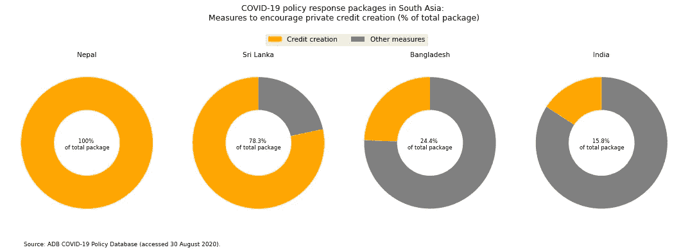

**图 8。南亚当局鼓励私人信用创造。**图片由作者提供。

向企业和家庭提供长期直接贷款、在一级市场购买长期到期的私人债务证券以及延期是东南亚许多一揽子计划中突出的措施(图 9)。文莱的一揽子计划包括 3200 亿美元的刺激计划，相当于国内生产总值的 2.6%，以延长所有部门贷款本金支付的延期。缅甸 70%以上的响应来自一个 7100 万美元的基金，以较低的利率向服装和旅游部门以及中小企业提供软贷款。

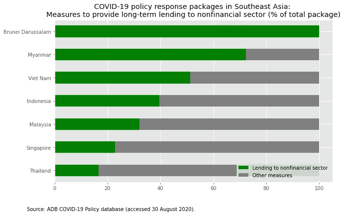

**图九。东南亚国家增加了对企业和家庭的长期直接贷款。**图片作者。

与其他国家相比，菲律宾表现如何？

菲律宾为新冠肺炎政策反应拨款 210 亿美元，相当于国内生产总值的 5.9%，其中约一半，即国内生产总值的 2.9%，包括为 1800 万非正规部门低收入家庭提供紧急补贴计划、为小企业员工提供工资补贴、为地方政府提供援助基金等(图 10)。相当于国内生产总值 1.5%的 52 亿美元的额外流动性，也占了该国刺激计划的相当大一部分。提供流动性支持的措施包括降低中小企业和大型企业的存款准备金率。

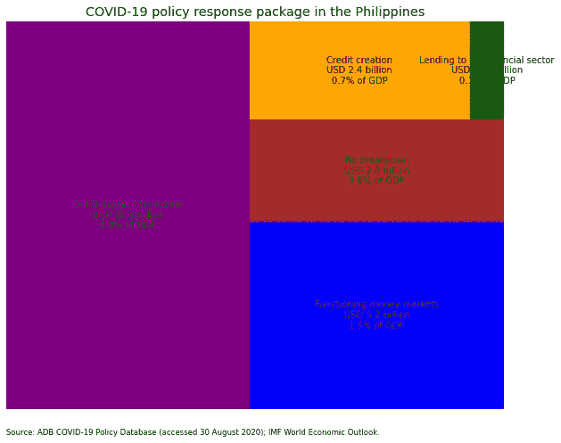

**图 10。菲律宾的新冠肺炎政策应对组合。**图片由作者提供。

尽管努力推动政府支出，菲律宾的数字仍然落后于东南亚的同行(图 11)。印度尼西亚，一个与菲律宾比较的好基准，分配了 1160 亿美元的刺激，相当于 GDP 的 10.4%。菲律宾的反应甚至落后于越南的 265 亿美元(占 GDP 的 10.1%)，越南是一个以控制疫情严重程度而闻名的国家。收入支持预算也落后于亚洲发展中国家的大多数水平(图 12)。

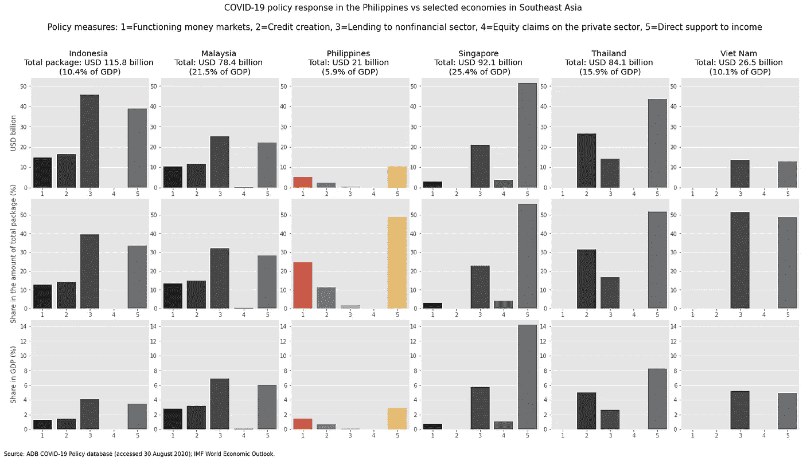

**图 11。菲律宾仍然落后于东南亚的同行。**图片由作者提供。

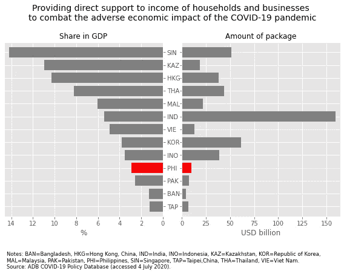

**图 12。收入支持预算仍低于亚洲水平。**图片由作者提供。

*结论*

亚洲发展中国家的政策制定者一直面临着一项挑战，即设计适当的政策应对措施，以应对新冠肺炎疫情对家庭和企业收入以及金融体系的负面影响。虽然这种探索性数据分析表明，各国政府采取了相当大的努力来防止经济进一步恶化，但它没有说明这些政策行动如何影响新冠肺炎病例的数量。然而，除其他因素外，本区域的政策应对将影响亚洲发展中经济体从新冠肺炎疫情的复苏。

本文中使用的数据和代码可以在这个 [Github](https://github.com/jessonpagaduan/covid19policydatabase) 资源库中获得。

参考资料:

[【1](#_ftnref1)】a . Abiad、M. Arao、E. Lavina、R. Platitas、J. Pagaduan 和 C. Jabagat，[新冠肺炎对亚洲发展中经济体的影响:疫情严重程度、控制严格程度和流动性下降的作用](https://voxeu.org/system/files/epublication/Covid-19_in_developing_economies.pdf) (2020)，CEPR 出版社

[2] J. Felipe 和 S. Fullwiler，[亚行新冠肺炎政策数据库:指南](https://covid19policy.adb.org/sites/default/files/pages/ADB-COVID19-Policy-Database.pdf) (2020)，《亚洲发展评论》，37(2)，1–20