# 决策树是如何构建的？

> 原文：<https://towardsdatascience.com/how-are-decision-trees-built-a8e5af57ce8?source=collection_archive---------34----------------------->

## 从头开始构建决策树的入门指南

理解用于构建决策树的基本原则不是很棒吗？在这篇文章中，我将演示如何构建一个决策树，特别是一个分类树，使用两个不同的标准:*基尼系数*和*熵*，并辅以一步一步的解释。我希望在这篇文章结束时，你能更好地理解决策树是如何构建的！🎓

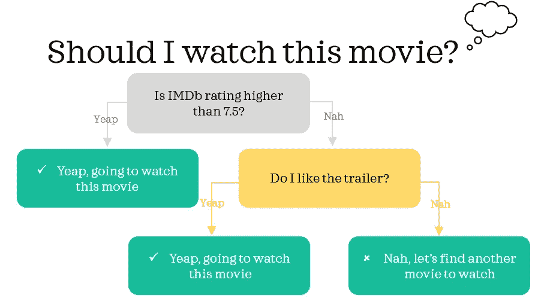

决策树建立在过去的经验上，用来评估是否要看某部电影

# 1.数据📦

为了让事情易于管理，并希望有点乐趣，我们将创建一个微小的虚拟数据，灵感来自情景喜剧[的 6 个主要角色:](https://www.imdb.com/title/tt0108778/)

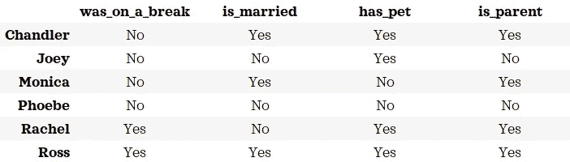

注意:数据中的值已经过调整，以适合示例

让我们假设这个数据对本文的目的来说是正确的。我们将构建一个决策树，使用其余的列来分类一个字符是否是父字符。换句话说，我们将构建一个具有以下输入和输出的分类树:
◼ ️ **输入|特征:** *was_on_a_break，is_married，has _ pet*t11】◼️**输出|目标:** *is_parent*

# 2.构建分类树🔨

如果你喜欢数学，我鼓励你和这个指南一起手动计算，以充分利用这个博客。在本节中，为了简洁起见，作为父母的角色被缩写为 **pa** ，而非父母的角色被缩写为 **np** 。

## 2.1.使用基尼系数**(又名基尼指数或基尼系数)** ☝️

决策树是通过自上而下递归分割成二进制节点来构建的。我们可以通过以下步骤找到节点的最佳分裂:
**步骤 1:** 计算要从
**分裂的节点的 gini 杂质(此处为向上的 gini)步骤 2:** 找到所有可能的分裂
**步骤 3:** 计算每个分裂的两个节点的 Gini
**步骤 4:** 计算每个分裂的加权平均 Gini
**步骤 5:** 确定最佳分裂

包括来自训练数据的每个人的最顶层节点被称为*根节点*。让我们用这些步骤来确定根节点的最佳分割。

🚪**第一步:计算根节点的基尼系数**
**➗公式:**

这个公式的两个变体将给出完全相同的结果

我们可以将这个通用公式简化为以下公式，并计算基尼系数:

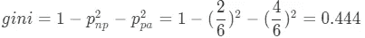

这个简化的公式将从这里开始使用

我们知道在 6 个角色中有 2 个非父母和 4 个父母。使用该信息，我们发现根节点处的基尼系数为 0.444。因此，根节点可以总结如下:

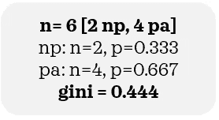

🚪**步骤 2:** 从根节点找到所有可能的分裂
使用三个特征中的任何一个，有三种方法来分裂。例如，我们可以把 6 个角色分成 2 组:一组给有宠物的人，另一组给没有宠物的人。其他两个特性也是如此。

🚪**步骤 3:** 计算每次拆分的两个节点的基尼系数
让我们计算三次拆分的每个节点的基尼系数。

**📌练习:**在继续之前，看看您能否计算出所有 6 个节点的基尼系数。

**🔑答案:**使用与步骤 1 相同的逻辑，我们发现每个节点的基尼系数如下:

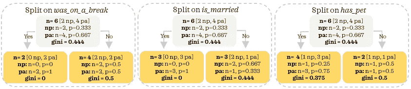

希望这些微小的数字清晰可辨👀(如果太小，尝试放大)

🚪**第四步:**计算每次拆分的加权平均基尼系数
现在，我们需要找到每次拆分的加权平均基尼系数，记为 *w_gini，*。以 *was_on_a_break* 为例，我们计算 w_gini 如下 *:*

**➗公式:**左:左边的节点，右:右边的节点

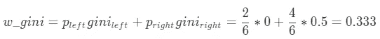

**📌练习:**看看能不能算出另外两个的加权基尼。

**🔑答案:**你的答案符合这些吗？

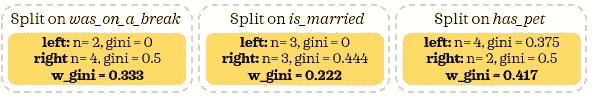

🚪**第 5 步:**通过检查上一步的结果，确定最佳分割(最低加权平均基尼系数)
，使用*is _ marted*进行分割得到最低加权平均基尼系数。如果我们也看看步骤 3 中的表格，我们可以直观地理解这个决定。当*上的分裂与*结合时，树能够将一半的数据分裂成左边的纯节点。这个节点是纯的，因为它只包含父节点。对于最纯的节点，Gini 是 0，对于最不纯的节点，Gini 是 0.5(例如，对于其他分裂的右节点)。

🚪**第六步:**计算信息增益:如果为正，👉我们了解到，如果我们要分手，最好用结婚。现在让我们看看我们是否能从分裂中获得任何信息。信息增益被定义为顶部节点的基尼系数与底部节点的加权平均基尼系数之差。

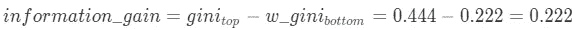

信息增益为正。换句话说，我们通过分裂获得信息。因此，正确的决定是从根节点使用*is _ marted*进行拆分。

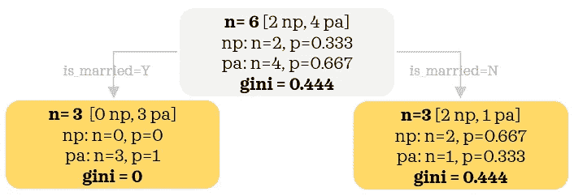

我们刚刚学习了如何确定分裂。⭐️:让我们重复同样的步骤，建立树的其余部分。是时候评估芥末节点的分配了！

也许我们可以从更简单的开始:左边的节点包含已婚节点。我们看到所有已婚角色都是父母，因此基尼=0。如果我们从这个节点分裂，即使从分裂中加权基尼为 0，我们也不会获得任何信息。所以，正确的决定是不拆分。在这种情况下，这个节点被认为是一个*终端节点，*不再进一步分裂。另一方面，对于右边另一个节点中的非婚角色，我们有一些工作要做。记住这些知识的最好方法是自己练习，为什么不试试通过下面的练习来应用我们刚刚学到的知识呢:

**📌练习:**完成所有步骤，找到正确节点的正确分割

**🔑答案:
步骤 1:** 我们已经知道了之前拆分的答案:0.444
**步骤 2:** 我们可以使用 *was_on_a_break* 或 *has_pet*
**步骤 3 &步骤 4:** 见下图
**步骤 5:** 最好的拆分是使用 *was_on_a_break*

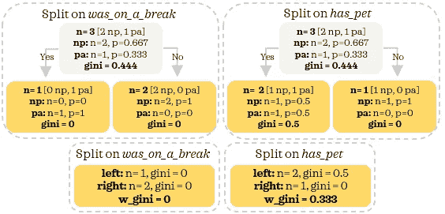

结合输出，最终的决策树如下所示:

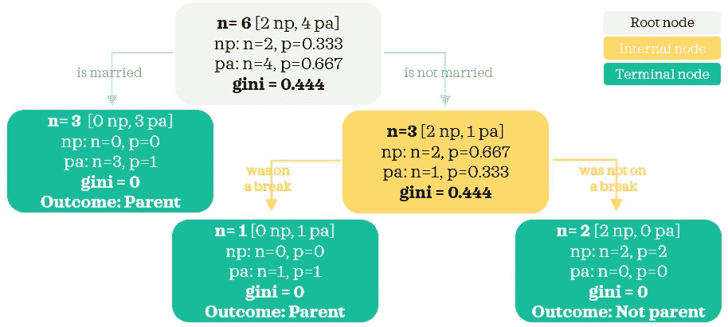

**根节点:**一个起始节点，包括所有人
**内部节点:**根节点和终端节点之间的所有其他节点。
**终端节点:**到达决策的节点

Yay❕:我们已经建立了一个简单的决策树。

## 2.2.使用熵✌️

让我们了解一下，如果用熵代替基尼，会有什么变化。步骤保持不变，除了我们每次都计算熵。
**➗公式:**

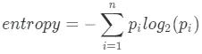

我们可以将这个通用公式简化为:

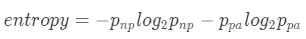

如果我们再次使用熵从根节点开始完成所有步骤，步骤 1、3 和 4 的输出将变为如下所示:

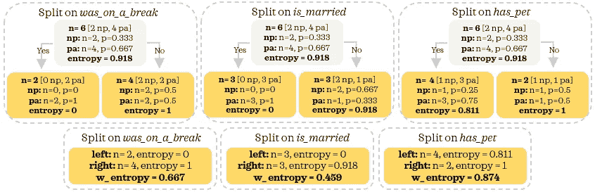

有了这个输出，看起来*是已经结合的*再次是从根节点的最佳分割。信息增益以类似的方式评估:

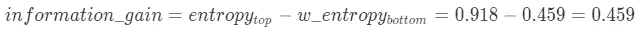

鉴于我们获得了信息，分开是有道理的。让我们像以前一样对底部节点继续相同的步骤。

因为已婚角色的左节点是纯的，所以我们不再需要从中分离。但是我们将按照步骤尝试改进正确的节点。步骤 1、3 和 4 的输出如下所示:

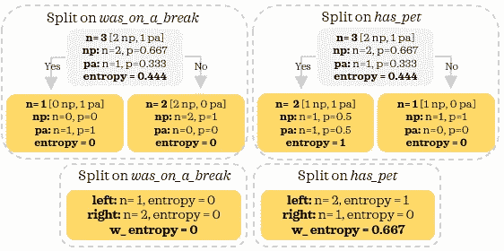

这是最后一棵树🌴：

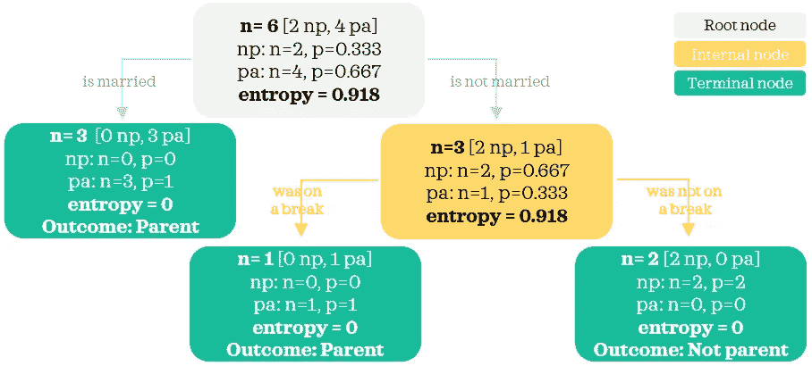

你注意到了吗，在最不纯的情况下，gini 是 0.5，熵是 1，在这种情况下，节点在两个类之间平均分配，而对于只包含一个类的最纯的节点，这两个值都是 0。

如果您热衷于通过更多的实践来巩固您的学习，请随意使用您自己的小数据集来构建一个简单的决策树。您可以使用下面的示例脚本根据 sklearn 输出检查您的树:

不要忘记用您要使用的数据替换这些数据

# 3.结束语💭

在实践中，使用决策树作为构建块的更健壮的算法可能比决策树本身更常用作预测模型。

如果你不小心，决策树很容易过度拟合。我们可以说 *was_on_a_break* 不是一个很好的特性，因为它恰好是一个非常具体的特性，只适用于训练数据中的记录。因此，使用该特征来建立模型会导致模型过度适应训练数据中的噪声。

不管怎样，我认为理解构建决策树的基本原则仍然是有价值的。✨

照片由[亚伦·伯顿](https://unsplash.com/@aaronburden?utm_source=medium&utm_medium=referral)在 [Unsplash](https://unsplash.com?utm_source=medium&utm_medium=referral) 上拍摄

*您想访问更多这样的内容吗？媒体会员可以无限制地访问媒体上的任何文章。如果你使用* [*我的推荐链接*](https://zluvsand.medium.com/membership) ，*成为会员，你的一部分会费会直接去支持我。*

***好玩的事实:*** *你听说过谷歌给朋友的复活节彩蛋吗？在谷歌上搜索* [*罗斯·盖勒，点击他照片正下方右侧的小沙发。*🙊另外 5 个角色也有这个功能！](https://www.google.com/search?q=ross+geller&rlz=1C1CHBF_enAU847AU848&oq=ross+geller&aqs=chrome..69i57j0l7.4197j0j7&sourceid=chrome&ie=UTF-8)

谢谢你看我的帖子。我希望你已经学到了一些东西，✂️.如果你感兴趣的话， 以下是我的其他帖子的链接:
◼️ [如何在熊猫数据框架中转换变量](/transforming-variables-in-a-pandas-dataframe-bce2c6ef91a1)
◼️ [用 Python 从维基百科中抓取文本的两种简单方法](https://medium.com/@zluvsand/two-simple-ways-to-scrape-text-from-wikipedia-in-python-9ce07426579b)
◼️ [用 Python 编写简单的 word cloud](/simple-wordcloud-in-python-2ae54a9f58e5)
◼️️[自然语言处理简介—第 1 部分:用 Python 预处理文本](/introduction-to-nlp-part-1-preprocessing-text-in-python-8f007d44ca96)
◼️ [自然语言处理简介—第 2 部分:词汇化和词干化的区别](https://medium.com/@zluvsand/introduction-to-nlp-part-2-difference-between-lemmatisation-and-stemming-3789be1c55bc)
◼️ [自然语言处理简介](https://medium.com/@zluvsand/introduction-to-nlp-part-3-tf-idf-explained-cedb1fc1f7dc)

再见🏃💨