# 股票市场、地震和疾病有什么关系？

> 原文：<https://towardsdatascience.com/how-are-the-stock-market-earthquakes-and-disease-related-c574c4d219e5?source=collection_archive---------54----------------------->

## 使用时间序列数据预测感染的传播，使用传统上用于模拟金融趋势的技术

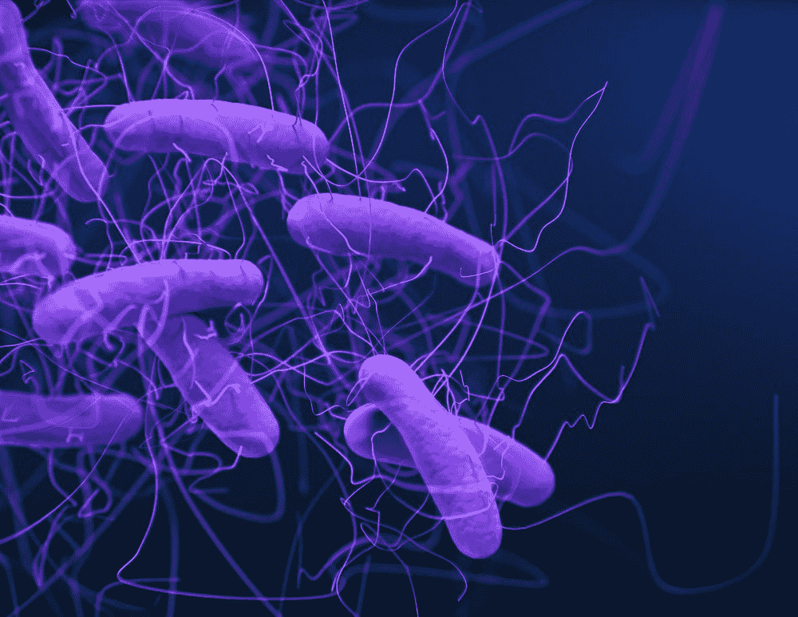

来自[疾控中心](https://unsplash.com/@cdc)的𝘊𝘭𝘰𝘴𝘵𝘳𝘪𝘥𝘪𝘰𝘪𝘥𝘦𝘴 𝘥𝘪𝘧𝘧𝘪𝘤𝘪𝘭𝘦细菌在 [Unsplash](https://unsplash.com/photos/W7L6KCaNfRU) 上的图像

尽管医学进步带来了救命的护理，但患者仍然面临着被来自医院和在医院里游荡的疾病感染的风险。这种情况是由入院时不存在但后来发展的感染因子引起的，被称为*医疗保健相关感染* (HAIs)。

追踪医院感染的传播是困难的，但也是必要的。在内科或外科治疗过程中发生的意外感染可能会延长住院时间，导致严重的患者疾病和死亡，并需要额外的治疗干预，从而产生额外的成本。

# 一个很有问题的海

最常见的 HAIs 之一是*艰难梭菌*感染(CDI)，一种大肠疾病。它会引起从腹泻到危及生命的结肠炎症等症状。传播的主要来源是有症状感染的患者，他们在粪便中流出大量孢子和细菌，导致其皮肤、床单和附近环境表面的广泛污染。孢子对热和通常的化学清洁剂有很强的抵抗力，因此可以在环境中保持几周或几个月。患者和医护人员的手上可能会沾染到孢子。

美国 HAIs 的增长，来自 [CDC](https://www.cdc.gov/)

由于可能的传播途径多种多样，考虑医院中需要类似护理的患者共用的 ***单元*** 或套房的可变性如何影响个别病例对后续传播的贡献是有益的。这些差异包括与物理位置密切相关的因素，如手部卫生依从性、清洁实践和患者更替率。

> 了解特定医院单元中的新感染可能强烈触发进一步的事件，以及了解这些影响将持续多长时间，可以指导接触预防和隔离措施，特别是针对高风险单元的措施。

2011 年，仅在美国就报告了约 476，400 例 CDI 病例，占全国所有医疗保健相关感染的 12.1%。尽管由于最近出现的流行菌株，CDI 仍被疾病控制和预防中心(CDC)列为主要的健康威胁，但此后发病率开始出现一些下降。继续努力提高感染预防措施的依从性，结合计算模型的发现，可以在进一步减少 CDIs 方面走得很远。

# 建模方法

在建立传染病传播模型时，尽快了解扩散模式至关重要。在这种情况下，数据量在本质上是有限的。这项研究可用的数据，主要是与大型城市医院 CDI 发病率相关的时间戳和单位标签，数量也相当少。这促使解决一些与捕获时间序列数据模式相关的小数据问题，同时确保从短序列中学习到的模式是可靠的。

为了了解 CDI 影响的各种特征，我们使用一类特别有趣的随机过程对感染传播进行建模，这些随机过程已被应用于从地震建模到金融分析的不同领域。这些是点过程，其定义特征是每个事件的到达在一段时间内增加了未来到达的速率。我们问:

> 如果我们将金融文献中公认的强大建模工具应用于一个重要的医疗保健问题，会发生什么？

使用模拟和真实的医学数据进行实验，我们进行研究以测试我们对模型参数的先验的有效性，并进行实验以评估模型的质量、稳健性和抗过拟合性。在此之后，我们在 CDI 事件数据上训练和测试我们的模型，得到每个单元的学习特征和所有单元对的传染性测量。下面，我们提供建模方法的背景。

# 事件序列建模

在时间中观察到的事件经常自然地聚集在一起。给定一组事件序列，我们可以通过时间戳和类型来描述序列中每个事件的特征。被称为 ***的标记点过程*** ，这些序列保存了几条有用的信息。例如，我们可以学习事件之间的触发模式，如下图中的红色箭头所示。我们也可能希望发现由蓝色和绿色时间线给出的相似事件序列的集群。利用这些习得的特征，我们甚至可以预测未来的事件。

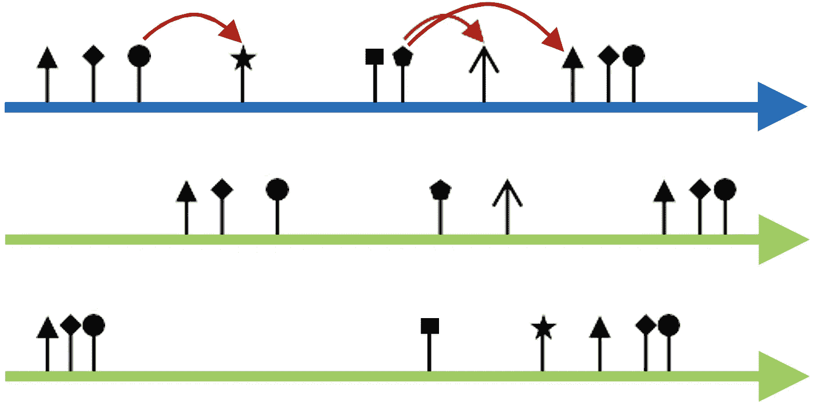

由各种事件类型组成的事件序列

我们用 *s* = {( *tᵢ* ， *cᵢ* )}表示，其中 *i* 范围从 1 到 *n* ，一个*n*-事件时间点过程，其中 *t* ᵢ是时间戳， *c* ᵢ ∈ {1，..。。， *C* }是事件 *i* 的标签。每一个点过程都可以表示为一个等价的 ***计数过程*** ，我们在其中统计每一个事件类型的发生次数。我们将一个 ***强度函数*** λ应用于每个计数过程，该计数过程收集时间 *t* 之前的所有类型的历史事件，并输出类型- *c* 事件的预期瞬时发生率。学习时间点过程的关键是参数化和估计其强度函数。

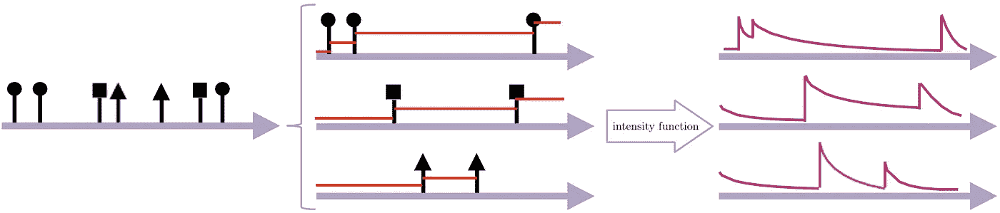

呈现指数衰减的点过程

# 霍克斯过程

这里，我们使用 ***Hawkes 过程*** ，这是一种特殊的点过程，用于模拟复杂的事件序列，其中历史事件影响当前和未来的事件。霍克斯过程是 ***自激*** ，因为事件到达率明确地依赖于过去的事件。

我们以一种特定的形式表达 Hawkes 过程的强度，有两个主要部分:独立于历史的外生强度 ***内在强度*** ，结合捕获隐藏在事件序列中的自激和相互触发模式的内生强度。我们将历史 type- *c'* 事件对后续 type- *c* 事件的影响称为 Hawkes 过程的 ***传染性*** 。 ***触发内核*** 测量传染性的时间衰减，并模拟先前事件如何触发未来事件的动态。

# 追踪 CDI 的传播

我们使用 Hawkes 过程对感染传播进行建模，以了解感染影响的各种特征。具体来说，我们将 Hawkes 过程与单位水平的事件序列进行拟合，其中每个新感染都会增加未来一段时间内的感染发生率。

我们设计并实现了一个模型来联合捕获多个事件序列的动态，并系统地揭示序列之间的聚类结构。为了提高我们对单位传染性、内在强度和衰减率(即模型参数)的估计，我们将关于影响模式的先验知识纳入到我们的学习框架中。我们的实验结果表明，与多基线方法相比，这样做改进了参数估计。我们还集成了学习任意触发核的能力，因为当前最先进的方法倾向于假设特定的核函数，例如指数衰减。

## 数据可视化

这项工作中使用的数据包括 CDI 阳性诊断的时间戳以及单元标签。事件被定义为患者的 CDI 测试结果为阳性诊断的日期，以及患者在诊断时居住的单元的指示。在下表中，我们提供了医院各单元及其房间构成的详细信息。

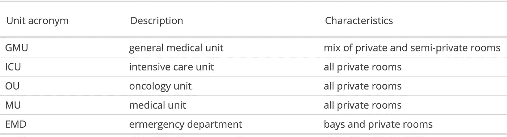

匿名单位缩写和特征

在下面的图中，我们按频率降序显示了事件的单位分布。单元标签包含其类型，GMU、ICU、OU、MU 或 EMD 之一。我们注意到不同单元的事件计数差别很大，但是不管事件计数如何，事件都倾向于以有趣的方式聚集。

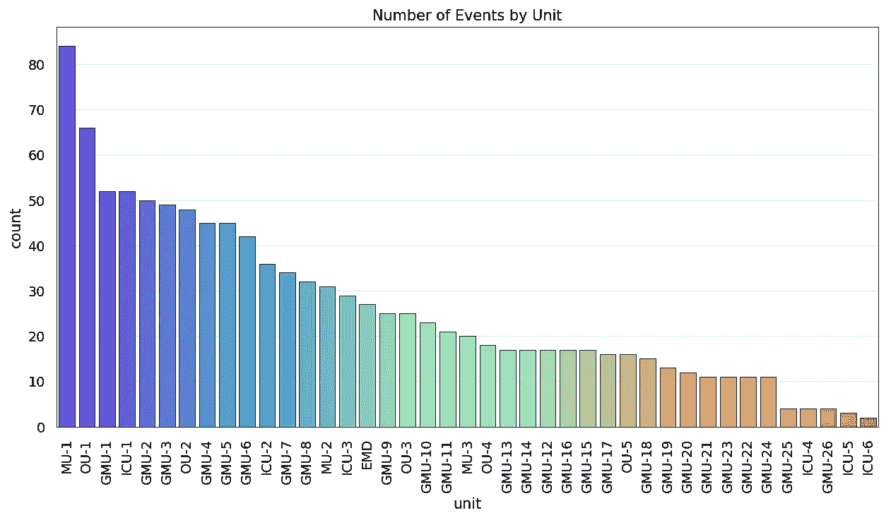

按单位划分的事件频率

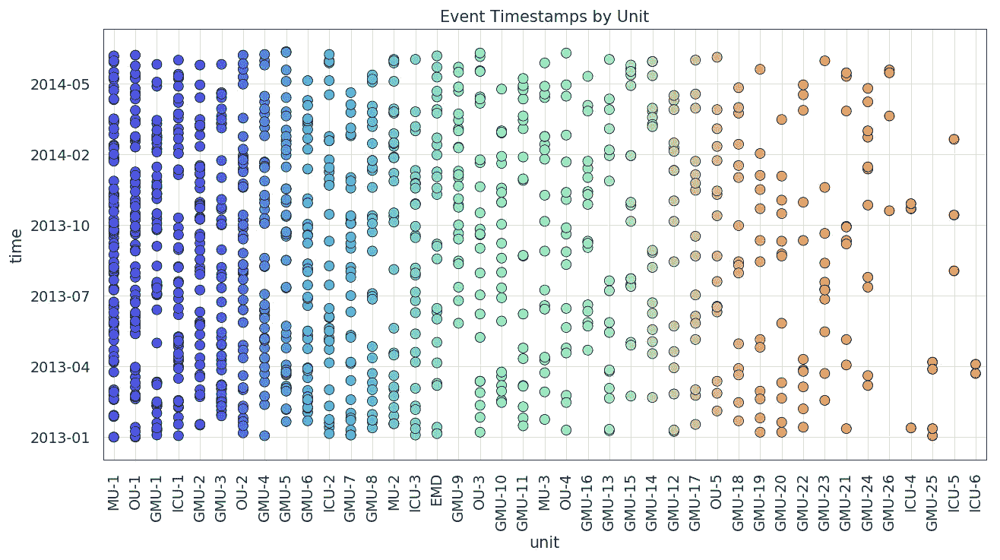

按单位划分的事件时间戳分布

我们提出了一个模型来学习每个事件序列的触发模式和跨各种序列的结构，其中每个事件序列包括多种类型的事件。模型参数分为两组:(1)一个由所有序列共享的*全局*触发核 *g* ，其反映了来自过去事件的影响效果，以及(2)一个*局部*传染性矩阵和局部固有强度向量，两者都与和每个单元相关联的阳性 CDI 事件序列具体相关联。

对于一个系统，其中 *U* 是序列的数量， *C* 是事件类型的数量，我们用 ***A*** 表示，测量 *C* × *U* ，通过串联 *U* 个体 *C* × *C* 传染性矩阵获得的平坦传染性矩阵。我们设 ***μ*** ，测量 *C* × *U* ，串联 *U* 个体 1 × *C* 向量形成的本征强度矩阵。

## 结构正规化

为了能够跨序列进行模式学习，对*施加稀疏和低秩约束。稀疏性约束包含的思想是，通常在每个序列中，只有事件类型的子集发生并触发其他事件。低秩约束背后的直觉是，当多个序列的总体触发模式相似并因此产生相似的单位传染性值时，导出聚类结构。我们还对*施加了低秩约束，因为我们假设内在强度值在几个单元之间可能是相似的。这些限制使我们能够纳入关于感染影响的先验知识。**

## **优化问题**

**我们学习带有最大似然估计的霍克斯过程模型。参数 ***A*** ， ***μ*** ， *g* 可以通过求解以下优化问题来学习:**

**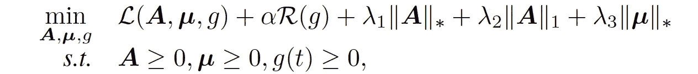**

**其中第一项表示模型的负对数似然，第二项正则化触发核以确保它是平滑的。参数λ₁、λ₂和λ₃分别控制*上的低秩正则化、*上的稀疏正则化和*上的低秩正则化的强度。负对数似然可以展开为:*****

***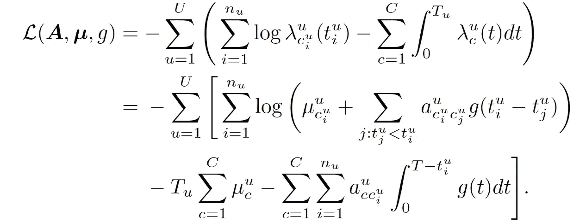***

***以上， *u* 表示特定的单元， *c* 表示特定的事件类型， *a* 是**A*A*的元素。 *nᵤ* 是事件的数量，而 *Tᵤ* 是与 *u* 相关的序列的最大时间戳。回想一下，λ是强度函数，其形式为:*****

****

**采用交替方向乘子法(ADMM)方案，每次迭代都有一个优化-最小化步骤来求解优化问题。输出为 ***A*** 、 ***μ*** 和 *g* 的学习值。学习算法和参数更新在[这里](https://drive.google.com/file/d/1q7mgPNAyT0Fw__aT4oLS2WKL4Lehv7OS/view?usp=sharing)有详细说明，还有鲁棒性分析。代码在这里链接[。](https://github.com/agnikumar/hawkes-health)**

## **单元级的推理结果**

**为了表征每个单元的 CDI 影响模式，我们将医院作为一个整体拟合一个 Hawkes 过程，输入 20 个序列，每个单元一个序列，有 20 个以上的事件，其中所有事件标签都相同，对应于阳性 CDI 诊断( *U* = 20 和 *C* = 1)。我们根据前半部分的数据训练一个模型。然后，我们在剩余的数据上测试模型。我们为每个单元 *u* 获得一个学习( ***A*** *ᵘ* ， ***μ*** *ᵘ* )对以及与所有单元相关联的单个触发内核。**

**这些强度和传染性值被标绘，每种类型标有一个单位。我们将学习到的传染性值解释为单位 *u* 中的 CDI 事件触发 *u* 中的 CDI 事件的程度。内在强度值描述由外部源触发的事件的到达。**

**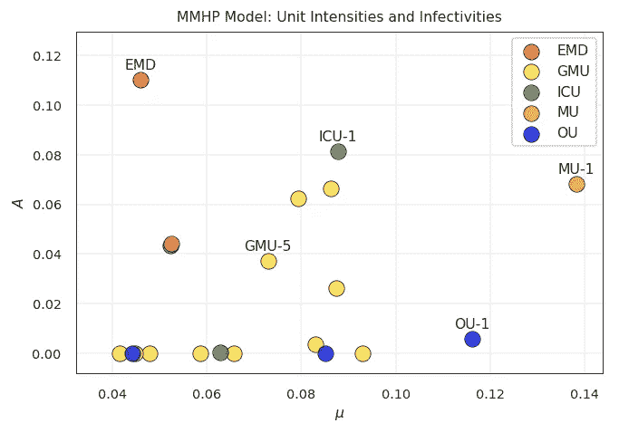**

**学习单位强度和传染性值**

**一个关键的结果是 EMD 在所有单位中表现出最高的传染性。急诊科是传播 CDI 的关键角色，这并不奇怪，因为在这个地方，由于患者不断涌入和患者流动率高，适当的清洁和消毒会变得很困难。此外，过度拥挤的问题使得隔离病人变得困难。**

**我们还看到，一般医疗单位往往在房间布局方面略有不同，因此可以理解的是，总的来说，他们表现出不同的传染性和内在强度值。仔细观察发现，具有高传染性的 gmu 也具有高的内在强度。较低的 ***A*** 值可能反映了良好的隔离实践，即在患者开始出现 CDI 症状后，在私人房间对其进行治疗。不同的 ***μ*** 值可以解释为 gmu 为具有不同潜在疾病概况的各种人口统计数据的患者提供护理。**

**由于物理分隔减少了孢子的传播，有私人房间的单元预期具有较低的传染性值。事实上，我们看到所有的肿瘤科和大多数重症监护室都有较低的传染性值，表明良好的隔离措施。**

**该模型确定，管理单元表现出相对较高的 ***A*** 值，这可能是因为一些 CDI 患者被例行转移到这些单元，这表明这些单元的隔离和清洁方案需要修改。位于特别意外位置的点，如 ICU-1，也向医院报告。**

## **医院层面的推断结果**

**在医院层面，我们寻求生成所有单位对的传染性值。为此，我们将 Hawkes 过程与数据集中所有 CDI 事件的单个序列进行拟合，并用一个标签表示与事件相关联的单元( *U* = 1 和 *C* = 20)。和以前一样，我们在前半段数据上训练模型，在后半段进行测试。**

**我们实现了下面给出的医院级别的传染性矩阵，其中每个单元测量类型- *u'* 事件到类型- *u* 事件对于 ***接收者*** 单位*和 ***影响者*** 单位 *u'* 的传染性。从视觉上看，单元格值对应于水平轴上的单位对垂直轴上的单位中的 CDI 事件的影响程度。我们看到当*u*=*u’*时的传染率往往是最高的，因为病人更可能由于他们居住的单位环境而被感染，而不是由于来自其他单位的影响。如图所示，我们通过影响者在单位间的感染分布，在水平轴上对影响者进行聚类。我们在纵轴上根据从其他单元接收的 CDI 影响效应的分布对接收器进行分组。***

**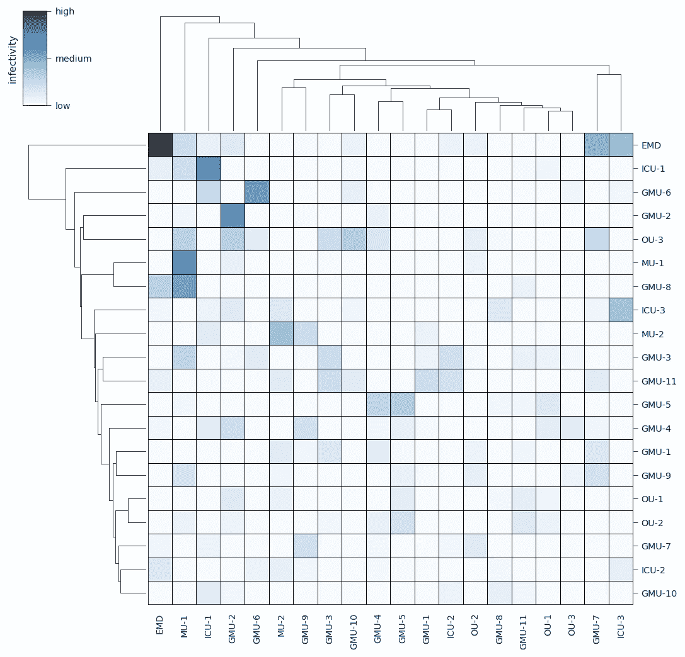**

**习得性医院传染性矩阵**

**从矩阵中，我们确定了前五个影响因素，即 EMD、MU-1、ICU-1、GMU-2 和 GMU-6。这与上一节中介绍的结果一致，即这些单位在触发与其自身相关的未来事件方面最具影响力。**

**我们确定前五名接受者为 EMD、ICU-1、GMU-6、GMU-2 和 OU-3。EMD 中其他几个单位影响 CDI 病例是合理的，因为频繁的患者移动会导致高活动。ICU-1、GMU-6 和 GMU-2 是顶级接收器，但它们所经历的 CDI 影响效应主要是由它们自身引起的，这在检查它们的隔离方案时值得注意。虽然我们预计 OU-3 由于其自身感染价值而被标记为低影响者，但令人惊讶的是它也是高接收者。传染性矩阵表明 OU-3 受到几个 gmu 的中度 CDI 影响，这是值得注意的，并促使其向医院报告以进行进一步调查。**

## **性能比较**

**为了评估单位级和医院级模型的相对性能，随着训练集大小的增加，我们绘制了各种测试对数似然值。我们将每个实验运行十次，用单个标准偏差误差棒绘制平均结果。**

**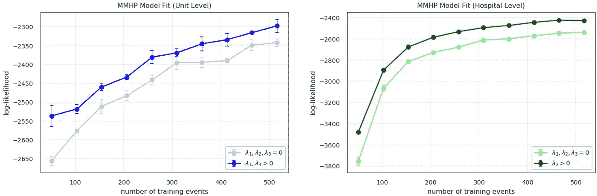**

**检验单位级和医院级模型的对数似然趋势**

**上面，我们看到，具有非零正则化参数值的模型始终比没有正则化的模型实现明显更好的性能，这在训练集包含较少事件时尤其明显。单元级结果表明，通过同时从多个序列中学习，具有策略正则化的模型能够为具有较少事件的单元利用来自其他序列的信息，有效地减少过拟合。**

# **结论**

**我们应用了一个涉及 Hawkes 过程的模型来描述患者监护病房内和之间感染的影响模式，通过提出传染性和内在强度的正则化因子，结合了关于 CDI 传播模式的先验知识。我们还包括学习任意触发内核的能力。我们希望通过纳入患者人口统计数据来扩展该模型，目标是建立一个端到端的 CDI 风险预测模型。**

**令人兴奋的是，仅由阳性感染诊断的时间戳组成的数据有效地捕获了各个单元的触发模式之间的系统差异。**

> **在医疗环境中，获得最新的传染性值和对单位不断变化的传染性能力的洞察可能是有价值的。**

**我们希望此处介绍的工作激发对感染影响特征的进一步研究，目的是帮助临床医生开发更有效的方案来降低患者风险。**

# **参考**

**A.Kumar，[使用自励时间点过程学习感染影响](https://drive.google.com/file/d/1q7mgPNAyT0Fw__aT4oLS2WKL4Lehv7OS/view) (2020)，提交给 NeurIPS 2020 的预印本**

***本文是霍克斯过程和时间序列分析系列文章的第一篇。有些帖子会更理论化，而其他的会详细描述数学建模的应用，就像这个。***