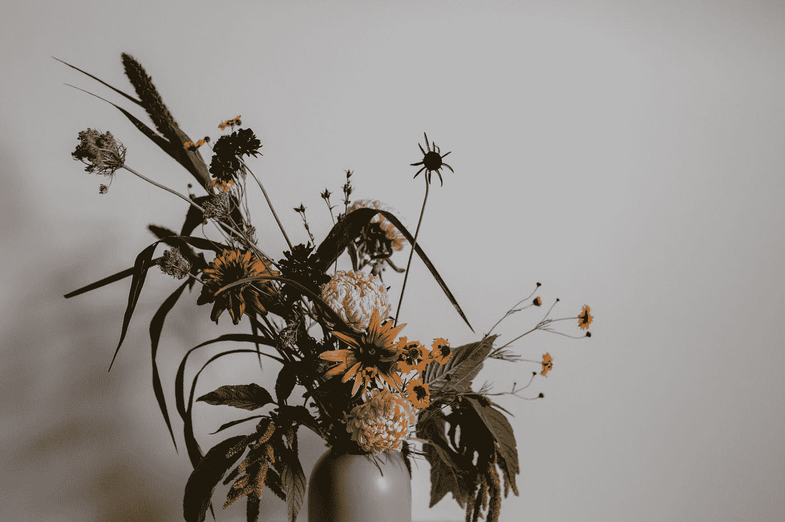

# 艺术如何帮助你成为更好的数据从业者

> 原文：<https://towardsdatascience.com/how-art-education-can-help-you-become-a-better-data-scientist-a909ae004477?source=collection_archive---------37----------------------->

## 发展空间能力以提高 STEM 成绩

照片由[戴维斯科](https://unsplash.com/@codytdavis?utm_source=medium&utm_medium=referral)在 [Unsplash](https://unsplash.com?utm_source=medium&utm_medium=referral) 拍摄

从罗德岛设计学院(RISD)毕业后不久，我收到了一封来自 RISD 的校友邮件，内容是关于该校前校长约翰·梅达将艺术融入 **STEM** (科学、技术、工程和数学)教育的倡议，称之为 **STEAM** 。作为一名热爱数学和科学的设计师，这封邮件在情感层面上触动了我。

*(关于《纽约时报》对约翰·梅达和 RISD 倡议的报道，见* [*此处*](https://www.nytimes.com/2014/11/02/education/edlife/putting-art-in-stem.html) *)。)*

STEAM 的支持者认为，创造力和解决问题的技能与 STEM 教育的成功密不可分。虽然我确实同意这个观点，但这个论点可能有些武断。首先，我们并不完全理解创造力意味着什么，即使我们理解了，我们也知道它不一定等同于学习如何画画。我在这两个领域工作了多年，我想分享一下我个人对学习艺术如何有利于数据科学实践的看法。

# **一点背景…**

我总是喜欢科学和艺术，但我经常不得不在两者之间做出选择。这是一个和在妈妈和爸爸之间做出选择一样困难的问题(毫不夸张地说，因为我妈妈是设计师，而我爸爸是工程师)。在我的童年，我花了很多时间来建造一个线跟踪机器人，并自学编码，同时还在书籍中填充角色草图。如果有人问我长大后想做什么，我总是很难选择是艺术家还是科学家。

尽管被评为班上最有可能治愈癌症的人，我还是决定在 RISD 大学学习视觉艺术，毕业后从事平面设计师的职业。在决定改变方向之前，我在这个领域工作和成长了近十年。我回学校做认知科学的研究，爱上了数据和统计，最后进入了数据科学领域。不像很多人想的那样，我的道路并没有感觉到分歧，如果你问我，我仍然不想选择。

# **认知地图**

蒂莫·维林克在 [Unsplash](https://unsplash.com?utm_source=medium&utm_medium=referral) 上的照片

当我在研究人类决策时，我被认知地图的想法迷住了，这一想法是受诺贝尔奖获得者约翰·奥基夫和牛津大学神经科学家蒂姆·伯伦斯的作品的启发。这个绝妙概念的一个非常简短的总结是，我们的大脑使用一个类似网格的系统来绘制空间关系，我们也可以将这个系统用于非空间关系。这一过程被认为是以海马体为中心的，海马体是以前被称为记忆中枢的大脑区域。

这似乎太直观了，难以置信。我们确实描述了类似于空间关系的非空间关系。我们可以用“距离”来感受和描述我们与人的关系。当两个事物彼此相似时，我们自然会理解为“更接近”。与昨天相比，童年的记忆感觉如此“遥远”。那么认知地图这个概念的重要性是什么呢？我认为(假设)艺术训练的某些方面发展了这样的空间技能，这些技能与导航和生成这些认知地图相关，这些认知地图在 STEM 研究的其他实践中是有用的。

# **发散思维能力**

有意识的原创训练鼓励你将不同的概念联系起来。想象一下，你去露营，你需要想办法打开一罐食物。这种跳出常规启发思维的认知过程被称为**发散思维**。当我们需要开罐头的时候，我们的大脑知道去找开罐器，因为开罐器和罐头的开启有直接的联系。但是如果我们在树林里而不是在厨房里，我们需要在开罐器的功能和树林里可用的东西之间建立一个新的联系。

照片由[迈尔斯·谭](https://unsplash.com/@mylestan?utm_source=medium&utm_medium=referral)在 [Unsplash](https://unsplash.com?utm_source=medium&utm_medium=referral) 上拍摄

现在让我们从认知图的角度来思考这个问题。我们的大脑有一个手册，告诉我们如何打开一个罐头，它链接到一个开罐器。但是，如果我们缺少必要的工具(开罐器)来执行指令，我们该怎么办呢？我们将遵循指令所需工具的属性(例如，切割金属，但不切割我的手)重新映射到其他可用工具的属性上，并找到最佳拟合路线。如果我们做得好，我们可以将指令的子部分映射到多个工具，并共同使用它们(一个切割金属，另一个保护我的手)。如果我们做得更好，我们可以把它推广到任何其他的地图上。

这是数据科学过程中的一项基本技能，在这一过程中，我们被许多工具淹没，无法得出答案。然而，我们如何将正确工具的正确属性重新映射到手头的问题是成功的关键部分。

创作艺术就是将不同领域的地图联系起来。许多任务的形式是改变给定对象的用途或改变给定概念的范围。例如，我曾经被要求从帽子中随机选择两个单词，并创建一个有凝聚力的出版物布局，以这两个单词(像花生酱和马蹄铁一样随机)为主题。主要的挑战是将这些单词的一些属性重新映射到一个对大众有意义的设计上。

这似乎是一种武断的做法，但它对科学研究过程有着重要的意义。将原本不相关的领域灵活地重新映射到手头的问题中，可以动态地利用我们大脑收集的更多资源。我们学会更容易地将我们在一个领域学到的知识推广到另一个领域。

凯利·西克玛在 [Unsplash](https://unsplash.com?utm_source=medium&utm_medium=referral) 上的照片

# **抽象能力**

同样，学会更流利地浏览不同的地图有助于我们浏览更广阔的领域。我们通过在可管理的范围内重新映射信息来做到这一点。这就像有许多地图的碎片，选择我们需要的位置，并在上面画大圈。因此，即使每个地图的一些细节可能是模糊的，我们仍然可以使用它来规划一条粗略但有效的路线，以便根据它们的大致位置完成所有的家务。快速找到重要要点并把这些关键概念集中起来的能力不仅有助于看清大局，而且有助于记忆大量的信息。这是一个**抽象**的过程，是艺术训练的组成部分。

葆拉·拉塞尔在 [Unsplash](https://unsplash.com?utm_source=medium&utm_medium=referral) 上拍摄的照片

例如，当你学习画一幅静物时，你训练自己一次提取你所看到的不同属性。首先，你可以从只关注整体比例和组件之间的关系开始。接下来，您可能会关注这些组件的边界和边缘。然后你可以只提取光线是如何照射到表面的。诸如此类。艺术培训不止于此。通常你会利用大脑中的其他地图来整合一些新的联想，以增加更深层次的含义。这种有意识地定义个体属性的过程建立了我们在它们之间快速导航的能力，并轻松地切换我们认知地图的规模。数据科学项目也需要类似的过程，在这个项目中，流畅地分解和组合问题，使其达到任何特定算法都可以解决的规模的能力非常重要。

由[在](https://unsplash.com/@heftiba?utm_source=medium&utm_medium=referral) [Unsplash](https://unsplash.com?utm_source=medium&utm_medium=referral) 上拍摄的

# **空间思维**

当我们在上面画静物的时候，我们开始观察组件是如何相互联系的。这是你在任何类型的艺术教育中学到的一项重要技能，也是认知地图的基础:一种将非空间问题视为空间元素的能力。许多研究表明，空间能力训练如何提高儿童的数学成绩(*见参考文献*)。艺术训练包括学习将多种元素组合或转换成更简单的维度，甚至在人们开始将这些想法写在纸上之前。这个过程包括模拟多种安排，并在我们的脑海中产生项目之间的关系。

[反推](https://unsplash.com/@retrosupply?utm_source=medium&utm_medium=referral)在[去飞溅](https://unsplash.com?utm_source=medium&utm_medium=referral)上拍照

这种空间训练然后被推广到非空间过程。之前我们讨论了艺术培训如何帮助我们跨越不同的领域和不同的背景。类似地，我们可以将非空间背景映射到空间中，并动态导航，从而让我们理解复杂的概念，并从不同的角度看待它们。(如果你看过 [3Blue1Brown 的视频](https://www.youtube.com/channel/UCYO_jab_esuFRV4b17AJtAw)，你就会知道这项技能有多方便。)

总之，我相信艺术教育的好处远远超出了传统的设计领域，通过在科学和技术中的实际应用来扩展自己。我在这篇文章中主要讨论了视觉艺术和设计方面的艺术培训，因为这是我最了解的。但是我相信这些技巧在许多不同类型的艺术实践中都有教授，包括表现领域更加多样化的表演艺术。毕竟，这是关于训练我们的基本认知功能，以扩大其门槛，打破通常的启发，而不仅仅是技术技能的训练。

## 参考

伯伦斯、T. E .、穆勒、T. H .、惠廷顿、J. C .、马克、s .、巴拉姆、A. B .、斯塔亨菲尔德、K. L .、& Kurth-Nelson，Z. (2018)。什么是认知地图？为灵活的行为组织知识。*神经元*， *100* (2)，490–509。

卡克马克，S. (2009 年)。折纸教学对国小学生数学空间能力影响之研究。*未发表的硕士论文)。安卡拉中东技术大学*。

郑怡玲和凯莉.米克斯。“空间训练提高孩子的数学能力。”*认知与发展杂志*15.1(2014):2–11。

吉利根，K. A .，弗卢里，e .，，法兰，E. K. (2017)。儿童中期空间能力对数学成绩的贡献。*实验儿童心理学杂志*， *163* ，107–125。