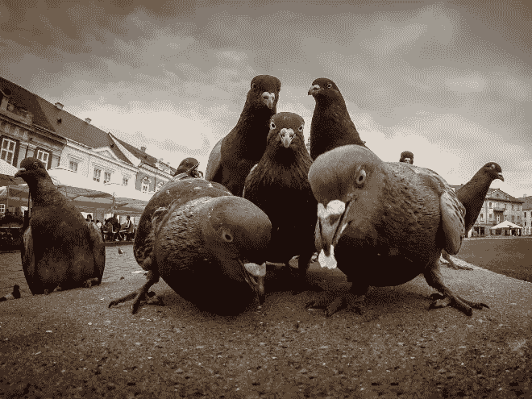
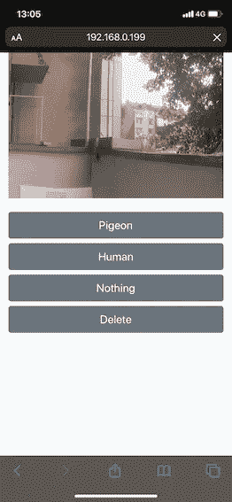
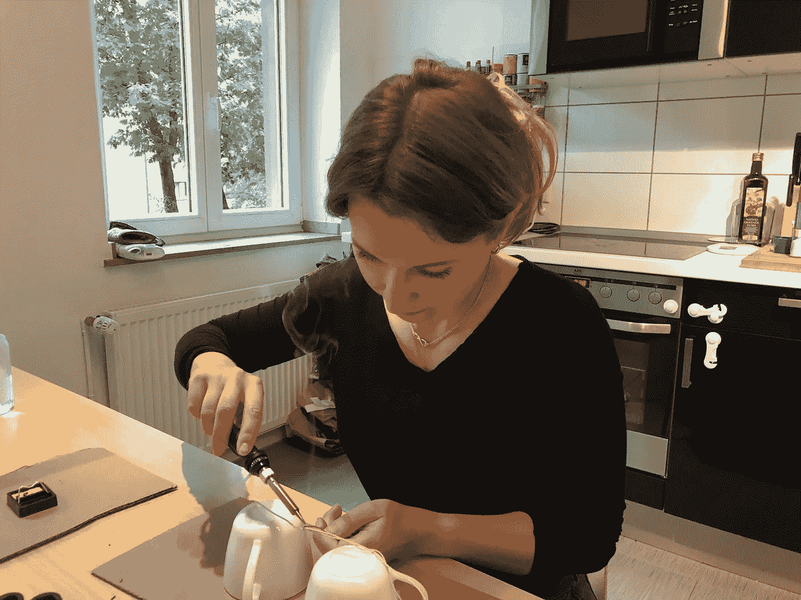

# 人工智能如何帮助我赢得与鸽子的战争

> 原文：<https://towardsdatascience.com/how-artificial-intelligence-helped-me-to-win-the-war-against-the-pigeons-9458293983a1?source=collection_archive---------43----------------------->

## 鸽子回避系统

## 建筑概述和为什么你可能需要一个鸽子火绒

免责声明:您正在阅读的第 1 部分给出了该项目的概述。 [*第二部分*](https://medium.com/@tatianasennikova/how-to-set-up-data-collection-for-the-pigeon-avoidance-system-eba572fe6dc9) *描述了技术设置和数据采集。* [*第三部分*](https://medium.com/@tatianasennikova/how-to-use-deep-learning-to-shoo-pigeons-from-the-balcony-31a2704f2160) *讲的是如何训练鸽子识别模型，并在树莓派上运行。*

来源: [Reddit](https://i.redd.it/jwa20gmv46v41.jpg)

想象一个美丽的夏日早晨。阳光透过树叶照射进来，鸟儿唱着欢快的歌曲，一切都充满了欢快的色彩。你泡了第一杯咖啡，站在阳台上享受只有周日早上才能享受的宁静与和谐。突然有什么东西打断了你对地球生命之美的沉思。在我的世界里，几乎每天都是我在自家阳台上发现的鸽子粪。我是一个忙碌的女人。我喜欢安静地享受早晨的咖啡，但我不喜欢——清理阳台上的鸽子粪便。

> 今天早上，我决定向鸽子开战，人工智能是最合适的武器。

现在我把情感部分放在一边，直接跳到工程、布线、建模和焊接的业务上。

# 问题陈述

鸽子经常光顾我的阳台，并在那里留下一些痕迹。我想在不伤害鸽子的情况下除掉它们，但要传递一个明确的信息:这里不欢迎鸽子。

# 解决方法

我已经建立了一个鸽子回避系统，可以检测鸽子并赶走它们。初始硬件设置包括:

*   [树莓派](https://www.amazon.de/Raspberry-Pi-ARM-Cortex-A72-Bluetooth-Micro-HDMI/dp/B07TC2BK1X/ref=sr_1_4?dchild=1&keywords=Raspberry+Pi+4+Model+B+8GB+RAM&qid=1596126399&sr=8-4)。我用的是树莓 Pi 4 型号 B 8GB 内存
*   [树莓相机模块](https://www.amazon.de/Raspberry-Camera-kuman-Automatic-Switching/dp/B07RM3Z6H7/ref=sr_1_8?crid=1Y2GQEJDQL6LG&dchild=1&keywords=raspberry+pi+kamera&qid=1596126483&sprefix=raspberry+pie+ca%2Caps%2C212&sr=8-8)
*   两个[运动传感器](https://www.amazon.de/Electreeks-PIR-Bewegungssensor-HC-SR501-Motion-Sensor/dp/B079WCCND1/ref=sr_1_3?crid=2N35R8W0CYVNB&dchild=1&keywords=bewegungsmelder+raspberry+pi&qid=1596276631&s=lighting&sprefix=motion+sensor+ras%2Caps%2C227&sr=1-3-catcorr)
*   [步进电机](https://www.amazon.de/Neuftech-Schrittmotor-Stepper-28BYJ-48-Treiberplatine/dp/B00NW4X25G/ref=sr_1_8?dchild=1&keywords=stepping+motor+raspberry&qid=1596126774&sr=8-8)

软件堆栈:

*   自动化的 Python
*   深度学习部分的 Keras
*   PHP，JavaScript，HTML 用于数据标注解决方案

# 架构概述

整体解决方案的工作方式如下。每当一只鸽子落在阳台上，运动传感器就会检测到光线的变化。它触发主管道，主管道反过来激活摄像机。相机拍摄照片，并将其存储在树莓上。主管道将图片发送到鸽子识别模型，该模型计算一只鸽子出现在图片上的概率，并返回该类。如果探测到鸽子，主管道就会启动步进电机，举起一根带丝带的棍子赶走鸽子。听起来很简单，但很有效。

鸽子回避系统架构图

# 为什么你可能需要一个鸽子火绒

架构图上有一个元素到目前为止还没有被解释，鸽子火绒。正是在这个时候，人们通常会扬起眉毛问:“鸽子的火种到底是什么？”鸽子绒是整体解决方案的重要组成部分。显然，为了训练鸽子识别模型，我需要向它输入带标签的数据。鸽子火绒是一个托管在树莓上的网络应用程序，它可以帮助我手动标记图像。最初，我想实现一个移动应用程序，左滑动会将图片标记为“不是鸽子”，右滑动会标记为“鸽子”。然而，很快我意识到，首先，移动应用程序开发对于最小可行产品(MVP)来说有点矫枉过正。第二，在现实中，我需要三个类，因为每当我在阳台上喝咖啡时，我会产生很多运动，并且通过制作数百张照片然后试图对它们进行分类，覆盆子会消失。因此，我引入了一个类“人类”,它会在下一张照片拍摄之前造成两分钟的延迟。我的主要希望是，当我已经在阳台上的时候，鸽子不会厚颜无耻地爬到阳台上。因为这些原因，我满足于安装在树莓上的 Apache HTTP Server 上运行的 web app。这就是鸽子火绒的界面。

鸽子火绒

由于我更喜欢在手机上点燃鸽子，这个网页被改编成手机版。这个应用程序非常简单。每当我给图片分配一个标签，它就把图片移到其中一个文件夹里:“鸽子”、“人”或者“什么都没有”。这也是未来培训的适当目录结构。“删除”按钮会将图片临时移动到“回收站”文件夹中，该文件夹由 cron 作业每晚运行的 clean _ directories.py 脚本定期清空。

顺便说一下，所有代码，包括训练例程、推理、鸽子火绒、树莓自动化都可以在 GitHub 上[获得。](https://github.com/tsennikova/pigeon-avoidance-system)

即使我不喜欢移动应用程序的最初想法，我仍然保留了标签模块的原始名称。我希望 Tinder 不要为此起诉我，否则你会在新闻里听到我的消息。

# 下一步是什么？

我以“鸽子回避系统”的名义在几篇文章中记录了这个项目。第 2 部分:“[如何为避鸽系统](https://medium.com/@tatianasennikova/how-to-set-up-data-collection-for-the-pigeon-avoidance-system-eba572fe6dc9)设置数据收集”将解释如何访问外部 Raspberry 组件，如摄像头、运动传感器和步进引擎。它还将提供有关数据收集以及如何在阳台上设置整个系统的详细信息。深度学习部分在:“[如何用深度学习把鸽子从阳台上赶走](https://medium.com/@tatianasennikova/how-to-use-deep-learning-to-shoo-pigeons-from-the-balcony-31a2704f2160)”中有描述。然而，我建议先阅读关于数据收集的文章。所以请保持更新，同时，先睹为快[第二部分](https://medium.com/@tatianasennikova/how-to-set-up-data-collection-for-the-pigeon-avoidance-system-eba572fe6dc9):我在我的厨房里焊接电缆。这个项目我确实需要很多电缆。

我在厨房里焊接电缆

如果你对这个项目有任何疑问，请随时通过 LinkedIn 联系我。