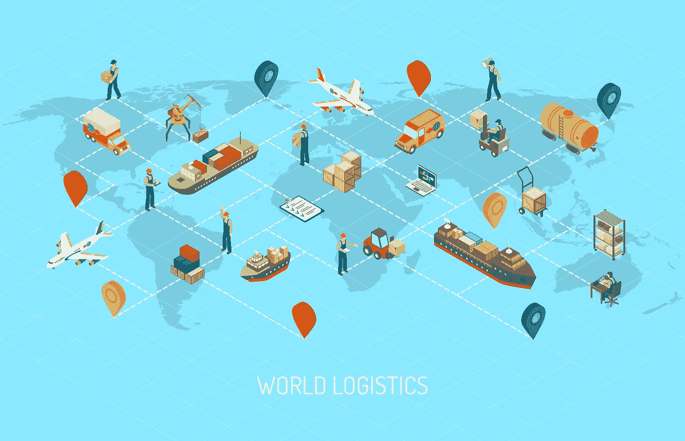
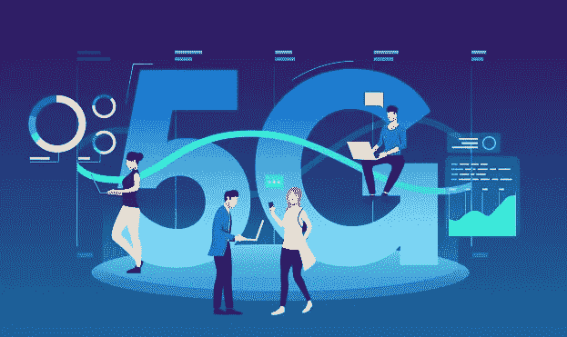

# 人工智能如何在 2020 年改变商业

> 原文：<https://towardsdatascience.com/how-artificial-intelligence-is-transforming-business-in-2020-1e68d4c1dd53?source=collection_archive---------32----------------------->

## 商业格局正在发生巨大的变化

图片由[皮克斯巴伊](https://pixabay.com/?utm_source=link-attribution&utm_medium=referral&utm_campaign=image&utm_content=1278060)的[加里克·巴尔塞吉安](https://pixabay.com/users/insspirito-1851261/?utm_source=link-attribution&utm_medium=referral&utm_campaign=image&utm_content=1278060)拍摄

# 介绍

工业革命千载难逢，然而，我们发现自己正在经历一场深刻的革命，即人工智能(AI)革命。200 多年前，当蒸汽机被发明时，我们经历了第一次工业革命。一个世纪后，我们发明了电，一个世纪后，发明了互联网。像所有这些发现一样，人工智能彻底改变了我们的经济，并颠覆了你能想到的每个行业。

但首先，是什么让 AI 如此具有革命性？

像蒸汽机和电力一样，人工智能扩大了社会生产力的上限。与效率低下且容易出错的人类不同，算法可以全天候工作，不容易犯人类犯的错误。除了生产力，人工智能目前的能力和未来的潜力本质上是无限的。人工智能应用增强了复杂流程的自动化、个性化的客户体验、改进的风险管理等等。

在这篇文章中，我们将看到人工智能如何彻底改变了几个行业。

# 人工智能和金融

pch.vector 创建的人员向量

根据[麦肯锡的一份报告](https://www.mckinsey.com/~/media/McKinsey/Industries/Advanced%20Electronics/Our%20Insights/How%20artificial%20intelligence%20can%20deliver%20real%20value%20to%20companies/MGI-Artificial-Intelligence-Discussion-paper.ashx)，金融服务是少数几个显著采用人工智能实践的行业之一，因此，一些公司的利润率比行业平均水平高出 10%以上。

以下是人工智能如何改变金融行业的一些常见应用。

## 欺诈防范

一般来说，人工智能应用寻求增加收入或削减成本。但在防止欺诈方面，人工智能两者兼而有之。必须向客户还钱是有代价的，而且不能将钱用于投资也会造成收入损失。在 2016 年，由于欺诈和身份盗窃，160 亿美元被盗，这就是为什么它是人工智能中最大的应用之一。通过分析客户的活动、位置和购买习惯，欺诈检测模型能够标记出可疑或异常的事件。

## 算法交易

交易员面临的最大挑战之一是管理自己的情绪。制定一个合理的交易策略是一回事，但是不管你面临什么样的混乱，坚持这个策略是另一回事。然而，算法交易消除了交易中的情感因素。机器学习和人工智能极大地提高了算法交易能力，随着数据的增加，算法每天都在学习和改进。

## 个性化银行服务

许多金融科技公司正在利用人工智能为客户提供个性化的银行服务。客户可以根据他们的风险偏好获得独特的金融工具组合，他/她还可以根据他们的支出模式、收入和目标获得个性化的金融计划。随着人工智能的发展，你可以期待看到更多个性化的银行服务。

如果你想了解更多关于人工智能在金融行业的影响，请查看 [2020 年银行业人工智能趋势](https://blog.datatron.com/2020-ai-trends-in-banking/)

# 人工智能和营销

由 GraphiqaStock 创建的背景矢量—【www.freepik.com 

很长一段时间以来，市场营销更多的是一门艺术而不是科学，直到最近。随着机器学习和人工智能的出现，数据科学家能够量化营销决策，并从整体上增强营销实践。

## 营销归因

营销中最大的问题之一是弄清楚如何量化各种营销渠道的影响。对于线下营销渠道，如电视、广告牌或广播，这尤其困难。

也就是说，出现了两种流行的营销建模技术来解决这个问题，归因建模和营销组合模型。归因建模用于确定销售和转化的信用如何分配给客户旅程中的不同接触点(例如，客户看到脸书广告，然后是 YouTube 广告，然后是 SEM 广告)。归因模式的问题在于，它们没有考虑线下渠道，而这正是营销组合模式的切入点。营销组合模型是多元回归的一种形式，旨在根据花费的美元来估计营销渠道的影响，以确定对转化率或收入的影响。

## 客户特征分析

客户特征分析或客户细分是通过对客户进行特征分析来更好地识别客户的实践。通过使用聚类技术和其他机器学习技术，营销人员可以更好地了解客户人口统计数据(年龄、性别)和地理位置(位置)。通过这样做，营销人员可以更好地定位广告和信息，以联系他们的目标市场。

# 人工智能和物流

宏向量创建的背景向量—[www.freepik.com](http://www.freepik.com)

通常，物流不是商业中最热门的话题，但涉及到人工智能时就不是了。事实上，AI 的一些最大潜力可以在物流中看到，包括自动化仓库和自动化车辆。

## 自动化仓库

当你想到*自动化仓库*时，你可能会想到亚马逊的仓库，那里有成千上万的移动机器人将库存从 A 点移动到 b 点。虽然这是真的，但实际上还有更多。自动化仓库还意味着使用数据来优化库存水平，从而减少所需的仓库空间，降低运输成本和总体成本。

## 自动驾驶汽车

人工智能在物流中的另一个用例是自动驾驶汽车。我之前说过，人类效率低下，容易出错。在运输方面尤其如此。人类需要睡觉、吃饭、使用洗手间、休息等等。有了自动驾驶汽车，交通将不再局限于一天八小时，一周五天。

特斯拉是自动驾驶汽车的主要例子，不仅生产消费类汽车，还生产自动驾驶卡车。另一个不太为人所知的例子是劳斯莱斯和英特尔。他们一起建立了一个智能感知系统，为自主船创造了机会。

案例研究:[了解人工智能如何通过动态定价模型转变一家全球运输公司](https://www.datatron.com/solution/casestudies/logistics)

# 人工智能和零售

图片由[皮克斯拜](https://pixabay.com/?utm_source=link-attribution&utm_medium=referral&utm_campaign=image&utm_content=4071232)的[梅根·雷扎辛](https://pixabay.com/users/Megan_Rexazin-6742250/?utm_source=link-attribution&utm_medium=referral&utm_campaign=image&utm_content=4071232)拍摄

在可以说是竞争最激烈的行业之一，零售商正在寻找通过人工智能脱颖而出和增加价值的创新方法。人工智能正以多种方式应用于整个产品和服务周期。以下是人工智能在零售业中的许多用例中的几个。

## 聊天机器人和机器人助手

聊天机器人在过去几年里有了显著的改进。虽然他们还不能完全取代客户服务代表，但他们非常擅长回答简单的问题，并用于指导客户找到正确的支持团队。比聊天机器人更有趣的是机器人助手——由软银设计的机器人 Pepper 是一种社交人形机器人，用于实体零售店与客户互动并提供帮助。

## 个性化推荐

一些零售公司也在使用人工智能为客户提供个性化推荐。弗兰克和奥克声称，通过问一系列问题，人工智能可以为每个顾客提供一个独特的服装风格订阅箱。亚马逊是另一个很好的例子，它使用人工智能根据以前的搜索历史和购买历史提供推荐的产品。

案例研究:[了解人工智能如何改进需求预测以优化库存。](https://www.datatron.com/solution/casestudies/retail)

# 人工智能和电信

卡特曼戈斯塔创建的业务向量—[www.freepik.com](http://www.freepik.com)

电信行业的估计价值为 1.4 万亿美元——价值如此之大，每一个差异都很重要，这就是为什么电信公司已经找到了几个人工智能用例来改善他们的客户体验，并最终实现利润最大化。以下是人工智能在电信行业的三个主要应用。

## 流失预测建模

客户流失率是指客户停止与某个实体做生意的比率。因为从技术上讲，电信行业的客户提供了永久的收入，客户流失的成本很高。因此，电信公司利用人工智能根据活动水平、投诉数量等来预测客户何时可能流失。

## 网络最佳化

人工智能已经成为构建自我优化网络的关键，使运营商能够根据流量数据自动优化网络。根据 IDC 的数据，已经有超过 60%的运营商投资人工智能系统来改善他们的网络。

## 预测性维护

我想我们都同意，电信服务中最大的诽谤者之一是网络故障——当你的 wifi 无法工作时，你不讨厌吗？嗯，公司现在正在利用人工智能，根据设备的状态和分析网络模式来预测网络何时可能发生故障，以便他们可以主动预防网络故障。

案例研究:[了解人工智能如何改善电信网络运营并模拟消费者行为](https://www.datatron.com/solution/casestudies/telecom)

# 感谢阅读！

*让我们连线上* [*领英*](https://www.linkedin.com/in/terenceshin/)