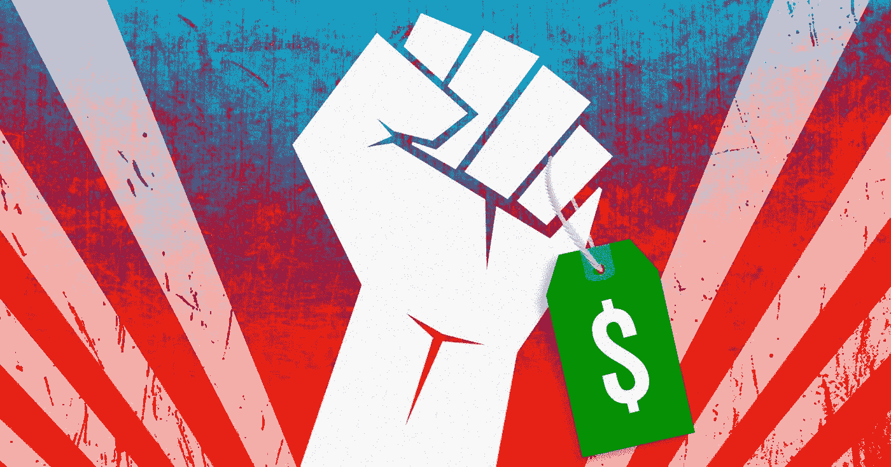

# 人工智能将如何推动 2020 年的消费主义

> 原文：<https://towardsdatascience.com/how-artificial-intelligence-will-fuel-consumerism-in-2020-946c67240dfa?source=collection_archive---------18----------------------->

## 气候变化还是消费主义？

## 当机器人比你更了解你的时候

我们都知道什么是消费主义。我们都有罪却不承认。回想一下，我们出售或藏在抽屉里的许多 iPhones(或 Android 手机)，只是因为我们想得到最新的手机。为什么续航时间延长一小时的电池和分辨率稍高的相机。

我们花数小时排队购买数不清的 Hello Kitties 或 Pokémon 公仔，只是因为它们是“限量版”。这是我们最喜欢的不同颜色的衣服，因为我们可以。我们告诉自己迫切需要的是装满衣服和鞋子的架子和衣柜——沙滩装、休闲装、正装、家居服、睡衣、派对装等——但实际上我们并不需要。

对于我们许多有罪的人来说，这种消费主义和物质主义的现象是合理的。然而，我们没有意识到的是，人工智能(AI)在多大程度上助长了这一现象。

而且只会在 2020 年被 AI 加剧。

# 消费主义——有什么大不了的？

实话实说吧——人工智能已经在*助长消费主义了。最精彩的部分？我们甚至没有意识到我们对整个“消费主义”现象有多着迷。如果我们这样做了，气候变化和整个推动“绿色”生活方式的运动就不会存在了。*

但这不是本文要讨论的内容。因此，尽管我们消费的东西产生了大约 60%的全球温室气体[1]，我们还是要花一点时间来忽略这个可悲的事实，并检查人工智能将如何推动**T5 更多 消费主义。**

以下是我的分析。

## 广告定位——当机器人比你更了解你的时候

你多久点击一次 Instagram、脸书、YouTube 或其他网站上的赞助广告？你有多经常在你的新闻订阅上发现一个广告，而你甚至没有在谷歌上搜索过它，但只是模糊地记得向某人提起过它，并且感觉完全被吓坏了？

**答**:不确定，但肯定越来越频繁

放松点，没人在监视你。这些算法正在变得越来越好。随着关于你的数据越来越多，这些推荐系统能够微调各种参数的权重，以获得你的几乎完美的复制品(模型)(或者看起来是这样)。

这些推荐系统是延续消费主义的完美例子。他们鼓励你比平常更早地得到你可能想要或需要的东西，仅仅是通过出现在你眼前(视觉刺激)。

当然，有些人可能会认为这是另一种形式的营销。的确如此。但是，当我们想到像英国退出欧盟、川普总统大选这样的传奇故事，当然还有导致我们现在所知的数据保护政策甚至监管的整个剑桥分析公司时，广告定位的整个想法可能是如此可怕。

见鬼，我甚至担心把我的电子邮件送给免费 WiFi，因为我不想让人们知道我在哪里，也不想出卖这些信息。妄想症是真的。

推荐系统无处不在——电子商务网站、社交媒体、基于订阅的服务(网飞、Spotify、Medium 等)等等。消费主义不再仅仅是物质商品。它还包括音乐、电影、书籍和任何书面文章等内容。

这些算法越好(即数据越多)，消费主义就越持久。

## 亚马逊效应——当机器人管理你的仓库

杰夫·贝索斯才华横溢。投资者喜欢他的公司是因为他带来了多少股东价值，更不用说 T2 亚马逊 T3 的企业集团式商业模式了。竞争对手讨厌他，因为他们因缺乏规模经济而难以跟上，也缺乏纵向扩展的资源。

当然，这不仅仅是*关于*亚马逊*的*。这是关于整个电子商务行业和对实体自由化的推动，就像灭霸在收集了无限宝石后打了个响指，让一半的人口消失了一样。尽管这看起来不可思议，但我们肯定会慢慢实现这一目标。我相信，进入实体店的体验很快就会从纯粹的交易型转变为体验式。

*那么，发生了什么变化？*

最近，*亚马逊*宣布向美国顾客提供免费的当天送达和当天送达服务..其增加的支出(96 亿美元)不仅包括运输和接收，还包括陆地、海洋和空中的配送和逆向物流。目标是:这样你就再也不需要去别的地方购物了。

阿里巴巴也紧随其后，花费 160 亿美元建立了一家快递公司，试图建立自己的递送平台。这也是对 JD.com 首次进军中国电子商务市场提供当日送达服务的回应。

就像斯科特在他的文章中非常精彩地提到的那样，这对像 DHL、FedEx 和 UPS 这样的公司有着巨大的影响。对于这些公司来说，现在更有意义的是被像亚马逊 T21 或沃尔玛这样的公司收购，以免被完全取代，如果他们不能提供相同的当天送达服务。他们肯定能够做到，但代价更高。不管怎样，必须要发生一些激烈的事情。

*AI 在哪里发挥作用？*

如果你还没有在 YouTube [4]上看过*阿里巴巴的*仓库，你应该看看。仓库里的大部分操作都是由机器人来完成的，我可以想象未来大多数仓库会是这样的。

它本质上是计算机科学爱好者的天堂。这个仓库类似于一个吃豆人棋盘，吃豆人(机器人)必须在迷宫(成排的物品)中导航，以获得食物(拾取物品)并避免鬼魂(其他机器人)。我们遇到的是一个路由问题(旅行推销员问题)和一个调度问题的组合。有了 AI，这些问题就变得简单了。深度 Q 学习(强化学习代理)和计算机视觉的使用使得典型的计算机科学问题更容易解决。

我敢打赌，电子商务公司都将转向自动化仓库这一黄金标准。如果他们不这样做，他们就失去了竞争力，亚马逊的目标也就实现了。

> 消费主义的增长仅仅是这种极快的传递速度的结果。

如果退货就像快递第二天送到你家门口一样方便(更不用说包裹投递点如此普遍)，当你可以在家里舒适地尝试东西时，谁还会出去呢？

## 额外收获:Lite 是新的重量级产品

*这一部分与人工智能如何推动消费主义没有直接关系，但由于基于云的时代商业模式的转变，我想提出这一部分。*

我非常肯定，在 2020 年，没有人会质疑科技公司正在并将继续推动全球经济。新兴公司基于轻资产模式，而已经存在很长时间的公司*也*弃船转向轻资产模式。亚马逊网络服务(AWS)、微软 Azure、谷歌云平台(GCP)和阿里巴巴等云提供商将获得所有这些利润，更不用说这些云服务的巨大利润了。

Spotify 允许播放流媒体音乐。YouTube 允许视频内容的流式传输。网飞允许电影和电视剧的流媒体播放。游戏正在向云发展，在云环境中，昂贵的游戏硬件不再是以高帧率运行游戏的必要条件。CD 用于音乐、DVD 用于电影、游戏机用于硬核游戏的时代已经一去不复返了。你现在需要的是良好的互联网来刺激消费。

## 结束语

当我们期待未来有所收获的一年时，让我们花一点时间来欣赏人工智能对我们生活的改善。说到这里，让我们也默哀一下，纪念环境为我们做出的牺牲，这样我们就可以享受当天送达了。

澳大利亚的树袋熊和其他动物。

## 参考

[1]家庭消费的环境影响评估，工业生态学杂志—[https://onlinelibrary.wiley.com/doi/abs/10.1111/jiec.12371](https://onlinelibrary.wiley.com/doi/abs/10.1111/jiec.12371)
【2】阿里巴巴旨在以 160 亿美元的快递风险投资交付，金融时报—[https://www . ft . com/content/3 b5 e9 b5 c-049 c-11ea-9 AFA-d9e 2401 fa 7 ca](https://www.ft.com/content/3b5e9b5c-049c-11ea-9afa-d9e2401fa7ca)
【3】fck dex，Scott Galloway—[https://medium.com/s/no-mercy-no-malice/fckdex-eca0025a0b11](https://medium.com/s/no-mercy-no-malice/fckdex-eca0025a0b11)
【4】在阿里巴巴配备机器人的智能仓库内，YouTube