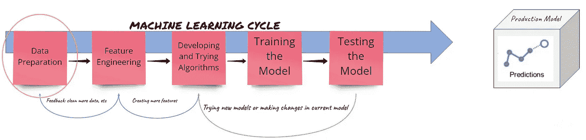
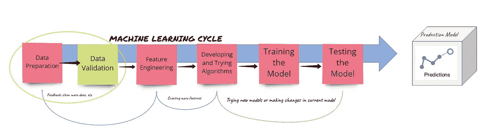
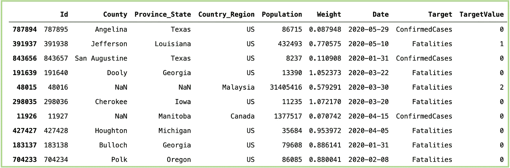
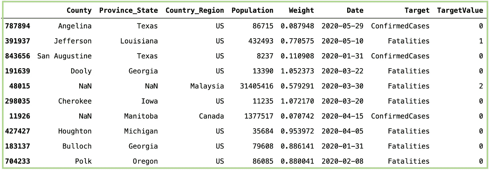
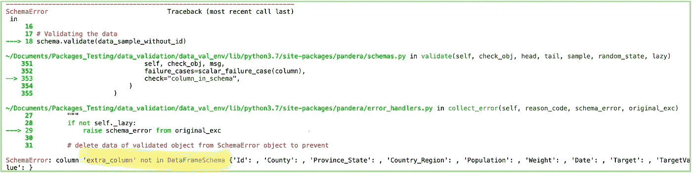
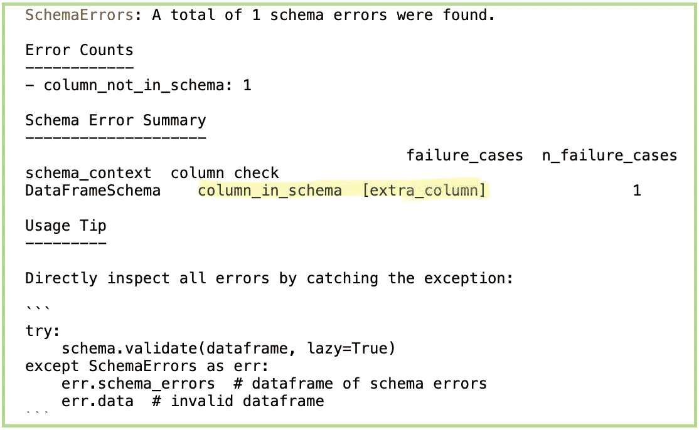
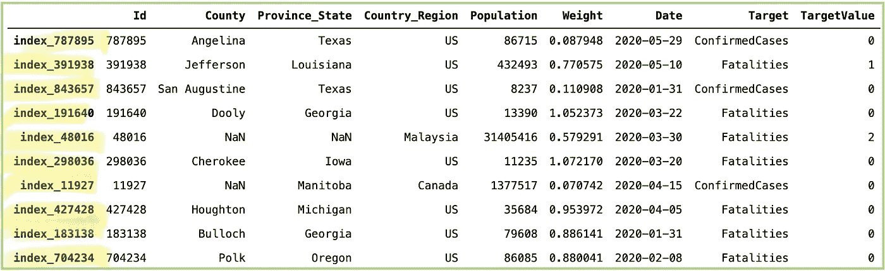
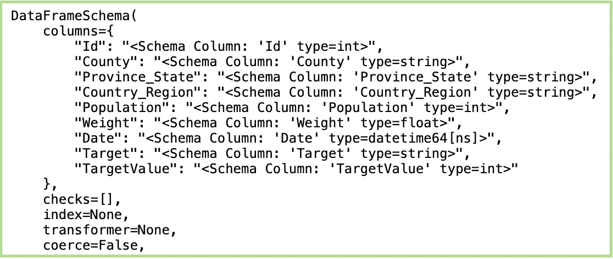
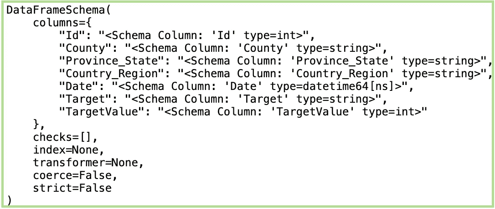
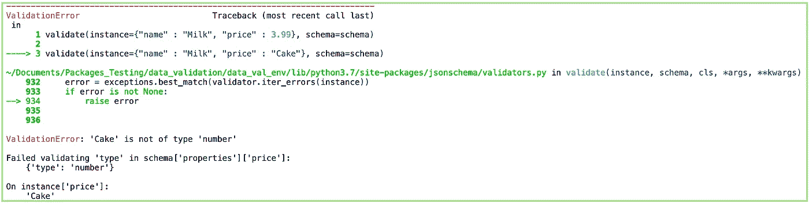

# 使用 Pandera 的自动化数据验证如何让我更有效率！

> 原文：<https://towardsdatascience.com/how-automated-data-validation-made-me-more-productive-7d6b396776?source=collection_archive---------13----------------------->

## 数据科学家的重要策略


在 [Unsplash](https://unsplash.com?utm_source=medium&utm_medium=referral) 上由 [Franck V.](https://unsplash.com/@franckinjapan?utm_source=medium&utm_medium=referral) 拍摄的照片

D ata 被称为 21 世纪的*新石油*。篡改数据以提取和使用正确的信息来解决我们的问题非常重要。对人们来说，处理数据是令人兴奋的，有时也是乏味的。正如正确的说法，“数据科学家花 80%的时间清理数据”。作为该包的一部分，当遇到新数据集时，我会经历相同的过程。同样的活动不限于，直到机器学习(ML)系统实现并部署到生产中。在实时生成预测时，数据可能会由于不直观和不可预见的情况而发生变化，如人为干扰导致的错误、提交的错误数据、数据的新趋势、记录数据时出现的问题等等。包含多个步骤的简单 ML 系统如下图所示:



作者(普拉蒂克·甘地)创造的形象

这需要通过明确引入或标记另一个组件来稍微改变，在数据准备之后和特征工程之前，我们命名为 ***数据验证*** :



作者(普拉蒂克·甘地)创造的形象

这篇文章关注的是为什么数据验证很重要，以及如何使用不同的策略将它无缝地集成到他们的管道中。经过一些工作后，我学会了如何实现脚本来进行数据验证，以节省一些时间。除此之外，我**使用一些预建的包来自动化它们**，加速我的游戏！

# 听听我的故事！


[公路旅行照片，Raj](https://unsplash.com/@roadtripwithraj?utm_source=medium&utm_medium=referral) 在 [Unsplash](https://unsplash.com?utm_source=medium&utm_medium=referral) 上

根据 [Gartner](https://www.bmc.com/blogs/cio-ai-artificial-intelligence/) 的数据，几乎 **85%** 的项目将*无法投入生产*。机器学习(ML)管道在投入生产时通常会遇到几个问题。我经常遇到的一个主要问题是数据质量的妥协。一天花几个小时，一个月可能花几次，并且弄清楚由于某种原因传来的数据是不可接受的，这可能会很令人宽慰，但同时也会令人沮丧。导致数据类型改变的原因有很多，例如，引入了文本而不是整数，整数在异常值上(可能高出 10 倍)，或者数据馈送中没有接收到整个特定列，等等。这就是增加这个额外步骤如此重要的原因。手动验证可能会花费额外的精力和时间。使其自动化(在一定程度上)可以减轻数据科学团队的负担。我认为在管道中集成自动化数据验证有一些主要的好处:

*   **节省几个小时的时间**
*   **团队成员之间的挫折感**
*   **通过关注其他领域提高效率**
*   努力使您的生产模型**更加精确**；)

Python 社区已经构建了一些优秀的包，以非常智能的方式处理这些问题。我将分享一些我探索过的，以及我如何设计我的脚本使它们成为我的管道的一部分。

**数据源**:我用了一个最近的数据集来展示如何实现这些包。下面是获取[数据](https://www.kaggle.com/c/covid19-global-forecasting-week-5/data?select=train.csv)的链接。

# 数据验证包

## 潘德拉:

Pandera 提供了一个非常简单灵活的 API，用于对数据帧或系列数据进行数据验证。它还有助于执行复杂的统计验证，比如像 two_sample_ttest 这样的[假设检验](https://pandera.readthedocs.io/en/stable/hypothesis.html#wide-hypotheses)。更多关于包装和使用的细节可以在[这里](https://pandera.readthedocs.io/en/stable/)找到。

从数据集中抽取 10 行样本:



正如我们所看到的，有多个不同数据类型的列:String、Int、Float、Datetime。我们需要*定义我们期望的数据的模式*。我定义了一个简单的模式，没有任何严格的数据验证检查规则，如上面的代码所示。根据期望的数据类型，我们可以用***【pa.Int】****来表示*整数，* ***pa。字符串*** 为*字符串，* ***pa。*** 浮子为*浮子或* ***pa。日期时间*** 如果有*一个日期时间*。这里我们设置 ***可空=真*** 如果我们期望*值否则 ***假*** 。此外，如果我们设置***compete = True***，它会将列转换为预期的数据类型，而不会给出任何错误。例如，用于将*浮点数转换为整数，将整数转换为字符串*等。在验证数据时，输出将是数据帧本身，因为它通过了所有的检查(试试看！！！).如果失败，输出将如下所示:**

```
**Traceback (most recent call last):
...
ValueError: cannot convert float NaN to integer**
```

**关于潘德拉，我已经探索了一些惊人的能力，我会尽可能详细地解释。**

## **设置必需的列:**

**有时，列可能是可选的，而不是必需的。在这样的情况下，我们可以设置 ***required = False。*** 由*默认* ***必填=真*** 用于所有列**

**正如我们在下面的截图中看到的，它返回数据作为输出，没有任何错误。**

****

**对于“ID”列，需要设置输出= False**

**尝试为同一列设置***required = True***并再次运行上面的代码。**

## **处理新列:**

**默认情况下，如果新列被添加到数据框中且未在方案中定义，则不会引发错误。但是，如果你愿意你可以设置 ***strict = True。*****

**运行上面的代码，我们看到它抛出了模式中没有定义的错误*‘extra _ column’*。**

****

**设置 strict = True 和 lazy = False 时“extra_column”出错**

**如果你看到我的代码，我已经添加了 ***lazy = True*** ，它给出了如下更详细的视图:**

****

## **索引验证:**

**如果数据集中存在任何特定模式或具有任何特殊重要性，也可以验证索引。例如，参见下文:**

**我创建并设置该列作为索引，以展示我们如何进行索引验证。在模式的括号之外，可以指定预期的索引格式。同样，输出与之前相同**

****

**使用索引验证后的输出**

**这里我们执行了一个单一的索引验证。多索引验证可以以类似的方式执行。点击查看[。](https://pandera.readthedocs.io/en/stable/dataframe_schemas.html#multiindex-validation)**

## **数据架构转换:**

****

**[尤里察·科莱蒂](https://unsplash.com/@juricakoletic?utm_source=medium&utm_medium=referral)在 [Unsplash](https://unsplash.com?utm_source=medium&utm_medium=referral) 上的照片**

**一旦我们定义了验证数据的模式，在由于额外的计算(100%的时间都会发生)而引入新的列之后，就有可能在管道本身中转换模式。假设最初我们只有 Id*、County、Province_State、Country_Region、人口*作为列。我们向模式中添加新列 *Weight、Date、Target、TargetValue* ，如下所示:**

**在打印如上所示的模式时，我们得到以下结果:**

****

**添加列后转换的架构**

**另一方面，如果需要，我们也可以从模式中删除一些列，如下所示:**

****

**删除列后的架构**

## **检查列属性:**

**用户可以使用*检查*对象对列进行更详细的检查，如下所示:**

**Pandera 有一些可以直接使用的预置检查，比如*大于等于*、*小于*。也可以传递自定义检查，例如，这里我们使用了 *lambda* 参数来计算字符串的长度。这是 Pandera 中最好的功能之一，可以为数据验证策略带来更多的价值。点击了解更多详情**

## **如何以及何时使用:**

*   **我创建单独的脚本，一旦在进入下一步之前接收到最终数据，就运行并给出验证报告。人们也可以将它们集成为预处理的一部分。**
*   **人们也可以直接把它们用作装饰者。这里看[如何](https://pandera.readthedocs.io/en/stable/decorators.html.)。**
*   **除了直接在数据帧上使用之外，它还可以应用于*系列*，特定的*列检查*，甚至是*逐元素检查*。**
*   **由于灵活性 *regex 操作*也可以使用 Pandera 对数据执行。**
*   **重要的是，你不可能一开始就有一个完美的数据验证模式。更有可能的是，当您在长时间内实时遇到数据时，通过合并不同的验证策略，您将使数据验证模式更加“完美”, ML 管道更加健壮。**

# **其他包:**

## **远大前程:**

**顾名思义，您可以为要验证的数据设置期望值。老实说，我和潘德拉相处得太好了，以至于我没有机会去发掘他的全部潜力。它看起来很容易实现，并且可以直接打包使用。下面是相同数据的一小段实现:**

## **地狱犬:**

**这是另一个语法类似于 Pandera 的包。当数据为 ***字典格式*** 或 ***JSON*** 格式时，更适用。**

**关于这个包的更多细节可以在[这里](https://docs.python-cerberus.org/en/stable/index.html)找到。**

## **漏勺:**

**如果您的数据是通过 XML、JSON 或 HTML 表单 post 获得的，这是另一个很棒的包。换句话说，验证任何类型的字符串、映射和列表数据都是有益的。以下是一些有用的链接:**

***Github*:[https://github.com/Pylons/colander](https://github.com/Pylons/colander)**

***文献*:[https://docs.pylonsproject.org/projects/colander/en/latest/](https://docs.pylonsproject.org/projects/colander/en/latest/)**

## **JsonSchema:**

**JsonSchema 是 Python 的 JSON 模式的一个实现。顾名思义，这个包对于验证 JSON 数据非常有帮助。以下面这个包含有效 JSON 数据和无效 JSON 数据的例子为例:**

**在运行无效数据时，它会抛出一个错误:**

****

**无效数据的错误**

**正如我们所看到的，价格应该是数字，但提供的是字符串。关于它的更多细节可以在这里找到。**

## **结论:**

**这个帖子可能看起来主要是由 Pandera 主导的，因为它是我经常使用的软件包之一。写这个帖子纯粹是为了分享我踏上的航程。我确信人们可以从这些特定用例的包中获益更多。经常多走一英里可以达到非凡的效果。数据验证无疑是“额外努力”。开发数据验证策略可能会感觉到额外的工作，但是如果养成了创建自动化脚本的习惯，即使是处理一些小事情，也一定会受益匪浅。**

> **如果您有任何意见和建议，请随时分享！**