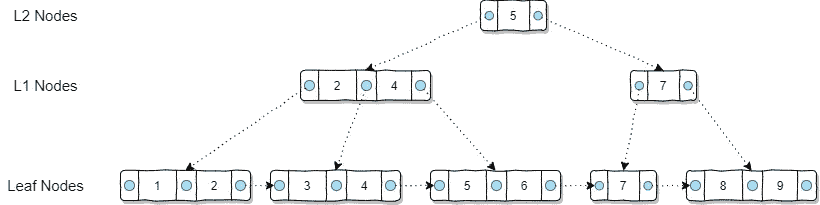
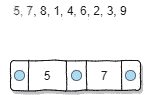
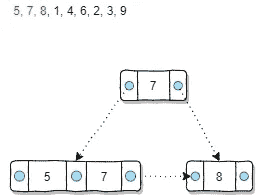
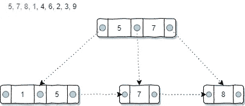
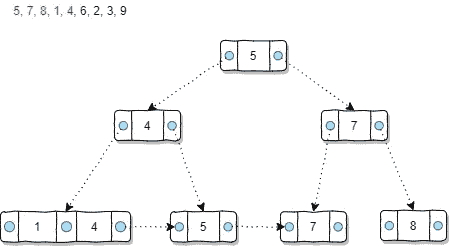
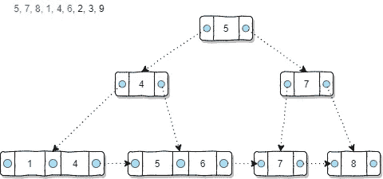
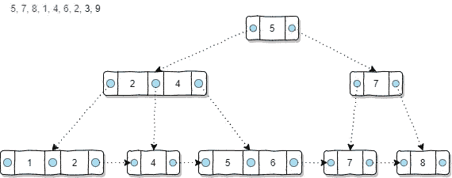
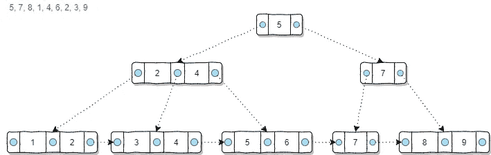

# B+树索引是如何在数据库中构建的？

> 原文：<https://towardsdatascience.com/how-b-tree-indexes-are-built-in-a-database-6f847fb3cfcc?source=collection_archive---------26----------------------->


照片由 [niko photos](https://unsplash.com/@niko_photos?utm_source=medium&utm_medium=referral) 在 [Unsplash](https://unsplash.com?utm_source=medium&utm_medium=referral) 上拍摄

## 使用图表来说明如何在数据库管理系统中建立 B+树索引

如果您不是 DBA 或数据库开发人员，您可能不知道数据库索引的机制。但是只要你会写一些 SQL 查询，你一定听说过数据库索引，知道索引可以提高 SQL 查询的性能。

在我以前的一篇文章中，我介绍了 B+树索引，它仍然被大多数数据库管理系统(DBMS)使用。它可以提高大多数条件下的 SQL 查询性能。

[](/why-we-need-indexes-for-database-tables-25198145a8ca) [## 为什么我们需要数据库表的索引

### 引入没有任何公式和计算机科学理论的 B+树索引

towardsdatascience.com](/why-we-need-indexes-for-database-tables-25198145a8ca) 

有一个图是我用来举例的，如下图所示。



你很好奇 b+树为什么是这个样子吗？具体来说，为什么顶级节点只有一个数字为 5 的节点？为什么叶节点 7 是单独的？在本文中，我将介绍如何从头开始构建 B+树索引。

# 将键插入 B+树


照片由[古斯塔夫·古尔斯特兰德](https://unsplash.com/@outoforbit?utm_source=medium&utm_medium=referral)在 [Unsplash](https://unsplash.com?utm_source=medium&utm_medium=referral) 拍摄

让我们从一个空表开始，忽略它的其他列，只关注创建了 B+树索引的键列。

现在，假设我们开始使用这张桌子。因此，一系列条目将被插入到表中。因为键列上有一个 B+树索引，所以需要在逐个插入数据行时构建索引。

尽管通常键字段可能是按顺序插入的，当然，情况并不总是这样。为了演示一般情况下的机制，让我们假设密钥是随机插入的。例如，顺序如下:

```
5, 7, 8, 1, 4, 6, 2, 3, 9
```

需要强调的是，建立 B+树指数的方法并不只有一种。因此，我们需要在我们的例子中有一些假设。不用担心，所有 b+树索引的机制都是一样的。

> 假设 1:硬盘驱动器的每个块可以存储两个密钥

当然，在实践中，这个数字小得不可能。但这会让我们的例子更容易理解。

好的。现在，我们可以将前两个数字插入到索引中。



因为假设 1，当我们插入两个值时，我们不需要担心任何事情。这些值必须排序，所以 5 在左边，而 7 在右边。请注意，该节点是一个叶节点，因为此时我们不需要任何非叶节点，因为一个叶节点中只能存储两个值。



当我们插入一个新数字“8”时，我们首先假设我们需要将它插入到现有的叶节点中。然而，它将以一个具有三个值“5，7，8”的节点结束。基于假设 1，我们需要拆分节点，因为该块只能存储两个值。

> 假设 2:当一个节点被拆分时，左边节点的右值去更高一级

我们需要作出假设 2 来定义每当一个节点被分割时哪个值去更高的级别。请注意，也可能有这样的假设，如右节点的左值上升，我们只需要定义它并遵循它。

因此，不能存储在该块中的最后一个值“8”被分裂，成为新的叶节点。之后，左边的节点是“5”和“7”，最右边的值是“7”，所以会上一级。

现在，我们有了一个非叶节点。这个新节点需要用左右两个指针来创建。左指针指向值较小的节点，而右指针指向值较大的节点。



接下来，当我们插入数字“1”时，叶节点“5，7”变成了“1，5，7”，这导致了另一次分裂。最后一个值“7”将被分离出来，成为一个新的叶节点。请注意，编号“7”不会被合并到另一个编号为“8”的节点中，这是因为 B+Tree 不具备这一功能，同时这会造成额外的索引构建开销。没有必要。

之后基于假设 2，左边节点最右边的值是数字“5”。它达到了更高的水平。已经有一个数字为“7”的节点，所以简单地在“7”的左边插入数字 5。别忘了让指针指向的节点小于或等于“5”。



下一个值是“4”。又造成了分裂，于是数字 4 基于假设 2 上了一层楼。但是，第一级非叶节点“5，7”已经得到了两个值。基于假设 1，需要拆分。

毫无疑问，基于假设 1，数字“5”应该上升到第二级非叶节点。但是，要知道数字 5 将不再存在于一级非叶节点中，这一点非常重要。这是 B+树的机制之一，在非叶子节点中不应该有任何重复的值。



插入数字“6”相对容易。因为叶节点“5”还有一个空格，所以数字“6”会被插入到这个节点中，没有任何其他效果。



当插入数字“2”时，需要拆分叶节点“1，2，4”。基于假设 2，数字“2”需要被提升。由于非叶节点“4”仍然有空间，所以数字“2”在那里结束，没有进一步的影响。



最后两个数字“3”和“9”可以在叶节点上找到它们的位置。因此，不再需要分割。

所以，所有的 9 个数字都以这种随机顺序插入到 B+树索引中。

# 摘要


特雷·吉普森在 [Unsplash](https://unsplash.com?utm_source=medium&utm_medium=referral) 上的照片

在本文中，我使用了图表来说明如何从头开始构建 B+树。事实证明，在 B+树索引的实现之间，假设可能是不同的。然而，机制是相同的。

作为最经典的索引类型，B+树已经使用了几十年，并且仍然被大多数数据库管理系统使用。尽管它可能不再是最先进的索引，但我相信它仍然是标志性的，DBA、数据分析师和软件开发人员都应该知道。

[](https://medium.com/@qiuyujx/membership) [## 通过我的推荐链接加入 Medium 克里斯托弗·陶

### 作为一个媒体会员，你的会员费的一部分会给你阅读的作家，你可以完全接触到每一个故事…

medium.com](https://medium.com/@qiuyujx/membership) 

**如果你觉得我的文章有帮助，请考虑加入灵媒会员来支持我和成千上万的其他作家！(点击上面的链接)**