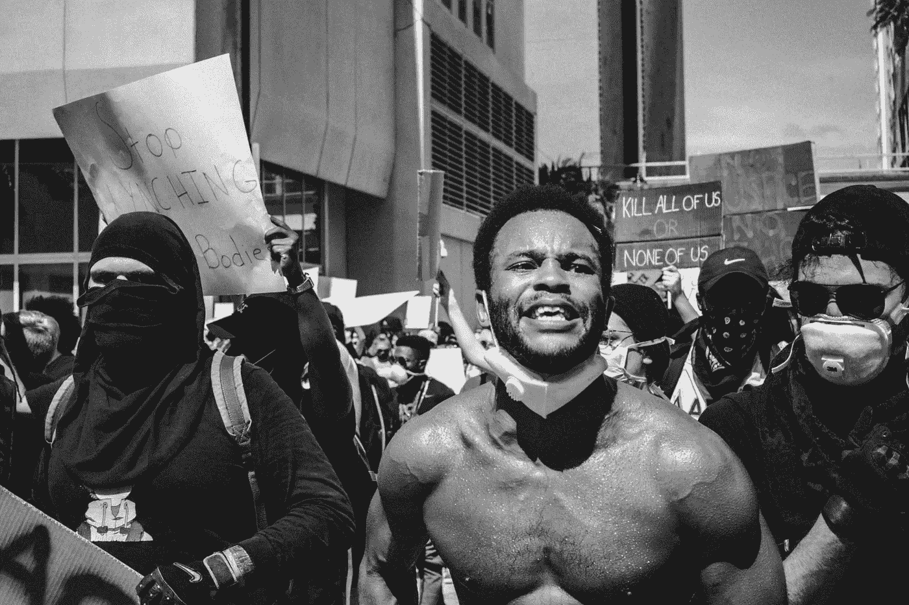
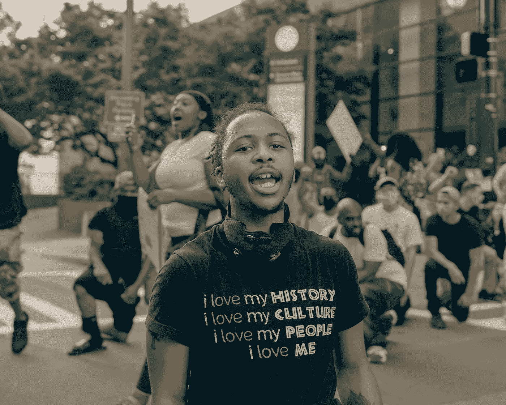
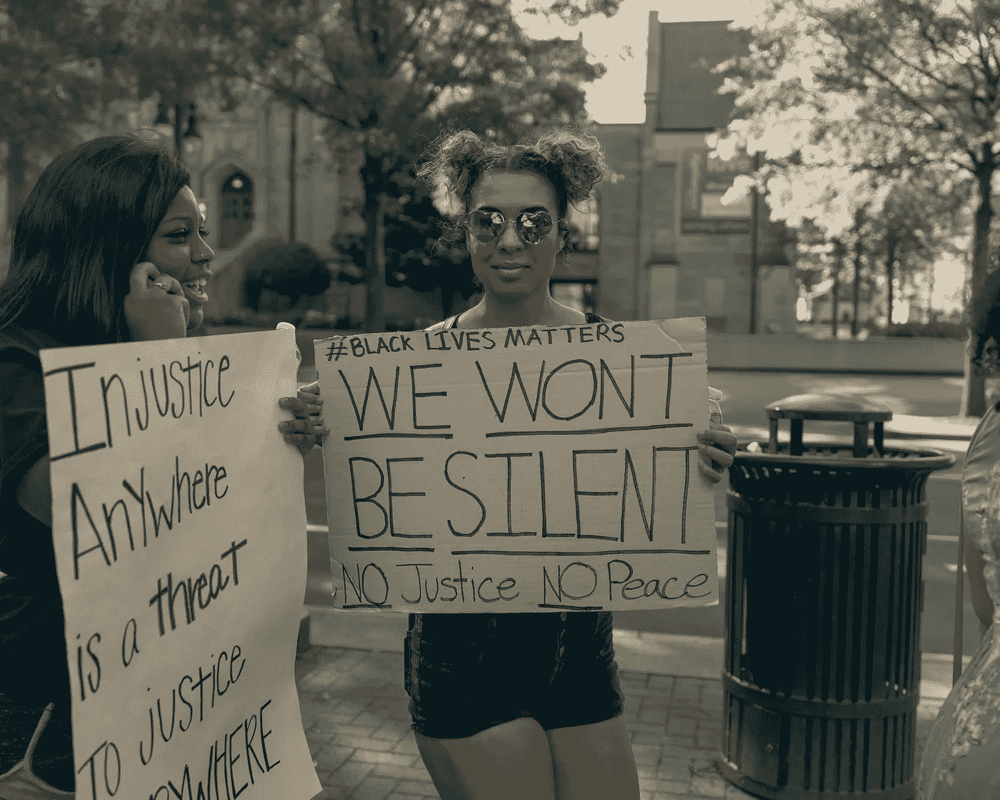
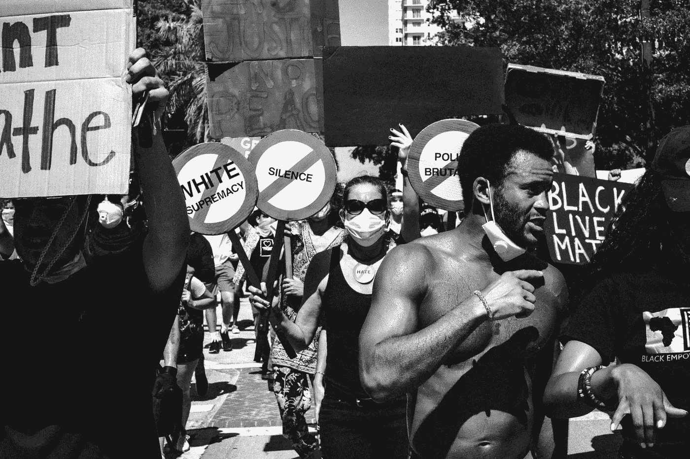

# 面部识别软件让黑人被捕有多糟糕

> 原文：<https://towardsdatascience.com/how-bad-facial-recognition-software-gets-black-people-arrested-3c02738a3d54?source=collection_archive---------38----------------------->

## 美国司法压迫黑人和棕色人种的另一种方式

黑人被面部识别软件错配的频率更高。弗兰基·科尔多瓦在 [Unsplash](https://unsplash.com/s/photos/black-lives-matter?utm_source=unsplash&utm_medium=referral&utm_content=creditCopyText) 上的照片

遍布美国的骚乱再次提醒我们，以白人为主的群体对有色人种的公然压迫。但是，当警察谋杀案现在成为焦点时，我们不应该忘记司法系统用来毁灭黑人生活的更微妙的工具。

首先，有许多黑人和棕色人种在被捕后死去。虽然联邦官员未能收集数据，但[独立资源](https://journalistsresource.org/studies/government/criminal-justice/deaths-police-custody-united-states/)显示，差距是真实的。

还有一个事实是，有色人种在审判时会受到更严厉的判决。显而易见，这是白人刑事法官种族偏见的结果。

最重要的是，事实上黑人和棕色人种更容易被逮捕。虽然黑人占平均人口的 13%，但截至 2017 年，他们占美国监狱的 33%。占人口 72%的白人只占监狱的 30%。从统计数字来看，黑人被监禁的可能性是白人的六倍。

因此，很明显，由于种族偏见，黑人和棕色人种受到警察和司法系统的压迫。不太明显的是，以白人为主的软件开发人员助长了这种犯罪。

# 算法与深色皮肤的人不匹配的几率要高 10 倍

国家标准和技术研究所(NIST)最近的一项研究证实了研究人员[一直说的话](https://nvlpubs.nist.gov/nistpubs/ir/2019/NIST.IR.8280.pdf):面部识别对你很有帮助，只要你是一个白人男性——其他人就失去了。

一种对法院很重要的方法是一对一匹配。这意味着你要查询两张不同的照片是否描绘了同一个人，例如，这可能有助于识别你在视频中捕捉到的嫌疑人。这项研究发现，根据算法的不同，黑人或亚裔美国人的误报率是白人美国人的 10 至 100 倍。换句话说，如果一个算法呈现了来自两个不同肤色的人的两幅图像，它们在计算机看来几乎是一样的。

在美国开发的算法中，假阳性的数量大致相同，不考虑非高加索人种。除了非洲裔和亚裔美国人之外，这项研究还包括美洲原住民、美洲印第安人、阿拉斯加印第安人和太平洋岛民。

一些研究人员，其中包括来自 T4 NIST 的 Patrick Grother，提到白种人的面孔可能比非洲人或亚洲人的面孔更加多样化。但这并不成立:NIST 的研究还发现，在亚洲开发的算法能够像识别高加索人一样准确地识别亚洲人。根本原因似乎更多地在于算法本身，或者它从中学习的图像数据集。

我们不要让这些人受到不实指控。照片由[粘土堤](https://unsplash.com/@claybanks?utm_source=unsplash&utm_medium=referral&utm_content=creditCopyText)在 [Unsplash](https://unsplash.com/s/photos/black-lives-matter?utm_source=unsplash&utm_medium=referral&utm_content=creditCopyText) 上拍摄

面部识别责任的缺失不仅仅是 NIST 哀叹的问题。例如，麻省理工学院的研究人员 Joy Buolamwini 和斯坦福大学的 Timnit Gebru 在种族和性别方面发现了类似的差异。值得一提的是，两位科学家本身都是黑人女性——她们是从事人工智能工作的极少数人中的两位。

如果面部识别是白人为白人制造的玩具，所有这些差异都不会那么糟糕。问题是，这些算法被用于在它们的开发和实施中没有发言权的种族群体。例如，他们更有可能被错误地监禁，因为机器由于他们的肤色而犯了错误。正如 Buolamwini [所说的那样](https://www.nytimes.com/2018/02/09/technology/facial-recognition-race-artificial-intelligence.html)，“技术应该更适合使用它的人和被它使用的人。”

# 谷歌可能对获取黑色和棕色数据集持怀疑态度

是什么造成了这些差异？也许是算法的问题——没有这方面的定量数据。但是大多数研究人员认为应该归咎于算法用来学习什么是脸的数据。显然，获得大量白人的图像要比获得黑人和棕色人种的图像容易得多。

这似乎是真的。白人更有可能有足够的现金购买技术设备，用来给自己和家人拍照，并上传到网上。例如，如果你在谷歌上搜索“奶奶”，你需要向下滚动一点才能看到一个皮肤更黑的女人。

白人开发者更有可能选择其中一个以白人为主的数据集，而不会考虑他们已经忘记了什么。即使该算法本身也适用于黑人和棕色人种的图像。

例如，在 2009 年，一个惠普网络摄像头被认为能够跟踪面孔[对黑人不起作用](https://www.wired.com/story/can-apples-iphone-x-beat-facial-recognitions-bias-problem/)。2015 年，谷歌将一名黑人误标为“大猩猩”。到目前为止，只有苹果公司的 FaceID 及其三维红外扫描仪似乎对所有种族都有效。问题是，人们在日常生活和执法中很少在三维和不可见的红外光下拍摄照片和视频。

因此，尽可能多地获取黑人和棕色人种的照片是非常有意义的，这样开发人员就可以将他们包含在现有的数据集中。唯一的问题是，得到这些照片会导致更多的问题。

我们不能让大型科技公司出售有区别的产品。[摄粘土堤](https://unsplash.com/@claybanks?utm_source=unsplash&utm_medium=referral&utm_content=creditCopyText)上[的 Unsplash](https://unsplash.com/s/photos/black-lives-matter?utm_source=unsplash&utm_medium=referral&utm_content=creditCopyText)

为了让他们的面部扫描在 Pixel 上工作，谷歌[分包给](https://www.theguardian.com/technology/2019/oct/03/google-data-harvesting-facial-recognition-people-of-color)的工作人员，让他们扫描街上的黑人和棕色人种，以换取一张 5 美元的礼品卡。令人担忧的是，多名前承包商后来站出来说，他们被建议使用不道德的策略。

一名前承包商告诉《纽约每日新闻》，“他们说要瞄准无家可归的人，因为他们最不可能对媒体说任何事情”。

“我觉得他们想让我们掠夺弱者，”另一名承包商说。

甚至有报道称，承包商被建议在没有阅读同意书的情况下催促人们签署同意书，并将面部扫描伪装成“自拍游戏”或“调查”。

这显然引起了人们对黑人和棕色人种在公共场合的隐私的更多关注。创造包容性产品不能以滥用最弱势群体的隐私和信任为代价。

# 八年的监禁，也许毫无意义

尽管有这些担忧，面部识别技术已经在美国警察和司法部门广泛使用。当其他不利于嫌疑人的证据不足时，这可能导致监禁。

这发生在 T2 威利·艾伦·林奇的案件中。早在 2015 年，佛罗里达州的卧底特工让一名男子向他们出售价值 50 美元的快克可卡因。但是他们不想马上暴露身份。因此，一名警察没有当场逮捕他，而是把电话放在耳边，假装在打电话，拍了几张该男子的照片。

回到警长办公室，侦探们无法辨认照片上的男子。于是他们转而求助于人脸分析对比考试系统(FACES)。当出现一张照片时，这个软件会从警方的数据库中返回可能的嫌疑人。照片显示威利·林奇和其他嫌疑人一起被捕了。

一个令人不安的方面是，特工没有在林奇的逮捕报告中提到面孔，而是声称他们已经通过人工搜索确定了他的身份。另一个方面是软件返回了多个嫌疑人，都用一个星级系统评分。

正如 [Slate](https://slate.com/technology/2019/01/facial-recognition-arrest-transparency-willie-allen-lynch.html) 报道的那样，运行该软件的分析师认为，根据面孔，林奇被评为一星，而其他所有人一星也没有。然而，她承认她不知道最大可能的恒星数量是多少。

对于今天的面部识别技术来说，有色人种看起来都差不多。弗兰基·科尔多瓦在 [Unsplash](https://unsplash.com/s/photos/black-lives-matter?utm_source=unsplash&utm_medium=referral&utm_content=creditCopyText) 上的照片

有趣的是，法院和警方都没有考虑到照片上的男子可能不在警方的嫌疑人数据库中。林奇是黑人的事实更强调了这一点。除了那一张快照，他们所有的就是价值 50 美元的快克可卡因——但显然这足以让这个人被关八年。

美国公民自由联盟(ACLU)在 2019 年 3 月提交了一份[法庭之友简报](https://www.aclu.org/blog/privacy-technology/surveillance-technologies/florida-using-facial-recognition-convict-people)，将该问题提交给佛罗里达州最高法院。但是由于这种过程需要时间，所以可能要到林奇八年刑期结束时才会有结果。没人能把这些年还给林奇。

# 最后一句话:我们也需要反对种族主义技术

随着反对种族主义的骚乱在世界范围内继续，大规模的逮捕浪潮也在继续。我们需要确保有缺陷的面部识别软件不会导致更多的错误指控。

只要这种技术不平等，它就不适合警察使用。而且技术还不成熟。这是事实。两年前，IBM 发布了一个“面孔多样性”数据集，以消除面部识别中的差异。现在，他们已经宣布不再提供、开发或研究这种技术。似乎流行的偏见如此强烈，以至于 IBM 都无法消除它们。

显然，这并不意味着谷歌、亚马逊和微软等其他公司不会继续推进这一领域。但即使是他们也开始怀疑面部识别软件到底有多道德和有利可图。

由于欧盟正在考虑对这项技术实施为期五年的禁令，亚马逊和微软反对禁令的声音比谷歌大得多。事实上，谷歌拒绝向任何人出售面部识别软件。看起来他们试图获得黑人和棕色面孔的方式的丑闻对他们来说已经足够了。微软也紧随其后，T2 宣布不会向警方出售其软件。

甚至大公司也意识到和黑人和棕色人种乱搞不再酷了。随着越来越多的人走上街头反对种族主义，反对面部识别的声音也越来越大[。](https://www.nytimes.com/2020/06/09/technology/facial-recognition-software.html)

无论我们的肤色如何，我们的工作就是倾听这些声音并让他们被听到。下次你看到闭路电视摄像头时，想想这个问题。

 [## 我们必须对抗面部监控以保护黑人的生命

### 来自算法正义联盟的紧急信件，作者 Joy Buolamwini

onezero.medium.com](https://onezero.medium.com/we-must-fight-face-surveillance-to-protect-black-lives-5ffcd0b4c28a)