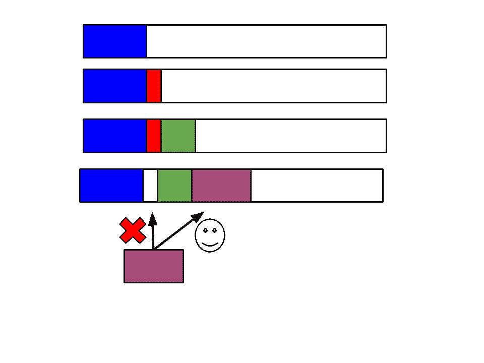
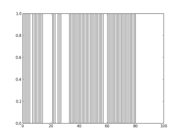
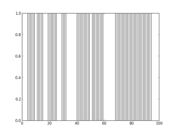
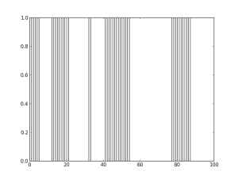
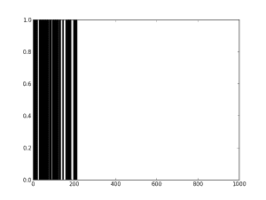

# 在首次拟合算法下，碎片有多糟糕？

> 原文：<https://towardsdatascience.com/how-bad-is-fragmentation-under-a-first-fit-algorithm-88c50c130cee?source=collection_archive---------67----------------------->

## 模拟破碎的基本原理。

照片由[克莱门特·H](https://unsplash.com/@clemhlrdt?utm_source=medium&utm_medium=referral)在 [Unsplash](https://unsplash.com?utm_source=medium&utm_medium=referral) 上拍摄

有时我阅读操作系统，因为我想知道我的电脑是如何工作的。我已经将 Linux 发行版作为我的主要操作系统运行了大约 10 年，因此熟悉这些概念允许我极大地定制和优化我的系统。

普通大众可能感兴趣的一个话题是:

> 什么是碎片整理，为什么我有时要整理我的电脑碎片？

虽然，可能没有一个 1990 年以后出生的人听说过碎片整理，因为计算机内存容量的大规模增长。

我要描述的不是在任何现代操作系统上内存管理实际上是如何完成的，但是它会给人一种为什么会发生碎片的感觉(甚至这是什么)。

当我试图理解一个概念时，我经常发现写自己的模拟是有益的。我将给出我用来运行一个非常简单的首次拟合算法模拟的代码，这样我们就可以看到它会变得有多糟糕。

# 首次拟合算法

首适算法正是它听起来的样子。你把记忆想象成填满的酒吧。每个程序都有一个大小，你寻找第一个足够大的洞来放它。这是我做的一张图片来说明:

由作者在 Google Draw 中制作

这是什么意思？

你下载蓝色程序，它进入第一个(最左边)区域，没问题。你下载红色的，第一个可用的洞就在蓝色的旁边。绿色也一样。

然后你意识到你不想要红色了，所以你删除了它。这就留下了一个漏洞。当你下载紫色程序时，你的内存管理注意到了这个漏洞，并试图在那里安装它。哇哦。这个洞太小了，所以它继续寻找第一个适合它的洞(因此得名“首次适合算法”)。

最终，你可能会删除绿色，一些东西可能会进入红色和绿色留下的大洞，但它可能不会填满整个东西。

一旦这些洞开始出现，就很难去掉。这叫做 ***外部碎裂*** 。我写了一个模拟来看看情况会变得多糟。虽然这个程序只做了我刚才展示的简单的事情，但是它有点长而且令人困惑，所以让我们一步一步来。

我上了两节课。第一个允许我假装在下载一个程序。每个程序都有一个从 1 到 10 的随机大小，它在内存中的位置，以及直到我删除它的时间(一个从 1 到 20 的随机数)。

这个类只是记忆的棒。在我们的模拟中，它的总大小为 100，并且它有一个当前在内存中的程序列表(程序跟踪它们的位置)。

我做了一个功能，把一个程序加到记忆棒里。这只是寻找适合它的第一个可用的孔。不幸的是，我最终没有看到一个光滑统一的方法来做到这一点，并通过案例拼凑了一些东西。我分别检查第一个程序前的孔和最后一个程序后的孔。

我创建了一个 sort 方法，因为当我向列表中添加一个新程序时，尽管它的位置可能在中间，但它却卡在了列表的末尾。这只是按位置对它们进行排序。最后，我有一个程序，如果时间足够长，它就会被删除。

最后，我只是模拟了 100 个时间步。在每一个时间点上，我都尝试使用一个随机生成的程序。然后，我让所有的删除时间参数减少。我检查是否有 0 并删除它们。我将列表排序，然后重复。

以下是一些最终结果:

这个程序使用了 66%的内存，因此外部碎片导致了大约 34%的浪费。

这个在 69%的使用率上稍微好一点。

这种情况要糟糕得多，使用率为 43%，因此浪费了 57%。完整的代码可以在 GitHub [这里](https://github.com/wardm4/frag-simulation)找到。

用不同大小的内存和不同长度的时间删除东西来感受它是如何改变事情的，这很有趣。如果您尝试使用的空间量足够小于您的总内存，碎片显然不会是一个大问题。

另一方面，正如这些模拟所显示的，题目的答案是它可能非常糟糕。这些模拟实际上是准确的(如果我的旧*操作系统概念*第七版教科书是正确的)，因为你可以从数学上证明你用这个算法浪费的预期空间大约是 33%(我运行的模拟比我展示给你的多得多，这是我通常看到的)。

不过，没有必要害怕。旧的操作系统确实在这方面使用了一些变体，但所有现代操作系统都使用一种叫做 ***分页*** 的东西，这种东西完全避免了外部碎片(有一种东西叫做内部碎片，我没有谈到)。

只是为了好玩，我决定向你“证明”只有当你使用足够大比例的内存时，这个算法才是糟糕的(也就是说，在现代计算机上可能永远不会！).这是一个模拟结果，你的程序太小了，浪费的空间根本不重要:

