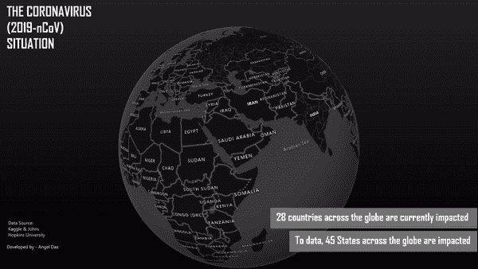
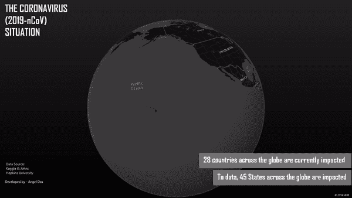
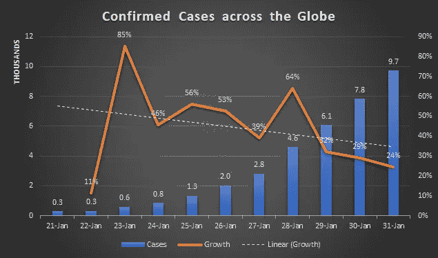
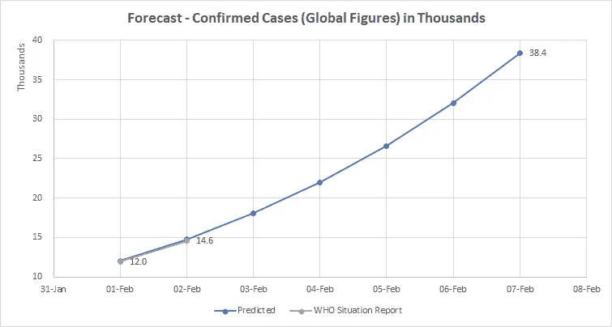
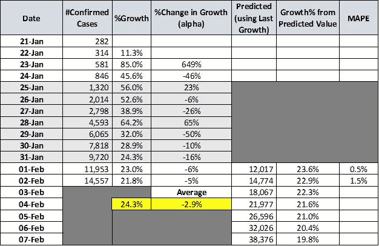
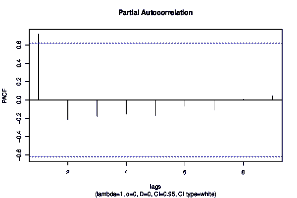

# 冠状病毒爆发会有多糟糕？—预测疫情数字

> 原文：<https://towardsdatascience.com/how-bad-will-the-coronavirus-outbreak-get-predicting-the-outbreak-figures-f0b8e8b61991?source=collection_archive---------2----------------------->

## 数据分析师的观点—您应该知道的 4 件重要事情

*编者按:*[*【towardsdatascience.com】*](https://slack-redir.net/link?url=http%3A%2F%2Ftowardsdatascience.com)*是一家以数据科学和机器学习研究为主的中型刊物。我们不是健康专家或流行病学家。想了解更多关于疫情冠状病毒的信息，可以点击* [*这里*](https://slack-redir.net/link?url=https%3A%2F%2Fwww.who.int%2Femergencies%2Fdiseases%2Fnovel-coronavirus-2019) *。*

> “每一个在中国和其他地方受苦的人，愿上帝加强受害者和他们的家庭，引导他们度过这段艰难的时光。请遵循[世卫组织网站](https://www.who.int/emergencies/diseases/novel-coronavirus-2019/advice-for-public)中概述的建议，保持安全并受到保护 *"*

# 我们今天站在哪里？

疫情继续蔓延——截至 2 月 1 日，世卫组织已确认约 12000 例病例，仅周六就确认了 2000 例以上(约占报告病例总数的 18%)。共有 28 个国家的 48 个省受到影响。然而，这些病例中只有 2%多一点是在中国以外发现的。虽然这个数字可能看起来很小，但处于疫情中心的武汉是中国主要的交通枢纽。由于农历新年，城市间的旅行增加，这在一定程度上助长了疫情。去年 10 月至 11 月期间，有近 200 万人离开武汉，大约 12 万人飞往国外。因此，冠状病毒的爆发仍然是全球关注的主要问题。

受影响的国家/地区—截至 2020 年 1 月 31 日的报告(鸣谢—由作者使用 Excel 3D 地图绘制)

# 这种病毒的传染性如何？

任何疫情传播的速度和难易程度决定了其规模。伦敦帝国理工学院发布的[报告](https://www.imperial.ac.uk/mrc-global-infectious-disease-analysis/news--wuhan-coronavirus/)表明，一个人患冠状病毒会影响 1.5 到 3.5 个健康人。据《纽约时报》报道， ***如果 5 名新型冠状病毒携带者可以影响 2.6 名其他人，那么 1 个周期后可能有 5 人患病，2 个周期后有 18 人患病，3 个周期后有 52 人患病，以此类推*。**

一种冠状病毒如何在 5 个周期内从 5 人传播到 368 人(鸣谢:纽约时报)

# 中国的疫情有多严重？

## 数据 vs 世界卫生组织辩论！

> 我曾致力于创建一个 QlikSense base 仪表盘来监控当前的情况并跟踪疫情。你可以在下面找到更多关于它的信息。

 [## 新型冠状病毒(2019-nCoV)——世卫组织新型交互式、基于网络的冠状病毒在线培训…

### 世卫组织的在线训练是目前对抗冠状病毒爆发的最佳武器；涵盖检测方法…

medium.com](https://medium.com/@angeleastbengal/novel-coronavirus-2019-ncov-whos-new-interactive-web-based-online-training-for-coronavirus-d0865f0b47af)  [## 冠状病毒爆发会有多糟糕？—疾病爆发—假设分析

### 数据分析师对当前形势的看法

medium.com](https://medium.com/@angeleastbengal/how-bad-will-the-coronavirus-outbreak-get-the-outbreak-hypothesis-analysis-940197ed7815)  [## 新冠肺炎对国际学生的影响

### 不可预见的挑战及其对国际学生招生的影响

medium.com](https://medium.com/@angeleastbengal/the-impact-of-covid-19-on-international-students-88f96cb8dcf9) 

截至周六，世卫组织已在中国确认了 11821 例病例。然而，由约翰霍普金斯大学(T2)整理的数据显示这个数字要高得多。某些病例存在**假阳性**的可能性，即某人被错误地怀疑携带病毒，但在检测时被排除。中国报告病例数的平均增长率仍高达 16.3%(高于 2003 年的 SARS 病例数)。

中国受影响的州/省(由作者使用 Excel 3D 地图绘制)

# 展望未来——到下周末，确诊病例将超过 38，000 例！

鉴于我们没有足够的数据点，很难使用时间序列模型来预测疫情。让我们来看看一段时间以来确诊病例的增长率。在研究与时间相关的变量时，需要考虑三个关键参数。

*   ***趋势*** *—变量的大小是否随时间线性增加？例如，确诊病例的增长是否会随着时间的推移而增加？*
*   ***水平*** *—变量在一段时间内的平均值是多少？例如，过去 6 天的平均增长率是多少？*
*   ***季节性*** *—我们是否在特定的区间内看到了相似的数值模式？—我们是否在特定日期观察到类似的趋势，即每周一确诊病例/增长数字较高？*

数据来源:世卫组织形势报告

***假设和见解***

*   假设——疫情将继续增长，因为确诊病例的初始数量很低，我们只能在增长率稳定下来后再看数字。否则数字可能会失真
*   *确诊病例增长数字缺乏季节性。可行，因为数据点较少；然而，由于确诊病例数量增加，增长率开始下降*
*   *可以使用* ***前一天的值*、*α和前一增长率*** *的组合来预测接下来 7 天的结果；其中α是增长率随时间变化的平均值*

***预测***

利用前一天的确诊病例总数和最近增长率的α值(-2.9%)，我预测了下周的疫情爆发。使用世卫组织形势[报告 12](https://www.who.int/docs/default-source/coronaviruse/situation-reports/20200201-sitrep-12-ncov.pdf?sfvrsn=273c5d35_2) & [报告 13](https://www.who.int/docs/default-source/coronaviruse/situation-reports/20200202-sitrep-13-ncov-v3.pdf?sfvrsn=195f4010_2) 对预测进行了验证，观察到 1%的 MAPE。看一下图表就知道，我最终高估了这些数字。

预报

预测。数据来源——世卫组织局势报告

## ARIMA(自回归综合移动平均线)能给出更好的结果吗？

时间序列是在固定时间间隔内记录指标的序列。根据频率的不同，时间序列可以是每年、每月、每周甚至每天。由于确诊病例数是一个随时间变化的变量，像单指数或双指数平滑法或 ARIMA 可以产生更好的预测。然而，由于数据点较少，我没有尝试。任何时间序列模型都需要足够的数据点来理解当前值和先前值之间的相互作用。然而，我使用偏自相关(PACF)图来验证我的假设是否正确。

我将在我的下一篇文章中写更多，但是，如果你想了解更多，请访问这个[网站](https://www.machinelearningplus.com/time-series/arima-model-time-series-forecasting-python/)。利用 PACF，我得出了以下结论:

*   在排除中间滞后的贡献后，PACF 可以被想象为序列和它的滞后之间的相关性。由于 PACF 仅高于滞后 1、**、*的显著值，这表明在今天和前一天的总确诊病例之间存在纯粹的相关性*、**、*，而不是任何其他情况(因此我可以使用当前值来预测下一个)*、****

*关于作者:高级分析专家和管理顾问，通过商业、技术和组织数据数学的结合，帮助公司找到各种问题的解决方案。一个数据科学爱好者，在这里分享、学习、贡献；你可以跟我在* [*上联系*](https://www.linkedin.com/in/angel-das-9532bb12a/)*；*