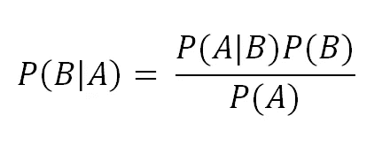

# 贝叶斯定理如何应用于测试一种疾病(如冠状病毒)？

> 原文：<https://towardsdatascience.com/how-bayes-theorem-applies-to-test-a-disease-like-coronavirus-e63c38b3dbbe?source=collection_archive---------15----------------------->

## 它解释了为什么各国进行筛查和检测的速度很慢。

许多人在高中或大学都学过一定程度的统计学。然而，人们并不知道统计学在日常生活中的实际应用。今天我要介绍统计学中一个应用于现实生活的著名概率定理，贝叶斯定理。

贝叶斯定理背后的概念并不难。它根据与事件相关的已知条件来计算事件的概率。这个定理描述了一个观察到的事件如何影响另一个事件的概率。

太抽象？太难了？下面我给你举个例子。

截至 4 月 8 日，全球约有 140 万冠状病毒患者[1]，全球约有 77 亿人[2]。所以感染率在 0.019%左右。假设一家制药公司开发了一种测试试剂盒，用来测试一个人是否感染了冠状病毒。由于开发非常仓促，这个测试套件的准确性并不完美。正常人有 2%的几率呈阳性，感染者有 1%的几率呈阴性。问题是，如果你做了测试，结果呈阳性，你被感染的可能性有多大？

在 [Unsplash](https://unsplash.com/s/photos/laboratory?utm_source=unsplash&utm_medium=referral&utm_content=creditCopyText) 上拍摄的 [ThisisEngineering RAEng](https://unsplash.com/@thisisengineering?utm_source=unsplash&utm_medium=referral&utm_content=creditCopyText)

贝叶斯定理的公式如下

在这个公式中，B 是我们想知道发生概率的事件，A 是观察到的事件。P(B|A)表示给定 A 发生的概率 B，P(A)和 P(B)分别是 A 和 B 发生的概率。最后，P(A|B)表示给定 B 发生的概率，P(B)也称为先验概率，因为它没有考虑来自 A 的任何信息，P(B|A)也称为后验概率。

在上面的例子中，A 代表从检测试剂盒中得到阳性结果，B 代表被冠状病毒感染。

所以容易 P(B)，又名被感染的概率，是 0.019%。P(A|B)表示假定人被感染，测试试剂盒显示阳性结果。如前所述，感染者有 1%的几率呈阴性。因此，有 99%的机会在感染者身上显示阳性。因此 P(A|B) = 99%。唯一缺失的谜题是 P(A)，也就是显示阳性结果的概率。

有两种显示积极结果的情况。第一种是人被感染了试剂盒显示阳性，第二种是人没被感染但试剂盒还是显示阳性。既然我们知道感染率是 0.19%。因此，一个人没有被感染的概率是 1–0.019% = 99.981%。在正常人身上有 2%的几率呈阳性。利用简单的概率规则，我们可以计算出 P(A)= 99.81% * 2%+0.19% * 99% = 2.01843%。

将所有数字代入贝叶斯定理后，P(B|A) = 0.93%。这意味着这个人只有不到 1%的实际感染。

这一刻，你可能会很惊讶，结果很小。而这在现实生活中肯定是不能接受的。因此，需要进行多次尝试来验证结果。在这种情况下，P(B)将变为 0.93%，因为被感染的概率由第一次尝试的结果更新。在不改变其他变量的情况下，P(B|A)将大幅提高至 31.77%。在第三次尝试中，结果达到 95.8%，几乎可以肯定这个人被感染了。

这个简单的例子揭示了检测疾病以获得更高准确性的耗时过程。因此，尽管许多国家已经提供了额外资源来增加实验室技术人员的数量和提高效率，但只有少数国家能够对其公民进行大规模筛查。因此，呆在家里。这不仅减少了你被感染的机会，也减轻了诊断的负担。

统计学可能对每个人来说都太复杂了。然而，它在我们的日常生活中被广泛使用。希望这篇文章能帮助你更多的了解贝叶斯定理。希望你喜欢，下次再见。

## 引用

[1]:冠状病毒最新:一瞥，卫报，2020 年 4 月 8 日，[https://www . The Guardian . com/world/2020/apr/08/Coronavirus-latest-at-a-glance-death-toll-83000](https://www.theguardian.com/world/2020/apr/08/coronavirus-latest-at-a-glance-death-toll-83000)

[2]:世界人口钟，worldometers.info，2020 年 4 月 8 日，【https://www.worldometers.info/world-population/ 

# 我的其他文章

[你会用你的媒体文章来吸引招聘经理和人力资源吗？](https://medium.com/@wyfok/do-you-use-your-medium-articles-to-attract-hire-managers-a7c64f8b9340)

[我在德国亚马逊公司为期六个月的实习中所做所学](https://medium.com/@wyfok/what-i-have-done-and-have-learned-in-my-six-month-internship-at-amazon-in-germany-a16f02627e8)

[为什么 SQL 中的窗口函数如此重要，你应该马上学习它](/why-window-function-in-sql-is-so-important-that-you-should-learn-it-right-now-1274b6096a86)

[如何使用 SQL 进行数据分析(房产销售时间序列)](/how-to-use-sql-to-perform-data-analysis-house-property-sales-time-series-bf36cd3c2528)

[用 Python 中的克鲁克算法更优雅地解决数独](https://medium.com/@wyfok/solve-sudoku-more-elegantly-with-crooks-algorithm-in-python-5f819d371813)