# 贝叶斯定理如何帮助赢得第二次世界大战

> 原文：<https://towardsdatascience.com/how-bayes-theorem-helped-win-the-second-world-war-7f3be5f4676c?source=collection_archive---------4----------------------->

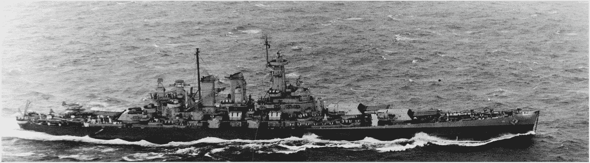

[1943 年，吉尔伯特和马绍尔群岛战役期间，美国海军 SBD-5 侦察机在华盛顿号和列克星敦号上巡逻](https://commons.wikimedia.org/wiki/File:SBD_VB-16_over_USS_Washington_1943.jpg)

## 第一部分:介绍贝叶斯统计和它如何破解日本海军密码 JN 25

在第二次世界大战期间，美国和英国的密码分析师都疯狂地试图破译轴心国军事部门发送的加密通信。在这些努力中，位于布莱奇利公园的英国密码破译中心可能因其作为英国炸弹的诞生地而闻名，该机器将在 1939 年至战争结束期间解码臭名昭著的德国密码 Enigma。虽然 Bombe 和它的后继模型已经得到了大多数公众的关注，但是如果没有统计方法的支持，他们的努力通常是徒劳的。本文的目标是阐明其中一种方法，即贝叶斯推理，首先介绍它背后的理论，然后概述它是如何被用来破解轴密码的。

托比·奥克斯博洛拍摄的布莱奇利公园的 1 号小屋。来源:Flickr。这个文件是在[知识共享](https://en.wikipedia.org/wiki/en:Creative_Commons)归属-共享 2.0 通用许可下许可的

第一部分将致力于破解日本海军密码 JN 25，而第二部分将概述贝叶斯推理在破解英格玛密码中的作用。这份报告的大部分内容基于爱德华·辛普森写的一篇文章，他是在布莱奇利公园工作的密码破译员之一。我试图通过回顾贝叶斯形式主义和进行仅在辛普森的文章中隐含的大部分数学运算，使这个主题更容易理解。如果在这篇文章的最后，你发现自己对这个话题很感兴趣，我鼓励你阅读辛普森的原始文章，这是一篇关于他在布莱奇利公园的迷人的第一手报道。

# 定理

像许多其他著名的理论一样，贝叶斯定理出奇的简单:

公式本身很容易推导出来，并且在贝叶斯统计之外有许多应用。然而，它的简单性可能具有欺骗性，因为该定理的大部分力量在于对所涉及的概率 P 的解释。几个世纪以来，贝叶斯定理的真正争议在于它的使用挑战了更传统的频率主义方法。而所谓的频率主义者将事件的概率定义为“在许多试验中其相对频率的极限”[1]。贝叶斯主义者将概率解释为个人信仰的一种度量。

有人可能会问，他们怎么敢在数学理论中加入像信仰这样主观的东西。说出这种批评，人们肯定会有好的同伴。许多统计学的重量级人物，包括费希尔和皮尔逊，已经放弃了基于类似论点的概率的贝叶斯解释[4]。

为了真正理解这两种方法之间的差异并能够做出公正的判断，让我们考虑下面的例子:

想象一下，一个朋友向你挑战掷硬币游戏，并迅速拿出一枚她想用的硬币。在同意这个游戏之前，生性多疑的你想确定她递给你的硬币是公平的，也就是说，硬币正面和反面落地的机会是相等的。

## 频繁主义方法

一个频繁主义者会把这个问题框架为一个假设检验，用零假设 H₀:的硬币是公平的，用替代假设 H₁的硬币是不公平的。然后，她将决定一系列试验(比如说𝑛=100)和一个置信水平(比如𝛼=0.05).抛硬币后𝑛时报，结果被记录下来。如果我们让𝑘表示我们观察正面的次数，让𝑝表示硬币正面落地的概率，那么按照二项式分布，特定结果的概率如下

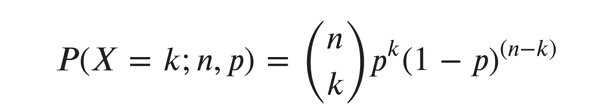

给定置信水平𝛼，她就可以计算拒绝区域，即可以安全拒绝零假设 H₀:𝑝=0.5 的𝑘区间。这个区域可以通过求解

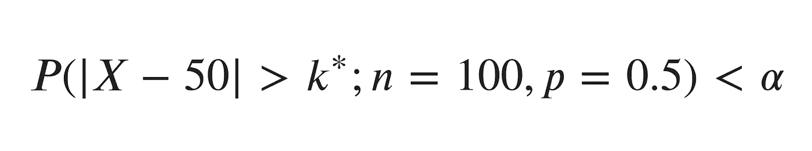

为了𝑘*.令人欣慰的是，人们在过去已经处理过这类问题，所以她可以简单地在表中查找它的解，或者使用任何统计软件来给她答案，而不是自己实际求解方程。原来，对于这个问题，𝑘*=10，所以 H₀可以拒绝如果|𝑘−50|>10，或者等价地如果𝑘 <40 or 𝑘> 60。

让我们假设在 100 次掷硬币中，(𝑘=)有 73 次是正面朝上。常客现在可以得出结论，硬币被操纵了，她的结论是错误的可能性小于 5%(置信水平)。

## 贝叶斯方法

作为贝叶斯统计的坚定支持者，你出现了。你对“浪费时间”感到震惊，并认为所有这些本来可以通过更少的试验来完成。为了理解如何继续，让我们先回顾一下贝叶斯定理:

注意，我们用更有意义的符号𝜃和𝐷.代替了变量 a 和 b𝜃表示模型的参数，在我们的情况下，这只是正面𝑝的概率，这是所用硬币固有的特征，也是我们试图推断的未知值。𝐷代表观察数据，即硬币正面和反面落地的次数。

*   𝑃(𝜃|𝐷)是𝜃的概率*给定*证据或数据𝐷.换句话说，硬币正面着地一定次数后，𝑝具有特定值的概率。这叫做**后路**。
*   𝑃(𝐷|𝜃)回答了以下问题:观察到𝐷给𝜃的数据的可能性有多大？这也是频率主义者计算的东西，它被称为**可能性**。
*   𝑃(𝜃)是统计学家在观察任何数据之前对𝜃的不同值有多大可能*的信念。它通常被称为型号**之前的***
*   𝑃(𝐷)通常被称为**边际**，描述了观察数据的概率，与模型参数无关。它确保后验分布是归一化的，但我们经常可以找到避免直接计算的方法。

我们需要做的第一件事是决定一个模型来描述抛硬币实验。和以前一样，二项分布是我们选择的函数:

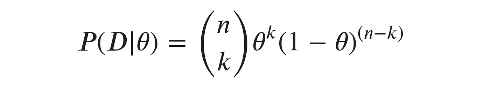

数据 d 包括𝑛的投掷次数和𝑘.的头数定义了**可能性之后，**我们现在必须在之前选择一个**。记住，先验描述了统计学家在看到任何数据之前对参数𝜃的信念。因此，如果我们在和一个值得信赖的朋友打交道，作为贝叶斯人，我们可以选择一个在𝜃=0.5(一枚公平硬币的价值)附近有一个尖峰的先验，如橙色曲线所示。如果我们的朋友过去试图捉弄我们，我们可能更倾向于选择蓝色曲线作为先验。它的范围更广，因此对𝜃.的任何特殊价值都不太相信**

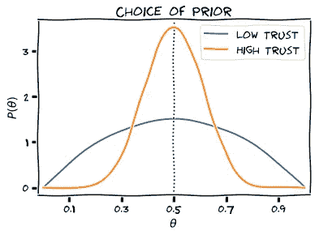

你们可能已经注意到了，我们没有写下任何先验方程。不幸的是，贝叶斯推理中涉及的数学可能相当棘手。通常积分无法解析计算，人们不得不求助于数值工具，如蒙特卡罗抽样。出于这个原因，我们将依靠图表来发展对贝叶斯统计的直观理解。

假设在 6 次投掷中，硬币有 4 次正面朝上。使用“低信任”先验，后验分布𝑃(𝜃|𝐷)将看起来像这样:

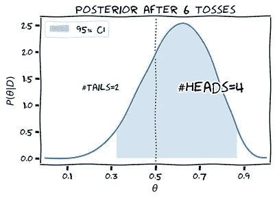

如你所见，分布已经转移到更大的𝜃值，因为正面出现的次数是反面的两倍。我们可以将似然项解释为作用于先验分布的过滤器，只允许与数据𝐷.或多或少一致的𝜃值通过

分布仍然相当广泛，所以我们得出结论，要做出任何可靠的推断，我们需要更多的样本。经过 20 次投掷，观察头部 15 次后，后部看起来像这样:

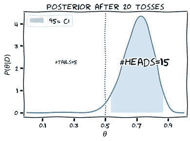

我们可以非常肯定地得出结论，这枚硬币被操纵了，而且我们已经能够比频繁者少扔 80 枚硬币来做到这一点。谈资源的高效利用！

现在你应该同意和我们的朋友一起玩了吧？看情况。如果她让你选正面或反面，就赌正面！然而，如果她坚持为自己挑选头像，也许是时候你找一个新朋友了…

人们实际上可以计算出这个游戏有利版本的预期收益:如果我们在正面下注 1 美元，我们的预期收益是

由于我们不知道𝜃的确切值，我们需要对其概率分布进行积分:

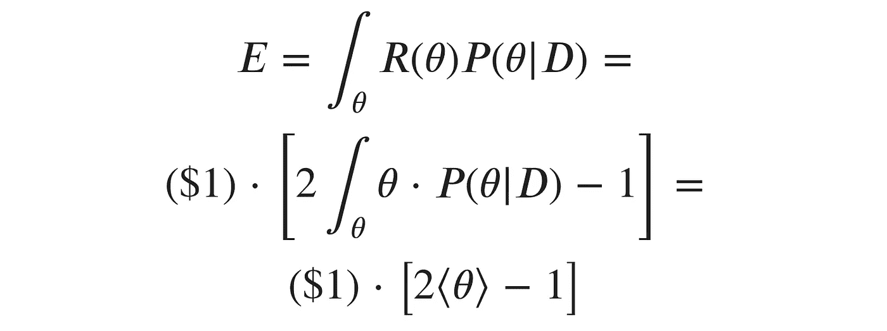

对于最后一个表达式，我们实际上不需要计算任何积分。为了获得后验分布下𝜃的期望值(平均值)的粗略近似值，查看所述分布以找到⟨𝜃⟩≈0.7 就足够了(精确值约为 0.708)。因此

每次抛硬币的预期投资回报率约为 40%，我会说“去吧”；但是在你把所有的钱都押上之前，确保你知道赌徒的毁灭。

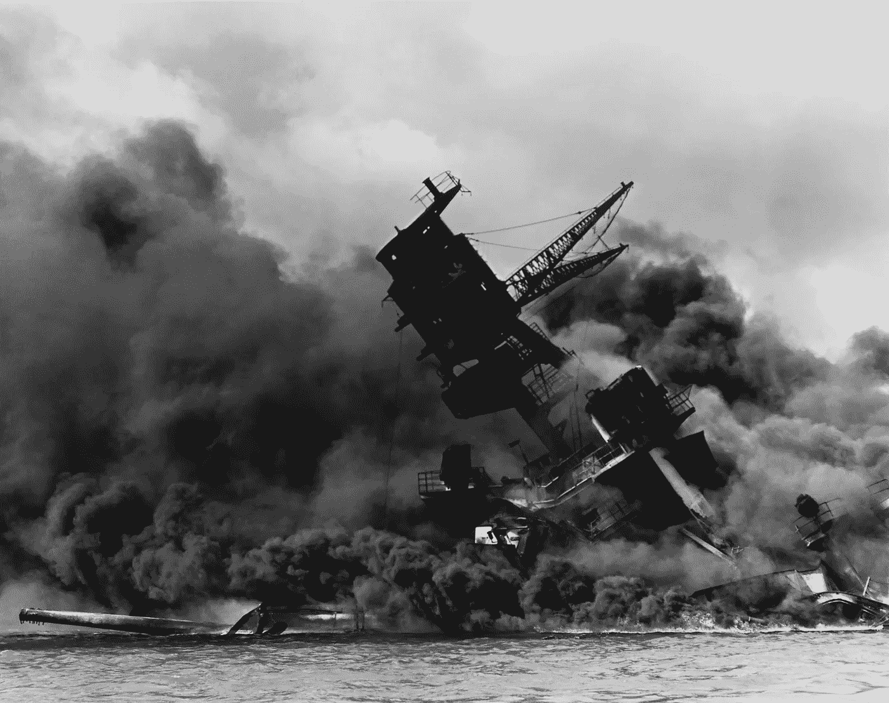

[美国海军亚利桑那号(BB-39)在日本偷袭珍珠港后燃烧](https://commons.wikimedia.org/wiki/File:The_USS_Arizona_(BB-39)_burning_after_the_Japanese_attack_on_Pearl_Harbor_-_NARA_195617_-_Edit.jpg)，公共领域

# 日本海军密码机 JN 25

## 日本视角

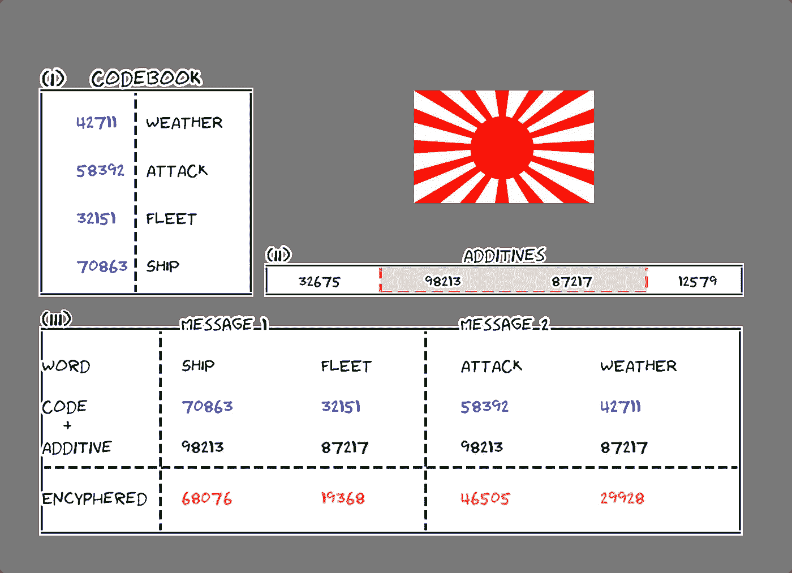

二战期间，日本海军对信息进行编码的方式相当简单。发送者将使用一个**代码簿(I)** 把他的信息的每个字转换成一个五位数。作为一种安全措施，这五个数字的总和总是能被 3 整除。在给日本人一种方法来确保他们的信息被正确无误地传输的同时，这种方法将极大地帮助盟军解码截获的信息；但稍后会详细介绍。

对明文进行编码后，发送者将查询所谓的**添加剂(II)** 的加密表。这些五位数将被添加(非进位)到代码中，以产生最终的**加密信息(III)** 。接收者可以访问相同的代码簿和添加剂，并且可以通过颠倒上述过程来简单地解码消息。

## 联盟视角

面对一组截获的信息，联合密码分析师的任务是找出正确的添加剂。与此同时，所谓的书籍制作者试图通过结合语言和组合技巧来复制日本法典。

由于密码分析师只能获得有限数量的证据，即给定数量的拦截消息，他们所能希望的最好情况是对消息中最有可能的添加剂做出概率陈述。因此，(贝叶斯)统计特别适合解决这个问题。

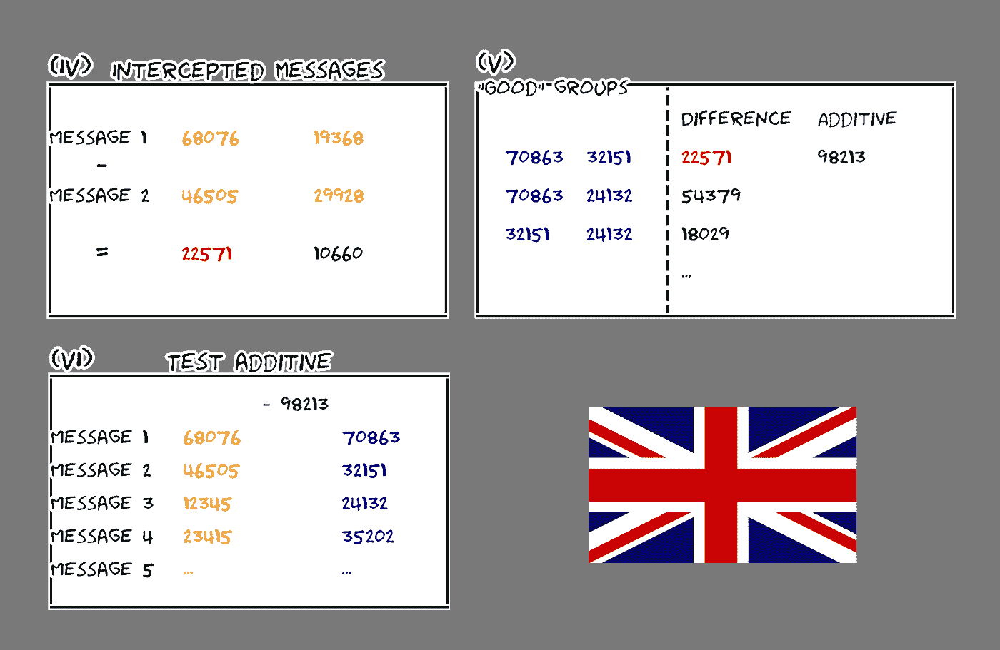

解密过程将从一组已知具有相同添加剂的**截取消息(IV)** 开始。这些信息被认为是“深入的”,人们会说是信息的“深度”。

将五位数的密码相互比较，并记录结果(总是选择低于 5555 的数字)。这一过程背后的逻辑是，通过计算编码信息之间的差异，潜在的添加剂将会相互抵消。
盟军已经知道了日本的部分密码，许多密码组也是已知的。这些被称为**“好组”**，并与它们的(非携带)差异 **(V)** 一起被列表。如果已知 50 组，则必须计算并记录 1225 个差异。

密码分析人员会比较从截获的信息和来自好的群体的信息中计算出来的差异。如果找到一个匹配项(在我们的例子中是 22571，用红色显示)，就会计算一个假设的附加项(用绿色显示)。

最后也是最重要的任务是测试这个假设的添加剂的有效性。作为第一步，在每个消息 **(VI)** 中，从其相应的编码字中减去添加剂。如果产生的代码(显示为蓝色)违反了“可被 3 整除”的规则，这个附加项可以很快被丢弃，为盟军节省了大量时间。通常，多种潜在添加剂将通过该测试，因此使用统计分析来确定它们的相对强度。
作为真实添加剂的证据，密码分析员将在上述测试中使用任何其他良好组的存在。数学结果是这样的:

让我们用𝐴来表示加法成立的事件，用𝐴来表示加法不成立的事件。我们想要确定在添加剂被加入𝑃(𝐴|𝐷).后给定好组的数据的后验概率

如果我们只对比值比(真与假)感兴趣，分母中的边际𝑃(𝐷就会抵消:

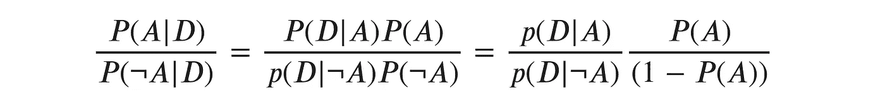

在没有任何关于 a 的概率的先验知识的情况下，人们总是可以使用一个给两个事件分配相等概率的先验，即𝑃(𝐴)=0.5.等式的最后一项。从而抵消，剩下的是确定似然比，这是很容易获得的。(请注意，如果我们有任何理由相信我们正在处理一个正确的添加剂，基于证据而不是良好群体的存在，我们总是可以修改先验以反映这一信念。)

作为例子，让我们考虑可以在消息 2 中恢复的好组 32151。如果 98213 是*不是*真加法，那么 32151 只是一个随机的五位数。这个数字出现的概率是 1/10⁵，但是，由于这个数字需要检查“被 3 整除”的规则，我们得到了𝑃(32151| 𝐴)=3/10⁵.

如果 98213 是一个真正的添加剂，那么𝑝(32151|𝐴的可能性是由 32151(“车队”)的相对出现频率给出的。当然，像“船”或“天气”这样的词比其他像“攻击”这样的词出现得更频繁。这需要在正确的统计处理中加以考虑，因为更频繁的术语为假设增加了更多的证据。为了这个例子，让我们假设每第 80 个截取的单词是“Ship ”,每第 250 个截取的单词是“Fleet ”,那么添加剂 98213 的总证据将被计算为:

从技术上来说，未包含在良好组列表中的代码也为上面的产品添加了因素。然而，由于这些因素仅略小于 1，为了节省时间，可以安全地忽略它们。

作为最后一个简化技巧，可能性将被转换成它们的对数值，用简单的加法代替复杂的乘法。每个好的组的对数似然性将被预先制成表格，这样工作人员可以简单地查找数值，测试添加剂的过程也可以被简化。这一程序的主要优势之一是，测试添加剂的劳动密集型和重复性任务可以外包给数学知识有限的员工。专家意见只需要在边缘案例或非常重要的信息中被参考。

# 结论

我希望我能够对贝叶斯推理有所启发，并展示它是如何在布莱奇利公园被用来破译 JN 25 的。如果你想知道更多关于这个话题的信息，请点击这里查看爱德华·辛普森的文章[。请继续关注第二部分，我将剖析德国之谜的内部运作，并讨论贝叶斯定理是如何帮助破解它的。](http://mathcenter.oxford.emory.edu/site/math117/bayesTheorem/enigma_and_bayes_theorem.pdf)

# 参考

[1]https://en.wikipedia.org/wiki/Frequentist_probability

[2][https://en.wikipedia.org/wiki/Bayesian_probability](https://en.wikipedia.org/wiki/Frequentist_probability)

[3]爱德华·辛普森，*贝氏在布莱奇利公园(* 2010)，英国皇家统计学会，[http://math center . Oxford . emory . edu/site/math 117/Bayes theorem/enigma _ and _ Bayes _ theorem . pdf](http://mathcenter.oxford.emory.edu/site/math117/bayesTheorem/enigma_and_bayes_theorem.pdf)

[4]莎伦·伯奇·麦克格雷，《不会消亡的理论:贝氏法则如何破解恩尼格玛密码，追捕俄罗斯潜艇，并从两个世纪的争议中脱颖而出》，耶鲁大学出版社