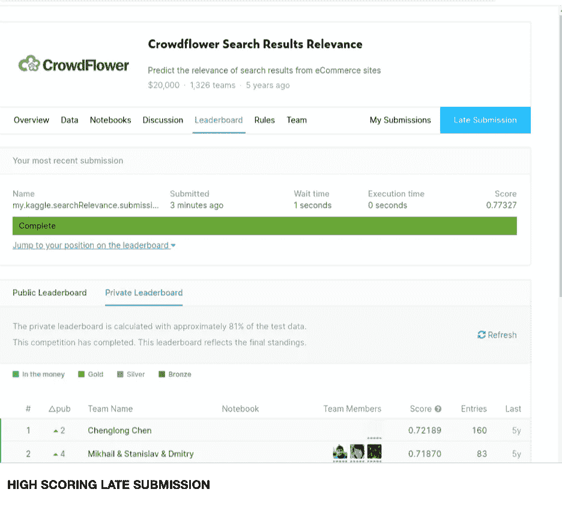
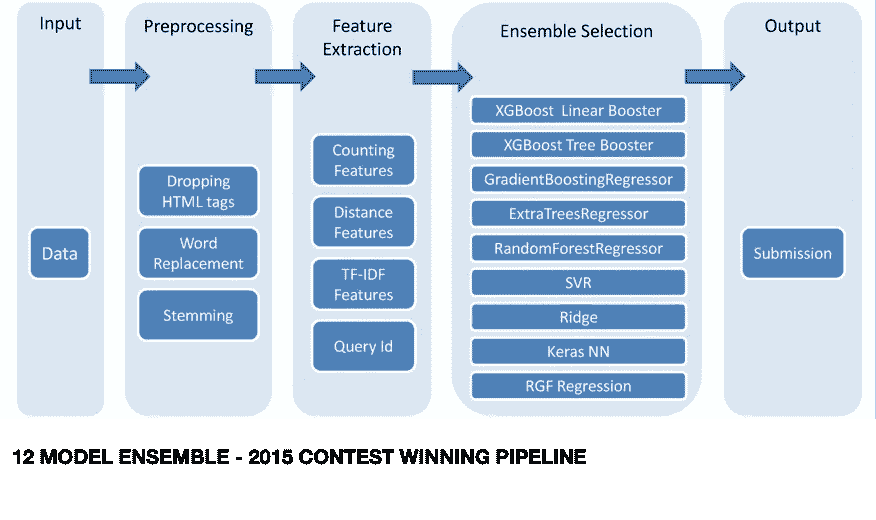

# BERT 如何确定搜索相关性

> 原文：<https://towardsdatascience.com/how-bert-determines-search-relevance-2a67a1575ac4?source=collection_archive---------16----------------------->

## 了解 BERT 的局限性和偏见将有助于您更好地理解 BERT 和 Search 如何看待世界和您的内容。

2019 年 10 月 25 日，谷歌搜索副总裁潘杜·纳亚克宣布:

> 通过将 BERT 模型应用于搜索中的排名和特色片段，我们能够更好地帮助您找到有用的信息。事实上，当涉及到排名结果时，BERT 将帮助搜索更好地理解美国十分之一的英语搜索，我们将随着时间的推移将这一功能扩展到更多的语言和地区。[ [1](https://blog.google/products/search/search-language-understanding-bert)

谷歌的言论和解释提出了一些关键问题:

*   BERT 比以前的搜索相关性工作好多少？
*   BERT 模型是如何创建的？它们是如何微调的？
*   BERT 模型的局限性和偏差是什么？
*   这些偏见会如何影响伯特对网页内容的看法？
*   一个人可以使用 BERT 来确定她的内容对于特定查询的表现吗？
*   如何对查询和可能的目标页面“应用 BERT 模型”来得出排名？

## **BERT 比以前的搜索相关性工作好多少？**

2015 年，Crowdflower(现在的阿彭←Figure-Eight←Crowdflower)举办了一场 Kaggle 比赛[ [2](https://www.kaggle.com/c/crowdflower-search-relevance) ，数据科学家建立模型，预测给定查询、产品名称和产品描述的搜索结果的相关性。获胜者 ChenglongChen 以 72.189% [ [3](https://github.com/ChenglongChen/kaggle-CrowdFlower) ]的分数获得第一名，获得了 1 万美元的奖金。虽然比赛已经关闭了五年，但数据集仍然可用，Kaggle 比赛评分功能仍然适用于私人排行榜(它只是不奖励任何网站积分)。我拉了数据，微调了一个 BERT 分类模型，预测了一个提交，它的得分是 77.327% [ [4](https://github.com/todd-cook/ML-You-Can-Use/blob/master/searching/search_results_relevance_using_BERT.ipynb) ]。

(图片由作者提供)

这一获奖结果，虽然晚了几年，却显示了 BERT 是如何戏剧性地超越了现有的技术水平。)机器学习模型投票选出最佳结果:

(图片由陈[3])

相比之下，我的高分结果使用了一个 BERT 模型和一个相对简单的管道:

(图片由作者提供)

对于我的[第一个模型](https://github.com/todd-cook/ML-You-Can-Use/blob/master/searching/search_results_relevance_using_BERT.ipynb)(也是最后一个模型)，特征化是“只取前 505 个令牌”跨越三段数据(查询、产品标题、产品描述)——没有任何特殊处理——这些就是你看到的结果。在本文中，我们将在本文的后面讨论 BERT 如何以及为什么能够在糟糕和肮脏的输入下表现良好。

Kaggle Crowdflower 搜索相关性数据集有 20，571 个标记样本，生成提交需要对 22，513 个测试样本进行预测。虽然这是少量的数据，并且该领域仅限于电子商务产品 BERT base 没有对这些数据进行训练——但 BERT 分类器仍然能够以突破性的准确性开始学习和预测。

## BERT 模型是如何创建的？它们是如何微调的？

BERT 是 Transformers [ [5](https://arxiv.org/abs/1810.04805) ]中双向编码器表示的首字母缩写，是一种语言模型。语言模型对单词和单词一起出现的对数概率进行编码。最初的 BERT 模型是通过在英语维基百科和多伦多图书语料库上接受训练来实现的。训练目标是下一句预测和掩蔽词预测。
下一句任务选择一些相邻的句子，给它们正的权重；然后选择一些随机的句子并给它们负的权重:通过这种方式，BERT 模型学会判断两个句子是否按顺序出现。许多人认为这给了 BERT 一个模型显示的自然语言理解(NLU)的基础。实际上，伯特似乎知道哪些单词和句子应该放在一起。
屏蔽单词任务随机隐藏一个单词，奖励伯特能够预测到缺失的单词。这项任务，加上网络辍学，让伯特学会从周围的单词中推断更大的上下文。在实践中，BERT 通常用作更复杂模型的基础层；例如，通常会添加一个附加的最终层，然后对该新层进行微调以充当分类器。

我不会在这里解释变压器模型的机制，在这里阅读它。最佳微调技术的细节仍在制定中(从发表的 Arxiv 论文数量来看)，尽管超参数调整取决于您的数据，但进一步的探索肯定会有所收获。然而，在我们急于纠结于细节之前，让我们不要错过要点:当一个具有次优超参数调整的新模型大幅度击败先前的技术水平时，搜索引擎公司会采用它。完美是好的敌人。有时，新的*足够好*，如此之好，以至于公司立即将其作为战略优势，即使最佳微调机制尚未公开确定。

为了理解为什么 BERT 如此擅长预测搜索相关性，我们将不得不研究它的一些内在的，局限性和偏见。

## **BERT 模型的局限性和偏差是什么？**

1.512 个单词的限制

BERT 基线模型最多接受 512 个令牌。虽然可以用更少的令牌构建 BERT 模型，例如 tweets 的 256 个令牌，或者从头开始定义和训练 BERT 模型，例如较大文档的 1024 个令牌，但几乎所有常用的 BERT 模型的基线都是 512 个。

如果您的页面超过 512 个单词，搜索引擎可能会:

*   就拿前 512 个符号
    来说吧——如果你的页面在前 512 个符号中没有表达出它的观点，引擎可能甚至看不到它(可能已经是真的了)。
*   通过摘要算法(TextRank，Deep Learning 等)或通过应用算法删除不重要的单词和句子，将页面内容减少到 512 个标记以下——但这些计算成本很高，所以大多数页面可能不会这样做。

注意:虽然我们说 512 个记号/单词，但实际上，BERT 通常会查看 505 个记号(假设一个 4 个单词的查询，需要 3 个 BERT 记号分隔符)。实际上，搜索算法考虑的内容的标记数量可能远远小于 505，我们将会看到。

2.不是所有的单词都是记号:很多常用单词变成了单个记号；但是更长的和不熟悉的单词被分解成子音。

一个很好的例子是，一些单词在英式英语和美式英语的拼法上有所不同。有时，子词标记化的代价可能相当高:

> bert_tokenizer.tokenize('睡衣')，bert_tokenizer.tokenize('睡衣')
> ['p '，' ##y '，' ##ja '，' ##mas']，['睡衣']
> 
> bert_tokenizer.tokenize('小胡子')，bert_tokenizer.tokenize('小胡子')
> ['mo '，' ##ust '，' ##ache']，['小胡子']

有时候，没有区别:

> ['颜色']，['颜色']

但是通常不太熟悉的拼写会产生多个标记:

> ['aero '，' ##plane']，[' plane ']
> [' ars '，' ##e']，['ass']
> ['jem '，' ##my']，[' Jimmy ']【T2][' orient '，' ##ated']，['oriented']
> ['special '，' ##ity']，['specialty']

很少，但有时，英国拼法变得符号化了，符号变少了:

> ['波特']，['放'，' # #之三']

3.明显的拼写错误隐含着惩罚:

> bert_tokenizer.tokenize('反建制')
> ['反'，'-'，'建制']
> 
> bert_tokenizer.tokenize('反建制')
> ['反'，'-'，' est '，' ##ab '，' ##lism '，' ##ent']

虽然这些处罚看起来令人震惊，但它们实际上表明伯特是多么宽容；该模型将试图理解你给它的任何东西，而不是丢弃拼写错误的单词或忽略它以前没有见过的东西。此外，这些偏见并不是针对英国语言拼写变化的阴谋，而是训练数据的副作用:BERT 模型及其 BERT 记号赋予器通常具有有限的词汇(通常为 30，000 个单词，*包括*子记号)，这些词汇经过精心选择，因此几乎任何单词都可以被编码，许多最常见的单词都被提升为单独的记号。这个单词和令牌的流行度竞赛是基于原始训练数据的。最初的 BERT 模型是在英语维基百科和来自多伦多图书语料库(11，038 本书，47，004，228 个句子)的一些附加文本上训练的。显然，英式拼写在语料库中并不占主导地位。

如果您正在分析带有英式英语拼写变化的文档，那么在将它们输入到 BERT 模型之前，对拼写进行标准化可能是有益的。一个训练有素的模型可以概括出它以前没有见过的东西，或者只接受过部分训练，但是最好的模型性能发生在熟悉的数据上。

有了许多其他的语言模型和词向量，很容易识别这个词是否是新的，语言模型是否已经在其上训练过，这些类型的词有它们自己的术语:OOV，在词汇之外*。但是很难确定伯特是否从未见过一个单词或用它重复训练过，因为有太多的单词是由副发音分解的。但是这个小缺点是强大力量的来源:在实践中，BERT 可以根据历史和对相似邻近单词的理解来综合一个单词的意思。*

*4.伯特会忽略一些项目。毫无疑问，伯特不知道表情符号。
-通常，BERT 将表情符号标记为未知(字面意思为“[UNK]”)，如果这些表情符号在压缩页面时没有被丢弃，那么当模型看到它们时，它们不会增加任何价值。*

> *toker.tokenize('😍 🐶❤️')
> ['[未知]'，'[未知]'，'[未知]']*

## ***这些偏见会如何影响伯特对网页内容的看法？***

*基本上，由于 BERT 模型接受有限数量的令牌(通常是< 505), if your page uses unusual words or uncommon spellings, your page content will be split into more tokens, and in effect, the BERT model will end up seeing less of your page than a similar page that uses more common words and popular spellings.*

*This does not mean that you should aim to create pages that exactly mimic the style of Wikipedia. For a long time, search engines have preferred articles with general appeal, using common words and standardized spellings, written more akin to the news or Wikipedia articles than an aimless wandering of verbiage. So in a sense, the use of BERT natively supports the best practices of writing content for search engines.*

## *Why is BERT so good at predicting search results?*

*Fundamentally both of BERT’s training objectives work together: word masking helps BERT build a context for understanding, and the next sentence prediction, well, — isn’t the problem of content relevance often a matter of determining how well one search query “sentence” is paired with one search result “sentence”?*

*We have already seen how BERT has the ability to synthesize meaning from subword tokens and neighboring words. This skill gives BERT an advantage since 15% of search queries contain words that have never been seen before [ [1](https://blog.google/products/search/search-language-understanding-bert) )。BERT 是确定搜索相关性所需的未知术语含义的自然预测器。*

## ***一个人可以使用 BERT 来确定她的内容对于特定查询的表现吗？***

*总之，大概不会；为了理解其中的原因，让我们深入探讨如何使用 BERT 来评估查询和页面的匹配程度。在高层次上，为了回答这个问题，他们可能会选择一些页面进行检查，并针对这些页面运行您的查询来预测相关性。*

**

*(图片由作者提供)*

*大多数搜索查询不超过四个单词，大多数页面摘要不超过 505 个单词(否则就不算是摘要)。搜索相关性分数通常分为:1 .跑题了，2。好吧，三。很好，第四个。非常好。[ [2](https://www.kaggle.com/c/crowdflower-search-relevance)*

*当 ML 工程师建立一个模型来估计一个查询与搜索结果的匹配程度时，他们通常会对大约 100 万个例子进行训练。为什么这么多？深度学习模型需要大量的数据，才能很好地进行归纳，预测以前没有见过的东西。如果你试图建立一个通用的搜索引擎，你需要大量的数据。但是，如果您的搜索空间较小，例如只是电子商务技术，或者只是家居装修网站的产品等，那么只需几千个带标签的样本就可以击败之前的技术水平。不常用数据是搜索查询的常规组成部分:*

> *这些查询中有 15%是我们以前从未见过的——谷歌搜索副总裁潘杜·纳亚克*

*几千个标记样本可以提供一些好的结果，当然，一百万个标记样本可能会提供很好的结果。*

## ***如何对一个查询和一个可能的目标页面“应用 BERT 模型”来得出排名？***

*Kaggle Crowdflower 竞争数据提供了一些有趣的线索，说明额外数据在实践中是如何被经常使用的。通常情况下，更多的功能(如果可用)会添加到模型中，以使其更加灵活，并能够跨一系列输入进行预测。
例如，之前我们将搜索排名问题公式化为:*

**

*(图片由作者提供)*

*但是在 Kaggle 提交查询数据中，额外的信息是可用的，或者有时是缺失的，因此特征将被格式化为:*

**

*(图片由作者提供)*

*在一些测试案例中，只提供了查询和产品标题，而在现实世界中，可能只提供了很少的页面内容，甚至没有。
例如，如果你的公司有一个“索尼 PS6 创始人版”的产品页面，该页面有动态内容，如最近的推文或购买者的推荐、用户图片等，搜索引擎很可能只使用页面标题(或关于页面的某种类型的元数据)，而实际上不使用页面内容。教训很明显，当提供网页内容时，首先最重要的是关注准确反映你的产品和内容的相关信息。*

*BERT 将继续存在，它对搜索相关性的影响只会越来越大。任何向客户或内部客户提供搜索的公司都可以使用 BERT 来提高搜索结果的相关性。用很少的数据，一个 BERT 分类器就可以击败以前的技术水平，更多的数据将有助于产生更好的结果和更一致的性能。*

## *参考*

*[*【1】https://blog . Google/products/Search/Search-Language-understand-BERT*](https://blog.google/products/search/search-language-understanding-bert)[*【2】Kaggle 众筹搜索结果相关性*](https://www.kaggle.com/c/crowdflower-search-relevance)[*【3】陈龙臣众筹 Kaggle*](https://github.com/ChenglongChen/kaggle-CrowdFlower) *【4】*[*ML-You-Can-Use:搜索—搜索结果相关性使用*](https://github.com/todd-cook/ML-You-Can-Use/blob/master/searching/search_results_relevance_using_BERT.ipynb)*

**(感谢詹士对本文一稿的审阅和评论。)**