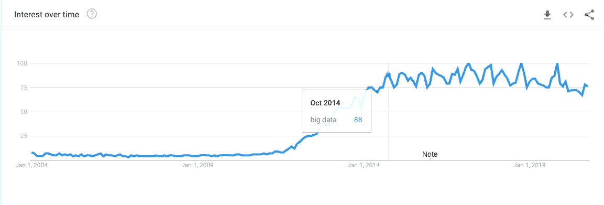

# 大数据真的有那么大吗？

> 原文：<https://towardsdatascience.com/how-big-is-big-data-7be51cdea64e?source=collection_archive---------49----------------------->

## 而且为什么一开始就叫大数据？

[ev](https://unsplash.com/@ev?utm_source=medium&utm_medium=referral) 在 [Unsplash](https://unsplash.com?utm_source=medium&utm_medium=referral) 上的照片

“大数据”这个术语已经出现了一段时间，但在几乎所有情况下，我们都认为它指的是非常大的数据集。毕竟，它的名称中有“大”这个词，所以数据必须是大的，对吗？

大数据术语在 2012 年左右开始变得越来越受欢迎，直到 2014 年才真正实现飞跃。

[“大数据”一词的谷歌趋势](https://trends.google.com/trends/explore?date=all&q=big%20data) -作者图片

它主要用于覆盖大公司不断增长的数据足迹。随着公司收集和处理更多种类和不同的数据，数据库和数据集市的旧语言实际上并不适合。因此，大数据和数据湖等术语的诞生将数据处理带入了未来。

那么，大数据的真正含义是什么？大数据工程师的工作角色和普通的数据工程师有区别吗？

我希望在这篇文章中阐明这些问题。

# **大数据有多大？**

嗯，不一定要那么大。大数据用于描述不同于传统数据仓库的数据存储和处理解决方案。这通常是因为使用传统数据库需要存储和处理的数据量变得过于昂贵，*但这不是唯一的原因。*

大数据还包括非结构化数据处理和存储。公司现在可以收集和处理视频、图像和文档，而不是收集标准的表格数据，大数据解决方案需要考虑这一点。

这就是为什么数据湖这个术语变得如此流行，因为您将您的数据存储称为一个开放和变化的湖，而不是一个固定和结构化的仓库。

也就是说，大数据经常被用来描述大量的数据。

> 我们现在产生的数据几乎是 10 年前的 30 倍。

试图在传统的数据仓库中存储和分析如此大量的数据会花费太多的资金，并且需要太长的时间来返回结果。

这是因为传统的数据解决方案是为纵向扩展而构建的。我的意思是，你有一个数据库，如果你想要更多的存储空间，你可以增加更多的硬盘，如果你想要更多的能力，你可以提高 CPU 和 RAM。然而，有时添加更多并不能给你带来任何额外的好处，反而会变得过于昂贵。

大数据解决方案可以横向扩展。这意味着您的数据存储通常是一个服务器/数据库集群。如果您需要更多的存储或计算能力，您可以添加几乎无限多的服务器。

这听起来很简单，并且回避了一个问题*,为什么我们不用旧的数据库做这件事呢？*答案很简单，这需要改变数据处理方式。如果您将一个传统的数据库拆分到多台机器上，并且希望对一个表中的所有记录进行计数，那么当您的表现在分布在多台机器上，每台机器都给出不同的答案时，您如何得到这个数字呢？

这就是大数据解决方案所提供的。它们不仅提供了一种存储难以置信的大量数据的方法(见下面的 Google 文章),而且管理跨多个节点(服务器)的数据处理。

 [## 谷歌的数据足迹会让你大吃一惊

### 说真的，他们有一大堆数据！

medium.com](https://medium.com/@lewisdgavin/googles-data-footprint-will-blow-your-mind-2237cf8e0d4) 

简而言之，要回答大数据有多大的问题，这要视情况而定…它有多大就有多大。但是，只有当您能够应对这三个 V 时，它才真正成为大数据平台。体积、速度和变化。

# **大数据技术的例子**

今天，我们可以使用如此多的大数据技术，因此我将在这里列出其中最有趣的故事。

*   Hadoop —一种大数据软件框架，包含多种技术，共同创建大数据解决方案。该框架允许跨多个服务器垂直存储和处理数据。
*   Apache Hive——Hive 是适合 Hadoop 框架的技术之一。[它最初是由脸书](https://www.facebook.com/notes/facebook-engineering/hive-a-petabyte-scale-data-warehouse-using-hadoop/89508453919/)开发的，允许分析师和工程师使用 SQL 来分析存储在他们的 Hadoop 集群中的数 Pb 的非结构化数据。
*   Apache Spark — Spark 可以在 Hadoop 或独立集群上运行。从 Hive 的缺陷中学习，它成为一个快速的内存数据处理解决方案，以提供更快的大规模分析。
*   Apache Kafka 由 LinkedIn 开发，Kafka 旨在将大量数据实时吸收到他们的数据湖中。Kafka 允许您横向扩展数据流和数据摄取，同时使其具有容错能力，因此不会丢失任何数据。

# 大数据工程师需要哪些技能？

在大数据技术兴起的早期，大数据工程师不仅需要 SQL 等数据处理技能，还需要编程经验。这是因为许多早期系统是由程序员构建的，然后才变得更加普遍，类似 SQL 的接口构建在上面。

如今，仍然需要将编程和 SQL 很好地结合起来，但是在某些情况下，您可能只需要 SQL 知识就可以了，特别是如果您了解集群和单节点数据处理之间的核心区别。

虽然在大多数情况下，你需要强大的技术背景，但我发现编程技能和数据处理技能一样重要。这是因为您经常构建和管理数据湖，这需要 DevOps 之类的技能集以及将这些技术集成在一起。

作为一名大数据工程师，您不仅要对数据执行 ETL 处理，还要从各种来源获取数据，包括网站、API、服务器和其他数据库。您可能还需要创建能够以毫秒级延迟接收、分析和存储结果的实时解决方案。所有这些任务都需要传统数据仓库模型之外的新技能。

最终，世界上的数据足迹只会越来越大，所以最终我们今天所说的大数据可能就是明天的小数据。它正在学习扩展以满足不断增长的需求，这造就了大数据，**大数据。**