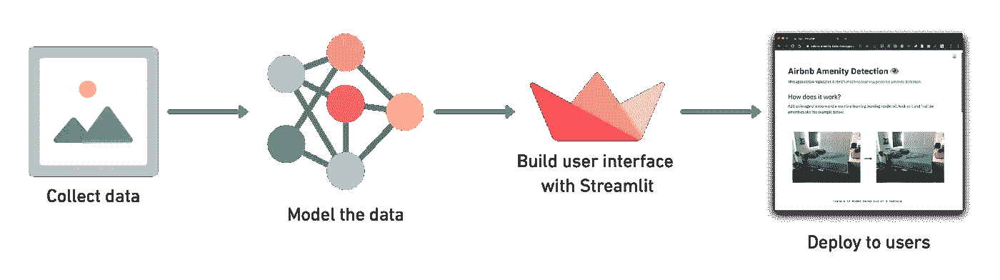

# “像我这样的初学数据科学家如何获得经验？”

> 原文：<https://towardsdatascience.com/how-can-a-beginner-data-scientist-like-me-gain-experience-df2d4d718ad7?source=collection_archive---------5----------------------->

## 我学过一些课程，现在做什么？提示:摸摸炉子。

一项被低估的技能。感谢山姆·伯克的照片。

Manuela 前几天给我发了一封电子邮件，问了我一个问题“像我这样的数据科学家初学者如何获得经验？”。

问得好。

它接着说，“我参加了一些课程，做了一些项目，但一些面试官说:‘我喜欢你的阵型，但你没有我们想要的最起码的经验，以后再来吧！’".

我回复了一些我正在复制到这篇文章的观点。

**免责声明:**我不是去找工作。所以你可能会问，“那么，我为什么要接受一个不去找工作的人的建议呢？”。

你这么问是对的。

永远不要相信那些没有亲身经历的人的建议。我的解释是，我没有找到适合我的工作，所以我创造了自己的(这可以是一篇独立的文章，事实上，我的建议是:[不要找工作，而是创业](https://medium.com/the-post-grad-survival-guide/building-a-business-from-a-bedroom-98-130-and-11-months-in-7a55774b2a0))。

然而，如果我想得到一个角色(反过来，它需要的经验)，我会这么做。

# 课程和经验差距

网络课程是商品(一个很普通的东西)。是的，我是作为一个教[在线机器学习课程](https://dbourke.link/mlcourse)的人这么说的。

在线课程创造基础知识，从事你自己的项目创造特定的知识(无法教授的知识)。

所以我对 Manuela 的第一个问题是，当你说你完成了一些课程和项目时，有多少是你自己的项目，而不是你作为课程的一部分完成的项目？

以下是我对经验的定义:你独自(或与他人合作)尝试过但不知道结果的事情。

这里有一个例子。

你父母告诉你多少次炉子是热的？

我猜你是在被烧伤后才明白的。

听父母的话就相当于听教官给你上课。当然，你可以理解他们所说的，但是除非你亲自尝试，否则你不会真正理解。

所以获得经验(在真正开始一个角色之前)相当于摸炉子。

如果你像我一样，有课程证书和课程项目，正在寻找一种叫做经验的难以捉摸的东西，现在是时候开始问自己了:

> 我碰到炉子了吗？

# 在你拥有它之前开始工作

找出你想要的理想角色，然后开始行动。

如果这听起来很奇怪，把它作为你研究的一部分。如果你有能力学习数据科学技能，你就有能力弄清楚不同类型的角色需要什么。

我举一个具体的例子。

假设你在寻找自由职业者，但是所有的机会都需要经验。还有一个用于建立计算机视觉模型，以识别手术台上是否有医生的工具(这不是虚构的，我是从我被要求参与的一个实际项目中得出的)。

你读了角色任务，然后说，“哇，那太有意思了，我很乐意去做。”你继续读，看到“需要 3 年以上的经验”，然后想，“嗯，我没有 3 年以上的经验，所以我不打算申请。”然后用剩下的时间思考，“好吧，看来我对这些角色都不够好。”

我去过那里。而且是错误的思维过程。这是一个基于恐惧的决定，而不是基于成长的决定。你决定不申请，因为你害怕你的能力达不到要求。

事实是，许多角色涉及大量的动态计算(毕竟，这是数据科学中的科学或机器学习工程师中的工程师)。

那么你能做些什么呢？

你可以获取项目的工作描述，然后自己构建。花一周时间设计和计划你可能如何做，花四周时间实际做，然后花一周时间分享你学到的东西。

最坏的情况是，你已经花了 6 周的时间找出了什么没有用(对于一个特定的问题)，最好的情况是，你现在有东西可以向别人展示你实际上做了什么(没有课程项目的有益指导)。

你可以这样说，“我看到了这个项目，并决定建立一个概念证明。”

对于医生的工具问题，你可以在互联网上搜索工具的不同图片，创建自己的数据集(人工与否无关紧要，重要的是弄清楚如何创建这样的东西)，建立一个模型来检测工具是否丢失，然后使用 [Streamlit](https://www.streamlit.io/) 将你的概念证明部署到一个面向用户的应用程序中。

一个自我设计项目的例子。首先收集您自己的数据，以某种方式对其建模或分析，使用 Streamlit(或类似工具)构建一个用户可交互的界面，并通过 web 将其部署给用户。对于这种端到端的例子，看看我[如何使用相同的步骤复制 Airbnb 的便利设施检测](https://dbourke.link/airbnbplaylist)。

如果未来的雇主不把这种主动性称为“经验”，你就不想在那里工作。

**补充说明:**当 Andrei(我的商业伙伴)和我为我们的机器学习课程(对 Shubhamai 大声喊出来)雇用一名教师助理时，我们雇用了那个已经在自己回答别人问题的学生。Shubhamai 在得到这份工作之前就开始了。

# 后续行动

另一个被忽略的点。永远不要把拒绝视为一劳永逸的事情。

正如引用的，一些面试官说，“你没有我们想要的经验，以后再来吧。”

换一个词吧，“你还没有我们要的**的经验**，以后再来吧。”

如果有人告诉你“你还没有经验”，你真诚地相信他们的话，去实践你的技能，也就是说，做一些像在你有工作之前就开始工作的事情，你应该继续跟进。

向他们展示你所做的工作(需要注意的是:这需要实际去做并提高你的技能)。

说，“嘿，根据我们上次的谈话，我想让你知道我一直在提高我的技能，这是我同时建立的。如果你有任何空缺，我很乐意被重新考虑。”

大部分忘记了后续。不仅仅是采访，而是任何事情。任何一种关系都可以通过某人采取额外的步骤来改善。

记住，生活中的很多结果都是非线性的。如果有人给我发了一封邮件，而我在几个月内忘记回复(邮件对我来说是福是祸)，我可能永远不会回复。但是如果他们跟进并提醒我的懈怠(谢谢)，我更有可能在接下来的 24 小时内回复。

> 这总是有用吗？

不，当然不是。但它显示出的主动性远远超过了只是浏览多个招聘信息。

# 了解某人

许多职位空缺甚至没有列出来。

我在一家科技公司的第一份(也是唯一一份)工作来自于一个人，他看到了我在 LinkedIn 上发布的内容，碰巧认识一个人，而这个人又认识一个可能有兴趣和我交谈的人。我最终遇到了这个人(对 Cam 大喊)，他被证明是一个完整而绝对的活着的传奇，就我一直在做的事情进行了交谈，他问我下周是否愿意来一天，我做了，然后又一天，两天后，我得到了一个角色。

在这种情况下应该注意的是，我确实有基本技能，离世界一流还差得很远，但我不会走进那里，不知道什么是 pandas DataFrame，也不知道如何解决和查找堆栈溢出问题(是的，我每天花很多时间，甚至工作几个月都在研究和搜索东西，记住，工程师是“解决问题”的人)。

对我们未来的许多雇员(尤其是初级雇员)来说，他们是因为有人认识某人。

我是这样看的:求职门户已经死了。

他们可能对某些人有用，但对我来说，我假装他们没有。我告诉自己，通过那个按钮申请很容易，但更难的是找到我应该与之交谈的人，与他们交谈，向他们展示我一直在做的事情，接受他们的建议，听取他们的反馈，提高我的技能，跟进并展示他们，并有可能获得一份工作。然而，如果我通过招聘启事来申请，它会立刻被拒绝(也许不会，但我也是这么告诉自己的)。

当然，在一个理想的世界里(尽管可能不理想)，公司会只雇佣有才能的人，但这不是人们的工作方式。人们喜欢和他们喜欢的人一起工作。

> 好吧，那你怎么去了解一个人呢？

如果你要走数字路线，保持简单。就像你给我发的邮件一样(正如你在上面看到的，Manuela 给我发了一封非常简洁明确的邮件)。又短又甜。直接提问。

我得到了 Airbnb 的面试，因为我在 LinkedIn 上发了一条招聘人员(做调研找到的)的消息。她在一天之内回复说，“嘿，丹尼尔，你明天有空吗？”。我没有得到这份工作，但我确信我比通过他们的招聘网站申请(我甚至没有申请)更接近了。

同样，这个过程也不能保证。

您可以向 100 个人发送消息，但没有收到回复。同样的，申请 100 份工作却没有得到任何机会。如果你的记分卡最终看起来像这样，把它作为反馈，你处理事情的方式可能需要改进。

数字是高效的，远程工作越来越成为一件事，但人们仍然喜欢与他们的身体互动(可能对我们这样的技术书呆子来说很惊讶)，就像在同一个房间里一样。这意味着去参加活动(在社会条件允许的情况下)，与人交谈，多走一步与 X 公司的 Dave 跟进(见上文),他告诉了你他过去几个月一直在做的项目。

我工作的科技公司每个月都会举办一次人工智能聚会。在我为他们工作之前，我去了一个聚会，不知道他们是谁，甚至不知道他们的存在，7 个月后，我在那里工作。

# 分享你的作品

这应该是清楚的，但如果不是，我会把它放在这里。

如果你的外出机会失败了，让他们来找你。

这要从创造东西并公开分享(完成与否)开始。

我在过去 3 年中拥有的所有最好的机会都来自于偶然发现我的工作的人(我从 2016 年开始在网上写作，从 2017 年开始写机器学习)。

是的，你应该有自己的博客，把它作为你的投资组合的中心枢纽，把其他社交媒体平台(你可以搞清楚这些)作为辐条。

想想吧。你是怎么学到东西的？你可能四处搜索，偶然发现了一篇关于这个主题的很棒的博客文章，并在自己的工作中使用了它。

你猜怎么着？

你可以成为一个有帮助的博客帖子的创建者。

这与上面的内容有联系。在你有工作之前就开始工作，分享你的工作(这是你的经验)。一旦你做了与之前被拒绝的工作相关的事情，继续说，“嘿，这是我做的。”

# 进一步阅读

现实一点，雇佣没有经验的人对任何公司来说都是一大风险。

因为很有可能，你会在短期内失去生意上的钱(当你学习和建立你的基本技能时)。所以你可以认为你的主要职责是降低风险。

怎么会？

以上几点足以作为开始。但是如果你有兴趣了解更多。以下资源会有所帮助。

*   好到他们不能忽视你的加州纽波特(Cal Newport)——这几乎可以从标题上看出来。
*   [如何交流和分享你的作品](https://www.mrdbourke.com/how-to-think-about-communicating-and-sharing-your-work/)——我写的一篇文章详细讨论了这几点。
*   [不要称自己为程序员](https://www.kalzumeus.com/2011/10/28/dont-call-yourself-a-programmer/)——另一篇关于开始一个角色主题的伟大文章(如果你没有角色，你可能会把这篇文章理解为“嗯，这些与我无关”，但你应该把这些要点视为逆向工程，记住:在你有角色之前开始工作)。

有问题吗？如果你有任何进一步的问题，请留下你的回复或随时给我发电子邮件。

PS 我把这篇文章变成了一个视频(在每一点上重复多一点)。