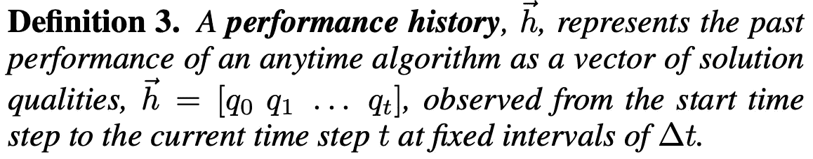

# 机器人什么时候应该停止思考，开始行动？

> 原文：<https://towardsdatascience.com/how-can-a-robot-decide-when-to-stop-thinking-and-start-acting-d65d3ed8dce2?source=collection_archive---------52----------------------->

人们每天解决许多问题。也许我们正在想我们应该穿什么去参加某个聚会，或者我们正在想出开车去某个地方的最佳方式。有时候，我们甚至试图弄清楚我们应该和谁结婚，或者我们应该去哪里上大学。

当一个人解决一个涉及许多不同因素的难题时，他们甚至没有意识到就做出了权衡。如果我们花在解决问题上的时间太少，我们最终会得到一个不够好的解决方案。然而，如果我们花*太多的*时间来解决问题，我们会得到一个很好的解决方案，但是会花费太长的时间。换句话说，当我们解决复杂的问题时，我们*不知不觉*但*有效地*回答了下面的问题:

> 什么时候我们应该停止思考一个问题，并开始采取行动，找到我们目前为止想出的最佳解决方案？

让我们考虑一个例子。假设莎莉想出了从她家开车去滑雪胜地的最佳方式。看看几个选项。她应该喜欢哪一个？

1.  她应该考虑很长时间(30 分钟)来获得一条需要 35 分钟的伟大路线吗？
2.  她是否应该想都不用想(1 秒钟)就能得到一条耗时 2 小时的可怕路线？
3.  她应该考虑一个合适的时间量(2 分钟)来得到一个合适的需要 40 分钟的路线吗？

虽然第一个选项会导致最快的路线，但她会花太多时间思考。类似地，虽然第二种选择要求她很少思考，但她会花太多时间开车。然而，第三种选择在思考时间和驾驶时间之间提供了一个很好的平衡。

[我在研究生院的第一篇论文](https://www.justinsvegliato.com/pdf/SWZijcai18.pdf)试图为机器人回答这个问题:*机器人什么时候应该停止思考它的问题，并开始采取行动，寻找迄今为止它提出的最佳解决方案？这就是我们今天要谈论的话题。*

由[布鲁诺/德国](https://pixabay.com/users/bru-no-1161770/?utm_source=link-attribution&utm_medium=referral&utm_campaign=image&utm_content=3179167)在 [Pixabay](https://pixabay.com/) 上拍摄的照片

# 我们所说的思考是什么意思？

让我们首先正式定义机器人*思考*的含义。我们不是在谈论关于意识的[难题](https://en.wikipedia.org/wiki/Hard_problem_of_consciousness)或对于像我一样在房间里的哲学极客的[中国房间争论](https://en.wikipedia.org/wiki/Chinese_room)。相反，我们谈论的是一类叫做 [**anytime 算法**](http://rbr.cs.umass.edu/shlomo/papers/Zaimag96.pdf) 的算法。简单来说，anytime 算法只是一种随着时间的推移逐渐改进某个解决方案的算法，并且可以为了那个解决方案而随时被中断。例如，如果我们试图想出一条从杂货店到医院的路线，anytime 算法会不断地生成随着时间的推移越来越好的路线。基本上，当我们说一个机器人正在思考时，我们真正的意思是机器人正在执行一个随时会产生解决方案的算法。

anytime 算法通常有几个很好的特性。首先，anytime 算法表现出**单调性**:它保证解的质量提高或保持不变，但绝不会随着时间的推移而变差。接下来，anytime 算法表现出**收益递减**:解质量的提高在计算的早期阶段较高，在后期阶段较低。

为了说明 anytime 算法的行为，请看这张照片。在这张照片中，随着**计算时间**增加，**解质量**也增加。事实证明，这种行为是 anytime 算法的典型特征。

# **交易解决方案质量计算时间**

为了确定机器人何时应该停止思考并开始行动，我们需要量化两件事:解决方案的质量对我们来说值多少，时间对我们来说值多少。提示**依赖于时间的效用**。时间相关效用表示由任意时间算法计算的解决方案的效用。直观地说，在任何实时决策任务中，一秒钟内计算出的某种质量的解决方案比一小时内计算出的相同质量的解决方案具有更高的效用。这意味着解决方案的效用是质量和计算时间的函数。这是一种正式的说法:

幸运的是，通常可以通过将依赖于时间的效用函数表示为两个函数之间的差异来简化它，这两个函数被称为**内在价值函数**和**时间成本**。首先，*内在价值函数*代表一个解决方案的效用，如果我们只考虑该解决方案的质量，忽略计算时间的成本。第二，*时间成本*代表解决方案的效用，如果我们只考虑计算该解决方案所需的时间，而不考虑解决方案质量的价值。下面让我们更正式地定义这种简化:

***这种东西有什么意义？*** 这个问题问得好。给定被分成内在价值函数和时间成本的时间相关效用函数，决定何时中断任意时间算法并对当前解起作用的问题变得明确。例如，看看下面的例子。我们有三个函数:内在价值函数、时间成本和依赖于时间的效用函数。内在价值函数随时间逐渐增加，时间的成本随时间呈指数下降，时间相关的效用函数为我们创造了一个凸函数。**我们应该停止思考，开始在依赖时间的效用函数顶端行动。**

听起来很简单，对吧？嗯，有个问题。虽然很容易指着橙色圆圈说停在这里，但我们实际上并不事先知道 anytime 算法的性能。**决定何时中断 anytime 算法并对当前解决方案采取行动需要预测 anytime 算法在未来的性能。**

# 预测任意时间算法的性能

在我们进入如何预测 anytime 算法的性能之前，让我们再定义一些东西。我们将定义一对向量，它们共同代表任意时间算法的性能。第一个向量描述了 anytime 算法在解决一个问题实例时的**过去的性能。我们可以将过去的绩效定义为从初始解决方案到当前解决方案所观察到的解决方案质量的向量。换句话说，性能历史是从 anytime 算法的开始时间步长到当前时间步长观察到的一系列解决方案质量，如下所示:**

第二个向量代表 anytime 算法在解决一个问题实例时的**未来性能。我们可以将未来性能定义为从当前解决方案到最终解决方案的算法剩余时间内的解决方案质量的向量。也就是说，性能预测是从当前时间步长到算法的最终时间步长后预测的一系列解决方案质量，如下所示:**

为了预测 anytime 算法的未来性能，我们可以使用它在正在解决的问题的实例上的过去性能。通常，这只是一个从*性能历史*中计算*性能预测*的函数。在不致力于具体实现的情况下，让我们大致这样定义这个函数:

需要强调的是，该功能可以通过多种方式实现。在大多数情况下，一个简单的方法，如**非线性回归**，可以从性能历史中计算出一个合适的性能预测。事实上，我在报纸上就是这么做的。然而，对于所有那些深度学习专家来说，也可以使用复杂的模型来完成，如神经网络，其中包括算法的功能。

这是对性能预测器的直观描述。理想情况下，随着性能历史的增加，它计算的性能预测将接近 anytime 算法的真实性能。例如，在第 *i* 个时间步，第 *i* 个性能预测并不十分接近真实性能 *p** 。事实上，这太乐观了。然而，在第 *(i + 1)* 时间步，下一个性能预测 *(i + 1)* 性能预测更接近真实性能 *p** 。直观上，随着性能预测器利用性能历史中更多的解决方案质量，性能预测接近算法的真实性能。

# 机器人什么时候应该停止思考，开始行动？

现在我们已经定义了一堆东西，我们终于可以看到机器人如何决定何时停止思考并开始行动。基本上，机器人会以固定的时间间隔监控它的 anytime 算法。在每个时间步，机器人将使用性能预测器从性能历史生成性能预测。根据性能预测的情况，机器人要么中断 anytime 算法，要么让它继续运行。在更深的层次上，基本算法是这样工作的:

1.  **初始化**时间步长和性能历史。
2.  **启动**任意时间算法。
3.  **当**anytime 算法运行时，**执行**以下操作:
4.  — **获取**anytime 算法的当前解。
5.  — **计算**当前溶液的质量。
6.  — **将当前解决方案的质量添加到绩效历史中。**
7.  — **使用性能预测器根据性能历史计算**性能预测。
8.  — **如果**性能预测满足停止条件:
9.  — **中断**anytime 算法。
10.  — **返回**当前解决方案。
11.  — **否则**，**增加**时间步长，**暂时休眠**。

***但是什么是停止条件呢？*** 简单来说，我们用一个停止条件来决定一个 anytime 算法在给定的时间步是否应该被中断。如果停止条件为真，我们中断算法。否则，我们让算法继续运行。

***而我们应该用什么停止条件呢？*** 我们使用一个停止条件，只要*预计最佳解决方案*的效用和*当前解决方案*的效用之差大于零*，就让 anytime 算法运行。*更正式地说，我们让 anytime 算法在以下值大于零时运行:

事不宜迟，对于那些想了解更多技术细节的人来说，下面是决定智能系统何时应该停止思考并开始行动的方法:

