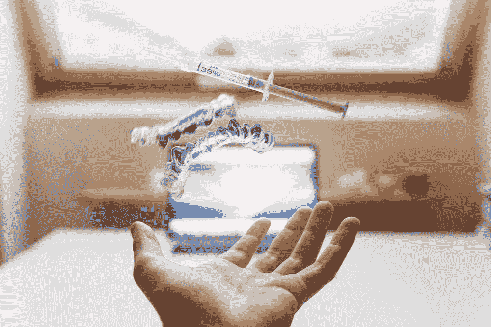
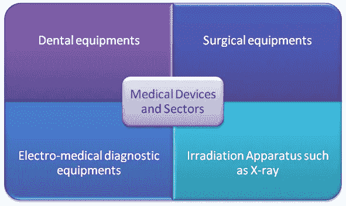
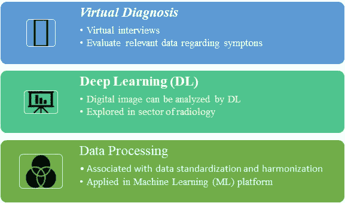
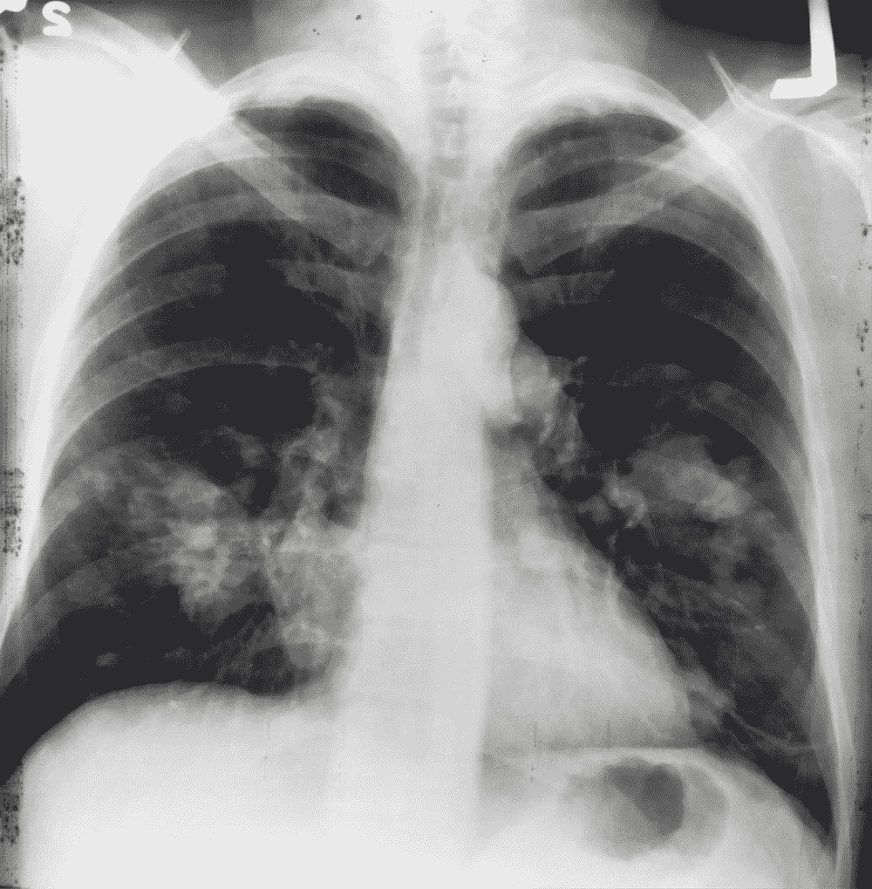

# 不同的人工智能(AI)技术彻底改变了医学领域(AIM)

> 原文：<https://towardsdatascience.com/how-can-artificial-intelligence-ai-revolutionize-the-field-of-medicine-3466bab60756?source=collection_archive---------52----------------------->

## 当前的学术和工业研究采用医学中的人工智能(AIM)

丹尼尔·弗兰克在 [Unsplash](/s/photos/medical-diagnosis?utm_source=unsplash&utm_medium=referral&utm_content=creditCopyText) 上的照片

作为一名电子工程研究生，研究重点是生物医学技术和创新；我试图决定的第一件事是这项技术在医学上已经发展到什么程度，以及它在不久的将来会呈现什么样的前景。医生和放射科医生仍然是高需求的核心，但随着人工智能技术、机器学习(ML)和数据科学的最近干预，出现了向数据分析自动化的转变。这种转变的部分原因是因为人工智能技术提高了准确性和时间:这两者在拯救生命方面都是至关重要的因素。

医学本身是一个复杂而富有挑战性的领域。在许多商业领域，包括金融科技行业，人工智能技术在自动化和有效的数据分析方面显示出令人鼓舞的成果。人工智能有望重新设计和革新医疗保健行业。这可以包括通过机器学习(ML)设计有效的治疗计划，以及协助专业人员分析医疗数据。

> 在医疗保健领域集成人工智能系统可以将全球收入提高 8.4 倍。通过人工智能技术带来的创新，医疗保健行业可以预计节省约 1500 亿美元。

医疗技术和行业的不同部门人工智能医学(AIM)研究主要基于生物医学、患者数据管理和信息检索过程。充足的投资和研究也被分配来增强增强智能。这个领域包括将科学数据的力量与医学专业判断相结合。

医疗技术和产业的不同部门

**医学中的人工智能(AIM)** 研究主要基于生物医学、患者数据管理和信息检索过程。充足的投资和研究也被分配来增强增强智能。这个领域包括将科学数据的力量与医学专业判断相结合。

某些常春藤盟校已经投资了这项技术。

## 当前大学附属的 AIM 技术研究

斯坦福大学 AIMI 中心 正在利用统计学、电子工程和生物信息学方面的跨学科专业知识开发新的人工智能方法来分析医学成像。

2 ***HMS(哈佛医学院)*** 还积极参与开发数据驱动模型，以改善医疗保健行业的决策。

在开发能够在数字图像(例如视网膜图像)中发现判断特征以识别糖尿病患者的诊断算法方面进行了研究。

3 布法罗大学*的研究人员正在使用 ML 来分析高分辨率医学图像中的预测模式。遗传信息和医疗记录，以改善对病人的诊断。研究人员还在努力建立一个肿瘤委员会数据库，该数据库可以将人工智能用于“精确肿瘤学”，从而改善癌症患者的护理。*

*4 ***马里兰大学*** 也在 AI 和医学领域采取主动，项目:AIM-HI(AI+Medicine for high impact)。截至 2020 年，他们正在致力于:(1)使用 ML 使能的生物标志物发现和传感来治疗慢性疼痛；(2)用于精神健康和风险评估优先化的多阶段 ML 框架；(3)新生儿阿片类药物戒断综合征的精确治疗(NOWS)。*

*上面没有列出的其他大学也在人工智能和医学领域进行类似的研究。*

## *AIM 技术的行业关联研究*

*1***IBM Watson Health***将海量的医疗数据带入云枢纽。认知能力和传统分析将数据转化为知识。它可用于确定任何患者的正确药物治疗。
由于患者情况的变化和可用药物的范围，这项研究具有很大的潜力。使用人工智能技术，该平台可以决定特定药物是否真的适合特定患者。
然而，一些限制和批评包括推荐不正确的治疗建议。因此，当与注册医生咨询相配合时，该平台具有潜力。*

*2 ***谷歌搜索引擎*** 已经诚心诚意地帮助我们提供关于医疗条件或附近医院位置的信息。他们正在扩大对人工智能的研究，以帮助诊断癌症，防止失明和改善病人医疗保健的其他方法。*

*3**Verily 的项目基线**是用于与研究人员、临床医生、工程师和志愿者合作以构建下一代医疗保健工具和服务的另一种方法。他们的网站上列出了一些研究项目，包括对新冠肺炎、皮肤、情绪、睡眠的研究以及许多其他相关领域的研究。*

*还有其他没有在上面列出的工业项目也在人工智能和医学领域进行类似的研究。*

## *人工智能如何彻底改变医疗行业的某些领域？*

*人工智能和深度学习(DL)一直是让医疗部门在数据处理方面更加高效的主要焦点。图像分析的深度学习概念可以很容易地应用于读取 X 射线图像并得出必要的结论。这消除了*人为错误*范围的必要性，并提供了更快的处理时间。*

**

*AIM 的少数应用*

## *AIM 的少数应用*

*(一) ***自动化:*** 医疗领域需要两个不可分割的方面，即数据密集型和知识型。常规咨询和其他背景分析可以通过人工智能系统轻松实现自动化。*

*(二) ***虚拟诊断*** :虚拟人工智能辅助医疗筛查平台因其较低的成本和便捷性而日益普及。这也允许早期诊断的范围，从而防止后来的保健并发症。电话筛查或虚拟访谈可以检查诊断的相关数据，并可以推荐合适的医生进行进一步的咨询(如果需要)。*

*该平台可以通过询问一系列与您的症状相关的问题来进行在线诊断。AI 代码可以轻松诊断病情。最常见的在线诊断包括鼻窦炎、支气管炎、哮喘、指甲感染和尿路感染。*

*(iii) ***用于图像分析的深度学习(DL)软件:*** 该领域正在获得发展势头，特别是因为它提供了将医疗专业人员的能力集成到 it 平台中的范围。放射学涉及使用医学成像对损伤进行诊断和治疗的领域。图像分析中的深度学习可以提高诊断的效率，并积极地帮助从图像分析中得出关于患者治疗的结论。*

**

*[国家癌症研究所](https://unsplash.com/@nci?utm_source=unsplash&utm_medium=referral&utm_content=creditCopyText)在 [Unsplash](/s/photos/medical-diagnosis?utm_source=unsplash&utm_medium=referral&utm_content=creditCopyText) 上拍摄的照片*

*这一领域在癌症治疗中得到了积极的探索。它可以使用于肿瘤诊断的图像分析过程自动化，并为早期诊断和治疗提供新的无误差模型。无误差分析还可以降低医疗成本。该领域发展势头强劲有几个原因:(1)缺乏特定领域的专业人员(2)与测试和分析相关的并发症(3)允许医生和病理学家之间的合作范围(4)通过提高诊断的准确性降低成本。*

*(四) ***机器人辅助手术:*** 机器人辅助手术涉及外科技术的进步，以提高外科手术的效率。这一过程通常包括将 3D 摄像机和微型手术器械插入患者体内。外科医生使用外部控制系统来操纵仪器，以精确地完成手术任务。虽然到目前为止，外科医生只是积极地参与手术决策过程，但人工智能技术仍有改进和自动化一些系统以提高准确性的空间。这一点尤其重要，因为人工智能技术可以在 3D 摄像机无法到达的地方运行。*

*(五) ***原始数据处理*** *:* 大多数专业人士都难以获取相关数据，也难以整合起来做出有价值的见解。此外，数据变更和数据完整性也有可能受到损害。因此，越来越多的医疗保健初创公司积极参与处理大量医疗数据。它们执行数据标准化和协调，并用于 ML 平台。*

# *AIM 的未来*

*AIM 的主要目标是将医疗专业人员的能力与数据密集型系统相集成。这可以允许对医学信息和数据的全面理解的范围。人工智能有助于准确找到相关数据，既耗时又划算。医疗保健行业是一个数据密集型系统，因此人工智能集成可以找到改善护理和减少信息过载的方法。
一些限制和批评包括推荐不正确的诊断和治疗建议。AIM 平台在注册医生咨询的辅助下具有潜力。医生、目标和医疗技术的整体作用可以改善当前的医疗保健系统。*