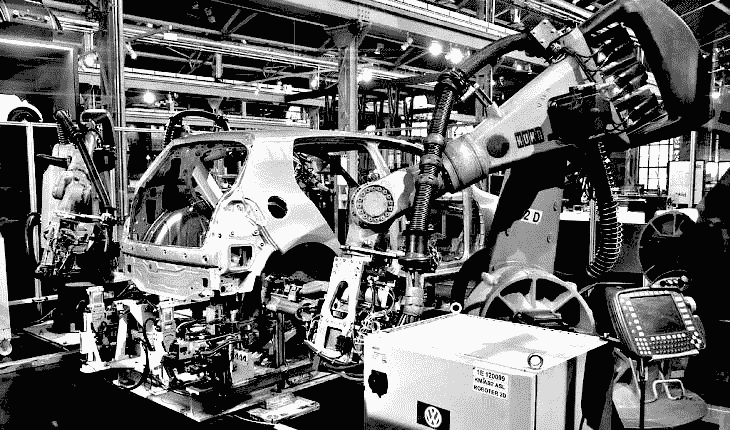
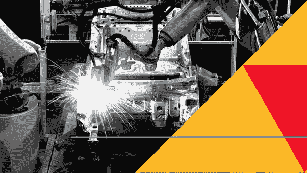
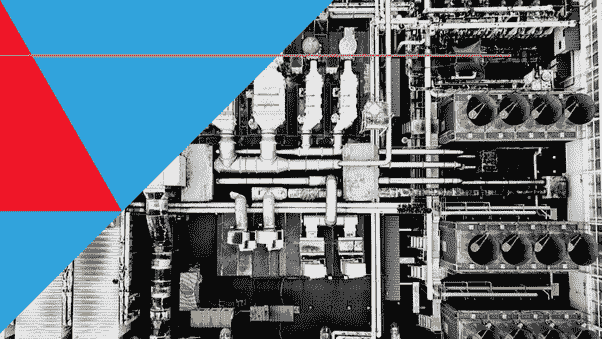
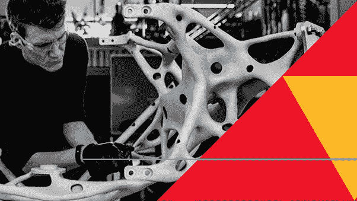

# 人工智能如何应用于制造业？

> 原文：<https://towardsdatascience.com/how-can-artificial-intelligence-be-applied-in-manufacturing-8662eaaea999?source=collection_archive---------6----------------------->

## 人工智能和机器学习正在为制造商提供前所未有的能力，以大幅提高吞吐量，优化供应链，并加速研发。

自从互联网兴起以来，世界顶级的生产工厂已经将他们的操作数字化了。现在，万亿字节的数据从工厂车间的几乎每一个工具中流出，给组织提供了他们不知道如何处理的更多信息。

不幸的是，许多公司缺乏翻译这些信息以降低成本和提高效率的资源。为此，公司需要人工智能。

# 是什么推动了采用人工智能的紧迫性？

高收入波动性需要不断寻求成本节约缩短生产时间增加监管和检查工厂车间的学习和适应性制造能力和供应链需求增加对小批量和/或定制商品的需求

# **未来的工厂可以……**

1.  在整个生产过程中检测缺陷。
2.  部署预测性维护以减少停机时间。
3.  响应供应链中需求的实时变化。
4.  验证像微芯片这样复杂的商品是否被完美地生产出来。
5.  降低小批量或单批货物的成本，实现更大程度的定制化。
6.  通过将日常任务转移到机器上来提高员工满意度。

# **人工智能在制造业的主要用途**

## **缺陷检测**

今天，许多装配线没有适当的系统或技术来识别整个生产线的缺陷。即使那些可能已经到位的也是非常基础的，需要熟练的工程师来构建和硬编码算法，以区分功能和缺陷组件。这些系统中的大多数仍然不能学习或整合新信息，导致无数的误报，然后必须由现场员工手动检查。

通过向该系统注入人工智能和自学能力，制造商可以通过大幅减少误报和质量控制所需的时间来节省无数时间。

## **质量保证**

制造业需要对细节的高度关注，这种必要性在电子领域更加突出。从历史上看，质量保证一直是一项手工工作，需要高技能的工程师来确保电子设备和微处理器的制造正确，并且所有电路的配置正确。

今天，图像处理算法可以自动验证一个项目是否已经完美生产。通过在工厂车间的关键点安装摄像头，这种分类可以自动实时进行。

## **装配线集成**

如今，制造商使用的许多设备都会向云发送大量数据。不幸的是，这些信息往往是孤立的，不能很好地结合在一起。

要全面了解您的运营情况，需要几个不同的控制面板和一名主题专家来理解这一切。

通过创建一个集成的应用程序，从您使用的广泛的物联网连接设备中提取数据，您可以确保获得对操作的神一样的看法。

## **装配线优化**

此外，通过将人工智能分层到您的物联网生态系统中，这些丰富的数据，您可以创建各种自动化。例如，当设备操作员出现疲劳迹象时，主管会收到通知。当一台设备发生故障时，系统可以自动触发应急计划或其他重组活动。

## **创成式设计**

除了促进制造过程，人工智能还可以帮助组织设计产品。它是这样工作的:设计师或工程师将设计目标输入到生成式设计算法中。然后，这些算法探索解决方案的所有可能排列，并生成设计备选方案。最后，它使用机器学习来测试每次迭代并对其进行改进。

*这些制造业人工智能用例来源于 Manceps 的* [*制造业人工智能服务*](https://www.manceps.com/articles/case-study/use-ai-to-design-products?utm_source=Medium&utm_medium=Article&utm_campaign=Inbound&utm_content=Manufacturing) *页面。Manceps 帮助企业组织大规模部署 AI 解决方案——包括制造商。我们甚至有一个关于生成式设计的* [*案例研究*](https://www.manceps.com/articles/case-study/use-ai-to-design-products?utm_source=Medium&utm_medium=Article&utm_campaign=Inbound&utm_content=Manufacturing) *。*

*想把人工智能带到你的运营中？下载我们的免费资源:将人工智能引入组织的完整指南。在 7 章中，你将获得所有你需要的信息，不仅在技术上，而且在文化上为人工智能的转变做准备。*

