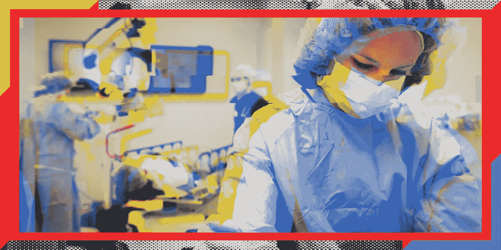
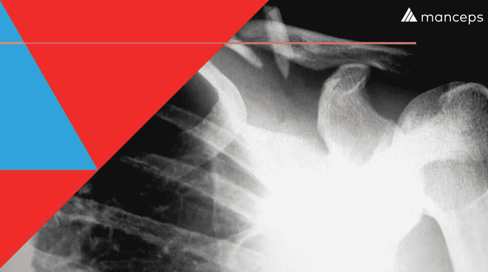
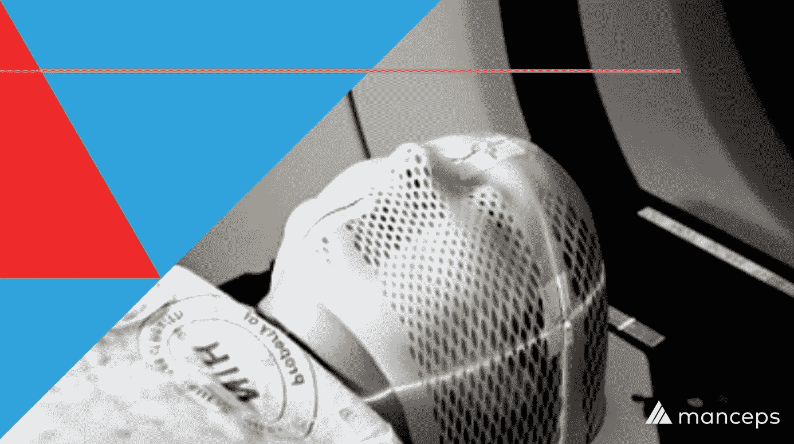

# 人工智能如何帮助医疗保健？

> 原文：<https://towardsdatascience.com/how-can-artificial-intelligence-help-healthcare-1a2bd72ca94b?source=collection_archive---------39----------------------->

## 人工智能和机器学习正在为医疗保健提供商提供前所未有的能力，以有效地组织患者护理，自动化合同和支付，并加快诊断和治疗开发过程。

在过去的几年里，医疗保健提供商和保险承保人已经开始看到将机器学习引入他们行业的力量。现在，各种规模的医疗组织都在争先恐后地减少官僚主义，同时提高诊断的准确性和批准治疗患者的速度。

不幸的是，许多医疗保健组织(尤其是保险公司)仍在手动处理患者病历，这可能是一个费力且容易出错的过程。人工智能使医疗保健提供商能够轻松地为患者护理带来自动化解决方案。

# 是什么推动了采用人工智能的紧迫性？

医疗保健的高成本，尤其是诊断和药物研发。与维护患者记录和批准治疗计划相关的官僚效率低下。缓慢的临床试验需要更多的医生培训。

# 当机器学习进入医学领域时—

1.  医生使用图像识别技术来更容易地检测疾病，在某些情况下，甚至是自动检测。
2.  保险提供商使用[自然语言处理](https://www.manceps.com/articles/case-study/case-study-using-nlp-to-summarize-medical-records?utm_source=Medium&utm_medium=Toward%20Data%20Science%20Article&utm_content=Five%20Uses%20for%20AI%20in%20Healthcare)来总结患者病例文件并更快地批准治疗计划。
3.  制药公司大大缩短了识别有效分子并将其推向市场的时间。
4.  外科医生在机器人和人工智能的帮助下进行手术。
5.  药剂师及早发现危险的药物相互作用。
6.  患者得到更好、更个性化的护理。

# 人工智能在医疗保健中的主要用途

## 患者病例文件处理

自然语言处理一直是医疗保健部门的福音。事实上，我们已经看到了将 NLP 和光学字符识别引入共享、评估和总结患者病例文件的过程中的一些努力。

传统上，保险组织必须手动批准治疗计划。为了完成这项艰巨的任务，医疗专业人员评估病人的病例档案，以作出决定。为了确保高质量的护理和限制责任，这些文件可能长达数百页，包含从详细的患者健康信息到保险范围细节的所有内容。

通过将机器学习融入这一过程，医疗保健组织大大简化了这一过程。人工智能算法可以自动执行重复的任务，甚至可以用自然的人类语言总结患者资料的重要方面。

## 诊断和疾病检测

似乎每周，研究人员都在宣布使用图像识别和深度学习进行疾病检测的新方法。到目前为止，人工智能已经被用于检测乳腺癌、早期阿尔茨海默氏症、肺炎、眼病、细菌性脑膜炎和许多其他疾病。

训练深度学习模型来检测疾病的过程可能很复杂。例如，很难积累必要的阳性数据集来训练模型。通过与人工智能公司合作，研究人员可以接触到高技能的数据科学团队，他们可以在整个研究过程中帮助你。在某些情况下，它可以简单到概述您的研究项目目标，开发人员可以开始工作，构建人工智能解决方案，帮助您收集数据和部署诊断模型。

## 药学研究

虽然疾病检测通常依赖于图像识别模型，但制药研究在更复杂的数据集中发现模式。尽管如此，卷积神经网络在提供新的药物分子方面已经显示出如此大的前景，它们现在被 150 多家初创公司和 40 家制药公司用于支持药物发现过程。

然而，你可能会感到惊讶，这些组织中很少有足够强大的人工智能团队来快速推进他们的研究。研究机构应该让一群人工智能专家和数据科学家来应对你最紧迫的疾病治疗挑战。

## 个性化患者护理

没有什么比医疗保健更私人的了。然而，随着专业人士看到越来越多的患者，越来越难以提供个性化的护理。好消息是，人工智能与分析和大数据相结合，最终使得在整个行业大规模部署定制护理成为可能。通过部署大分析和高级解决方案，这些新方法正在以更低的成本带来更高质量的护理。

无论你的公司规模如何，人工智能工具都可以大规模提供定制护理。这些工具可以在流程的任何阶段支持医疗保健提供商:从电话上的交互式客户服务代理到诊所或药房中由人工智能驱动的医生助理。

## 人工智能驱动的医疗设备

由于人工智能将越来越多地在医疗保健领域发挥巨大作用，我们可以预计医院和诊所将越来越多地转向利用人工智能的医疗设备。各种设备都可以被注入人工智能，以简化诊断并确保准确性。未来的医疗设备制造商将找到新的方法，用人工智能为他们的产品提供动力。

*这些例子来源于 Manceps 的* [*医疗保健 AI 服务页面*](https://www.manceps.com/healthcare?utm_source=Medium&utm_medium=Toward%20Data%20Science%20Article&utm_content=Five%20Uses%20for%20AI%20in%20Healthcare) *。Manceps 帮助企业组织大规模部署人工智能解决方案，包括医疗保健提供商。我们甚至有一个关于医疗保健公司如何使用 NLP* *的* [*案例研究。*](https://www.manceps.com/articles/case-study/case-study-using-nlp-to-summarize-medical-records?utm_source=Medium&utm_medium=Toward%20Data%20Science%20Article&utm_content=Five%20Uses%20for%20AI%20in%20Healthcare)

*希望将人工智能引入您的组织？获取我们的免费指南。*

