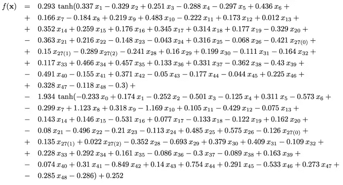

# 我如何向企业解释我的 ML 模型？

> 原文：<https://towardsdatascience.com/how-can-i-explain-my-ml-models-to-the-business-dc4d97997d64?source=collection_archive---------23----------------------->

## 3 个框架让你的人工智能更容易解释

可解释性无疑是人工智能领域最热门的话题之一——随着人工智能领域的投资越来越多，解决方案越来越有效，一些企业发现他们根本无法利用人工智能！*为什么？简单来说，许多这些模型被认为是“黑箱”(你可能已经遇到过这个术语)，这意味着没有办法解释某个算法的结果，至少在我们能够理解的方面。*

> 许多人工智能模型被认为是“黑箱”

向人类解释黑盒模型所做决策的重要性。[来源](https://dl.acm.org/doi/abs/10.1145/2939672.2939778)

在下面的图片中，我们可以看到一个复杂的数学表达式，其中有许多运算链接在一起。此图显示了神经网络功能内层的工作方式。似乎太复杂而难以理解，对吗？

来自神经网络的链式数学表达式—通过 [Rulex](https://www.rulex.ai/rulex-explainable-ai-xai/)

如果我告诉你，下面的表达式指的是与上面的图像相同的神经网络。更容易理解，对吧？

如果，否则来自神经网络的逻辑—通过 [Rulex](https://www.rulex.ai/rulex-explainable-ai-xai/)

简而言之，这是可解释人工智能的本质——我们如何以企业和个人理解的方式翻译训练黑盒模型过程中涉及的复杂数学表达式

> 这被称为[正确的解释](https://medium.com/golden-data/what-rights-related-to-automated-decision-making-do-individuals-have-under-eu-data-protection-law-76f70370fcd0)，它无疑动摇了公司实施人工智能的方式。

但是随着需求和规则的出现，也出现了针对人工智能可解释性的新解决方案(yeyyy！！)来支持那些希望利用人工智能同时能够解读它们的企业！*不再有黑箱，欢迎透明！*如果你好奇想知道更多关于我们为什么需要可解释性，我建议去[看看这篇文章](https://medium.com/all-things-venture-capital/ai-explainability-why-we-need-it-how-it-works-and-whos-winning-b4ca3c26b2a6)！

# 人工智能解释框架

这是一个许多作者已经探索过的主题——2016 年，在 Marco Ribeiro、Sameer Singh 和 Carlos Guestrin 的研讨会工作中，提出了一个关于黑盒模型可解释性的新颖解决方案。提出的解决方案旨在建立两种类型的信任:**信任模型提供的预测**和**信任模型。**

从那时起，许多其他框架和工具被提出来，以使人工智能在不同数据类型和领域的可解释性成为现实。今天在这篇博文中，我将介绍石灰、TF-Explain 和假设。

## 石灰

LIME 由华盛顿大学的研究人员开发，旨在获得算法内部发生的更大透明度，它已经成为可解释人工智能社区中非常受欢迎的方法。

基于预测模型的石灰产量和可解释性。[来源](https://medium.com/analytics-vidhya/explain-your-model-with-lime-5a1a5867b423)

当谈到在低维度数据集上开发模型时，可解释性可能更容易，但当涉及到更高维度时，模型的复杂性也会增加，这使得很难保持局部保真度。 [LIME](https://arxiv.org/pdf/1602.04938v1.pdf) (局部可解释模型不可知解释)不仅解决了模型优化中的可解释性需求，还解决了领域和任务可解释性标准合并的可解释表示的概念。

有几个将 LIME 与常见的数据科学包(如 Scikit-Learn 或 XGBoost)结合使用的例子。在这里你可以用 Scikit-Learn 和 LIME 检查一个关于人工智能可解释性的实际例子。

ou 也可以深入看看 LIME 的工具，在他们的 [**Github** LIME](https://github.com/marcotcr/lime) 上。

## TF-解释你的模型！

Tf-explain 是一个提供可解释性方法的库。Tf-explain 实现了可解释性方法，同时利用 Tensorflow 2.0 回调来简化神经网络的理解。这个有用的包是由 Sicara 提供给我们的。

该库旨在提供可解释性方法的完整列表，可直接用于您的 Tensorflow 工作流程:

*   [Tensorflow](https://www.tensorflow.org/) 2.0 兼容性
*   方法之间的统一接口
*   支持培训整合(回调， [Tensorboard](https://www.tensorflow.org/tensorboard) )

tf-explain 中实现的方法都是从文献中已知的，如激活可视化、Grad Cam、遮挡敏感度或香草梯度。所有这些风格都是为了图像的可解释性，但是表格数据和时间序列呢？

## 如果……

可解释人工智能的假设解决方案界面。[来源](https://pair-code.github.io/what-if-tool/)。

如果为了更好地理解 TensorFlow 模型的输出，存在一个具有酷的交互式可视界面的框架，会怎么样？[假设工具](https://pair-code.github.io/what-if-tool/)正是如此。假设您需要分析一个先前部署的模型，您可以，不管它是使用 Tensorflow 还是其他包(如 XGBoost 或 Scikit-Learn)开发的模型。

除了在部署后监控模型之外，您还可以按要素对数据集进行切片，并跨不同切片比较性能，同时确定模型在哪些子集中性能更好或最差。这不仅有助于你的模型的可解释性，也为研究和理解诸如偏见和数据公平性等主题提供了机会。

在这里，您可以查看一个在 Google Colab 中使用的[假设分析工具的示例。](https://colab.research.google.com/github/pair-code/what-if-tool/blob/master/What_If_Tool_Notebook_Usage.ipynb#scrollTo=NUQVro76e38Q)

# 最终韧性

毫无疑问，可解释性是一个重要的话题，将成为未来几年公司首先关注的问题之一，这不仅是因为法规，还因为社区和个人对基于人工智能的解决方案的潜力越来越了解和敏感。

然而，尽管过去几年在人工智能可解释性方面已经取得了重大而有趣的进展，但关于如何将获得的解释应用于实践，在方法和理论上仍有挑战需要解决——例如，解释必须超越可视化和对解释质量的客观评估！

> 可解释方法允许我们深入了解人工智能模型是如何工作的。但是我们寻找的所有答案都是模型工作的方式吗？或者数据质量和可解释性可以发挥巨大作用？

[*法比亚娜*](https://www.linkedin.com/in/fabiana-clemente/) *是 CDO*[*y data*](https://ydata.ai/?utm_source=medium&utm_medium=signature&utm_campaign=blog)*。*

**人工智能的改进和合成数据**

[*YData 为数据科学家提供了一个以数据为中心的开发平台，致力于高质量的合成数据。*](https://ydata.ai/?utm_source=medium&utm_medium=signature&utm_campaign=blog)