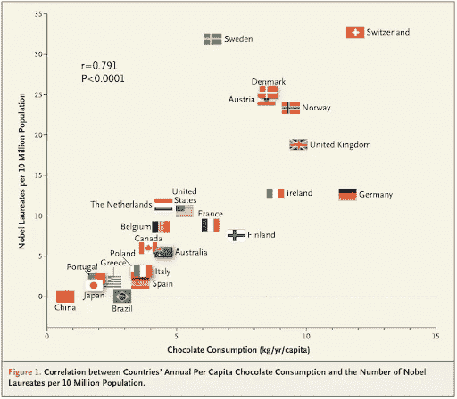
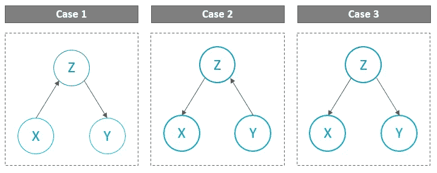
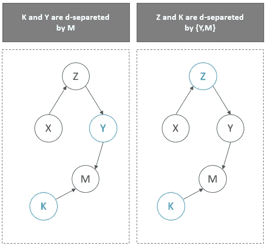
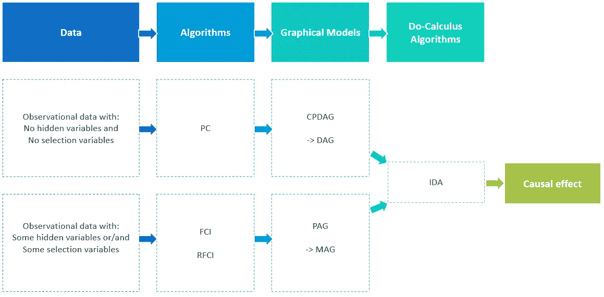

# 机器学习算法如何包含更好的因果关系？

> 原文：<https://towardsdatascience.com/how-can-machine-learning-algorithms-include-better-causality-e869ca60e54d?source=collection_archive---------34----------------------->

## 使用因果建模工具进行因果发现

近年来，机器学习算法取得了巨大的成功。由于大量数据的可用性和计算速度的提高，它们已经超过了通常的统计方法。

然而，随着我对它们如何工作以及如何应用的了解越来越多，我发现了一个令人惊讶的事实:**这些算法大多专注于做出最准确的预测或分类，而不是证明因果关系。**

然而，这种关系在决策中至关重要，尤其是在健康、社会或行为科学领域。

考虑以下问题:

*   尼古丁贴片在减少人们吸烟习惯方面有多有效
*   重建政策对贫困地区的发展有什么影响？
*   上一个营销公司对销售增长的贡献有多大？

你可以看到这些问题是因果问题而不是联想问题。他们不仅需要证明因果关系，而且需要量化它。

大多数情况下，使用实验干预:分析师进行调查，收集数据，并用复杂的统计方法进行分析。**然而，这些实验在时间和金钱上都很昂贵，在某些情况下甚至会引发伦理问题。**

此外，当谈到机器学习算法时，它们通常受到 3 个主要原因的限制:

1.  **缺乏适应新环境的能力**他们没有接受过训练
2.  **有限的可解释性**因为他们给出的预测或建议背后的理由很少，这可能会导致用户的不信任
3.  **不了解因果关系**

**那么，有没有其他替代方案呢？**

在本文中，我将与您分享我对一些重要的因果建模工具的主要发现，如结构模型、因果图及其关联逻辑。

阅读本文后，您将了解到:

*   因果推理有哪些不同的层次？
*   如何通过图形学习一个因果结构？
*   如何量化因果关系？

# **相关性并不意味着因果关系**

在开始之前，有必要重温一句众所周知的格言:**相关性不是因果关系。这意味着你不能仅仅因为观察到两个变量之间的相关性就合理地推断出它们之间的因果关系。**

为了说明这一点，让我们考虑一下梅瑟利在 2012 年发表在他的论文*巧克力消费、认知功能和诺奖得主* ( [全文在此](http://www.biostat.jhsph.edu/courses/bio621/misc/Chocolate%20consumption%20cognitive%20function%20and%20nobel%20laurates%20(NEJM).pdf))中的下图。

正如作者所指出的，一个国家的巧克力消费水平与其人口的认知功能之间存在相关性(r=0.791，p <0.0001). Does it mean that eating more chocolate would make smatter? Unfortunately, probably not!

To put it more precisely, if two random variables *X* 和 *Y* 在统计上是相关的 *(X ⊥ Y)* ，那么要么:

*   *X* 原因 *Y* ，
*   *Y* 原因 *X* 或
*   存在第三个变量 *Z* 导致 *X* 和 *Y* 。在这种情况下， *X* 和 *Y* 成为独立给定的 *Z* ，即 *X ⊥ Y | Z*

这被称为*共因原则*，由赖欣巴哈于 1956 年提出。

因此，为了真正调查巧克力消费的影响，有必要进行一项实验。例如，这需要强迫一个国家吃更多的巧克力，并观察这是否会导致更多的诺贝尔奖获得者。

如你所见，实验是不可能的。当涉及到健康问题时，它甚至会引发伦理问题。因此，需要其他工具来证明因果关系。

# **因果推理的阶梯**

正如 Pearls 在他的因果推理工作中所发展的那样，因果信息可以分为三个层次。

1.  联合
2.  干涉；干预
3.  反事实

这种层次结构有助于了解每类信息可以回答什么样的问题。

让我们进一步发展每个级别…

## 1.联想或观察

这是第一级，也是最基本的一级。它依赖于使用可用数据的纯统计关系。

> 例如，购买面粉的顾客很可能也会购买黄油。这种关联可以使用条件概率和来自观察数据的期望直接建立。如果 *x* 是购买的面粉数量， *y* 是黄油数量，那么我们就可以根据数据计算出 *P(y|X=x)* 。

目前的机器学习方法非常适合回答这种任务。人们可以想到亚马逊和类似公司使用的推荐引擎的有效性。然而，他们的结果很少告诉我们变量之间的实际统计相关性。

## 2.干预还是行动

这一层次高于联想，因为它不仅在于观察数据，而且在于改变数据。

> 例如，在我们之前的案例中，有必要进行干预来回答以下问题:如果我们将面粉价格提高两倍会发生什么？
> 
> 由于价格的这种上涨可能会导致顾客行为的改变，所以不可能仅仅从观察到的数据来回答这个问题。如果 *x* 是购买面粉的数量 to， *y* 是黄油的数量，那么我们要计算 *P(y|X=do(x))* ，其中 *do* 表示我们已经干预将 *X* 的值设置为 *x* 。

重要的是要记住，当存在共同基础时，即一个变量同时影响因变量和自变量时:

***P(y | X = do(X))≠P(y | X = X)***

为了说明这一点，考虑顾客购买面粉和黄油只是为了烤一个蛋糕。面粉价格的上涨会使他们根本不去烘焙。

## 3.反事实还是想象

最后一层由反事实来代表。他们回答了一个典型的问题:如果我采取不同的行动会怎样？因此，他们依赖追溯推理。

> 例如，我买的面粉的数量是我买了很多黄油的唯一原因吗？还是因为最近的促销？
> 
> 如果 *x* 是购买的面粉的数量 to，而 *y* 是黄油的数量，那么我们要计算 *P(y|x'y')* ，即假设我们实际观察到的 *X* 是 *x* 和*，那么事件 *Y = y* 被观察到的概率*

请注意，可以回答反事实问题的模型也可以回答关于干预和观察的问题。这种可能性在相反的方向上不起作用。这就是为什么反事实被放在层级的顶端。

# **因果发现方法**

既然我们已经确定并分类了不同的因果推论，让我们把注意力集中在建立它们的主要方法上。

为此，我们将首先讨论用于建模因果结构的**图形模型**和用于学习它们的**算法**。然后，我们将描述量化这种因果关系的**方法。**

本节末尾将提供一个**总结图**来综合要点。

## **通过图形模型对因果结构进行建模**

图形模型可以被认为是给定概率分布的依赖结构的映射。

在进入技术细节之前，必须区分两种情况:

1.  **情况 1:** 数据集不包含任何**省略变量**和**选择偏差**
2.  **情况 2:** 数据集包含**省略变量**或/和**选择偏差**

**情况 1:没有遗漏变量，也没有选择偏差**

因果结构可以通过**有向无环图(DAG)可视化。**它是一个由图组成的数学工具，即由节点和有向边组成，不包含任何循环。

然而，相同的数据集及其变量之间的条件(不)依赖关系可能导致多个 *DAG* 。

让我们考虑下面的例子:我们想找出影响学生成绩的主要因素，并衡量其效果。为了简单起见，我们只取 3 个变量: *X* 数学的课时数(包括家里的个别课)， *Y* 学生家到学校的距离，Z 学生的数学成绩。我们可以假设 X ⊥ Y | Z

这种假设导致 3 种可能的 Dag:

图 2 —作者的插图

这就是为什么有必要引入一个额外的概念:*等价类*。这是一组骨架相同但边缘标记不同的图形。DAG 的等价类叫做**完全部分有向无环图(CPDAG)。**

在 3 个变量的情况下，很容易得出节点的条件(不)相关性。但是当图形包含很多变量时，就需要引入一个额外的工具: **d-separation** 。

> 我们来定义 d-分离:
> 两个节点 X 和 Y 是*d-可分离的*由 *L* 组成的一组节点，如果条件作用于 L 中的所有成员，就阻塞了两个节点之间的所有路径。

为了说明这一点，这里有两个例子:

图 3—作者的插图

因此，d-分离的概念为我们提供了定义在图上的(不)依赖关系，这些关系反映了变量之间的条件(不)依赖。

**如何基于给定数据集学习 DAG 图？**

一个众所周知的算法， **PC 算法，**在 [R 包 pcalg](https://cran.r-project.org/web/packages/pcalg/vignettes/pcalgDoc.pdf) 中提供。基本上，它从一个完整的无向图开始， *G0，*并执行一系列删除边的条件独立性测试。这就引出了骨架。然后，基于保存在条件集中的信息来引导骨架。

但是，可能会出现两个问题:

*   隐藏变量或混杂变量，即不包括影响变量的变量
*   由于变量和样本的选择而产生的选择偏差

**情况 2:省略变量和选择偏差**

在这种情况下，我们需要找到一个结构，在给定所选变量的情况下，表示观察变量之间的所有条件独立关系。这意味着我们需要边缘化所有的潜在变量，并能够可视化的条件独立，只有在观察到的变量。

由于边限下 Dag 是不闭合的，我们需要使用另一类图:******(*MAG*)***。这个类允许对应于条件独立性的丢失边。同样，**部分祖先图** (PAG)是 a MAG 和**m-分离**的等价类，是 d-分离的推广。***

*****如何基于给定数据集学习 MAG 图？*****

***学习 MAG 可以通过 **FCI 算法**(“快速因果推断”)来完成，该算法使用与 PC 类似的方法，但具有更多的条件独立性测试和更多的方向规则。也可以使用 **RFCI 算法**(“真正快速的因果推断”)，这种算法速度更快，但输出的信息通常略少。两种算法均可在 [R 封装 pcalg](https://cran.r-project.org/web/packages/pcalg/vignettes/pcalgDoc.pdf) 中获得。***

## ***因果效应估计***

***仅仅观察数据并不能使我们量化一个变量对另一个变量的因果影响。**要做到这一点，我们需要测量 *Y* 的状态，如果 *X* 被迫取值 *x* 并将其与 Y 的值进行比较，如果 X 被迫取值 *x + δ* 。**我们依靠这个对 *P(y|X=do(x))的分布。****

***当没有隐藏变量和选择偏差时，并且当因果结构是已知的 DAG 时，可以通过使用由 Pearl 开发的被称为**“do-calculus】**的一组推理规则来获得关于介入分布的信息。***

***实际上，因果结构很少为人所知。然而，通过考虑真实因果 DAG 的等价类并在等价内的每个 DAG 上应用 do 演算，仍然有可能进行估计。这给了我们一个有用的近似值。***

***这些想法被纳入了 **IDA 方法**(当 **D** AG 为 **a** bsent 时 **I** 介入演算)。***

# ***主要发现***

***想法:机器学习算法必须超越预测，才能真正评估因果关系，回答因果问题。***

***这一点非常重要，主要有三个原因:***

1.  ***能够**适应他们没有接受过培训的新环境*****
2.  ***向**提供更多关于他们预测或建议的解释*****
3.  ***提供对感兴趣变量之间因果关系的**理解*****

***在这种情况下，因果推理通过模拟干预的结果和形式化反事实推理超越了预测。***

***下图提供了本文中讨论的主要工具和算法的**总结。*****

******

***图 4——摘要图，作者的说明***

# ***参考***

***[1] J. Pearl，*因果推理的七个工具，以及对机器学习的反思*，ACM 通讯，2019 年 3 月***

***[2] F .达布兰德， [*因果推理导论*](https://www.r-bloggers.com/an-introduction-to-causal-inference/) ，2019 年 11 月 30 日***

***[3] K. Binz， [*用 pcalg 进行因果推断*，](https://kevinbinz.com/2014/04/09/causal-inference-with-pcalg/)2014 年 4 月 9 日***

***[4] M. Kalisch 等人， [*【用 R 包的图形模型进行因果推断】pcalg*](http://project.org/web/packages/pcalg/vignettes/pcalgDoc.pdf) ，统计软件杂志，2012 年 4 月***

***注意:本文旨在涵盖理论概念，并根据网上提供的信息展示实际操作示例。***