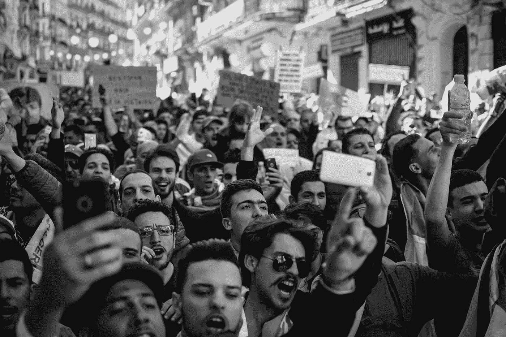
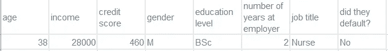

# 我们如何消除人工智能算法中的偏见？钢笔测试宣言

> 原文：<https://towardsdatascience.com/how-can-we-eliminate-bias-from-ai-algorithms-the-pen-testing-manifesto-4b09974e8378?source=collection_archive---------46----------------------->

## 苹果、高盛和威斯康星州立大学被指控使用有偏见的人工智能。我们能保证人工智能没有偏见、种族主义和成见吗？

图像来源:[像素](https://www.pexels.com/photo/crowd-of-people-black-and-white-photo-2246258/)

# 信用评分 AI 中的性别偏见？

几个月前，美国的许多苹果卡用户报告说，尽管他们和他们的伴侣拥有相同的收入和信用评分，但他们的品牌信用卡却被分配了非常不同的信用额度(见 [BBC 文章](https://www.bbc.com/news/business-50365609))。苹果公司的联合创始人史蒂夫·沃兹尼亚克在推特上写道，他的信用卡信用额度是他妻子的十倍，尽管这对夫妇在他们所有其他的信用卡上都有相同的信用额度。

金融服务监管机构纽约金融服务部正在调查用户性别可能是造成差异的原因的指控。苹果热衷于指出高盛对算法负责，这似乎与苹果的营销口号“由苹果创造，而不是银行”不一致。

由于监管机构的调查仍在进行中，还没有证据表明存在偏见，所以我在这篇文章中只是假设性地写了些东西。

# 司法系统使用人工智能的偏见

图片来源:[像素](https://www.pexels.com/photo/hotrod-die-cast-model-on-board-1422673/)

苹果卡的故事并不是最近算法偏差登上头条的唯一例子。去年 7 月，美国全美有色人种协进会(全国有色人种协进会)签署了一份声明，要求暂停使用自动化决策工具，因为其中一些工具被证明在用于预测累犯率——换句话说，预测罪犯再次犯罪的可能性——时存在种族偏见。

2013 年，埃里克·卢米斯被判处六年监禁，此前威斯康星州使用了一个名为 COMPAS 的程序来计算他再次犯罪的几率。COMPAS 是一种专有算法，其内部工作原理只有其供应商才知道。卢米斯试图在威斯康星最高法院挑战该算法的使用，但他的挑战最终被驳回。

不幸的是，诸如此类的事件只会恶化人工智能作为一种危险工具的广泛看法，它不透明，监管不足，能够编码最糟糕的社会偏见。

# 一个人工智能怎么会有偏见、种族歧视或偏见？哪里出了问题？

我将在这里集中讨论贷款申请的例子，因为这是一个比较简单的框架和分析问题，但我提出的观点可以推广到任何类型的偏见和受保护的类别。

我想首先指出，我强烈怀疑苹果或高盛的任何人坐下来制定了一套明确的规则，在贷款决策中考虑性别因素。

首先，让我们想象一下，我们正在创建一个预测一个人拖欠贷款概率的机器学习模型。有一些“受保护的类别”，比如性别，我们不允许歧视。

开发和训练贷款决策人工智能是 Kaggle(一个让你参与数据科学竞赛的网站)上经常出现的那种“香草”数据科学问题，有抱负的数据科学家可以期待在工作面试中被问到。制造机器人信贷员的方法如下:

假设您有一个 10，000 行的大表，都是您的银行过去见过的贷款申请人的信息:

潜在贷款申请人的数据表示例。

最后一列是我们要预测的。

您可以将这些数据分成三组，分别称为定型集、验证集和测试集。

然后，您选择一种机器学习算法，如线性回归、随机森林或神经网络，让它从训练行中“学习”，而不让它看到验证行。然后在验证集上测试它。对不同的算法进行清洗和重复，每次都调整算法，最终部署的模型是在验证行中得分最高的模型。

完成后，您可以在测试数据集上测试您的模型，并检查其性能。

# 删除一列并期望偏见从人工智能中消失的谬论

现在，很明显，如果“性别”列出现在训练数据中，那么就有建立有偏见的模型的风险。

然而，苹果/高盛的数据科学家可能从一开始就将该列从他们的数据集中删除了。

那么，数字货币贷款人怎么还会有性别偏见呢？我们的算法肯定没有性别歧视，对吧？毕竟，它甚至不知道申请人的性别！

不幸的是，与直觉相反的是，偏见仍然有可能蔓延开来！

我们的数据集中可能有代表性别的信息。例如:目前工作的任期，薪水，尤其是职称都可能与我们的申请人是男是女有关。

如果有可能在你的净化数据集上训练一个机器学习模型，以任何准确度预测性别，那么你就在冒你的模型意外带有性别偏见的风险。您的贷款预测模型可以学习使用数据集中关于性别的隐含提示，即使它看不到性别本身。

# 无偏见人工智能宣言

我想对人工智能开发的工作流程提出一个补充:我们应该从不同的角度攻击我们的人工智能，试图在部署它之前发现任何可能的偏差。

仅仅从数据集中删除受保护的类别，掸掉手上的灰尘，然后认为“任务完成”是不够的。

## 人工智能偏向笔测验

当我们开发一个人工智能时，我们也需要唱反调，而不是试图消除偏见的原因，我们应该试图证明偏见的存在。

如果你熟悉网络安全领域，那么你应该听说过笔式测试或渗透测试的概念。一个没有参与开发您的系统的人，可能是一个外部顾问，试图入侵您的系统来发现漏洞。

我建议我们应该引入人工智能笔测试:一种类似于发现和消除人工智能偏差的笔测试:

## 人工智能笔测试会涉及到什么

为了测试人工智能的偏见，外部人员或内部数据科学家(不参与算法开发)将尝试建立一个预测模型来重建被删除的受保护类别。

所以回到贷款的例子，如果你从数据集中删除了性别，测试笔的人会尽最大努力建立一个预测模型把它放回去。如果他们能够以任何程度的准确性重建性别，反映出如果你无意中推出了性别歧视的贷款预测模型，你本来会花在损失控制上的钱，或许你应该给他们奖金。

## 进一步的人工智能偏差压力测试

除了上面的笔测试，我建议进行以下进一步检查:

*   将数据按性别分类。
*   评估每个性别的模型的准确性。
*   识别任何高估或低估任一性别违约概率的趋势。
*   根据性别确定模型准确性的任何差异。

## 进一步措施

我还没有谈到人工智能偏见的一些更明显的原因。例如，训练数据本身可能是有偏差的。在刑事司法系统中使用的一些算法的情况下，这是非常可能的。

# 如果你发现了偏见，该怎么办？

让我们假设你已经发现你训练的算法确实表现出对性别等受保护类别的偏好。减轻这种情况的方法有:

如果 pen-test 显示另一个输入参数(如职位)作为性别的代理，您可以删除它，或者尝试模糊它与性别相关的方面，或者进一步净化数据，直到 pen-tester 无法重建性别。您可以对 pen-test 的结果进行反向工程，以人为改变您的训练数据，直到性别不再可发现。您可以手动纠正模型的内部工作方式来补偿偏差，也可以检查训练表中的偏差。如果你的人工智能从有偏见的数据中学习，那么我们不能期望它是无偏见的。如果你对女性的预测不如男性准确，那么很可能你对男性的训练数据比女性多。在这些情况下，您可以使用数据扩充:复制数据中的每个女性条目，直到您的训练数据集达到平衡。您还可以为代表性不足的类别收集额外的训练数据。你可以试着让你的模型变得可以解释，并找出偏见在哪里蔓延。如果你对机器学习可解释性的更多细节感兴趣，我邀请你也阅读我之前关于[可解释 AI](https://fastdatascience.com/building-explainable-machine-learning-models/) 的帖子。

# 题外话…招聘中的偏见？

我有兴趣进一步研究这种方法的一个应用，就是如果你在招聘中使用机器学习，如何消除偏见。想象一下，你有一个将简历与工作匹配的算法。如果它无意中发现了人们简历中与产假以及性别相对应的空白，我们就面临着歧视性人工智能的风险。我想这可以通过上面的一些建议来弥补，比如调整训练数据和人工消除这种信号。我认为笔式测验将是应对这一挑战的有力工具。

# 公司如何避免偏见再次出现？

如今，大公司非常清楚不良公关传播的可能性。因此，如果 Apple Card 算法确实有偏差，我很惊讶在发货前没有人更彻底地检查算法。

贷款限额因性别而相差 10 倍是一个惊人的错误。

如果参与贷款算法的数据科学家，或者威斯康辛州使用的累犯预测算法，按照我上面的清单对他们的算法进行钢笔测试和压力测试，我想他们会在公关灾难有机会成为头条新闻之前发现它。

当然，事后指责很容易，大工业中的数据科学领域还处于起步阶段。有人会称之为监管不足的西部荒原。

我认为，我们也可以感到高兴的是，医疗保健等一些保守行业尚未在重要决策中采用人工智能。想象一下，如果黑色素瘤分析算法或羊膜穿刺术决策模型被证明有种族偏见，会有什么后果。

出于这个原因，我强烈建议将算法发布到野外以做出重要决策的大公司开始分离出一个数据科学家团队，他们的工作不是开发算法，而是对算法进行笔测试和压力测试。

开发模型的数据科学家承受着太多的时间压力，无法自己完成这项工作，正如网络安全行业通过多年的经验发现的那样，有时最好让外部人员唱反调，试图打破你的系统。

# 参考

[1] S. Natarajan 和 S. Nasiripour，[关于 Apple Card 的病毒推文导致高盛调查](https://www.bloomberg.com/news/articles/2019-11-09/viral-tweet-about-apple-card-leads-to-probe-into-goldman-sachs) (2019)，彭博

[2] [苹果“性别歧视”信用卡被美国监管机构调查](https://www.bbc.com/news/business-50365609) (2019)，BBC

[3] [州诉卢米斯](https://harvardlawreview.org/2017/03/state-v-loomis/) (2017)，《哈佛法律评论》