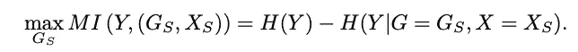

# 如何解释图形神经网络—gnnexplaner

> 原文：<https://towardsdatascience.com/how-can-we-explain-graph-neural-network-5031ea127004?source=collection_archive---------18----------------------->

## PyTorch Geometric 中实现的节点和图形解释的 GNNExplainer 的分步指南。


来源:[马努奇](https://pixabay.com/users/manuchi-1728328/?tab=popular&pagi=3)通过[皮克斯拜](https://pixabay.com/)

图形神经网络(GNN)是一种可以直接应用于图形结构数据的神经网络。我之前的帖子简单介绍了一下 GNN。读者可以通过[这篇文章](https://medium.com/datadriveninvestor/an-introduction-to-graph-neural-network-gnn-for-analysing-structured-data-afce79f4cfdc)了解更多细节。

许多研究工作显示了 GNN 理解图形的能力，但是 GNN 是如何工作的以及为什么工作的对大多数人来说仍然是一个谜。与 CNN 不同，在 CNN 中，我们可以提取每一层的激活来可视化网络的决策，而在 GNN，很难对网络学习了什么功能做出有意义的解释。为什么 GNN 确定一个节点是 A 类而不是 B 类？为什么 GNN 确定一个图形是化学物质还是分子？似乎 GNN 看到了一些有用的结构信息，并根据这些观察做出了决定。但现在的问题是，GNN 看到了什么？

# GNNExplainer 是什么？

本文中[介绍了 GNNExplainer。](https://arxiv.org/abs/1903.03894)

简而言之，它试图建立一个网络来学习 GNN 人所学的东西。

GNNExplainer 的主要原理是减少图中不直接影响决策的冗余信息。为了解释一个图，我们想知道图中影响神经网络决策的关键特征或结构是什么。如果一个特性很重要，那么预测应该通过删除或用其他东西替换这个特性来进行很大程度的修改。另一方面，如果移除或更改某个特征不会影响预测结果，则该特征被视为不重要，因此不应包含在图表的解释中。

## 它是如何工作的？

GNNExplainer 的主要目标是生成一个最小图来解释一个节点或一个图的决策。为了实现这个目标，该问题可以被定义为在计算图中找到一个子图，该子图使用整个计算图和最小图来最小化预测分数的差异。在本文中，这个过程被公式化为最大化最小图 Gs 和计算图 G 之间的互信息(MI ):



此外，还有一个次要目标:图形需要最小化。虽然在第一个目标中也提到了，但是我们也需要一个方法来制定这个目标。该论文通过增加边数的损失来解决这个问题。因此，GNNExplainer 的损失实际上是预测损失和边缘尺寸损失的组合。

## 解释任务

本文讨论了三种类型的解释:一个节点的解释、一类节点的解释和一个图的解释。主要区别在于计算图表。

对于单个节点的解释，计算图是其 k 跳邻居，其中 k 是模型中的卷积数。

对于一类节点的解释，建议选择一个参考节点，用同样的方法计算解释。可以通过取其特征最接近具有相同类别的所有其他节点的平均特征的节点来选择参考节点。

为了解释整个图，计算图成为图中所有节点的计算图的并集。这使得计算图等同于整个输入图。

## **面罩接近**

最小图 Gs 的学习是通过学习用于边的掩码和用于特征的掩码。也就是说，对于计算图中的每个边，在 edge_mask 中存在确定边的重要性的值。同样，对于结点要素中的每个要素，feature_mask 确定该要素对于最终决策是否重要。

## 简短的摘要

有了这些概念，我们可以为 GNNExplainer 总结一切:

1.  我们需要提取计算图，它是节点分类的 k 跳邻居，或者是图分类的整个图。
2.  为计算图中的每条边初始化一个 edge_mask，为每个特征尺寸初始化一个特征 mask。
3.  构建一个神经网络，该网络学习具有上述损失的边缘 _ 掩码和特征 _ 掩码。
4.  使用 edge_mask 和 feature_mask 将计算图形缩减为最小图形。

# 在 Pytorch 中实现 GNNExplainer

这就是我们在实现 GNNExplainer 之前需要知道的一切。综上所述，我们正在尝试学习边 _ 掩码和节点 _ 特征 _ 掩码，它们从计算图中移除一些边和特征，同时最小化预测得分的差异，所得的图是解释节点或图的决策的最小图。

我将在 Pytorch Geometric(PyG)中实现这一点。PyG 的一个很大的优点是它更新非常频繁，并且有许多当前模型的实现。令人惊讶的是，我发现 GNNExplainer 已经在 PyG 库中实现了，这节省了我很多时间。尽管它只适用于节点解释，但由于它是开源的，因此不难将其修改为也适用于图形解释。

## 节点解释器

首先，我们需要安装 PyG。GNNExplainer 目前还没有发布(PyG 1.4.4 ),但是代码已经在 Github 中发布了。所以要获得 GNNExplainer，你必须从他们的 Github 库克隆并从那里安装。

示例代码在 [PyG 网站](https://pytorch-geometric.readthedocs.io/en/latest/modules/nn.html?highlight=gnnexplainer#torch_geometric.nn.models.GNNExplainer)上提供。这很容易理解，所以我不打算在这篇文章中展示代码。但是实现细节是我们想要检查的，并在之后用于图分类。

我将根据我上面的简短总结来追踪代码。示例代码将节点索引以及完整的特征矩阵和边列表传递给 GNNExplainer 模块。

```
explainer = GNNExplainer(model, epochs=200)node_idx = 10node_feat_mask, edge_mask = explainer.explain_node(node_idx, x, edge_index)
```

GNNExplainer 中发生的事情正是我们在上一节中讨论的。

1.  提取计算图

为了解释一个节点，我们首先需要得到它的 k 跳计算图。这是通过PyG 中的 _**_ 子图 __()** 方法完成的。

```
x, edge_index, hard_edge_mask, kwargs = self.__subgraph__(
            node_idx, x, edge_index, **kwargs)
```

hard_edge_mask 移除 k-hop 邻域之外的所有其他边缘。

2.掩码由 **__set_mask__()** 方法初始化，并应用于网络的每一层。

```
self.__set_masks__(x, edge_index) **def** __set_masks__(self, x, edge_index, init="normal"):         
    (N, F), E = x.size(), edge_index.size(1)          
    std = 0.1         
    self.node_feat_mask = torch.nn.Parameter(torch.randn(F) * 0.1)                    std = torch.nn.init.calculate_gain('relu') * sqrt(2.0 / (2 * N))               self.edge_mask = torch.nn.Parameter(torch.randn(E) * std)                  **for** module **in** self.model.modules():             
        **if** isinstance(module, MessagePassing):                          
            module.__explain__ = **True**
            module.__edge_mask__ = self.edge_mask
```

3.使用经过训练的模型执行初始预测，然后将预测用作标签来训练 GNNExplainer。

```
*# Get the initial prediction.*         
**with** torch.no_grad():             
    log_logits = self.model(x=x, edge_index=edge_index, **kwargs) 
    pred_label = log_logits.argmax(dim=-1) # Train GNNExplainer **for** epoch **in** range(1, self.epochs + 1):                  
    optimizer.zero_grad()             
    h = x * self.node_feat_mask.view(1, -1).sigmoid()             
    log_logits = self.model(x=h, edge_index=edge_index, **kwargs)              
    loss = self.__loss__(0, log_logits, pred_label)             
    loss.backward()             
    optimizer.step()
```

4.损失的定义是

```
**def** __loss__(self, node_idx, log_logits, pred_label):         
      loss = -log_logits[node_idx, pred_label[node_idx]]          
      m = self.edge_mask.sigmoid()         
      loss = loss + self.coeffs['edge_size'] * m.sum()         
      ent = -m * torch.log(m + EPS) - (1 - m) * torch.log(1 - m + EPS)         
      loss = loss + self.coeffs['edge_ent'] * ent.mean()          
      m = self.node_feat_mask.sigmoid()         
      loss = loss + self.coeffs['node_feat_size'] * m.sum()         
      ent = -m * torch.log(m + EPS) - (1 - m) * torch.log(1 - m + EPS)         
      loss = loss + self.coeffs['node_feat_ent'] * ent.mean()          **return** loss
```

## 图形解释器

目前的实现是 PyG 只是为了节点解释。但是理解了背后的原理，重新编写图形解释函数就不难了。

我们只需要替换几个函数:1)我们需要替换 __subgraph__ function 来获得整个图的计算图。2)我们需要为整个图形设置遮罩。3)我们需要改变损失函数来计算图的损失。

完整的代码实现可在这个 [Github 链接](https://gist.github.com/hongxuenong/9f7d4ce96352d4313358bc8368801707)获得。

# 结论

GNNExplainer 提供了一个框架来可视化一个 GNN 模型学到了什么。然而，实际的解释结果可能不足以解释一个巨大的图形，因为最佳解释的搜索空间比一个较小的搜索空间大得多。除了拟合神经网络之外，也可以应用其他搜索技术来寻找借用相同概念的最佳解释，并且性能还有待证明。

# 参考:

GNNExplainer:为图形神经网络生成解释，[https://arxiv.org/abs/1903.03894](https://arxiv.org/abs/1903.03894)

Pytorch 几何，[https://pytorch-geometric.readthedocs.io/en/latest/](https://pytorch-geometric.readthedocs.io/en/latest/)