# 我们如何影响幸福？

> 原文：<https://towardsdatascience.com/how-can-we-impact-well-being-b19dd7b5c459?source=collection_archive---------23----------------------->

## 使用机器学习找出从哪里开始

我参加了一个沉浸式数据科学训练营，学习如何更好地利用数据帮助解决 T2 的贫困问题。[这个仪表盘](https://public.tableau.com/profile/anish.malpani#!/vizhome/WellbeingEstimatorDashboardvFinal/WellbeingPredictor)(想不到吧？但只有桌面兼容)是在结合了来自 6 个不同来源的 27 个数据集，并使用 Python、Tableau 和优秀的旧 Excel 建立了一个推理(有时是预测)机器学习模型之后的输出。哒哒！

如果你在社会影响/非营利领域和/或数据领域，这篇文章概述了我是如何(以及为什么)着手做这件事的。这本书很长，而且很有技术含量，但我希望它值得你去读。

如果你说“不，去他妈的！”如果你想看看从中有什么发现，直接跳到最后，看看这个模型的发现和局限性。

> **对于编码人员:** [如果你感兴趣，这里有](https://github.com/anishmalpani/wellbeing)GitHub 链接，包含所有代码、数据和 Tableau 仪表板文件。

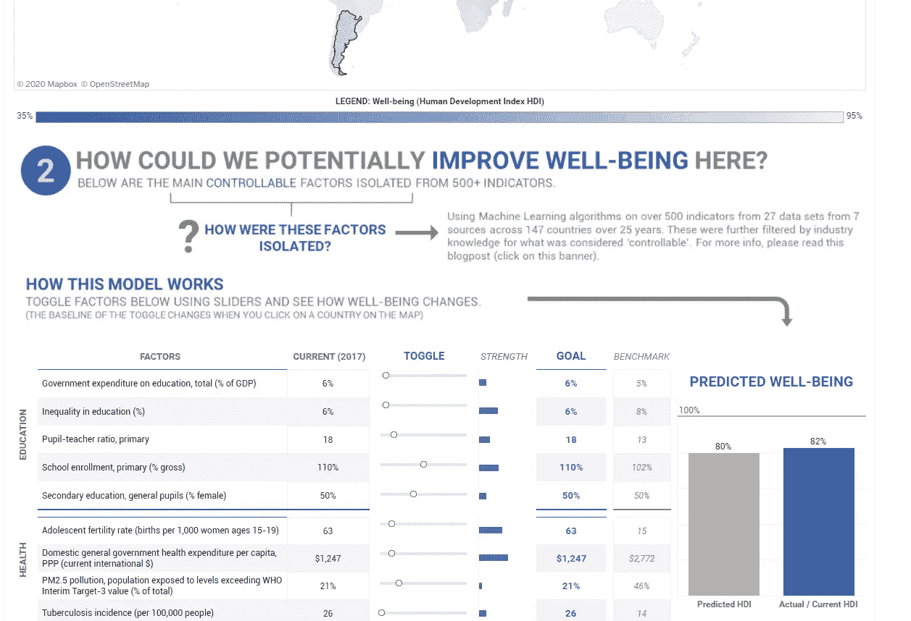

“奇特”仪表板的快照(如果你之前懒得点击链接)——作者截图

## 放弃

如果你真的看了一下仪表板，一些警钟可能已经响起。这是公平的。不，我并没有声称已经通过这个仪表盘解决了贫困问题，远远没有。有许多假设、免责声明和不完善之处吞没了它的一切。这也恰好是影响空间的固有性质——很难定义和衡量“影响”

但这并不意味着我们不能尝试。

## 设置(“为什么”)

我相信，数据是决策的未来。

这种信念驱使我在过去的一年里去伦敦参加了为期三个月的沉浸式数据科学训练营。

我已经，在某种程度上，知道我要做什么——我想专注于解决多维贫困；首先通过我自己的社会企业，然后，如果失败了，通过任何最有意义的方式。

在为非营利组织工作了两年后，我突然意识到，平均而言，impact space 没有足够的技术专长。我记得我工作过的一个组织雇用了一个家伙，给他的电子邮件地址是“fellow3@company.org”。我是“financefellow@company.org”。

我们有很多心脏，但我们没有足够的工程师、数据科学家、财务专家、图形设计师和其他技术人员来有效地运营任何类型的组织。

我不想成为那种陈词滥调。我喜欢数据，如果我要创办一家社会企业，我希望站在最新科技的前沿，而不是落后。

## 问题是

T2 有超过 13 亿人处于多维贫困状态。这个“多维”的东西是什么意思？这就是——贫困的概念有多个层面——健康、教育、生活水平和往往无法衡量的层面——尊严。这不像 T4 极端贫困那么简单，极端贫困是指每天收入低于 1.90 美元的所有人。

我们如何尽快解决这个问题？在过去的几十年里，贫困已经大大减少，但仍有很长的路要走。那么，我们如何加快这一进程呢？

多边组织(联合国、世界银行、国际货币基金组织)、各国政府以及通过有争议的企业社会责任方式(仍然有效)做了很多工作。

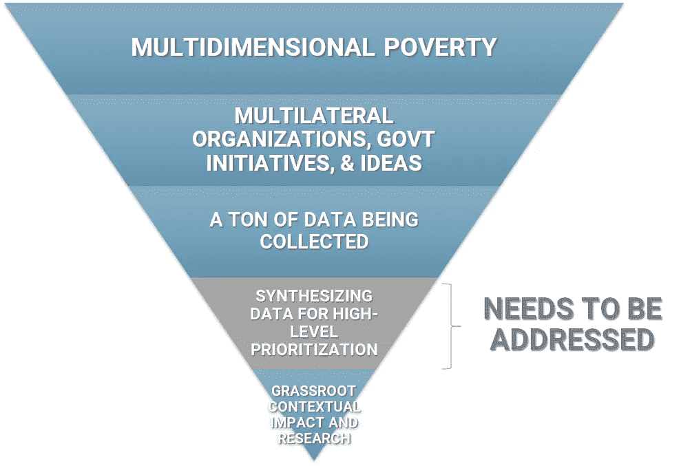

作者图片

这些玩家也在收集大量数据——不一定干净或容易收集，但确实有数据。

不过，我的假设是，这种高水平的全球数据还没有足够的综合。从上面倒过来的蓝色三角形可以看出，这就是需要更多关注的差距。这是连有效利他主义运动都认为是正确的——全球优先研究是影响空间最紧迫的问题之一。

那么，综合所有的全局、宏观数据来看，*哪些* ***可控因素*** *对多维贫困有* ***最高影响*** *？我能使用* ***机器学习*** *在数据瀑布中找到任何* ***有意义的关系吗？***

我运行了一个由影响力领域的关键人物组成的焦点小组的问题陈述，这些人是社会企业家和影响力投资者，他们也参与了这场游戏。他们的本能反应是，“等等，什么？”

人们坚信答案就在实地，而不是隐藏在一些收集不当的全球数据中。我不反对这一点。无论数据显示什么，干预措施在大规模实施之前都需要在当地进行测试，特别是因为大多数时候，生命处于危险之中。

此外，还有研究结果的“可移植性”——仅仅因为它在过去或在肯尼亚有效，并不意味着它在今天或在印度也会有效。我并不反对这些。

*但如果这个“收集不良”的全球数据给了我们* ***起点*** *呢？如果他们给我们比直觉或轶事证据更好的假设来测试呢？我们能否利用机器的力量告诉我们一些大脑无法进行物理计算的事情？*

## 这个想法

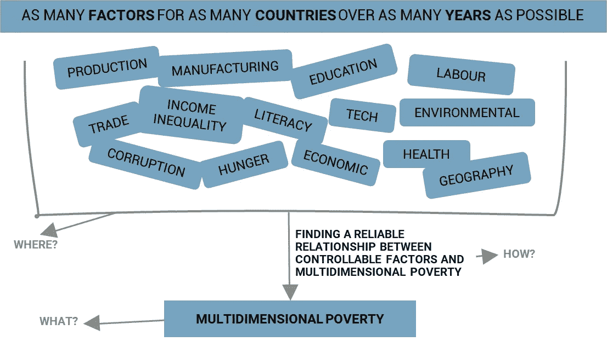

作者图片

因此，我的想法是尽可能多地收集尽可能多国家的宏观数据，使用回归模型(机器学习)分离出 10-15 个最有效的因素/指标，看看我是否可以再次使用机器学习在这些分离的因素和多维贫困之间建立推理关系(见上图)。然后，当我有了这种关系，创建一个实际上可以被非技术用户使用的仪表板。

听起来很直接，对吧？理论上也许是，但我必须弄清楚很多:

A) **多维贫困的目标变量是什么。我预测/试图理解的度量标准是什么？
B)**我可以在哪里找到影响这个贫困指标的所有因素或数据(以及当我找到它时如何合并和清理它)。
C) **如何**找到这些可控因素与多维贫困之间的可靠关系。以及如何把所有这些都放到一个漂亮的可用仪表盘上。****

## **a)决定多维贫困的衡量标准**

**联合国开发计划署有一个多维贫困指数，称为多维贫困指数。你以为我会用这个，对吗？是的，那是计划。但是没有足够的相关年份的数据，没有足够的覆盖国家，计算起来也很复杂[。算了吧。](http://hdr.undp.org/sites/default/files/hdr2019_technical_notes.pdf)**

**我可以用[极端贫困](https://en.wikipedia.org/wiki/Extreme_poverty)——它很容易得到，有很多数据点，但它是一维的，与我所代表的一切都背道而驰。把那个也划掉。**

**然后我看到了[人类发展指数](http://hdr.undp.org/en/content/human-development-index-hdi) (HDI)，有种耶稣回来了的感觉。它是多维的，因为它考虑了教育、医疗保健和收入(非常接近 MPI)，有许多数据点与它相关联，跨越许多年和国家，并且它相当容易计算。是的，它没有具体衡量贫困，但它确实衡量了幸福，是的，它不是一个完美的衡量标准，但让完美不要成为好的敌人。**

**哒哒！有时候你需要的只是一点合理化。**

## **b)找到数据(并清理数据)**

**接下来，我不得不从万维网上搜集数据。我找到了来源。我不得不在某个时候停下来，因为这个数据收集的过程可能是无止境的。最后，我从 6 个不同的来源收集了 27 个数据集的数据，这些数据跨越了 147 个国家 59 年的时间，包含了大约 800 个因素/特征/指标。**

> ****对于 Python 编码人员:**有一个很酷的[世界银行数据包装器](https://github.com/OliverSherouse/wbdata)，你可以用它在 Python 本身中进行大量数据提取。另外，你可以在这里找到我收集、清理和合并的所有数据，以及代码(Jupyter 的笔记本叫做“A —合并数据”)。**

**我知道这听起来令人印象深刻，但其中也有许多垃圾——许多(许多)空值、许多偏差、重复因子和高度相关(彼此密切相关)的因子。所有数据科学家都知道，所有这些都需要处理。这并不总是一个有趣的过程，但它非常重要。**

**我使用 Python 和 Excel 来清理和合并数据——这并不难。然而，空值是我的数据集中的毒瘤。**

**在合并和清理(某种程度上)数据之后，它看起来是这样的:**

**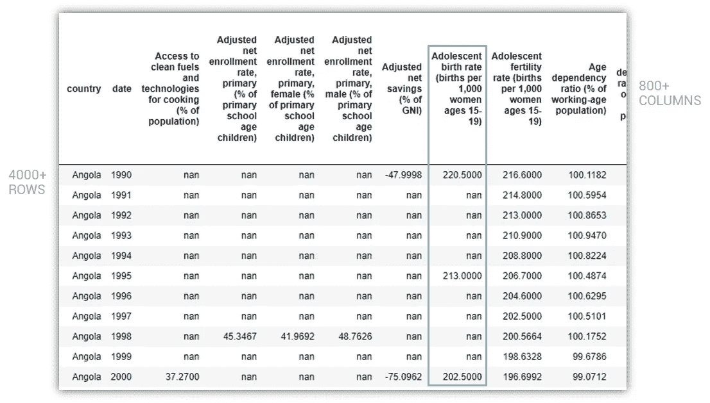**

**作者截图**

**它有超过 800 列和 4000 行，但是正如你所看到的，也有很多空值。空值的问题是，如果任何行或列有空值，它对机器学习不友好。您要么删除空值(并希望留下足够的数据)，要么尝试智能地填充它。**

**我的数据集中有太多的空值，如果我删除所有的空值，我将丢失所有的行和列，也就是所有的数据。那可不行。**

**所以为了给我的项目带来希望，我必须用一些逻辑来估算值。感谢上帝有了机器学习。我利用机器的力量，根据每个国家可用的其他信息，为那些该死的空值生成近似值。这是一个相当复杂的过程，但这是插补过程后上述相同样本的样子:**

**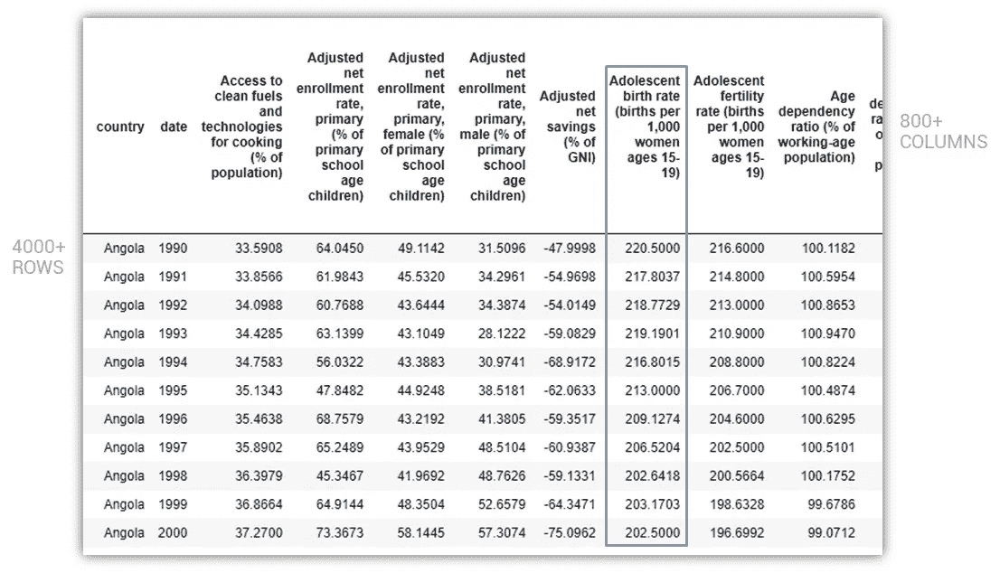**

**作者截图**

**现在你可能在想，“等等，什么？你刚刚凭空创造了数据吗？而你要用这些假数据来解决贫困？”**

**是的，这肯定是一个危险信号，但是有一个解决方法。只要我们使用真实数据来衡量我们的机器学习模型的准确性(即作为“测试”集)，我们就可以减轻估算数据导致我们偏离的风险。我们会继续讨论这个问题。**

> ****对于 Python 程序员:** Sklearn 有一个令人难以置信的迭代估算器，它仍处于实验阶段，但就我的意图和目的而言，它工作得完美无缺。估算器的 sklearn 文档可以在[这里](https://scikit-learn.org/stable/modules/generated/sklearn.impute.IterativeImputer.html#sklearn.impute.IterativeImputer))找到，你可以在我的 Github [这里](https://github.com/anishmalpani/wellbeing)看到我是如何使用它的(在 Jupyter 笔记本“B-输入缺失值”中)。在估算过程中，我必须提取 147 个国家的数据，并估算每个国家的值。上面的文件还包含了与该过程相关的所有函数。**

**在清理、合并、估算和丢弃空值(甚至不可估算)之后，我的最终数据集是一个整洁的 1，353 行 x 513 列，跨越 46 个国家 28 年，有 500 多个因子/特征。**

## **c)分离出主要因素，并找到与幸福的最佳关系(模型)**

**现在我们有了数据，是时候进入数据科学的核心了。该过程的第一部分是分离出前 10-15 个因素。为什么？因为如果我要为非编码用户构建一个仪表板，它不可能有 500 个要切换的因素。这可能会让用户精神错乱，但更重要的是，远离我的仪表盘。所以我不得不减少这些因素。怎么会？**

**我用来筛选这些因素的标准有三点:**

1.  ****影响力**(如果这是一个词的话):这些因素与幸福感的相关性有多强。例如，腐败与幸福更相关(相反)还是与失业更相关？我使用机器学习算法对每个因素的影响进行排序。**
2.  **可控性:企业家或个人能在合理的范围内影响这个因素吗？我没有使用任何花哨的数据科学，只是我的直觉。魔法也有其局限性。**
3.  ****不相关**:这些因素可能 ***而不是*** 与 HDI(幸福指数)和其他因素密切相关。因为如果他们是，那就太容易作弊了。**

**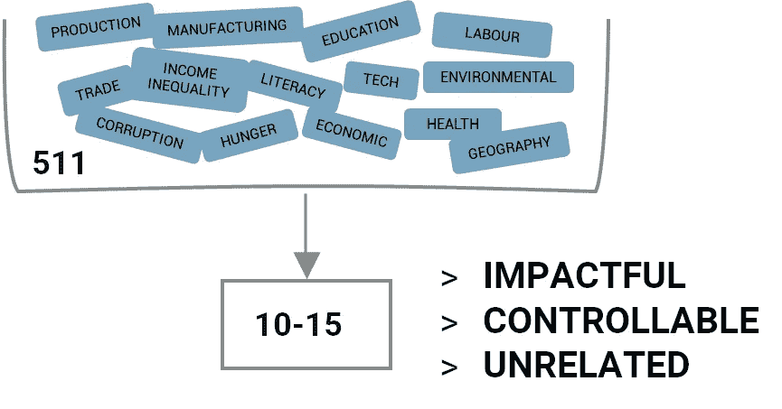**

**作者图片**

> ****对于 Python 编码人员:**为了提取因素的影响，我被限制使用那些推理性的 ML 算法，即那些给我系数或特征重要性的算法。所以我不能使用神经网络或 KNN，但我运行了一系列推理回归器——套索、脊、弹性网、决策树(用 AdaBoost 堆积)和支持向量机。**
> 
> **我的目标变量是 HDI，我的 X(预测矩阵)包含了数据集中所有的 511 个因素。我的测试集主要由真实值(非估算值)组成，这降低了估算数据污染模型的风险。**
> 
> **在运行了所有的模型之后，最好的模型碰巧是 LassoCV(这种情况经常发生),它在测试集上给了我 0.94 的 R2 分数和 0.98 的分数。因为我使用的是年度数据，所以我也运行了时间序列交叉验证，这给了我 0.97 的测试分数。所以，总的来说，模型看起来不错。**
> 
> **你可以在我的 Github 项目页面[这里](https://github.com/anishmalpani/wellbeing)找到这个(在 Jupyter 笔记本“C-挑选预测器&最终模型”里)。**

**这是一个超级迭代的过程。我运行了许多机器学习模型，每一次，它们都会出现一两个新的因素，要么与人类发展指数的组成部分高度相关(例如，GDP 与用于计算人类发展指数的人均国民总收入高度相关)，要么是**而不是**必然可控的东西(不确定一个企业家如何能够改变大片土地，除非你是迪拜，并且[能够建造岛屿](https://en.wikipedia.org/wiki/Palm_Islands))。所以，我不得不放弃这些因素，再次运行模型。再一次。再一次。**

**另一个问题是，10-15 个因素太少了，所以最终，经过一场木兰式的大规模斗争，我陷入了一个黑洞，有一段时间，我将 511 个因素缩小到以下 19 个因素，这些因素在某种程度上符合我之前强调的标准:**

**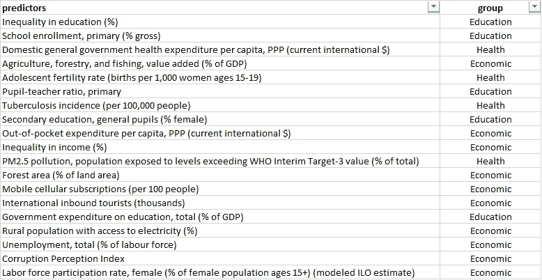**

**作者截图**

**这些因素/预测因素绝不是完美的，您可以根据自己的喜好插入和使用其他因素，但对于这个练习，这些因素似乎是可行的。**

****好了，现在进入这一步的第 2 部分——使用这 19 个独立因素建立最终模型。****

**正如你现在所知道的，我们正试图使用人类发展指数(HDI)作为我们的目标变量来预测福祉。理解 HDI 是如何计算的很重要。**

**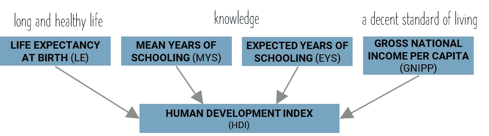**

**作者图片**

**人类发展指数由四个组成指标组成——出生时预期寿命、平均受教育年限、预期受教育年限和人均国民总收入。有一些稍微复杂的公式用于获取这些组件指标并计算 HDI，我们非常欢迎您通过访问[这里](http://hdr.undp.org/sites/default/files/hdr2019_technical_notes.pdf)来探索这些公式。**

**我们的目标是预测这些指标，然后用这些预测来计算人类发展指数。这将是构建具有孤立(“顶部”)因素的最终模型的基础。它将为每一个将与人类发展指数挂钩的组成指标纳入 4 个微型模型。大概是这样的:**

**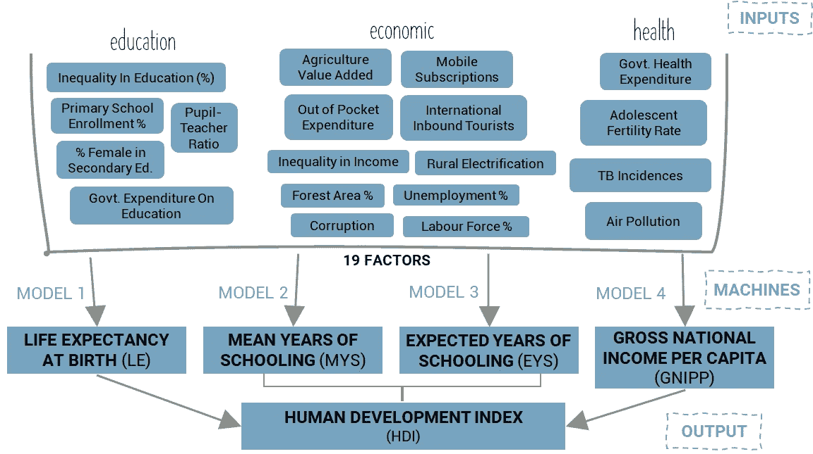**

**作者图片**

**是时候做模特了！**

> ****对于 Python 程序员:**这里的护栏是我只能使用一种类型的机器学习算法。这是因为无论我得到什么输出，我都必须能够将其导出到 Tableau 中，以便能够创建一个交互式仪表板。因为我没有[的 Tableau 服务器](https://www.tableau.com/en-in/products/server)，我用的是[的 Tableau Public](https://public.tableau.com/en-us/s/) (免费！！)为了构建 dash，我不能使用 [TabPy](https://github.com/tableau/TabPy) (一个允许你动态运行 Python 代码并在 Tableau 中显示可视化效果的库/工具)。TabPy(在撰写本文时)只适用于 Tableau 服务器，价格为$$$。这基本上意味着我只能使用线性回归模型，因为线性回归给了我一个方程。一旦我有了这个方程的系数和截距，我就可以将它们导出到一个 CSV 中，并使用它在 Tableau 中构建相同的线性回归方程。是的，这是复杂的，是的，我希望塔比与 Tableau 公共工作。**
> 
> **但你不会放弃，你会适应。**

**对于那些不熟悉机器学习的人来说，一个用于评估机器学习模型/算法的常见度量标准被称为 [R 平方](https://www.investopedia.com/terms/r/r-squared.asp) (R2)。你可以随意阅读更多的相关内容，但是在这篇文章中你需要知道的是，R2 1 分意味着这个模型是完美的，0 分意味着它很糟糕。**所以我们希望 R2 分数接近 1** 。**

**在构建、调整和优化机器学习模型之后，我的模型的最终得分如下:**

**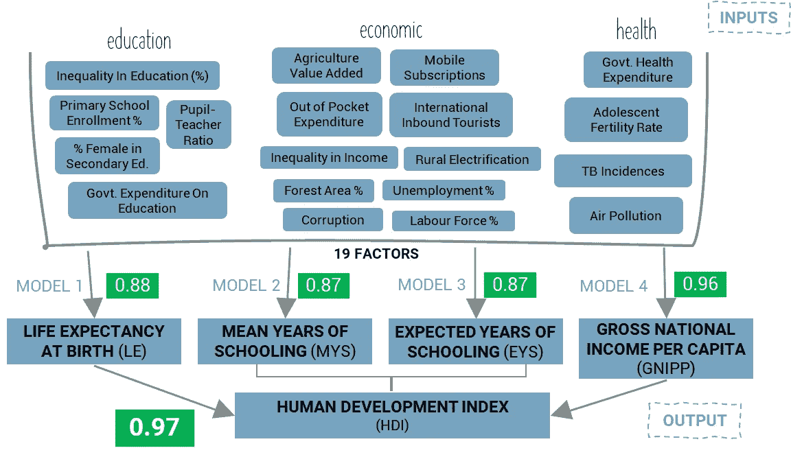**

**作者图片**

**健康的模特，对吧？呜哇！**

**如果你想知道为什么组件模型的分数比人类发展指数的最终分数低，那是因为这些组件被用来计算其他指数，然后这些指数被加权来计算人类发展指数，在整个过程中，我们的模型在抽象后表现相当好。**

> ****对于 Python 编码者:**上面绿色的分数代表只包含真值(非估算值)的测试集的分数。这样做是为了降低在我的训练数据中使用估算值的风险。**
> 
> **对于四个组成模型(预期寿命、平均受教育年限、预期受教育年限和人均国民总收入)，我再次使用了 LassoCV。我使用 GridSearch 进一步优化了这些模型。我不得不减少一些因素/特征的偏斜度，通过记录高度偏斜的因素来做到这一点。如果因子的偏斜度大于 1，那么它们就是“高度偏斜的”。**
> 
> **一旦调整了四个模型，我就用它们的预测按照开发计划署的公式计算人类发展指数。然后，我将计算出的人类发展指数数据与实际的人类发展指数数据进行对比，结果显示我的 R2 得分为 0.97。总的来说，分数相当不错。**
> 
> **你可以在我的 GitHub 项目页面[这里](https://github.com/anishmalpani/wellbeing)找到更多细节(在 Jupyter 笔记本“C-挑选预测器&最终模型”中)**

**模型建立了。分数不错。现在是时候把这个模型输出到一个*花哨的*画面中了。**

## **d)将所有内容融入 Tableau，构建一个交互式仪表盘**

**这个仪表板的目标是将机器学习的能力放到一个并不真正知道如何编码的用户手中。如果我能给我的目标受众一个使用起来有些直观的 dash，我构建的机器学习模型将更具可扩展性。**

**那么谁是我的目标受众呢？主要是社会企业家，其他在影响力领域工作的人是次要的。**

****这对他们有什么用？也许这能给我的目标受众一个工具，让他们了解不同的可控因素是如何影响幸福的。例如，如果他们减少了 5%的腐败，对福利的大致影响是什么？或者，如果他们将农村电气化提高到 100%，他们所选择的国家的福祉会发生怎样的变化？所有这些都将基于跨越 28 年、涵盖 122 个国家*的所有类型的数据，并且将由使用机器学习计算的关系来驱动，这是人类无法在大脑中(或手动或在 Excel 中)完成的。****

**显然，这不是一段完美的关系。但正如我前面提到的，这是他们可以用来作为当地基层研究的起点的东西。这就是我打算如何使用它。**

**在 Tableau 中制作性感的仪表盘相对容易，因为它是一个点击式软件。但是，正因为如此，它也相当严格。因为我使用的是免费的公开版本的软件，所以我能做多少有趣的东西受到了一些限制。**

**本质上，我必须将机器学习模型从 Python 导出到 Tableau 中可消化的格式。我还必须以这样一种方式构建仪表板，即我可以从用户那里获取信息(或输入)。我想给用户开关，他们可以切换，并立即看到如何改变一个因素会影响福祉。**

**经过大量的努力，这是[的最终输出](https://public.tableau.com/profile/anish.malpani#!/vizhome/WellbeingEstimatorDashboardvFinal/WellbeingPredictor)(你可能一开始就点击了，也可能没有点击，如果你在手机上，肯定没有，因为它只在桌面上有效)。如果你已经看到了这篇文章，我希望你能看看，如果你有任何想法，请不要犹豫，分享出来。它并不完美，有点笨拙，但可能有用。如果是(或者不是)，让我知道(或者不知道)。**

**我自学了 Tableau 如果你愿意花时间，这并不太难。YouTube 上有很多有用的视频，Tableau 自己也有一堆[培训材料](https://www.tableau.com/learn/training/20194)，这可能是一个很好的开始。你可以在 GitHub 项目页面的[上找到我使用的 working Tableau dashboard 文件。](https://github.com/anishmalpani/wellbeing)**

> ****对于 Python 编码者/ Tableau 专家:**前面说过，我受到了 Tableau Public 的限制。如果我有 Tableau Server，我可以使用[tabby](https://github.com/tableau/TabPy)并利用更复杂的模型。不过最后，我的分数相当不错，所以我并不大惊小怪。的。dash 的 twbx 文件在本项目的 [GitHub 页面](https://github.com/anishmalpani/wellbeing)上。尽情享受吧！**

## **调查的结果**

**我即将成为一名社会企业家。所以我差不多是这个仪表板的目标受众。我学到了很多。这可能看起来有点争议，但是你必须意识到这并不完美；它应该仅仅是为了缩小进一步的地方、基层研究的起点。**

1.  ****农村电气化可能改变游戏规则**。根据这个模型，它似乎对幸福有最大的影响。对印度来说，如果我们将农村电气化从 77%提高到 100%，我们可以看到整体福利增加两个百分点。**
2.  **政府需要在医疗保健上投入更多。这也与幸福感密切相关。对印度来说，如果我们将政府人均医疗支出增加两倍，我们的福祉将提高两个百分点。这看起来很小，但目前印度在人口上的人均支出很少(约 61 美元)，而大多数高收入国家的人均支出超过 2500 美元。**
3.  ****青春期女性(15-19 岁)的高生育率对幸福有很大的负面影响。**这似乎是显而易见的，也是意料之中的，对幸福有着很高的重要性。减少少女怀孕很重要。**
4.  ****我们需要减少对农业的关注。根据模型，农业、林业和渔业增加值的*增加*可能导致福利的*减少*。这似乎有点争议，但它凸显了世界正从一个农业社会转向一个更加以服务为基础的社会。****
5.  ****小学入学率不足和教育不平等是真正的福祉障碍**。这并不奇怪，教育就是一切——只不过这需要一代人或更多的时间来影响变化。**
6.  **依靠政府投资教育可能不是解决问题的办法。再次，有点争议，但似乎政府在教育上的支出与福祉成反比。请注意，根据模型，它是 ***而不是*** 一个重要的预测因素，因此它总体上不会对幸福感产生太大影响。**
7.  **失业、劳动力参与率和收入不平等对幸福的贡献可能没有我想象的那么大。根据模型，这些对幸福感没有太大影响。这对我来说有点令人震惊，因为这是我想要关注的。我需要重新考虑解决失业和创造就业的影响到底有多大。**

## **限制**

**正如我在这篇文章中反复提到的，这无论如何都不是一个完美的模型，如果有什么不同的话，它应该作为一个起点。很抱歉打破了记录，但重要的是不要从这个模型中得出结论。原因如下:**

1.  **该模型目前可以概括不同国家和日期的情况，可以用更复杂的模型进行改进(想想[贝叶斯多元时间序列](https://www.groundai.com/project/multivariate-bayesian-structural-time-series-model/1))。按照这些思路，这种模式可能会遭遇[辛普森悖论](https://en.wikipedia.org/wiki/Simpson%27s_paradox)，这基本上意味着对所有国家都适用的可能对某个特定国家不适用。**
2.  **其他因素(被隔离的 19 个因素之外)可以被用来建立具有相似(但不一定相同)精确度水平的模型。**
3.  **人类发展指数不是衡量福祉的防弹指标。围绕它的一些组成部分的有用性，如受教育年限和预期寿命，已经有了相互矛盾的发现。**

## ****下一步****

**还记得这个倒三角形吗？**

**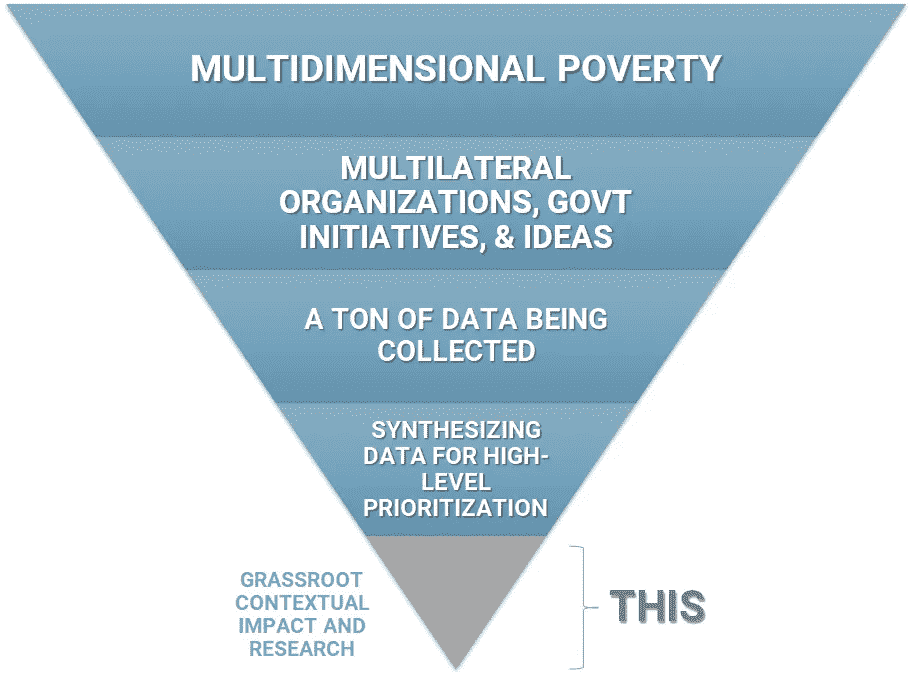**

**作者图片**

**我觉得我已经花了相当多的时间在“综合数据以进行高层次的优先排序”上。我现在需要用我从这个练习中学到的东西来思考我将如何在印度做基层研究。**

**在印度和世界各地已经有很多这样的事情发生了。这种本地方法可以说是最有用和最有影响力的，尤其是在涉及到深刻而持久的变革时。像 [J-PAL](https://www.povertyactionlab.org/) 、 [IPA](https://www.poverty-action.org/) 和 [Evidence Action](https://www.evidenceaction.org/) 这样的公司正在进行一些令人难以置信的随机对照试验，这些试验正在改变我们在地方层面做出积极改变的方式。许多草根非营利组织([赤脚大学](https://www.barefootcollege.org/)、 [GiveDirectly](https://www.givedirectly.org/) )也在直接改善当地的生计。我必须特别向[我们的数据世界](https://ourworldindata.org/)大声疾呼——他们正在做令人难以置信的事情，综合宏观层面上可用的数据。**

**所以我现在在印度，试图处理这一切。不打算说谎，我有点被过去两年里我所阅读的所有信息、经历和书籍所淹没。这其中最严重的部分是危险的(但也是重要的)愿望，那就是尽可能地把事情做好，而不要把自己想死。**

**我需要看看农村电气化是否像模型宣称的那样有影响力。我需要重新评估创造就业和改善劳动力的重要性。如何扭转浪费？它甚至不在模型中，但随着消费主义的增长，浪费也在增加，循环经济的整个困境可能开始变得更有意义。或者不是。**

**不确定性并不好玩，尤其是当你知道现在不确定性很重要的时候。**

**一个 poco 一个 Poco。**

**谢谢你一路读到这里。说真的。把你的电子邮件发给我，我会想办法给你寄一瓶啤酒。但是可能会有测验来过滤掉那些刚刚滚动到末尾的内容。等等，让我建立一个 ML 模型来解决这个问题。机器来了。**

********* *将因子从 511 浓缩到 19 后，我有了更多的可用数据，这些数据不必通过删除空值来排除，因为使用的列更少了。***