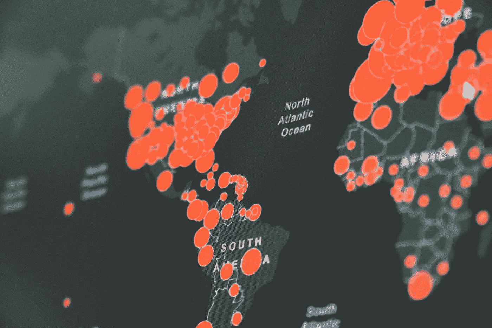
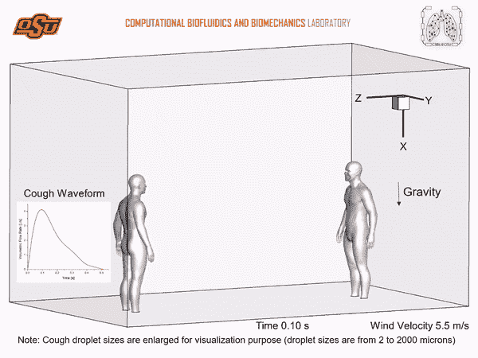
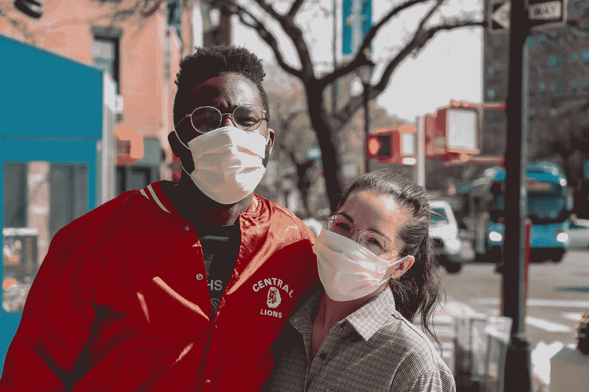
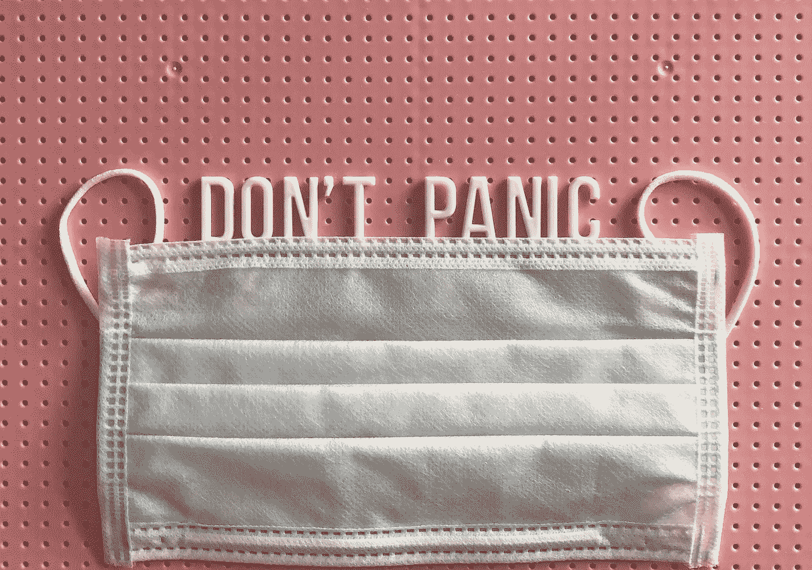

# 我们如何利用计算机视觉来强化戴口罩的建议？

> 原文：<https://towardsdatascience.com/how-can-we-reinforce-mask-wearing-recommendations-using-computer-vision-3557a8881dbc?source=collection_archive---------64----------------------->

## 戴口罩是保护每个人免受冠状病毒感染的最有效和最基本的方法。

活在近代史的历史性时刻难道不应该很牛逼吗？！哦…对了。这是一个疫情。

马丁·桑切斯在 [Unsplash](https://unsplash.com/s/photos/pandemic?utm_source=unsplash&utm_medium=referral&utm_content=creditCopyText) 上的照片

我和欧正生活在一个历史性的时刻，2020 年将作为永远改变世界的 2020 年事件而被载入史册。我们这一代是现代瘟疫的一部分，这种瘟疫可能是因为我们撕裂了这个星球而产生的，也可能是在实验室里被设计出来的，也可能只是错误的穿山甲遇到了错误的猪，让我们称之为信仰。你可以自由选择相信什么，但是有一个事实不容置疑:你所知道的生活将会改变很多。冠状病毒也被称为新型冠状病毒病毒，它会留在我们的经济、我们的习惯、我们的恐惧和空气中(？).

但是，嘿，并不是一切都是坏的！有好消息！还记得另一次疫情事件吗？每个人都在谈论“西班牙流感”或“1918 年疫情流感”，那次事件导致大约 5 亿人死亡。从技术上来说，我们要先进得多，我们有人工智能，更快的通讯，社交媒体，更好的理解突破，抗生素，当然还有能力制造疫苗并在世界各地传播，以根除病毒，就像我们对其他病毒所做的那样。

照片由 [Unsplash](https://unsplash.com/?utm_source=unsplash&utm_medium=referral&utm_content=creditCopyText) 上的[融合医学动画](https://unsplash.com/@fusion_medical_animation?utm_source=unsplash&utm_medium=referral&utm_content=creditCopyText)拍摄

问题是制造疫苗需要很多时间，一旦临床试验表明疫苗有效，大量生产可能需要大约四年时间。这个时间表包括设计、建造、认证和许可生产设施，然后生产足够数量的疫苗上市。

现在，4 年对于“恢复正常”来说听起来是一段很长的时间，这就是为什么人们在谈论#新正常或#次正常的意思，你可以继续你的生活或业务，但需要一些考虑或措施，如**社交距离、手部卫生和使用口罩**。这些措施中的一些甚至不是一个建议，它们已经成为法律，并且有一个很好的理由，它们可以帮助减缓传染病并拯救成千上万的人。

# 但是为什么用口罩遮住脸如此重要呢？

一旦有人被感染，病毒颗粒就会悬浮在我们肺部、口腔和鼻子的体液中。然后，当受感染的人咳嗽时，他们可以将充满病毒的微小水滴喷到空气中。

已经发现 Sars-CoV-2 病毒在这些液滴中存活至少三个小时。但其他非官方研究表明，Sars-CoV-2 病毒在悬浮于气溶胶液滴中超过 16 小时后仍具有传染性。研究发现，与他们研究的其他类似冠状病毒相比，这种病毒“在气溶胶形式下具有显著的弹性”。

此外，研究表明，6 英尺的社交距离政策是不够的，如果即使有微风(约 2 英里/小时)，咳嗽产生的飞沫也可以传播到 6 英尺以外。

[https://news . okstate . edu/articles/communication s/2020/OSU-研究人员-检查-社交-距离-模型-鼓励-谨慎. html](https://news.okstate.edu/articles/communications/2020/osu-researchers-examine-social-distancing-models-encourage-caution.html)

那么我们如何实施其中的一些建议呢？我坚信人工智能可以成为实施这些措施的关键因素，特别是计算机视觉可以用来有效地识别风险。

什么是计算机视觉？它是如何工作的？我喜欢这个定义:

> “计算机视觉是人工智能的一个领域，它训练计算机解释和理解视觉世界。使用来自相机和视频的数字图像以及深度学习模型，机器可以准确地识别和分类物体……”

基本上，你使用图像和视频数据来教计算机检测和识别感兴趣的对象。例如，教一个系统识别一个人是否戴着面具。

照片由[朱利安万](https://unsplash.com/@julianwan?utm_source=unsplash&utm_medium=referral&utm_content=creditCopyText)在 [Unsplash](https://unsplash.com/s/photos/face-mask?utm_source=unsplash&utm_medium=referral&utm_content=creditCopyText) 拍摄

我认为我们可以使用这种经过训练的计算机视觉模型来监控街道，超市和公共交通，公园检测谁戴着口罩，谁没有戴，识别风险并绘制可能是潜在感染焦点的区域。让我们看看它看起来如何像一个被训练来识别“戴面具”的模特:

我认为这个用例有几个方面需要检查:

(任一)战术:一旦发现风险就采取行动，就像未蒙面的访客。例如，商场、超市、学校、办公楼等的入口。可以被摄像机 24/7 全天候监视，寻找对其他人有危险的不戴口罩的人。

(或)战略性的，意思是获取尽可能多的信息，并绘制出需要部署更强控制、通信和更有效执行的高风险区域。通过生成决策数据，政府和私人组织能够优化控制、节省资金，并为人们提供更安全的环境。

托尼克在 [Unsplash](https://unsplash.com/s/photos/face-mask?utm_source=unsplash&utm_medium=referral&utm_content=creditCopyText) 上拍摄的照片

“强制戴口罩”似乎是一个简单的策略，但每个不戴口罩的人都是他人的负担，我们必须明白，这样做是在拯救生命**。**

我相信这场战斗中一个非常强大的盟友当然是人工智能和技术，世界各地的人们都在帮助应用程序、网站、分析模型和难以置信的用例，因为最终我们都在一起。 **#StayHome #StaySafe**

# 参考资料:

 [## 何时以及如何使用口罩

### 本文件提供了在社区、家庭护理和卫生保健环境中使用口罩的建议…

www.who.int](https://www.who.int/emergencies/diseases/novel-coronavirus-2019/advice-for-public/when-and-how-to-use-masks)  [## 计算机视觉:它是什么以及它为什么重要

### 计算机视觉是如何工作的，为什么它很重要？在许多情况下，机器可以更多地解释图像和视频…

www.sas.com](https://www.sas.com/en_us/insights/analytics/computer-vision.html)  [## 为什么我们都应该戴口罩

### 口罩是疫情时代的象征——一个潜在的微小的、看不见的病毒敌人的视觉隐喻…

www.bbc.com](https://www.bbc.com/future/article/20200504-coronavirus-what-is-the-best-kind-of-face-mask)  [## OSU 研究人员检验社会距离模型，鼓励谨慎——俄克拉荷马州立大学

### OSU 研究人员检查社会距离模型，鼓励谨慎疾控中心建议人们保持六英尺的距离…

news.okstate.edu](https://news.okstate.edu/articles/communications/2020/osu-researchers-examine-social-distancing-models-encourage-caution.html) 

# 更多演示:

 [## 安德烈斯·比利亚·里瓦斯在 LinkedIn 上:#周末#演示#covid19 | 20 条评论

### Otro #周末#家庭演示！我们的吉祥物是一种流行于法国的吉祥物…

www.linkedin.com](https://www.linkedin.com/posts/andresvilla_weekend-demo-covid19-activity-6660928867659771904-7GbJ)  [## 安德烈斯·维拉·里瓦斯在 LinkedIn 上:#homeoffice #weekend #demo | 24 条评论

### 欢迎#homeoffice 在您的#周末#演示中完成工作！！:D·阿奎瓦拉斯·科莫…

www.linkedin.com](https://www.linkedin.com/posts/andresvilla_homeoffice-weekend-demo-activity-6658080161705062400-pVt3) 

***编者按:*** [*走向数据科学*](http://towardsdatascience.com/) *是一份以数据科学和机器学习研究为主的中型刊物。我们不是健康专家或流行病学家，本文的观点不应被解释为专业建议。想了解更多关于疫情冠状病毒的信息，可以点击* [*这里*](https://www.who.int/emergencies/diseases/novel-coronavirus-2019/situation-reports) *。*