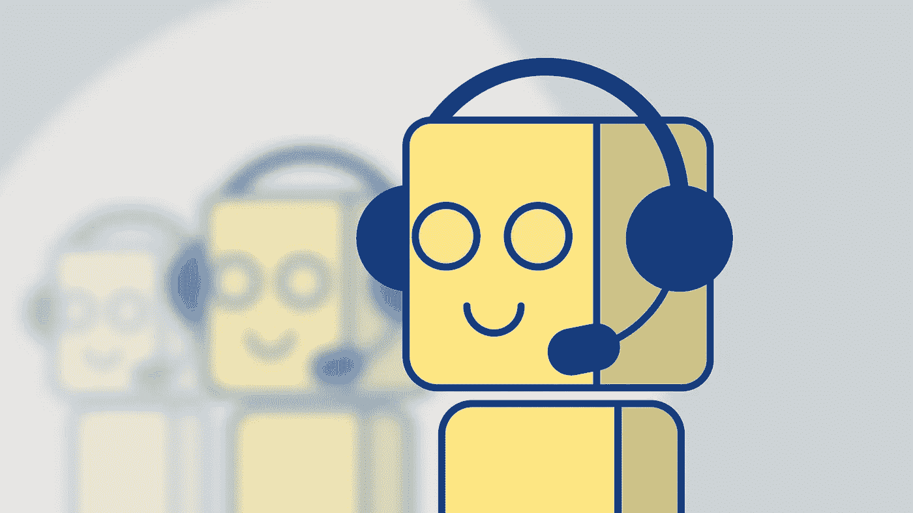

# 聊天机器人如何被用来改善任何业务

> 原文：<https://towardsdatascience.com/how-chatbots-can-be-used-to-improve-any-business-f7f3a1ebcbba?source=collection_archive---------24----------------------->

## 让它们运行得更顺畅、更高效

[https://images.app.goo.gl/Gy5EkKpHp9egJcUV9](https://images.app.goo.gl/Gy5EkKpHp9egJcUV9)

> 聊天机器人代表了人们获取信息、做出决策和交流的新趋势。—克里斯蒂·皮茨，威瑞森风险投资公司

我们都曾访问过这样的网站，在它的右上角会弹出一个小框，询问我们有什么可以帮到你的。这个小盒子是一个聊天窗口，旨在回答你白天或晚上可能有的任何问题。

它们旨在帮助客户不必等待与真人交谈。你输入你的问题，几秒钟后答案就出来了。

聊天机器人最大的好处之一就是它们可以全天候在线。顾客永远不需要等一个人吃完午饭或去洗手间回来。这为消费者提供了即时的满足感，并会让他们再次光顾。

聊天机器人可以用于许多方面来改善任何企业，无论是大企业还是小企业，除了客户服务之外，还可以用于其他方面。我们将在本文中讨论其中一些，但首先我们将提供一个什么是聊天机器人的快速定义。

# 什么是聊天机器人？

聊天机器人是一种计算机程序，它可以与人交流，并自动处理收到的信息。它们可以被编程为每次都以相同的方式响应，或者可以根据情况调整它们的响应。

他们利用短信、网站聊天窗口以及 Twitter 和脸书等社交媒体信息平台。今天，许多不同的公司使用这些机器人来简化他们的客户服务。但是这些也可以用来改善你的其他业务领域，如销售和营销。

你会问，他们会怎么做？好吧，下面我们来看看。

# 商业聊天机器人的其他领域还可以改进

聊天机器人非常通用，可以应用到你业务的不同领域。他们可以将许多需要员工参与的对话自动化，从而节省时间和金钱。我们开始在杂货店自助结账和餐馆自助服务亭的兴起中看到了这一点。

除了客户服务之外，这些在其他部门也很有用，例如:

**销售**

销售是受聊天机器人影响最大的部门之一。这些方便的时髦小工具可以收集关于客户的信息，销售团队可以使用这些信息来确定资格，并根据聊天机器人的交互进行推介。他们可以推荐产品，衡量客户的兴趣，并帮助引导他们通过销售渠道的每一个环节。

这些机器人可以根据顾客在你的网站上看到的内容，为某些产品带来知名度。你可以定制聊天机器人，让它等一会儿，让顾客四处看看，然后弹出来问一个基本的问题，比如“我能帮你找到什么吗？”。

**营销**

聊天机器人不仅可以用来回答客户服务问题，还可以用来娱乐客户。他们可以抓住你的观众的注意力，并从互动中学习，以便下次提供更好的体验。聊天机器人将整个交互体验个性化，使客户访问更加愉快和难忘。

由于许多聊天机器人都是在社交媒体网站上找到的，你可以接触到的受众是无限的。你可以通过挖掘一个你以前可能不知道的新的人口统计来获得一个新的客户群。这可以将你的营销努力扩展到之前没有包括的个人。

**人力资源**

聊天机器人可以让你的人力资源部门通过做一些平凡的任务而真正忙碌起来。他们可以安排面试，浏览简历，核实证书，选择合适的候选人进行面试。这将使人力资源部门有更多的时间来面试候选人，判断候选人的态度和职业精神，并确定他们是否适合公司的文化。

一旦候选人被选中，聊天机器人可以协助入职流程，包括自动化冗长的文书工作。新员工会感到欣慰的是，他们不必在开始阶段接触同事。新员工将会很自信，不会浪费时间在公司里摸索前进。他们将能够更快地适应，更快地、更有热情地履行自己的职责。

现在你知道了公司聊天机器人的哪些功能可以帮助你变得更有效率，你该如何使用它们呢？

> 大约 80%的企业计划在 2020 年前整合聊天机器人。—商业内幕

# 聊天机器人可以使用的平台

聊天机器人可以在你的网站上实现，也可以在脸书和推特这样的社交媒体网站上实现。他们每个人都有自己的方式与你的潜在客户交谈。比起在脸书和推特上，访问你网站的人会对你提供的产品和服务有更广泛的了解。社交媒体账户的人口统计数据会有所不同，你可能需要对它们进行研究，以便更好地了解它们。你将不得不对你的机器人进行相应的编程，以便对任何一个机器人提出正确的问题。

这太好了，除了聊天机器人可以用来开始我的网站和社交媒体吗？下面分别列出了几个例子。

**在你的网站上使用聊天机器人**

**Imperson —** 这款聊天机器人是对话式的，能够提供真实且吸引人的客户聊天体验。导航员使用关系记忆、NLP 用户意图和深层对话上下文来引导对话，帮助实现客户目标。Imperson 通过托管和部署您的 bot 并提供实时性能更新来提供端到端的 bot 解决方案。

**Reply.ai —** 是市面上最受欢迎的 ai 聊天机器人之一。企业级 bot 是一种建筑和管理软件解决方案，使公司能够改善其客户服务。它配备了一个内置 CRM、机器学习和实时洞察的仪表板，使机器人在收集信息时更加智能。

**Flow XO —** 让你无需学习如何编码就能创建智能的交互式聊天机器人。该软件配备了一个易于使用的拖放编辑器，您可以创建逻辑工作流，并将您的聊天机器人连接到各种软件。您构建的机器人将与第三方应用程序(如 Salesforce、Google Sheets 等)进行交互和工作。

**Drift —** 是一个对话驱动聊天机器人，它能让最优秀的企业实时领先。当用户与这个机器人交互时，他们可以提供关键信息，如姓名、电子邮件和电话号码，以便销售和营销人员跟进。您可以在浏览器中直接向用户发送消息，或者为他们提供自动聊天体验。

**社交媒体上使用的聊天机器人**

**Mobile Monkey —** 是一款软件解决方案，帮助您构建智能聊天机器人，将您的 Facebook Messenger 营销提升到一个新的水平。您可以管理许多潜在客户挖掘活动，如聊天爆炸、滴流活动和列表构建。它允许您自动回答客户服务中的常见问题。

**Chatfuel —** 是最受欢迎的聊天机器人解决方案之一，可以帮助您轻松构建 Facebook Messenger 机器人。这允许你自动回答常见问题，如手机猴子。如果需要的话，它还允许你加入对话，并控制聊天机器人。

**ManyChat —** 帮助您创建智能 Facebook Messenger 聊天机器人，可用于销售、营销和客户服务。该软件配备了一个可视化的拖放生成器，使您可以轻松地构建自己的聊天机器人。您还可以自动进行 Messenger 营销，并根据时间延迟或某些用户操作发送消息。

**Octane AI —** 这个聊天机器人可以让你在几分钟内为你的 Shopify 商店设置和定制一个机器人。这个软件让你能够恢复被遗弃的购物车，自动回答你的客户的询问，在购买后发送后续信息，包括运输信息和收据等等。

# 结论

这篇文章旨在向人们介绍聊天机器人，以及他们如何使用它们来改善他们的业务。我们讨论了贵公司的不同领域，聊天机器人可以帮助您发展业务。我向你展示了几个聊天机器人的例子，你可以通过你的网站或社交媒体渠道自己使用它们。

世界各地的许多公司都利用聊天机器人来自动化和简化他们的业务。这些都有助于帮助公司提高效率，增加员工参与度，并创造积极的入职体验。聊天机器人将员工通常处理的多余任务解放出来，专注于更具创造性和生产力的方式，为组织做出贡献。