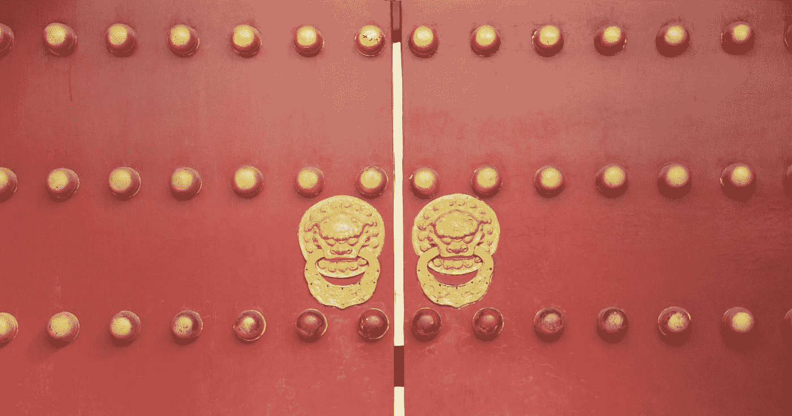

# 中国是如何用科技钉死冠状病毒的！

> 原文：<https://towardsdatascience.com/how-china-nailed-the-coronavirus-using-technology-77703dc94a37?source=collection_archive---------21----------------------->

中国高科技系统对抗 COVD-19 的案例研究

***编者按:*** [*走向数据科学*](http://towardsdatascience.com/) *是一份以数据科学和机器学习研究为主的中型刊物。我们不是健康专家或流行病学家，本文的观点不应被解释为专业建议。想了解更多关于疫情冠状病毒的信息，可以点击* [*这里*](https://www.who.int/emergencies/diseases/novel-coronavirus-2019/situation-reports) *。*

[Rade apto VI](https://unsplash.com/@lab604?utm_source=medium&utm_medium=referral)在 [Unsplash](https://unsplash.com?utm_source=medium&utm_medium=referral) 拍摄的照片

中国是新型冠状病毒传播的源头。在中国境内，它感染了约 80，000 人，并导致 3，000 多人死亡。一开始，疫情规模很大，但最近几周，他们设法控制住了疫情。对于一个像中国这样有 14 亿人口的国家来说，每天报告 50 个病例只是沧海一粟。一些人批评中国的制度，声称它在西方永远行不通。这篇文章的范围不是要判断他们的方法，而是要说明他们是如何利用先进的技术赢得对新冠肺炎的战争的。

中国以从公民那里收集大量数据而闻名。他们有一个由分布在全国各地的 2 亿多个视频监控摄像头组成的网络。除此之外，他们还在住宅区的门口安装了生物扫描仪。当一个人决定离开他的公寓时，他必须扫描他的脸作为一种登记。从那时起，处理数据的智能系统知道该人在外面，并可以通过广泛的视频监控系统跟踪他的行踪。中央数据库存储所有这些信息，然后机器学习算法处理这些数据，并计算这个人的潜在社交互动。

照片由[粘土堤](https://unsplash.com/@claybanks?utm_source=medium&utm_medium=referral)在[防溅板](https://unsplash.com?utm_source=medium&utm_medium=referral)上拍摄

中央数据库还从其他来源收集数据。其中之一是微信应用，仅在中国，每月就有约 10 亿人使用该应用。该应用程序方便地将本地化、社交媒体、聊天和电子钱包结合到一个系统中。这种系统的第一个优势是，支付使用非接触式虚拟卡，无需兑换真实货币。因此，这种物理交换的缺乏自动减少了病毒的传播。

第二个优点是定位特征，其提供了个体的精确地理位置。鉴于监控摄像头的覆盖范围有限，微信提供的位置将为系统提供关于该人行踪的精确信息(误差在几米之内)。如果一个人与感染病毒的人密切接触，系统可以立即警告他，让他避开那个人。

第三个优点是，由于电子钱包包括与购物一起访问的商店的信息，这两者可以结合起来。从商店的位置，可以推断出一个购物的人是否感染了病毒，因为几分钟前，一个受感染的人正在同一家商店购物。另一方面，购买可能提供关于个人幸福的信息。人工智能(AI)系统可以很容易地推断出，如果购买了某些物品(如药物)，那么这个人或他身边的人很可能生病了。微信上的聊天进一步证实了这一假设，因为它们是使用人工智能自动分析的。然后，该系统将此人标记为潜在病例，一个医疗小组将对其进行特殊检查。

第四个优势是社交媒体元素，这对于确定患者的社交圈以及在感染情况下联系他们至关重要。

该系统非常复杂，可以列出在过去两周内与感染者有过接触的大多数人。然后政府对这些人实行至少 14 天的自我隔离。

照片由[杰米街](https://unsplash.com/@jamie452?utm_source=medium&utm_medium=referral)在 [Unsplash](https://unsplash.com?utm_source=medium&utm_medium=referral)

每个公民还获得一个自动健康代码，可以是:红色、琥珀色或绿色。这种编码决定了人的流动性。绿色意味着这个人可以不受限制地自由走动。刚从国外回来或可能与感染者接触过的人有黄色代码，他们的行动受到限制(事实上他们不允许开车)。那些可能被感染的人属于红色类别，他们必须留在隔离区。

正在使用的系统不仅是高科技的，而且还结合了其他国家采用的程序。所有来自疫区的航班都经过人工检查。在商业建筑(如购物中心)的入口处，员工检查人们的体温，如果发现发烧，就提出报告。在一些城市，每三天只允许一个人离开房子去买必需品，而且他们只有在有特殊许可证的情况下才能开车。中国政府的想法是在热点失控之前发现它们。这个系统被许多人认为是非传统的，接近极端，但它似乎产生了良好的效果。毫无疑问，这是世界历史上最高的流行病控制技术。当然，系统存在各种问题；最明显的事实是，人们正在牺牲自己的隐私。[这肯定需要调整。](/tweaking-chinas-coronavirus-tech-strategy-to-beat-the-virus-in-the-west-a00984f27c0c?source=post_stats_page---------------------------)最终，没有一个系统是完美的，很难达到平衡。因此，我们必须问自己，为了拯救更多的生命，我们准备走多远。

【https://www.businesstoday.com.mt】这篇文章最初发表于 [*请在下面留下你的想法，如果你喜欢这篇文章，请随时关注我🐦*](https://www.businesstoday.com.mt/people/people/799/how_technology_is_helping_china_crush_the_coronavirus#.XodD3y2B124)*[推特](https://twitter.com/alexieidingli)，🔗 [LinkedIn](https://www.linkedin.com/in/alexieidingli/) 或😊脸书*。

*   [冠状病毒的多米诺效应](/the-domino-effect-of-the-coronavirus-66fdd72fc9fd)
*   [游戏新冠肺炎:让我们玩个游戏打败病毒吧！](/gaming-covid-19-lets-defeat-the-virus-by-playing-a-game-f8433805fe7d)
*   [在冠状病毒封锁下为孩子们准备的有趣的人工智能活动](/fun-artificial-intelligence-activities-for-kids-under-coronavirus-lockdown-7177969a2ba1)

[**阿列克谢·丁力教授**](http://www.dingli.org/) 是马耳他[大学](https://www.um.edu.mt/)的 AI 教授。二十多年来，他一直在人工智能领域进行研究和工作，协助不同的公司实施人工智能解决方案。他的工作被国际专家评为世界级，并赢得了几个当地和国际奖项(如欧洲航天局、世界知识产权组织和联合国等)。他出版了几本同行评审的出版物，并且是马耳他[的一部分。由马耳他政府成立的人工智能工作组，旨在使马耳他成为世界上人工智能水平最高的国家之一。](https://malta.ai/)