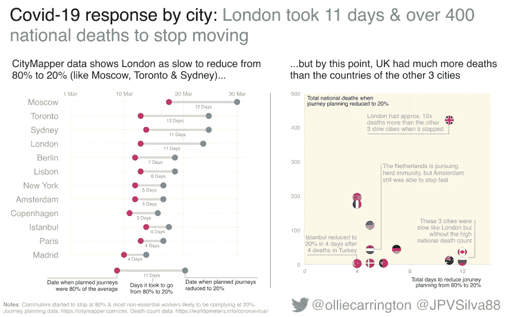
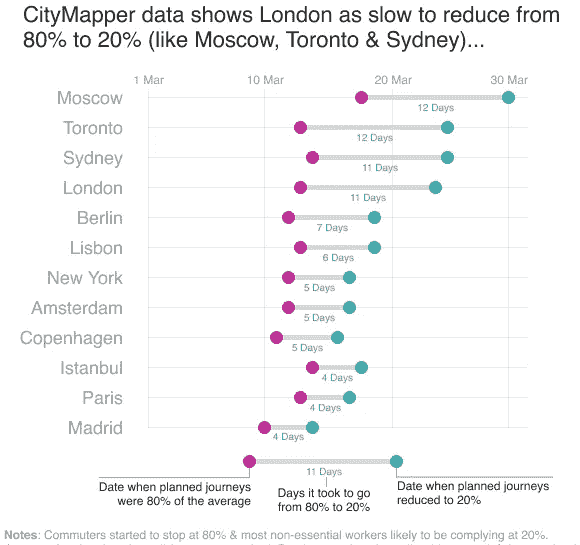
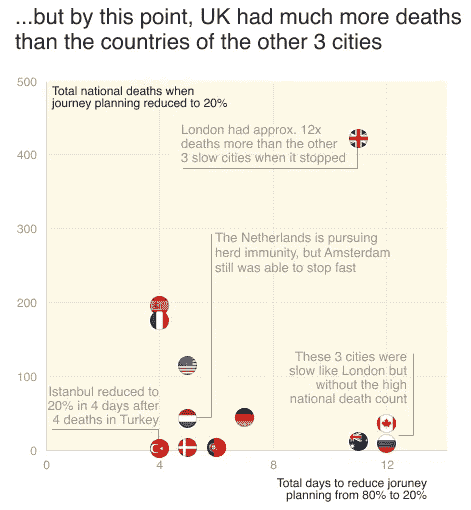

# Citymapper 数据如何突出不同城市的新冠肺炎响应

> 原文：<https://towardsdatascience.com/how-citymapper-data-highlights-the-covid-19-response-of-different-cities-fd30d51b0d9c?source=collection_archive---------48----------------------->

## 我们发现了哪些城市在应对冠状病毒疫情时比其他城市花了更长的时间停止通勤

冠状病毒对我们的生活方式产生了不可思议的影响。为了遏制病毒的传播，许多政府禁止我们拜访朋友和家人，或者去工作场所、商店和餐馆。世界各地城市的通勤已经停止。

我们知道发生这种情况的一个原因是，像 Citymapper 这样的应用程序的用户已经停止使用它们来计划旅程。

完整的 dataviz 由我、奥利弗·卡林顿和若昂·席尔瓦创建

以上是我们的最新数据，即使用 Citymapper 的旅程规划数据来比较不同城市对新冠肺炎的一个角度的反应。它是由我和我的合作伙伴 joo Silva 创建的，我将在这里分两部分简要介绍它。

# *这组中的四个城市用了超过 10 天的时间来减少出行*

> 尽管通勤在同一天开始放缓，但伦敦比巴黎多花了整整一周的时间将平均行程减少到 20%

在 viz 数据的第一个图表中，我们使用了一个范围图来显示 12 个城市何时开始减少旅行(当它们达到平均旅行计划的 80%时，以粉红色显示)。然后你可以比较一下这些城市停止旅行所用的时间(平均旅行计划的 20%，当主要是关键员工四处走动时，用蓝绿色显示)。

在这里，你可以清楚地看到，马德里、巴黎和伊斯坦布尔的市民将旅行计划从 80%大幅减少到 20%。另一方面，伦敦和悉尼用了 11 天，而莫斯科和多伦多用了 12 天。

使用 Citymapper 计划行程的百分比似乎与大多数城市的实际情况相符。例如，3 月 25 日，也就是伦敦最终达到通常 Citymapper 行程计划的 20%的第二天，[伦敦市长](https://www.london.gov.uk/coronavirus/statement-coronavirus-covid-19)宣布，“*地铁乘客量与去年同一天相比已经下降了 88%，公交车乘客量下降了 76%*。

我自己创建的 dataviz 的第一部分

# 但让伦敦与众不同的是，它在一个更加严峻的新冠肺炎环境下放缓了脚步

> 当伦敦减速时，已经有 422 人死亡

数据 viz 中的第二个图表显示了行程计划从 80%减少到 20%的情况。这是一个散点图，使用城市的国旗作为点，表明城市通勤者和他们的国家政府如何认真对待他们国家的病毒升级。

例如，里斯本可能比巴黎和马德里花了 50%的时间来减少旅行，但情况远没有那么严重，当这种情况发生时，新冠肺炎有 4 人死亡，而法国有 175 人，西班牙有 196 人。

我们还发现了土耳其和荷兰的有趣模式(我们在图表上做了注释)，但最有趣的故事是，在这张图表中，英国是如何从那些缓慢停止旅行的城市中分离出来的。当伦敦的行程规划下降到 20%时，英国有 422 例新冠肺炎死亡，这远远高于澳大利亚、加拿大和俄罗斯停止时 9 至 36 例死亡的范围。

我自己创建的 dataviz 的第二部分

从这个数据的一个角度来看，英国政府在 3 月份缓慢锁定的后果是严重的。现在预计英国将成为欧洲受影响最严重的国家。

# 我们如何创建我们的数据，即

我们使用基于浏览器的 UI 和 UX 设计应用程序 [Figma](https://www.figma.com/) 来设计数据，即。我们从[国旗](https://www.countryflags.com/)中找到了国旗图片，用于散点图。

[Citymapper 移动指数](http://citymapper.com/cmi)提供了迷人的旅程规划数据，我们使用了 [Worldmeter 的冠状病毒统计数据](https://www.worldometers.info/coronavirus/)来计算特定日子的死亡人数。

Citymapper 是一个非常知名的应用程序，但是它的受众不太可能完全代表一个城市的人口统计数据。这些数据似乎遵循了伦敦通勤者的整体情况，但对于伊斯坦布尔等收入不平等程度较高的城市来说，问题可能更大。

最后，我工作的慈善机构紧急呼吁提供资金，帮助伦敦五家国民医疗服务系统医院中受新冠肺炎影响的员工和患者。在这里了解更多:[www.justgiving.com/campaign/help-our-nhs](https://www.justgiving.com/campaign/help-our-nhs)