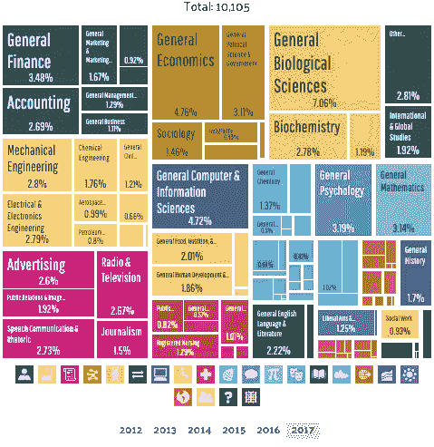
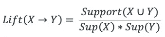
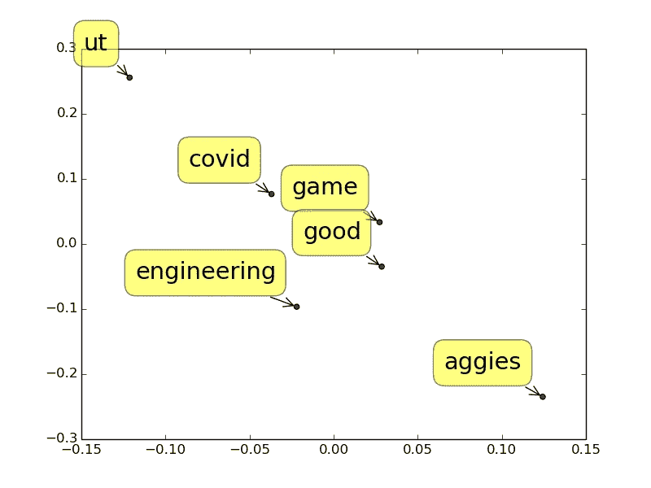

# 大学生如何应对新冠肺炎

> 原文：<https://towardsdatascience.com/how-college-students-are-handling-covid-19-3705016205fe?source=collection_archive---------39----------------------->


卡洛斯·阿方索的照片

## 一步一步的分析，了解自然语言处理的强大功能

作为一名受疫情冠状病毒影响的大四学生，我和德克萨斯大学奥斯丁分校超过 75%的学生[一样，将于今年秋天加入 zoom 大学。倒数第二个学期不在校园，让我有点想家。受好奇心和一点 FOMO 的驱使，我决定借助一些自然语言处理技术来检查一下我的长角牛同伴。](https://news.utexas.edu/2020/08/11/ut-austin-projects-more-than-75-of-class-seats-will-be-online-this-fall/)

这个项目的代码在我的 [GitHub](https://github.com/michelle-xia/rda) 回购。

# 目录

1.  [超声波探伤数据](#a203)
2.  [包话](#8eaf)
3.  [主题建模](#5516)
4.  [情感分析](#bd1e)
    1。[整体情绪](#c5bc)
    2。[按主题划分的情绪](#8241)
5.  [与得克萨斯 A&M](#a39a)1 的比较。[话题共同点](#a88b)
    2。[感情比较](#ac26)
    3。[学校声誉](#f56c)
6.  [结论](#0ef7)

# UT 奥斯汀数据

我使用约瑟夫·赖的通用 reddit 刮刀从 UT Austin subreddit 上的最新帖子中收集了 1348 个文本条目。这些文本条目包括文章标题、正文和评论。然后，我用 excel 上的 VBA 脚本清除了文本中的非 ASCII 字符。

从 UT Austin Subreddit 聚合文本

我将所有这些文本条目读入一个熊猫数据框架，并(再次)清理了数据。

```
 Overall_text
0    The UT employees are not a homogeneous group o...
1    Some departments are planning to continue work...
2    That 20% only represents tested cases that are...
3    A few bar owners opened to huge crowds, within...
4    - Master's degrees are a giant source of reven...
...   ..  ...                                                ...
1343 For ochem 2 next semester will Straumains be d...
1344 Is there a place in campus that students can u...
1345 Can you drop a Bio class and stay in the corre...
1346 Mythology w Curtis or Greek Archaeology w Gulizio
1347 Shabbir vs Straumanis for Ochem 2[1348 rows x 3 columns]
```

# 长角牛群，一袋单词

通常，自然语言处理的第一步是找到最常提到的单词，以更好地理解数据。为了做到这一点，我使用 NLTK 删除了[停用词](https://www.tutorialspoint.com/python_text_processing/python_remove_stopwords.htm)，并对数据帧进行了词频分析，以找到 UT 学生在子编辑中最常讨论的内容。

不出所料，哪个词领先…

UT Austin Subreddit 聚合文本的词频分析

上面的话透露出我的同行在谈论**其他人类**、**获得**、**信息**。第一个讨论的题目是**计算机科学** (cs)出现 **81 次**。出于好奇，我手动通读了一些数据中提到的热门词，看看是否有任何模式或意义。这个练习相当乏味；举个例子，我发现 *get* 主要指的是成绩、录取和冠状病毒传播——和我预想的差不多。

通常，在开始的几个词中没有太多有趣的信息，所以我向下滚动以获得更有价值的数据。似乎对种族主义和歧视的思考也在德州大学学生的头脑中占据了很大的比重。词频分析找到了单词***57 提到**是因为当[【德克萨斯之眼】](https://www.usatoday.com/story/sports/ncaaf/big12/2020/10/14/anger-over-the-eyes-texas-song-threatens-engulf-longhorns/3650021001/)——由大学四重奏首次在吟游诗人表演中演出——在 UT 对 OU 足球赛后，UT 四分卫 Sam Ehlinger 独自站起来后产生的嗡嗡声。应该指出的是，学生团体对于这首歌是否应该被替换并没有统一的意见。*

*我注意到的另一个有趣的点是， ***足球*** ( **17 提到**)不像教育和政治那样是 UT Redditors 中普遍讨论的话题。这可能是由于德州长角牛队的赛季表现不佳，以及本学期参加比赛的学生人数减少。或许也可以说，足球提及量低很大程度上是因为 UT 足球迷的独立子编辑区从 UT 奥斯汀子编辑区转移了足球话题。无论如何，德州大学奥斯汀分校的文化仍然是由德州大学奥斯汀分校的学生创造的，因此为长角牛队本学期的经历提供了一个宝贵的窗口。*

# *这学期的主题*

*分析单个单词可能是有趣的，但是当用作综合摘要工具时，它经常留下一些需要的东西。更好的概述技术包括**聚类**和**主题建模**。当有很少或没有重叠的明确定义的类别时，聚类效果最佳。因为从 Reddit 上提取的相对较小的对话数据集可能没有明显不同的类别，聚类可能是一种次等策略。因此，我使用了一个[潜在狄利克雷分配](https://blog.echen.me/2011/08/22/introduction-to-latent-dirichlet-allocation/)脚本来对数据执行**主题建模**。*

*德州大学奥斯汀分校主题的 LDA 分析*

*上面的数据包含了在 UT Austin subreddit 上找到的所有单词，这些单词在*字段 1* 列下，后面是不同主题的列。每行包含该行单词中隐藏的每个主题*和*的百分比。例如，第一行包含单词 *song* 。我们可以看到*宋*的妆容 0.02 与社会公正的话题有关。单纯看*歌*，我们只能假设它的意思(或者回去翻资料*手动读*(我知道，2020 年？)通过包含该词的帖子)。然而，在执行了潜在的狄利克雷联想分析之后，我们看到 ***【宋】*** 被其他类似的得分词所包围，如 ***【动作】******【肯定】******白*******黑******右*** 下首每个单词中隐藏的话题关系就是为什么这种方法被称为*潜在*狄利克雷联想。**

**在分析了每一栏的数据后，我发现德州大学奥斯汀分校的学生正在进行 8 个主要话题的对话:**

*   **社会公正**
*   **科学课**
*   **类别(常规)**
*   **住房/生活**
*   **计算机科学硕士课程(MSCS)**
*   **冠状病毒病**
*   **老友记**
*   **投票**

**我希望 UT 的每所学校都有一个主题，但只有 STEM(科学和 MSCS)出现了。我查看了 UT Austin 的主要项目，以防 STEM 专业的学生数量过多。这是 2017 年毕业的德州大学奥斯汀分校学生的专业细分:**

****

**([来源](https://datausa.io/profile/university/the-university-of-texas-at-austin))**

**各专业之间的平衡相当不错(当然，这是在 2017 年——自那以后，普通计算机和信息科学可能会大幅增加)，因此 STEM 专业的过多并没有导致与 STEM 相关的讨论相对于其他专业而言无处不在。也许 STEM 作为讨论主题的流行是由于 STEM 课程的难度和典型 Reddit 用户的概况，但这纯粹是我的猜测。**

**然而，我并不惊讶地发现，这 8 个经常被讨论的话题中的任何一个都成为了热门话题。因为德州大学奥斯汀分校靠近州府，而且它在政治上很活跃，所以*投票*和**T3***社会公正*是意料中的话题。UT 最近还在计算机科学学院推出了一个新的数据科学硕士项目，考虑到数据科学的兴起和失业的增加，这个新的研究生数据科学项目引起轰动也就不足为奇了。最后，剩下的话题可以归因于影响我们所有人的一般谈话主题或与 COVID 相关的话题(因为 COVID 也影响我们所有人)。**

**顺便提一下，LDA 分析实际上从 UT Austin subreddit 的聚合数据中产生了 9 个主题。第 9 个主题是*入学*，这是有意义的，因为 subreddit 不仅限于 UT Austin 的学生，并且这一分析的时间(大学申请通常最晚开放到早春学期)。然而，UT 本科录取与本文的重点无关；所以我丢弃了*录取*这个题目。**

# **人们感觉如何？**

## ***总体***

**使用 VADER *(价感知词典和情感推理器)*的情感分析显示，一般来说，在 UT Austin subreddit 上发帖的学生感觉**中立**。虽然很容易将这归因于大学生内心的死亡——尤其是在学期的这个时候——但中性文本条目的比例很大可能是由于 subreddit 的文化和 reddit 本身帖子的性质；然而，作为一个旁注，我发现许多对话的语气比我想象的更加中性。**

**同样令人鼓舞的是，正面情绪的总百分比比负面情绪的总百分比高。为了确保积极的 COVID 测试案例不会人为地夸大积极的百分比，我检查了所有包含*积极的*的行，并手动调整了与 COVID 相关的情感分数。**

```
**Sentiment     Percentage
------------------------  
Neutral          99.26%
Positive         61.23%           
Negative         38.47%**
```

**为了阐明百分比代表什么，使用 VADER 词典分析来自聚合 Reddit 文本的每行文本的**正面**、**中性**和**负面**情绪的得分，以计算其情绪构成。每条线还被分配一个复合情绪极性得分，其范围从-1 到 1，其中-1 表示该范围的负端，1 表示该范围的正端。利用这些分数，我计算了所有的正面、中性和负面文本的行数，方法是将每一类(正面、中性和负面)中得分超过 0 的行数除以所分析的文本行数。因为每一行都有积极、中性和消极情绪的百分比(换句话说，每行的积极、中性和消极数字并不相互排斥)，所以这里的百分比总和不是 100%。**

**我还取了所有文本条目的**中值复合得分**，它是 **0.126** ，这意味着这些文本条目总体上稍微有点正面。**

**让我们进一步分析一下。**

## **按主题**

**我提取了与一些主题相关的文本条目，以便更详细地理解情感构成。我优先选择了**社会公正**、**科学**和**普通课程**、**住房**和 **COVID** ，因为它们是最相关的话题，也是我最感兴趣的。总体而言，市场情绪趋于中立。在我分析的任何话题中，积极情绪都没有占据主导地位。**

**每个类别中的文本条目较少，所以我可以根据需要手动调整总的复合得分。正因为如此，我选择关注**复合得分**来进行分析(而不是像上面一样，关注每个文本条目的负面、中性和正面情绪)。为此，我将复合得分大于、等于和小于 0 的文本条目分别归类为正面、中性和负面。因为我使用了一个复合分数，所以每个文本条目只有一个复合值(或者，换句话说，每行的正、中和负是互斥的)，这意味着每个主题的所有表值总和为 100%。**

*****社会公正***这是可想而知的最固执己见的话题之一——80.49%的文本条目总体上是**负面**。**

```
**Sentiment     Percentage
------------------------  
Negative        80.49%
Neutral         12.20%           
Positive         4.88%**
```

**以下是一个关于社会公正的示例文本条目，其复合情绪得分为-0.2755:**

> **不合逻辑的世界的逻辑叙述**

**相比之下，关于社会公正的最积极的文本条目获得了 0.4404 的复合情感分数:**

> **嘿，你提出了一个很好的观点。你说得对，这不是一个合适的比较。我猜是从我的角度听来的**

*****科学***
切换到一个更积极的主题(或者至少，根据 UT Austin subreddit 上的学生所说)，我分析了关于科学的文本条目的情绪。这些文本条目中的大多数在情感上是中立的。**

```
**Sentiment     Percentage
------------------------  
Neutral         48.15%
Positive        41.67%           
Negative        10.19%**
```

**这些条目中的绝大多数都是礼貌性的帖子，询问不同物理、化学和生物课的最佳选择。**

**得到复合文本条目分数 0.8796 的删节样本文本条目是:**

> **大家好，
> 我现在是一名 ECE 专业的新生，正在考虑是下学期还是整个夏天去上 PHY303K/103M。任何建议将不胜感激:)**

**为了将正面和负面并列，这个与科学相关的不太乐观的文本条目得到了-0.6696 的复合情绪分数(不管你是谁，坚持住，伙计):**

> **为什么我在大学表现这么差**

*****班级*** 围绕这个话题的对话一般都是围绕着建议相关班级注册和满足一定毕业要求的班级。6 个文本条目(在该类别的 59 个条目中)还提到了文化多样性旗帜，这似乎已经从课程表的课程中消失了。围绕该主题的大多数文本条目都是中性的**。****

```
****Sentiment     Percentage
------------------------  
Neutral         77.97%
Positive        13.56%           
Negative         8.47%****
```

****关于接收 0 的复合情感分数的类的典型文本条目是:****

> ****既然 2021 年春季的课程表已经出来了，而且大部分课程又上线了，如果你现在在家乡，你打算回奥斯汀吗？或者你打算在家里再呆一个学期？****

****作为比较，下面是一个负面文本条目，其复合情绪得分为-0.1(与文化多样性标志混淆相关):****

> ****春季简易 CD 课程？课程表没有帮助。****

*******住房/居住***
关于住房的文本条目通常是**中性的**或正面的，往往是评论、噪音投诉和建议请求的混合体。鉴于我听说过许多大学生抱怨住在吵闹且不太整洁的西校区，我很惊讶负面的比例如此之低；但是，也许谈论你梦幻般的生活空间并不能成为有趣的话题。****

```
****Sentiment     Percentage
------------------------  
Neutral         48.21%
Positive        44.64%           
Negative         7.14%****
```

****一个面条爱好者的帖子获得了 0.919 的情感复合得分，如下所示。因为强调了*最佳*选项，这篇文章在情感方面得分很高:****

> ****西校区或附近最好的拉面是什么？？老实说，奥斯汀最好的拉面是什么？****

****负的 post 得分-0.8312 描述了一种可怕的住房体验:****

> ****昨晚，大约午夜时分，我以为有人试图闯入我在远西校区的公寓…****

*******科维德*** 人们对科维德的期望比我想象的要高，但总体情绪仍然是**大多是负面的**。为了确保阳性测试案例不会被错误地归类为*阳性*，我重写了*阳性*测试案例的 VADER 情感词典，并手动检查了文本条目。****

```
****Sentiment     Percentage
------------------------  
Negative        52.43%
Positive        25.71%           
Neutral         22.86%****
```

****文本条目的示例包括对 UT 安全协议的称赞，其综合情绪得分为 0.8554:****

> ****我认为 UT 行动得足够早，有足够的社交距离和清洁协议，加上有限的面对面授课，它能够缩小，不像其他许多大型大学那样谨慎…****

****复合情绪得分为 0.8908 的讽刺妙语:****

> ****高价是值得的，哈哈，我们每隔几周就能得到免费的快速新冠肺炎测试。****

****以及不太轻松但相似的讽刺性评论，其复合情感得分为-0.6:****

> ****在美国，我们做不可能的事。我们已经把新冠肺炎变成了 COVID-21。因为我们没有进行适当的两个月锁定，我们将进行两年锁定。****

# ****长角牛和农校真的有那么大区别吗？****

****为了进一步分析，出于好奇，我比较了德克萨斯大学奥斯丁分校和德克萨斯 A&M 大学的 COVID 反应，同时也因为宿怨难改。为了做到这一点，我从 [Aggies subreddit](https://www.reddit.com/r/aggies/) 收集了大约 2000 个最近热门的帖子，从 [UT Austin subreddit](https://www.reddit.com/r/UTAustin/) 收集了大约 2000 个最近热门的帖子，以创建一个包含大约**4000 个热门帖子**的组合数据集(准确地说是 3907 个)。我决定只使用最受欢迎的书名，这次排除评论，部分原因是因为这样更容易收集数据，但也因为我想概括所有学校，而受欢迎的书名可以让我有一个大视野。****

****来自 UT 和 A&M subreddit 的合并帖子标题****

## ****主题****

****我进行了 LDA 分析(如上文中的[所述),以发现 UT Austin 和 Texas A & M. **3 个主要话题**在 UT Austin 和 Texas A & M 两个子区域均有讨论:](#c21b)****

*   ****投票****
*   ****健康/COVID****
*   ****足球****

****德克萨斯大学奥斯汀分校和 A&M 分校联合主题的 LDA 分析****

****这些都是合理的总体话题，尤其是考虑到这两所学校都位于德克萨斯州，在那里，高度重视足球是文化的一部分。请注意，这种分析不同于上面的单词袋方法，后者只查看最近帖子和评论中的提及次数；这种分析着眼于更早以前的帖子标题中包含的潜在主题(因此这里出现了与足球相关的讨论，但没有提到早先的)。****

****分析的下一步是比较两所学校每个主题的 LDA 分数。为了做到这一点，我按照学校对帖子进行了分组，并使用 LDA 计算了每个主题*在上午和下午出现的百分比:*****

****A&M 和德克萨斯大学的潜在主题内容****

****我很惊讶地看到，由于奥斯汀市在政治上的活跃声誉，Aggies 在投票中得分更高，所以我手动浏览了一些 A&M 的帖子。在鼓励学生在美国总统选举中投票的信息中，有一些异常值(为了匿名，帖子标题被删节):****

> ****支持学生的大学站市议会候选人将举办一场户外活动…如果可以，请记得投票给…我。****

****Aggies 以他们的社区精神而闻名，看起来一些校园选举与总统选举在时间上是一致的。****

****我也查看了最近 UT Austin 的帖子，但最近所有与投票相关的讨论都围绕着总统选举。****

## ****情感比较****

****为了放大德克萨斯 A&M 大学学生和德克萨斯大学奥斯汀分校学生之间的差异，我按主题对每所学校进行了情感分析。我关注足球和 COVID，因为大多数与投票相关的帖子在两所大学之间没有太大差异，而是中立地鼓励学生投票。****

*******足球*******

****总的来说，德州 A**M**的学生似乎比德州大学奥斯汀分校的学生对足球有着更为平衡**和积极**的态度。********

****agate playing marbles 玛瑙制成的玩具弹球****

```
****Sentiment     Percentage
------------------------  
Neutral          61.28%
Positive         27.23%           
Negative         11.49%****
```

****27.23%的 Aggie subreddit 帖子对 Aggie football 持积极态度，如以下帖子所示，这些帖子的情感综合得分为 0.7906:****

> ****凯尔·菲尔德，我们唯一的真爱****

****然而，并不是每个农校都同样热情。这篇文章的情感综合得分为-0.2808:****

> ****我希望我们足球踢得更好****

****长角牛****

```
****Sentiment     Percentage
------------------------  
Neutral         50.00%
Negative        37.50%           
Positive        12.50%****
```

****长角牛队比农校队对足球感觉更消极，考虑到围绕“德克萨斯之眼”的争议，这是有道理的。****

****关于足球最积极的 Longhorn 帖子得分为 0.4215:****

> ****在周六的足球赛上:很好****

****但是奥斯汀赢得了负分。本帖评分-0.7351(编辑匿名):****

> ****德州足球让我生气****

*******COVID***
**德州 A & M** 似乎处理 COVID 比 UT 奥斯汀多一点**正**，但差不了多少。我很惊讶这两所学校的情感复合分数如此相似。****

****德克萨斯 A&M****

```
****Sentiment     Percentage
------------------------  
Negative         65.00%
Neutral          30.01%           
Positive          4.99%****
```

****Aggies subreddit 上最积极的帖子是关于给学生休息时间的行政决定，得分为 0.6019:****

> ****副教务长迈克尔. t .斯蒂芬森回应道:……我们担心学生的心理健康，所以我们在那个星期五离开了他们，并在学期初增加了另一个假期。****

****然而，并非所有的领导力都是平等的。这是一篇关于 COVID 在 Aggies subreddit 上的负面帖子，得分为-0.6808:****

> ****有没有办法匿名举报一个不遵守新冠肺炎准则的教授？****

****UT 奥斯汀****

```
****Sentiment     Percentage
------------------------  
Negative         65.42%
Neutral          33.46%           
Positive          1.09%****
```

****相比之下，UT 奥斯汀的职位更倾向于**中立**。由于一名工作人员不幸去世，负面情绪也有所增加。****

****关于 COVID 带来的卫生改善，最积极的帖子得分为 0.5766:****

> ****我喜欢的 COVID 的一个结果…****

****另一方面，德克萨斯州每日得分-0.258 的负面帖子让人们深入了解奥斯汀开始慢慢重新开放时德州的状况:****

> ****住在校外的学生担心新冠肺炎的安全，因为宿舍举办现场活动——每日德克萨斯****

## ****名声****

****为了弄清楚这两所大学的人与每所学校有什么联系，我首先对聚合数据集进行了词频分析，以找到常用词。****

****UT Austin 和 A&M 子词典联合词频分析****

****从这些词中，我决定寻找与频率分别为 73、72、61 和 48 的**游戏、良好、工程**和 **covid** 的关联，因为这些是最常见的有趣主题。然后我在 UT 和 A & M 上运行了一个 [lift 分析](https://www.dataminingapps.com/2017/04/what-is-the-lift-value-in-association-rule-mining/),使用这些单词找到这些单词之间的**关联**。****

****高校与大学的关联提升矩阵****

****计算升力的方程式是:****

********

****升力方程(图片由作者提供)****

****本质上，它通过同时提到两个单词的帖子数量除以两个帖子数量的乘积，找到两个单词之间的**关联**。当 lift > 0 时，我们可以声称两个词之间有关联。**的提升分数越高**，则**的联想越强**。****

****在上表中，我们可以看到**高校**与**工程**、**游戏**、**好**相关联。 **UT** 则与 **COVID** 和 **game** 关联。****

****我用[多维标度](https://www.statisticshowto.com/multidimensional-scaling/) (MDS)图可视化了这些关联。****

********

****UT 和 Aggies 之间的 MDS 情节(图片由作者提供)****

****该图用**距离**来表示**关联强度**:两个标签越近，关联越强。注意，每个标签的位置在该图中本身没有意义；相反，每个标签相对于其他标签的相对位置显示了每个标签的距离和关联关系。(德州 A & M 的右下方位置并不意味着德州 A & M 在本次分析中得分低于 UT Austin 事实上，数字讲述的是相反的故事。)作为理智检查，我们可以看到 UT 离 A & M 最远，这表明人们对 UT 和 A & M 的看法最不一样。考虑到升力的计算方式和这两所学校的背景，这是有道理的。我们可以看到*比赛*似乎在中间，这也是有道理的，因为两所学校都参加足球比赛。****

****我有点惊讶地发现，人们更倾向于将*与 **A & M** 联系在一起，但 A & M 的校风和文化似乎更强烈，说来有趣，这可能会带来更明确的声誉。另一方面， **UT 奥斯汀**与 ***COVID*** 有很强的关联性，很可能是由于某工作人员不幸去世。*****

# ******最终想法******

****在本文中，我主要关注 UT Austin 和德克萨斯 A&M，但本文中的概念和技术可用于回答任何数据问题，特别是那些与任何具有公开可用的用户生成数据的组织中的 COVID 反应相关的问题。****

****这个项目对我来说是一个很好的方式，可以同时应用和提高我的 NLP 分析和编码技能，同时也赶上了德州两所最大的大学的进度。A&M 和德克萨斯大学似乎都管理得相当好(尽管对他们目前的足球队来说不能这么说)，并且正在回归正常。总的来说，我对许多结果并不感到惊讶，直到我比较了 A&M 大学和德克萨斯大学奥斯丁分校。特别有趣的是，A&M 的投票和工程主题分数都高于德克萨斯大学的分数。就情绪而言，农校比长角牛更不消极。****

****我最后要说的是:虽然我不愿意承认，但数据不会说谎:A&M 可能并不那么糟糕，但在一切恢复正常之前，我们可能需要迎头赶上。****