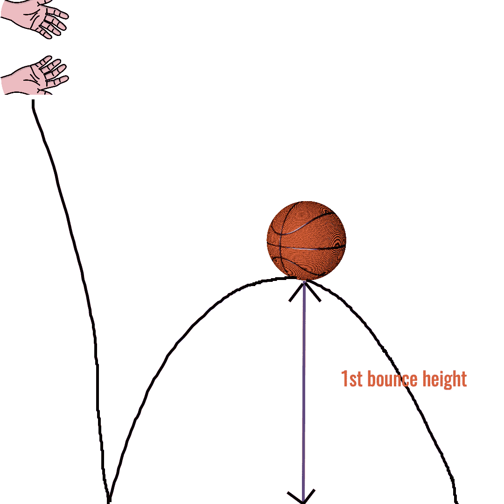
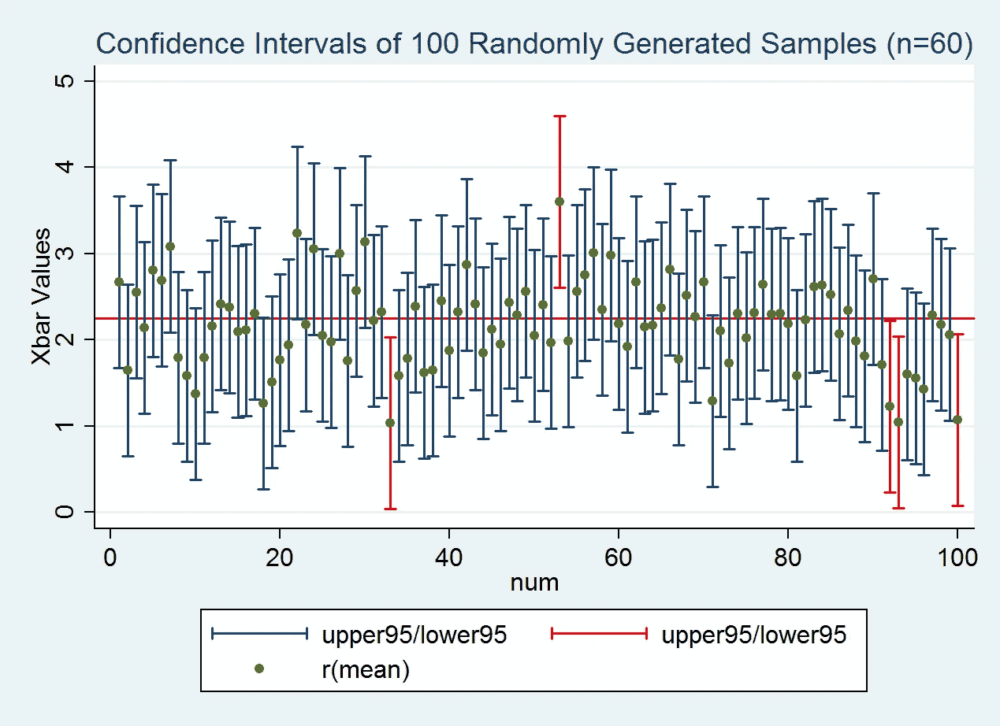
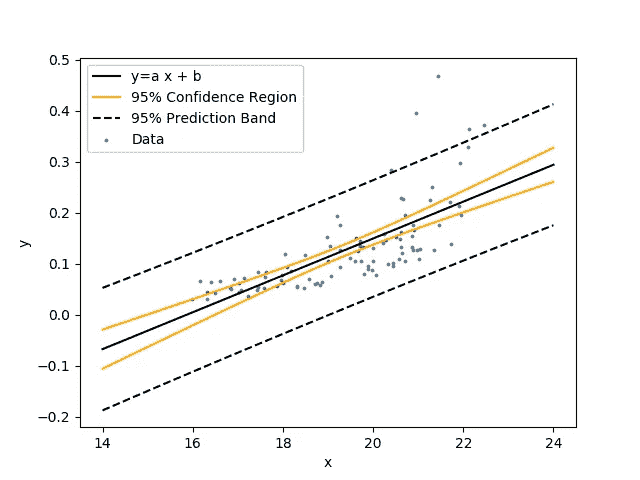

# 置信区间和预测区间如何工作

> 原文：<https://towardsdatascience.com/how-confidence-and-prediction-intervals-work-4592019576d8?source=collection_archive---------3----------------------->

## 以最简单的方式学习它

来源:https://imgflip.com/memegenerator

## **置信区间**

置信区间是根据样本数据计算的估计值，用于确定可能包含感兴趣的总体参数(均值、标准差)的范围。例如，如果我们的总体是(2，6)，均值的置信区间表明总体均值可能在 2 和 6 之间。我们有多大把握这样说？明明 100%对吧？因为我们知道所有的值，我们可以很容易地计算出来。

但在现实生活问题中，情况并非如此。研究整个人口并不总是可行或可能的。那我们该怎么办？我们采集样本数据。但是我们能依靠一个样本吗？不会，因为相同数据的不同样本会产生不同的均值。

因此，我们采取了许多随机样本(来自同一人群)，并计算每个样本的置信区间，这些范围的一定百分比将包含**真实总体参数。**

这个百分比称为置信水平。95%的置信水平意味着从 100 个随机样本中，我希望 95 个置信区间包含真实的总体参数。

还是，迷茫？我们通过一个例子来理解这一点。

假设你在一家制造篮球的体育用品公司工作。有几个制造工厂，每个工厂每天生产 10，000 个球。在公司包装和发货之前，你必须测试这些球。

标准行业程序之一是检查球的第一次反弹高度。你的同事建议随机抽取一个样本(来自同一家制造厂),并围绕平均反弹高度形成一个置信区间。

[投出篮球的第一次反弹高度](https://pixteller.com/designs/basketball-bounce-id1730030)

你拿 100 个球，让它们从你办公室的一楼落下，测量平均反弹，平均反弹的 95%置信区间是 110-120 厘米。**我可以说，我有 95%的把握认为所有篮球的平均反弹高度(来自一个工厂的整个群体)都在这个范围内**。

**注意:这并不意味着在 95%的时间里，弹跳高度都在这个范围内。**

[通过标绘区间解释](https://sites.nicholas.duke.edu/statsreview/ci/)

正如我们在上面这张图片中看到的，100 个不同的样本有 100 个置信区间。红线是人口的真实值。其中 95 个区间包含真值，其他 5 个不包含。

一些重要的考虑事项:

1.  随着我们抽取越来越多的样本，我们的置信区间变得越来越窄。较大的样本将减少抽样误差，给出更精确的估计，从而得到更小的间隔。假设，你决定测试 5000 个球，你会得到一个更好的反弹高度范围的估计。
2.  随着我们增加置信水平，比如从 95%到 99%，我们的范围变得更宽。这听起来可能违背直觉，但仔细想想。要更确信区间包含真实参数，范围应该更大。例如，我可以 100%确信球的反弹高度是 0 到无穷大。

我希望你对置信区间有所了解，现在让我们看看什么是预测区间。

## **预测区间**

拟合回归模型后会发生什么？我们预测因变量的值。

**在给定自变量的特定值的情况下，可能包含单个新观察值的因变量的值的范围是预测区间。**

让我们以更早的篮球为例来理解这个概念。

假设，使用一个回归模型(通常是线性回归)和给定的独立变量的特定值，如*橡胶材料，缝合类型*(基于已经生产的篮球)*，*，我们训练我们的模型。该模型现在预测的预测区间为 105-125 厘米。 ***我们现在有 95%的把握，用同样的设置生产的下一个篮球的反弹高度将在这个范围内。***

请注意，我们在这里预测的不是平均值，而是单个值，因此存在更大的不确定性，因此预测区间总是比置信区间宽。

[线性回归中的置信区间和预测区间带](https://apmonitor.com/che263/index.php/Main/PythonRegressionStatistics)

**预测区间**经常会与**置信区间**混淆。它们是相关的，但是这两个过程具有不同的计算和目的。

预测区间预测未来单个观察值将落在什么范围内，而置信区间显示与数据的某些统计参数(如总体平均值)相关的值的可能范围。

我希望你喜欢读关于 CI 和 PI 的书，并从中有所收获。

*参考文献:1)【https://sites.nicholas.duke.edu/statsreview/ci/】*

**2)*[*https://AP monitor . com/che 263/index . PHP/Main/python regressionstatistics*](https://apmonitor.com/che263/index.php/Main/PythonRegressionStatistics)*

**3)*[*https://sites.nicholas.duke.edu/statsreview/ci/*](https://sites.nicholas.duke.edu/statsreview/ci/)*

**4)*[*https://statisticsbyjim . com/hypothesis-testing/hypothesis-tests-confidence-intervals-levels/*](https://statisticsbyjim.com/hypothesis-testing/hypothesis-tests-confidence-intervals-levels/)*