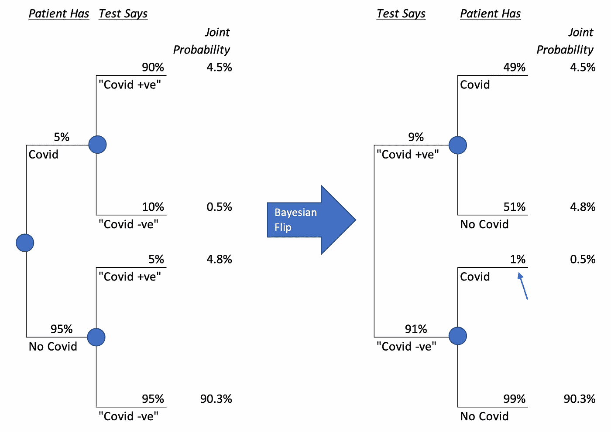
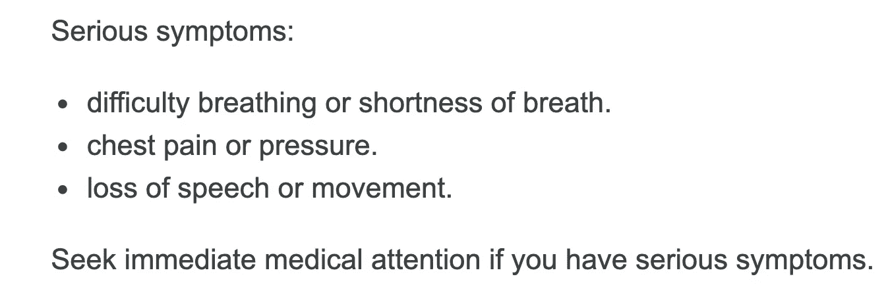
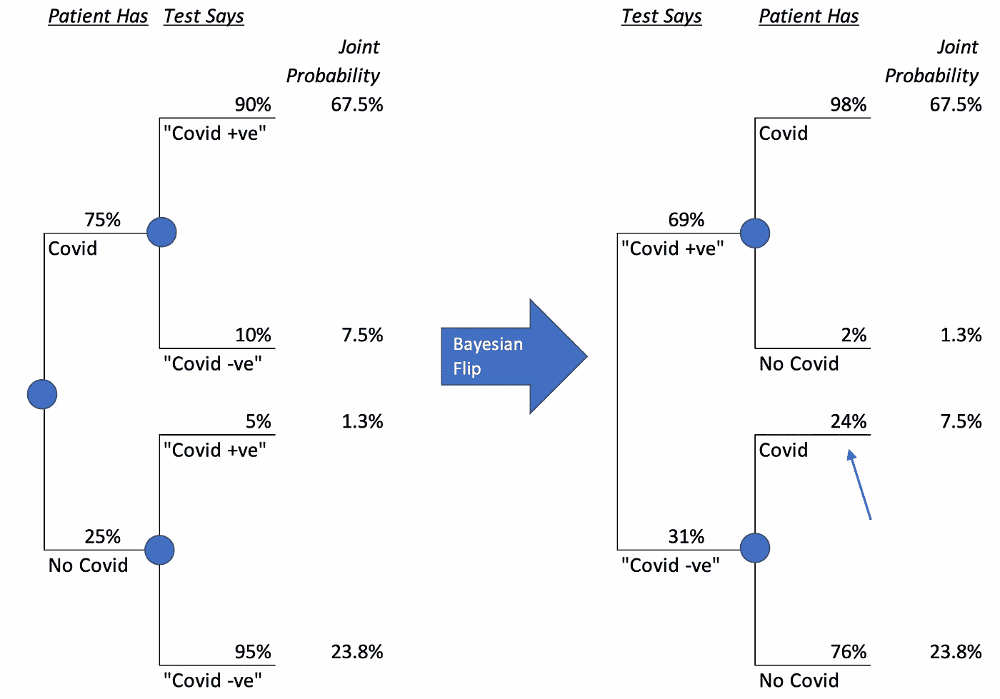
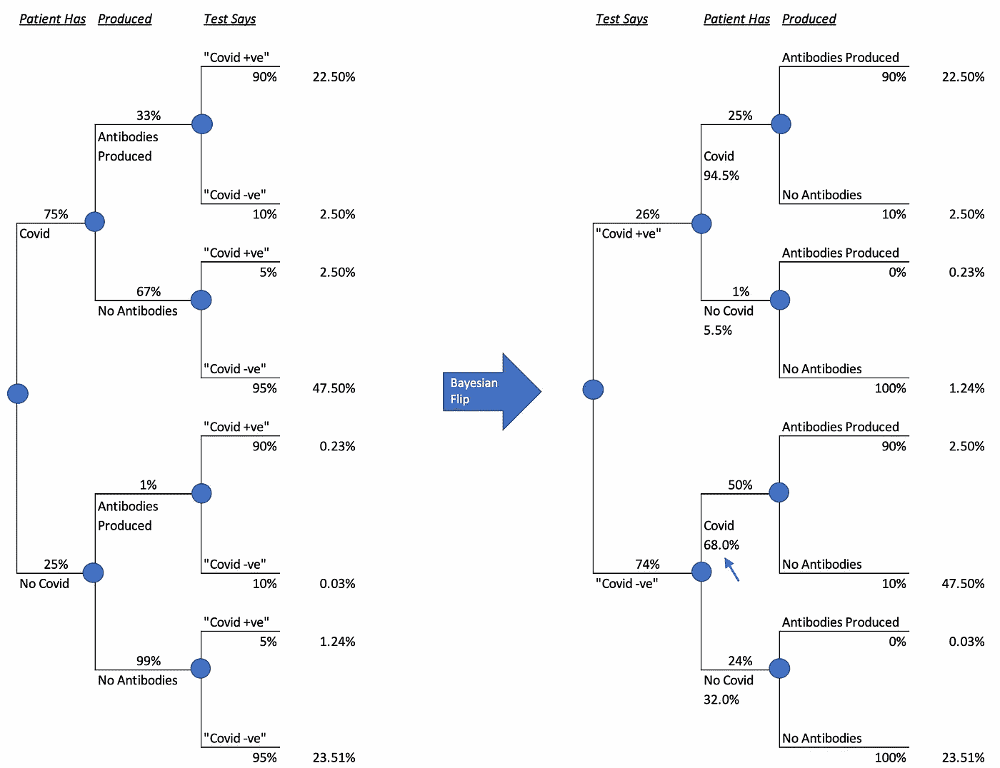
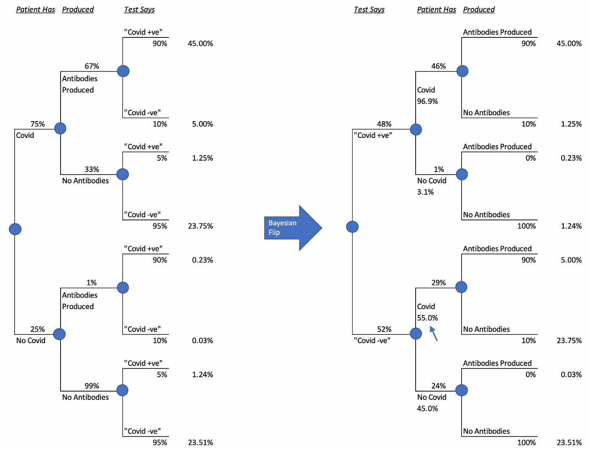

# 如何混淆流行与概率创造了医疗事故的背景

> 原文：<https://towardsdatascience.com/how-confusing-prevalence-with-probability-creates-the-context-for-malpractice-ec292615644b?source=collection_archive---------54----------------------->

## 正确解释阴性 Covd-19 抗体检测结果

来源: [PublicDomainPictures](https://pixabay.com/photos/maze-graphic-render-labyrinth-2264/)

新冠肺炎让我们许多人成为了数据科学家。我希望它也能让我们中的一些人成为决策科学家。这将降低像我的朋友简这样的人不得不从她的初级保健医生那里处理医疗事故的几率。

在我向你介绍简的故事之前，让我先告诉你约翰的故事，他是一个谨慎的人，一有机会就去做新冠肺炎抗体检测。当检测结果为阴性时，他成为无症状携带者并产生免疫力的希望破灭了。约翰试图解释这些结果，而你，一个初露头角的决策科学家，被要求提供帮助。你首先查看 [CDC 网站](https://web.archive.org/web/20200525142802/https://www.cdc.gov/coronavirus/2019-ncov/lab/resources/antibody-tests-guidelines.html)，发现他们正试图通过一个例子来教育你敏感性和特异性，其中敏感性为 90%，特异性为 95%，人口中新冠肺炎的患病率为 5%。让我们提醒自己敏感性和特异性的定义:

**敏感度:**给定被测人群中有人患有新冠肺炎，抗体检测结果呈阳性的人群比例。
**特异性:**给定受检人群中有人没有新冠肺炎，抗体检测结果为阴性的那部分人。

现在，我们准备解决第一个问题。

**问题 1:在抗体检测呈阴性的人群中，您认为既往新冠肺炎感染的患病率是多少？**

A.0%
b . 0.5%
c . 49%
d . 50%

互联网上充满了对数学的解释，下面是我制作的一个视频，展示了一种直观的理解方式。

上面的视频显示了如何使用基础代数通过灵敏度和特异性来计算条件患病率。以最高质量设置在全屏模式下观看。

上面的视频显示我们的答案是 0.5%。如果你选了 B，你做得很好！现在，约翰问你，尽管抗体检测呈阴性，他感染新冠肺炎病毒的可能性有多大。你会怎么说？

**问题 2:假设你知道约翰的抗体检测呈阴性，你认为约翰感染新冠肺炎病毒的最合理概率是多少？(假设你对约翰一无所知)**

A.0%
b . 0.5%
c . 10%
d . 50%

停下来思考。完成后，向下滚动到向日葵下面。

来源: [Capri23auto](https://pixabay.com/photos/sunflower-flower-petals-bloom-3614728/)

来源:[曼弗雷德·里希特](https://pixabay.com/photos/sunflower-bud-blossom-go-up-bloom-3536155/)

**概率是对你信念的一种衡量，而不是一种流行或被发现的频率。**你可以选择四个选项中的任何一个，但我们问的问题是根据你目前掌握的数据，你最容易证明的可能性。如果你愿意将一个小样本的数据投射到一个大得多的人群中，这将是选项 B。

> 概率是对你的信念的一种衡量，而不是一种普遍性或被发现的频率。

如果你选择 C 或 D，你将被要求解释除了所提供的数据之外，你还能收集到什么信息。如果你选了 A，那我就向你挑战，看看你是不是真心的。我们人类唯一可以 100%确定的是，我们终有一天会死去(而且我们昨天还没有死去)。对其他任何事情都 100%确定是一个非常糟糕的想法。这是列表中唯一违反科学基本原则的答案。引用敬爱的理查德·费曼的话，

> “在科学中，怀疑是必要的；为了科学的进步，绝对有必要将不确定性作为你内在本性的一个基本部分。为了在理解方面取得进步，我们必须保持谦虚，承认我们不知道的事情。没有什么是确定的，也没有什么是确凿无疑的。你调查是因为好奇，因为未知，而不是因为知道答案。随着你在科学领域获得更多的信息，不是你在发现真相，而是你在发现这个或那个或多或少有可能。
> 
> 也就是说，如果我们进一步调查，我们会发现科学的陈述不是关于什么是真什么是假，而是关于已知的不同程度的确定性的陈述……科学的每一个概念都处于绝对虚假或绝对真实之间的某个刻度上，但并不在这两者的两端。"

> 科学的每一个概念都在一个刻度上，介于绝对谬误和绝对真理之间，但不在两者的末端。

所有这些听起来相当学究气和知性，但我向你保证不是。现在让我们回到简的故事来理解为什么。在纽约市新冠肺炎疫情的巅峰时期，简病得很重，表现出了新冠肺炎的所有严重症状。谢天谢地，她和向我伸出援手的母亲在一起。我立即建议简接受电话预约，她照做了。医生证实，这看起来像是一个严重的新冠肺炎病例。有人建议简彻底休息一个月。大约 6 周后，除了一个人，严重的症状都消退了。她仍然不能说话。她需要更多的休息，她的工作场所现在已经开始了一个短期的残疾评估过程。这需要初级保健医生(PCP)的认证。简做了抗体测试，结果呈阴性。她把结果带给了她的医生。

在我继续讲这个故事之前，让我们试试另一个问题。

**问题 3:如果你是一名检查了 Jane 的报告和抗体测试结果的 PCP，你认为 Jane 感染新冠肺炎病毒的可能性有多大？**

A.0%
B. 0.5%
C. 24%
D. 55%

再想想向日葵，然后向下滚动。

来源:[像素](https://pixabay.com/photos/sunflower-blossom-yellow-flower-2179011/)

来源: [Ulleo](https://pixabay.com/photos/sunflower-sunflower-field-yellow-1627193/)

我知道你没有选 0%，但不幸的是，简的 PCP 就是这么做的。医生宣布简不可能感染新冠肺炎病毒，因为她的抗体测试呈阴性。PCP 违反了费曼的科学原理，因为它是 100%确定的。在 1000 个抗体测试的人群中，简的测试结果可能是假阴性的，而 PCP 不允许这种可能性。

然而，PCP 犯了第二个错误。他混淆了流行和概率。只有当你没有关于 Jane 的其他数据时，仅仅依靠新冠肺炎的患病率数据才有意义。然而，与上面 John 的例子不同，我们有更多关于 Jane 的信息。她不是一个统计上统一的数字，而是一个有着非常特定症状的人类。使用概率的全部意义在于允许我们自由地考虑多种信息来源，并在我们的决策中使用它们。Jane 的 PCP 忽略了 Jane 提交的每一份病历。然后，在一个认知失调的显著举动中，他用一个为什么简仍然不能说话的论题来捆绑他对新冠肺炎可能性的拒绝。他在给保险公司的便条中写道，她肯定患有焦虑症。这并没有伴随任何焦虑药物。与此同时，简的母亲告诉我，她的女儿一直很平静，做好了面对死亡的心理准备，如果那是结果的话。当 PCP 的办公室分享已发送给处理短期残疾流程的保险公司的笔记时，Jane 和她的母亲发现了焦虑的解释。你可以猜测一下保险公司将如何处理 PCP 的票据。

概率性思维会如何不同地引导 PCP 的思维？这就是贝叶斯定理的用武之地。本文开始时提供的相同信息现在使用下面的概率树显示。我们没有将此解释为流行，而是明确定义了以下区别:

1.  **患者有:**这种区分有两个度，有 Covid 和没有 Covid。在我们获得他们的抗体测试结果之前，我们认为任何我们不认识的人都有 5%的机会患有 Covid。这 5%是一个信念的飞跃。我们的主张是，我们相信我们在过去的数据中看到的在小样本中的流行程度具有广泛的适用性。
2.  **检测说:**这里也有两个度数，用引号表示，表示“Covid 阳性”和“Covid 阴性”的检测结果我们首先评估在患者患有 Covid 的情况下，测试显示 Covid 阳性或阴性的可能性，然后在患者没有 Covid 的情况下进行同样的评估。这在技术上被称为可能性，是信仰的又一次飞跃。我们说，考虑到为校准测试而进行的高度有限的测试，我们愿意将灵敏度和特异性更广泛地投射到人群中。

然后，在给定特定测试结果的情况下，我们可以推断出 Covid(或不 Covid)的概率。你只需要中学代数就可以做到这一点，使用下面的图解方法，运用贝叶斯理论。

一个动画视频展示了树翻转在我们的例子中是如何工作的。你会得到和第一个关于患病率的视频相同的结果。以最高质量设置在全屏模式下观看。

使用[这张谷歌表](https://drive.google.com/file/d/10B7NYb-YH2ubg2CccpMV1TWnFhS4ZBS2/view?usp=sharing)来玩下面的模型并理解数学。

左边的树显示了与我们开始时相同的信息。右边的树是“贝叶斯翻转”，它允许我们在给定测试结果的情况下计算 Covid 的条件概率。在这里，我们看到了与文章开头直观显示的结果相同的结果。

现在，我们已经准备好使用我们所掌握的信息。首先，让我们从[世卫组织网站](https://www.who.int/health-topics/coronavirus#tab=tab_3)开始，它列出了常见和不太常见的症状，然后继续定义严重症状:

简呼吸困难、气短、胸痛、有压迫感，并且无法动弹。她已经并继续丧失语言能力。然而，当她去找她的心理医生时，她被告知她对新冠肺炎的怀疑是焦虑的结果。如果你和我一样在阅读这篇文章，那么从科学角度来说*不负责任地给出了 5%的新冠肺炎概率。事实上，考虑到她有世卫组织列出的严重疾病的所有症状，我之前的预测上升到了 75%。我对这样的先验感到很舒服，因为有两个远程医生为她证实了这一点，就像最近的一次心脏病专家访问和一次紧急护理访问一样。对 Jane 来说不幸的是，是 PCP 向保险公司宣布判决。让我们回到数学上来。如果 PCP 有概率倾向，他会画出下面的树:*

正如你所看到的，新冠肺炎接受抗体检测呈“Covid -ve”的概率现在已经从 0.5%跃升至 24%。这是上面问题 3 中的答案 C。即使抗体检测结果为阴性，也有大约四分之一的人会感染新冠肺炎病毒。既然 0.5%不确定性的小孔已经扩大到 24%的窗口，为什么还要止步于此？

与此同时，我一直将抗体的存在与新冠肺炎的存在混为一谈。如果那不是真的呢？决策分析邀请我们问一个基本的问题:“数据中缺少了什么可以解释我们所看到的许多东西？”首先，如果事实证明不是每个感染新冠肺炎病毒的人都产生了可以被检测出来的抗体，那对我们得出的结论来说将是非常重要的。原来，疾控中心还没有批准抗体测试，并仍在评估它们。

> 决策分析邀请我们问一个基本的问题:“数据中缺少了什么可以解释我们所看到的许多东西？”

如果我持怀疑态度，相信只有三分之一的新冠肺炎患者会产生抗体，我会得到惊人的不同结论，就像这样:

请注意，没有理论上理解的机制，即没有 Covid 的人会产生抗体。然而，我将遵循科学原理，给出 1%的概率，而不是 0%的概率，来解释某人可能已经具有这种抗体的未知途径。

如果简的检测结果是阴性，我认为她仍然有 Covid 的概率是 68%！应该问的问题是:我有理由认为有 33%的几率会产生抗体吗？有一些零星的证据应该让我停下来，比如在一所监狱里，几乎每个人都产生了抗体。

事实上，我倾向于认为大多数新冠肺炎患者会产生抗体。对我来说，问题是这些抗体能否被市场上的特定检测试剂盒检测到。考虑到我们在这方面的早期，一项研究永远不足以让我们形成坚定的信念，我不能证明超过 2/3 的可能性是正确的。让我们看看这个信念会发生什么:

我认为简让新冠肺炎做的抗体测试呈阴性的可能性为 55%。这是上面问题 3 的答案 D，与 0.5%的新冠肺炎几率相差甚远。简单而强大的概率数学允许我们以符合常识的方式进行推理。 ***我强烈怀疑简的身体正在努力对抗感染，鉴于她还不能说话。*** 这很有可能是没有检测到检测所寻找的可检测抗体的原因。在她看到并感觉到自己说话能力的提高后，至少重复两到三次抗体测试是有意义的，因为在这种情况下，她更有可能产生可检测的抗体。

美国疾病预防控制中心和其他国家的同行应该根据新冠肺炎症状的严重程度来调整他们的特异性数字。如果他们这样做了，他们可能会发现对那些有严重症状的人的特异性要低得多。在这种条件下，我之前 33%的怀疑可能是有道理的，因为许多有严重症状的人都挺不过来，而那些痊愈的人需要很长时间。计划使用抗体测试作为评估多少人感染了新冠肺炎病毒的方法的国家会希望将这一条件纳入他们的思考。

简已经收到了其他人的建议，以医疗事故起诉她的医生，但她太累了，打不了这场仗。我对提升我们的决策方式更感兴趣。她的 PCP 最有可能遵循一个简单的新冠肺炎清单，而不是费心让自己与不断发展的世卫组织指南保持同步。如果你知道像简的 PCP 这样做决定的医生，我希望这篇文章能帮助你建设性地与他们打交道。拥抱不确定性是正确的科学立场，它开辟了一个完全不同的思维领域，比虚假的确定性有用得多。

*感谢 Rahul Brown、Alejandro Martinez 博士和 David Hutton 博士在撰写过程中提供的反馈。这里的任何错误都是我造成的。*