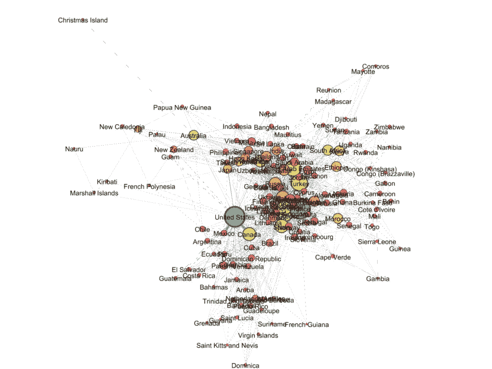
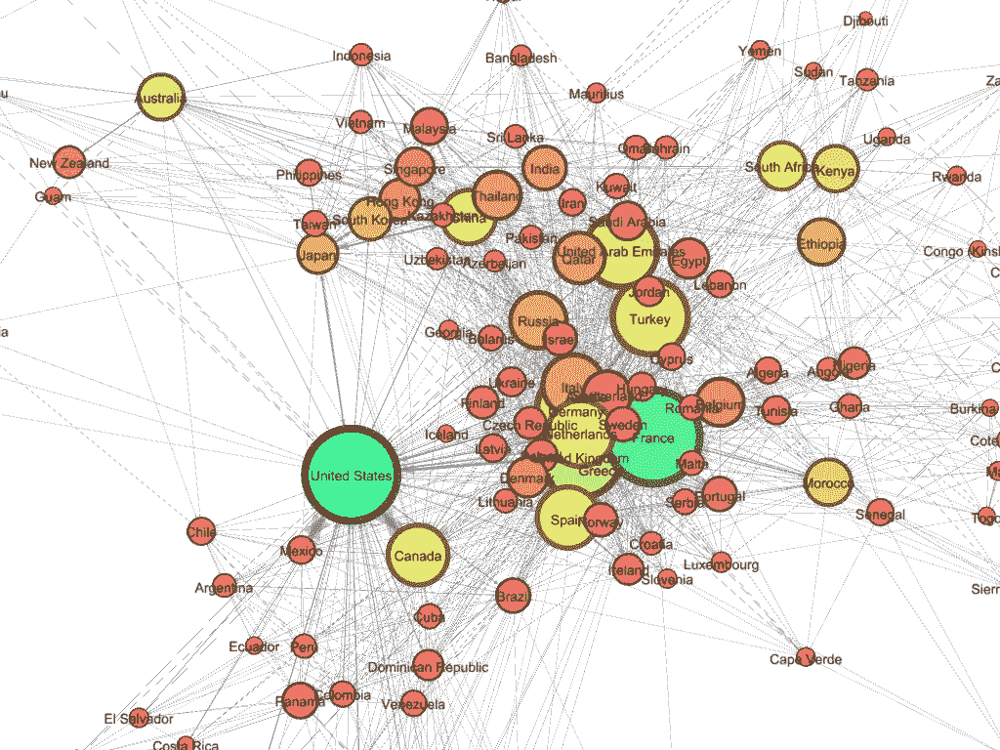
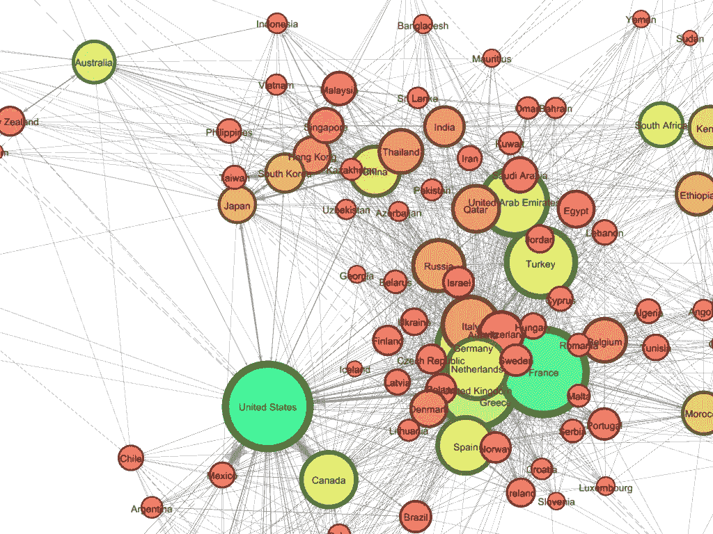
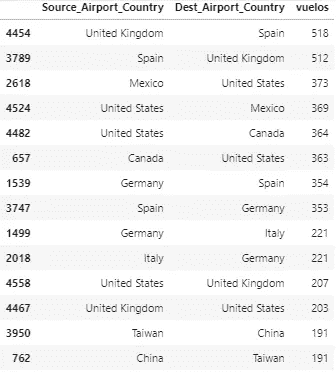
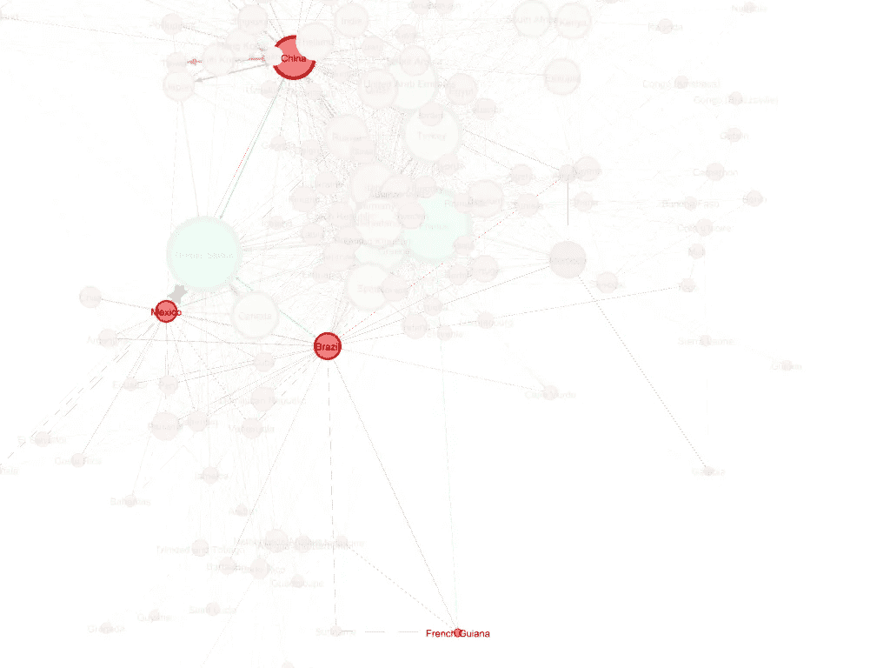
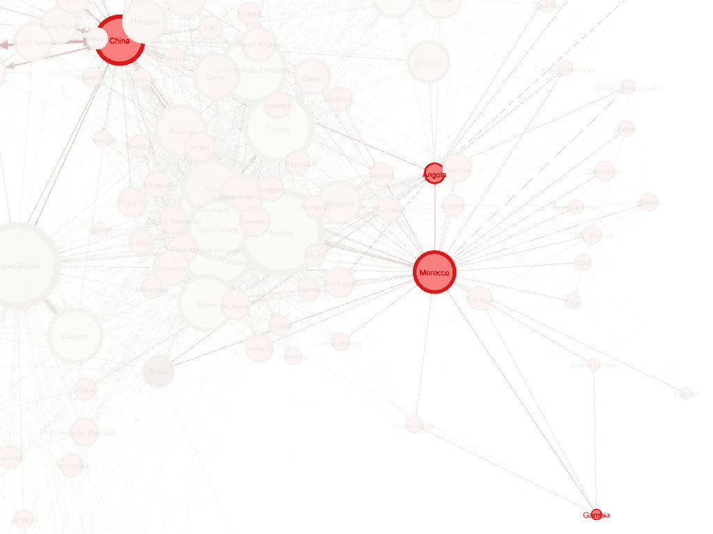

# 世界的联系有多紧密？通过国家间的航空联系进行分析

> 原文：<https://towardsdatascience.com/how-connected-is-the-world-45f272e21d3e?source=collection_archive---------39----------------------->

## 穿越 150 多个国家的旅行，使用 python 和图表

来自[的](https://unsplash.com/photos/j_MgyPHGRP0)[塞尔吉奥·索萨](https://unsplash.com/@serjosoza)的照片

## 你有没有想过这个世界的联系有多紧密？

可能是的，当新冠肺炎病毒开始在中国传播时，我们都开始猜测它是否有任何机会到达我们的国家。

如果你还有任何疑问，世界是**非常连接**，我们将在以下段落中检查它。

# **准备**

我从[Openflights.org](https://openflights.org/data.html)下载了 3 个数据集，包含 2015 年以来的航线、航空公司和机场。

总共有 **67，600 条航线**(商业和私人)往来于大约 **200 个国家和地区**。

我使用 Python(主要是 *Pandas* 、 *Networkx* 和 *Seaborn* 库)处理数据，然后我用 *Gephi* 做网络的可视化。

为了进行分析，我们将使用以下概念:

> [**中心性**](https://en.wikipedia.org/wiki/Betweenness_centrality) 或居间:表示那个国家在世界上有多中心或孤立，换句话说，**从那个国家到世界其他地方有多容易**。
> 
> [**国家的重要性**](https://en.wikipedia.org/wiki/PageRank) :表示国家在网络中有多重要，即**国家在与其他国家的联系的数量和质量上的联系程度**。它不一定是一个中心国家，但它可能与其他国家有很多联系。

为了便于阅读图表，我们将把**颜色**理解为国家在网络中的**重要性，将**大小**理解为其**中心性**。**

至于地位，它将是国家的中心地位和与之相连的国家之间的结合。

# 让我们开始旅行吧

首先我们要排除一些*中心性*值非常低(几乎孤立)的国家和地区，比如图瓦卢(大洋洲)、直布罗陀(欧洲)、百慕大(美洲)、莱索托或者布隆迪(非洲)。

## 让我们根据*的空中连接*来看看**世界看起来是什么样子的**

作者图片

在这张图片中，我们可以看到**大陆根据它们的航空联系被分组**。

> 欧洲在中间，亚洲稍微高一点。在左下角我们看到美洲，在左上角是大洋洲国家，在右边是非洲国家。

如果我们再放大一点:

作者图片

我们首先可以确定的是，**欧洲国家位于图的中心**，此外，它们的几个节点都很大。

这向我们表明，从字面上看，我们可以把这块大陆视为世界航空联系的中心，是其国家之间以及与其他大陆之间联系最多的地区。

与此同时，我们很少看到大洋洲、非洲和美洲之间的联系。为了能够沟通这些大陆，有必要通过亚洲或欧洲。

记住*颜色是国家在网络中的重要性*和*大小是它的中心性*，我们可以再次放大图表的中心，看到**美国也是一个中心国家**，在网络中非常重要。尽管在美国，但它与世界其他地方有很多联系。

作者图片

如果我们继续*环游世界*，根据节点的**大小**，我们可以在图中看到网络上**连接最多的国家**是法、美、英、德、阿联酋。

如果按**颜色**分析，连接数最高的国家(**重要性** ) 实际上是一样的，虽然我们看到澳大利亚和加拿大即使不是中心国家也包括在内。

## 国家之间最重要的联系是什么？

作者图片

这是我们想回答的另一个问题。为此，我们求助于用 *Python* 和*熊猫*完成的工作。

我们可以看到，最重要的联系是在英国、西班牙和德国之间，以及美国、墨西哥和加拿大之间。

# **新冠肺炎**

最后，回答我们在开始时问自己的关于新冠肺炎病毒传播的问题，**病毒从中国传播到世界其他地方有多容易？**

使用*最短路径*的概念，让我们看看中国是如何与美国的一个低中心性国家联系起来的，比如法属圭亚那。

作者图片

> 它只需要 4 步:中国，墨西哥，巴西和法属圭亚那。

让我们看看另一个例子，我们如何把中国和一个非洲的低中心国家联系起来？在这种情况下，我选择冈比亚。

作者图片

> 同样，只需要 4 个步骤:中国、安哥拉、摩洛哥和冈比亚。

# **结论**

我们通过航线观察了一个**超互联世界**。然而，除了美国之外，T4 主要集中在欧洲的几个国家和亚洲的一些国家。

此外，我们还发现了空中网络中最重要的**个国家**，这些国家与许多国家都有大量的联系。比如:*法国、英国、美国、德国或者阿联酋*。

最后，我们看到从中国到美洲或非洲的一个偏远国家只需要 4 步。这解释了新冠肺炎病毒是如何迅速影响整个世界的。

作为本书的结束语，*就其在全球航空网络中的中心地位或重要性而言，有没有哪个国家让您感到惊讶？*

下一步将对世界上所有的城市进行同样的分析。

## 无论如何，乍一看，这个世界是紧密相连的，无论在另一个国家发生什么，它确实比我们想象的更近。