# 卷积神经网络如何解释图像

> 原文：<https://towardsdatascience.com/how-convolution-neural-networks-interpret-images-1f99913070b2?source=collection_archive---------20----------------------->

## [深度学习+生物](https://medium.com/deep-learning-biology)

## 关键构建模块的直观指南

[来源](https://unsplash.com/photos/xYamknRmK04)

本文的目的是让**对卷积神经网络中的关键层**有一个直观的了解。这个想法是超越简单陈述事实和探索图像处理实际上是如何工作的。

## 目标

假设我们的目标是训练一个深度学习网络，以成功区分如下所示的猫和狗的图像

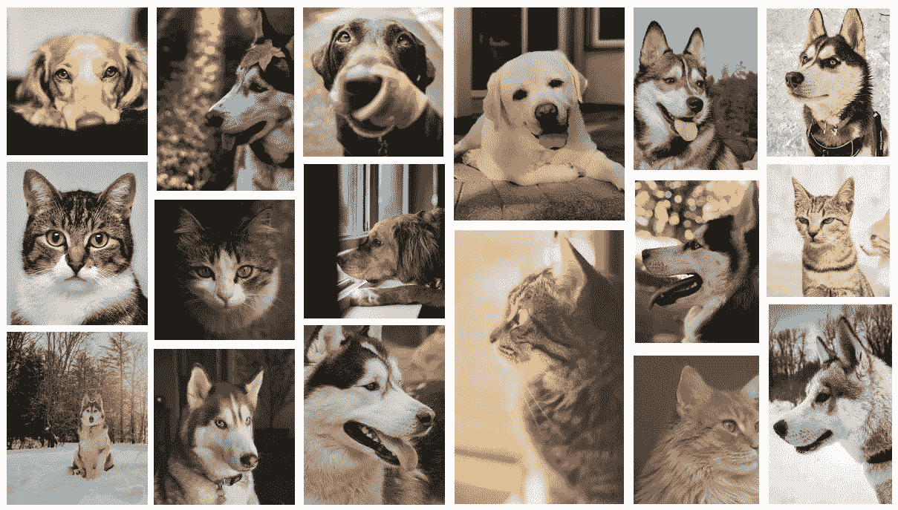

[来源](https://unsplash.com/photos/XGZZrXODE3k)

让我们从思考这样的算法必须克服哪些挑战开始。首先，它必须能够检测不同颜色、大小、形状和品种的猫和狗。当只能看到狗/猫的某一部分而不是整个部分时，它也必须工作。该算法必须对图像中不止一只狗/猫的存在敏感，最重要的是，它必须是空间不变的——它必须不期望狗/猫在图像的某个部分。在下面的章节中，我们将探讨 CNN 架构的不同组件如何产生所有这些功能。

# 计算机如何读取图像。

图像由像素组成，像素值代表亮度，范围从 0 到 255。0 代表黑色，255 代表白色，其他都是灰色。像素越多，图像质量越好。

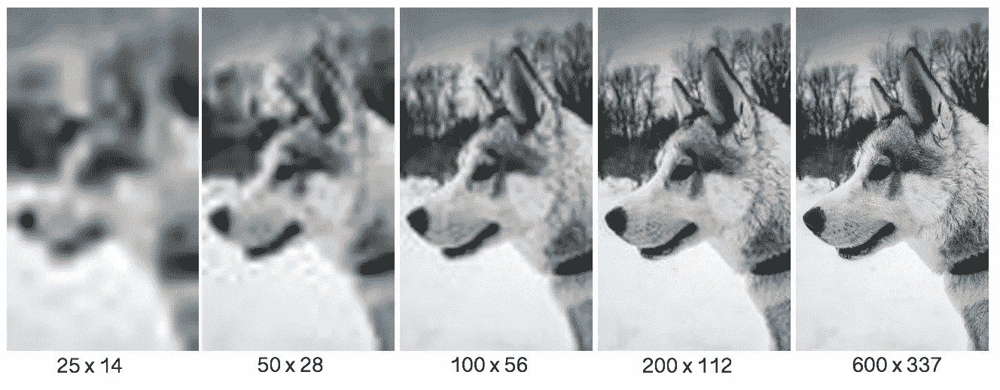

图像质量随着像素数的增加而提高。[作者制作]

虽然灰度图像是由单个通道(即单个 2D 像素阵列)组成的，但 RBG 格式的彩色图像是由三个不同的层组成的，这三个层相互堆叠在一起。

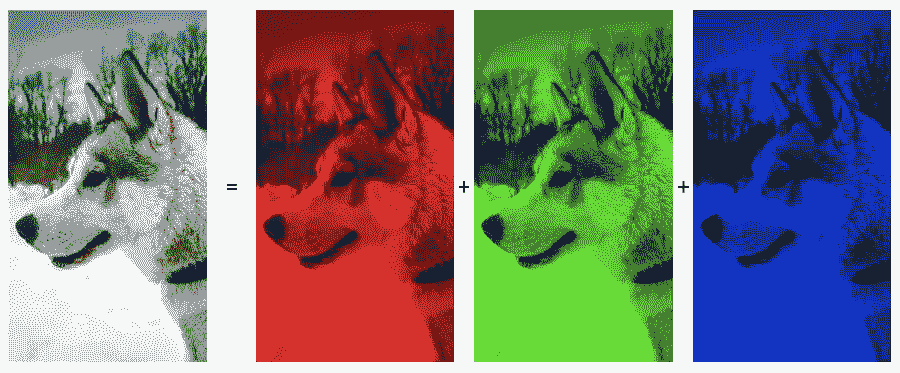

RGB 图像的三个通道， **r** ed， **g** reen， **b** lue。【作者制作】

# 多层感知器的局限性。

传统的神经网络不适合像图像分类这样的深度学习应用。每个像素的内容在输入层分别输入到感知器中。对于尺寸为 600*377*3 的 RGB 图像，仅输入层要学习的参数总数将为(600*377*3*2(每个神经元两个参数，权重和偏差))~ 150 万。这个数字将与层数成线性比例。然而，这并不是 MLP 面临的唯一挑战。MLP 没有内在的空间不变机制。如果一只 MLP 已经被训练来检测图像右上角的狗，当狗位于其他位置时，它将失败。

卷积神经网络旨在使用内置机制来改善这些缺点，该机制用于 **(1)提取不同的高级特征(2)引入空间不变性(3)提高网络学习能力。**

# 图像特征提取。

卷积(具体来说是离散卷积)是基于使用线性变换来从图像中提取关键特征，同时保持信息的顺序。输入与一个**内核**进行卷积，产生输出，类似于人类视觉皮层神经元网络产生的响应。

## 核心

内核(也称为滤波器或特征检测器)在水平和垂直方向上以预定的步长(称为**步长**)对输入图像矩阵进行采样。当核在输入图像上滑动时，计算核的每个元素与输入图像的重叠元素之间的元素乘积，以获得当前位置的输出。

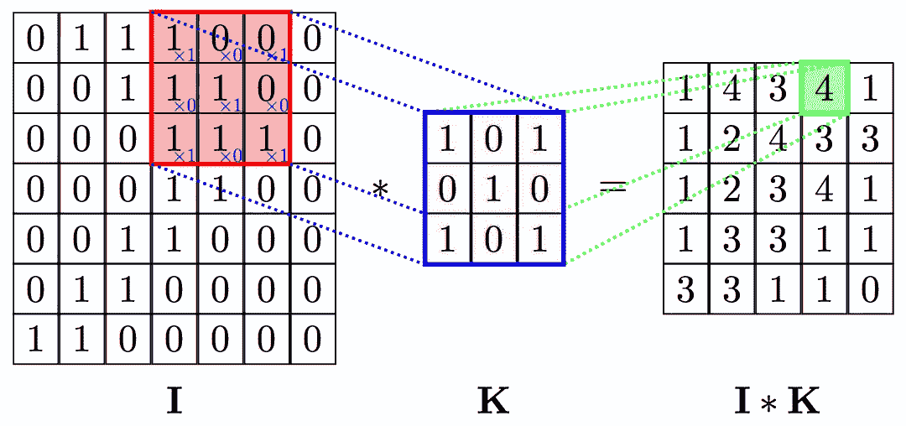

**卷积**:用 3*3 滤波器 **K** 对表示为 7*7*1 维张量的图像 **I** 进行卷积，得到 5*5 的输出图像。上面显示的是一个乘法步骤。[来源](https://github.com/PetarV-/TikZ/tree/master/2D%20Convolution)，图片免费分享。

当输入图像由多个通道组成时(几乎总是如此)，内核的深度与输入图像中通道的数量相同。在这种情况下，点积被相加以获得由单个通道组成的最终特征图。如果你是矩阵乘法的新手，看看这个 youtube 视频的详细解释。

**单步卷积**:该动画展示了内核(显示为一个 3*3 的移动正方形)如何从左到右和从上到下扫描输入图像，从而在右侧产生输出图像。对于一步一个卷积，内核在每一步中向每个方向移动一个单位距离。[来源](https://github.com/aqeelanwar/conv_layers_animation)，图片免费分享。

每个卷积层由许多不同的滤波器组成，每个滤波器提取不同的特征。虽然由单个卷积层构成的 CNN 将仅提取/学习低级特征，但是添加连续的卷积层显著提高了学习高级特征的能力。

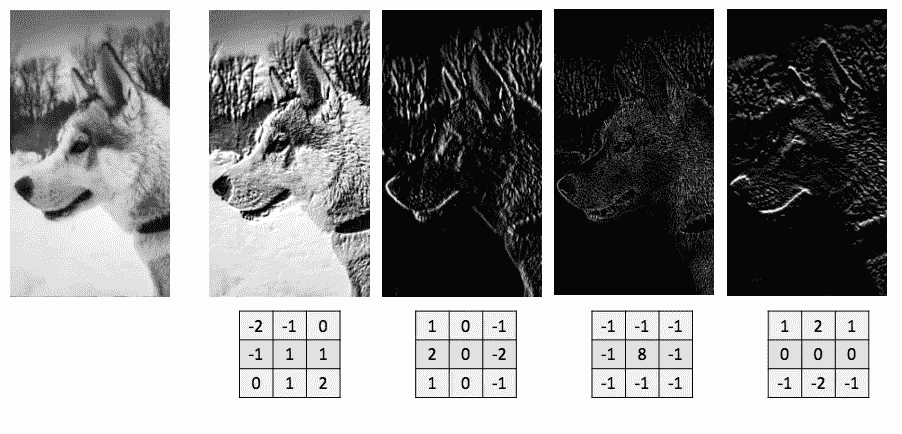

**特征提取:**一个 600*377 的灰度图像与 4 个不同的 3*3 滤波器卷积，导致不同的图像特征被提取到不同的程度。[作者制作]

## 整流器

为了在系统中引入非线性并提高学习能力，卷积运算的输出通过非饱和激活函数，如 sigmoid 或整流线性单元(ReLU)。看看这篇[关于这些和其他几个常用激活函数的优秀文章](/complete-guide-of-activation-functions-34076e95d044)。最常用的激活函数 ReLU 本质上保留正值，并用零替换负值。

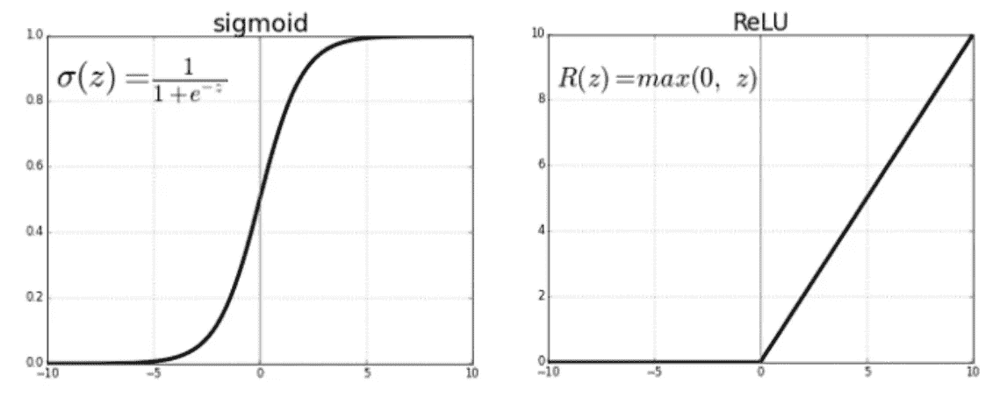

整流器:两个最广泛使用的整流器函数，sigmoid 和 ReLU。[作者制作]

## 填料

与输入图像相比，由卷积产生的特征图在尺寸上更小。对于一个输入图像 **I** * **I** 与大小为 **K** * **K** 的核进行卷积，步长为 **S** ，输出将为**[(I-F)/S+1】*****[(I-F)/S+1】**。这可以导致由几个卷积层构成的 CovNets 中的图像尺寸显著减小。输出图像周围的零填充 **[(F-1)/2]** 可用于保持卷积输出。

对于尺寸为 **I** * **I** 的输入图像与尺寸为 **K** * **K** 的滤波器以步长 **S** 和填充 **P** 进行卷积的最一般情况，输出将具有尺寸**[(I+2P-K)/S+1]*[(I+2P-K)/S+1]**。

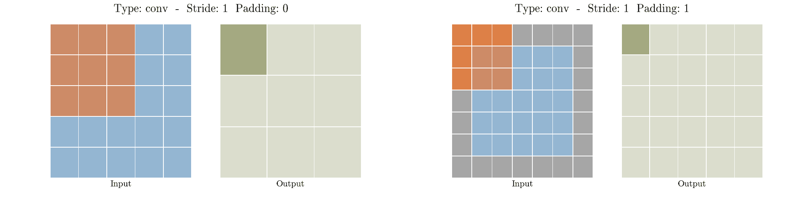

**填充**:当一个 5*5 的图像与一个没有填充的 3*3 内核进行卷积时，得到的图像是 3*3。单层填充将输入图像尺寸更改为 7*7。当与 3*3 滤波器卷积时，会产生 5*5 输出，与原始输入的大小相同。[来源](https://github.com/aqeelanwar/conv_layers_animation)，图片免费分享。

## **联营**

汇集卷积输出，以便引入空间不变性，即在不同图像中检测相同特征的能力。这里的想法是保留与 CNN 必须了解的重要特征相对应的关键信息，同时通过去除无关紧要的信息来减小图像大小。虽然有几种变化，但最大池是最常用的策略。卷积乘积被分割成大小为 **K** * **K** 的非重叠面片，并且在输出中只记录每个面片的最大值。

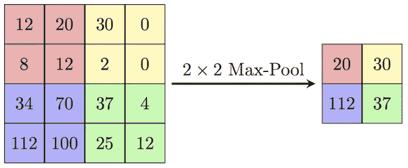

**Max-Pooling** :一个 4*4 的输入图像与一个 2*2 的内核进行 Max-Pooling，产生一个 2*2 的输出。[来源](https://computersciencewiki.org/index.php/Max-pooling_/_Pooling)，图片免费分享。

其他不常用的汇集策略包括平均汇集、“混合”最大平均汇集、随机汇集和空间金字塔汇集。

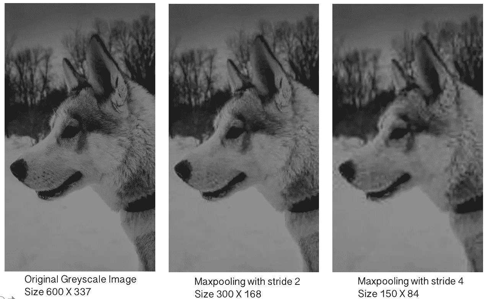

**MaxPooling** :虽然图像尺寸大大减小，但是池化图像仍然包含训练图像分类网络所需的所有关键特征。请注意，stride 2 maxpooling 操作对图像质量的影响很小。[作者制作]

到目前为止所讨论的 CNN 的两个关键元素:卷积层(由内核、步幅、激活函数定义)和池层以预定的模式组合在一起，以定义 CNN 架构。虽然我不会进入架构细节，但在下一节中，我们将讨论这些神经网络进行图像处理的一些一般特征。

# *可视化内层*

我使用了一个[公开可用的](https://www.kaggle.com/chetankv/dogs-cats-images)带标签的猫&狗图像数据集，并训练了一个二进制分类器(inceptionv3)。使用这个训练过的网络，我们可以感受一下 CNN 实际上是如何处理图像的。

首先，我们获取一个样本图像，并通过这个训练好的网络进行传递。3 个卷积和相关激活层(我使用 ReLU)的输出如下图所示。显而易见的是，随着我们沿着网络向下移动，输出变得越来越难以理解。当我们在第 25 层时，很难判断输入网络的图像是一只狗还是一只猫。值得注意的是，这个网络的整体架构相当复杂(这里不包括)，第 25 层甚至还不到网络的一半。那么这些层实际上在学习什么呢？仅仅看下面的图片并不明显。

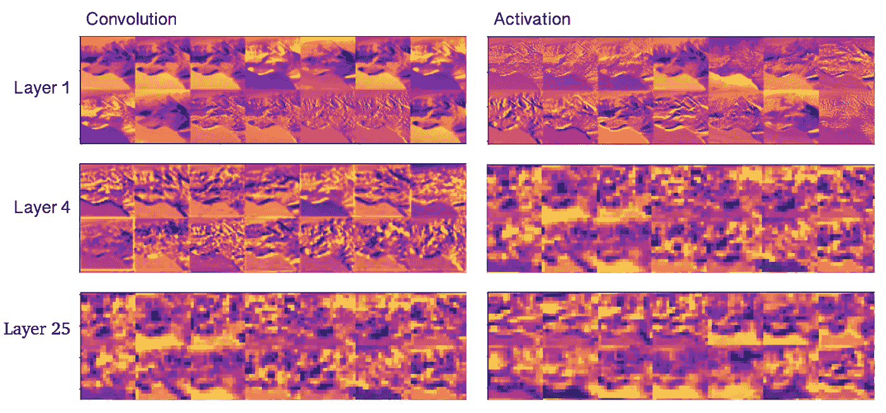

当输入狗的图像时，训练好的 CNN 的卷积和相关的激活层。[作者制作]

上图只是显示了输入图像的每个图层的输出。我们需要的是可视化每个卷积层的不同内核。这将告诉我们每个过滤器正在检测什么。我们从随机噪声构成的图像开始，并针对层中的每个内核对其进行优化。换句话说，我们在一个经过训练的网络中使用一组过滤器，并询问“什么样的输入图像将激活这个特定的内核”。了解这张图像将会告诉我们更多关于特定过滤器检测的内容。这个逻辑和相关代码的更详细的解释可以在[这里](/understanding-your-convolution-network-with-visualizations-a4883441533b)和[这里](/feature-visualization-on-convolutional-neural-networks-keras-5561a116d1af)找到。

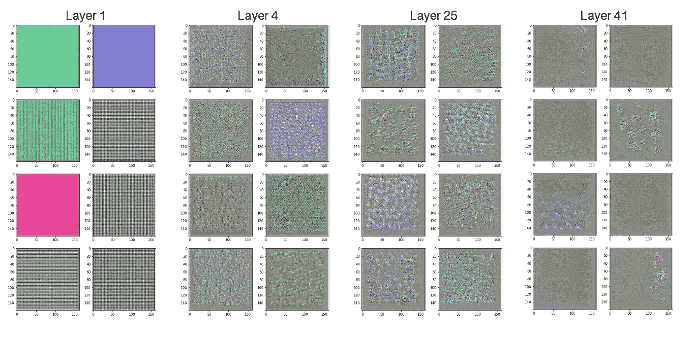

所选图层的特征可视化。[作者制作]

上面可视化的是与上面相同的层的一些过滤器激活模式。不同的层由图像的不同部分激活。层 1 本质上是由水平和垂直边缘激活的边缘检测器。随着我们深入网络，卷积核识别的模式变得复杂和稀疏，因为在这些阶段提取了更多的抽象图像特征。

## *结论。*

在本文中，我试图解释不同卷积层的设计和内部工作原理。如果你有任何建议，请给我留言或写信到 aseem.kash@gmail.com。