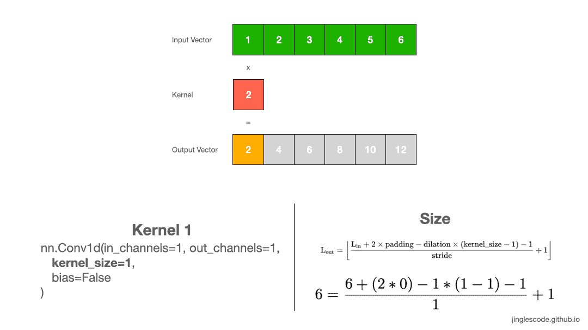
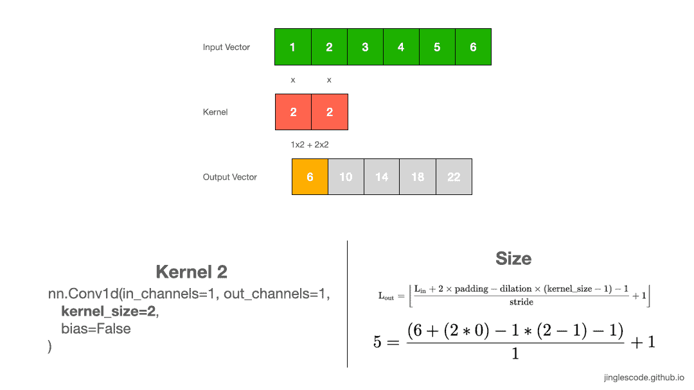
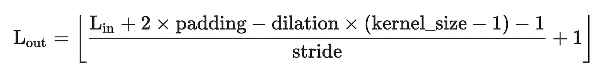
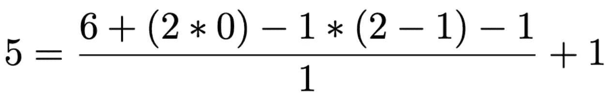
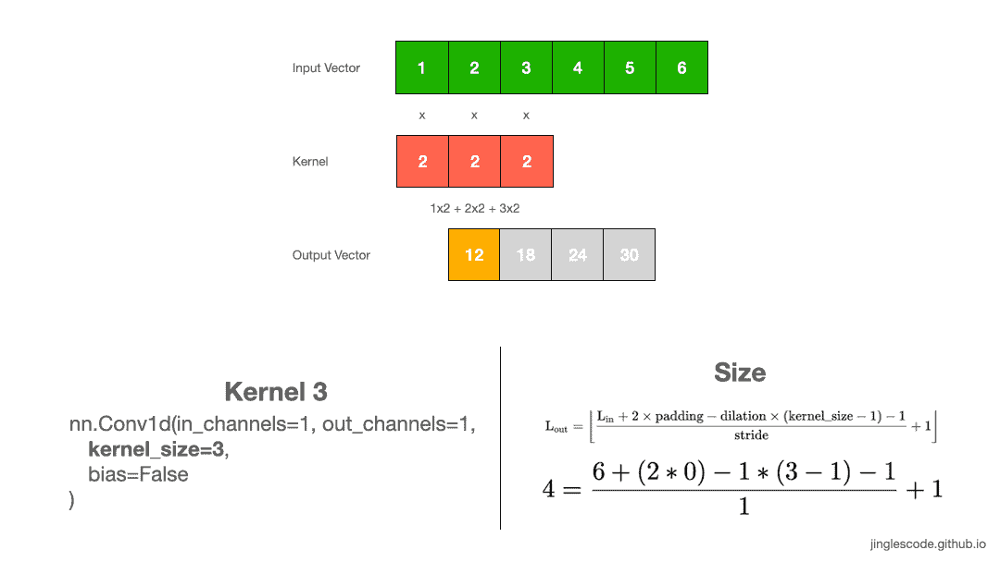
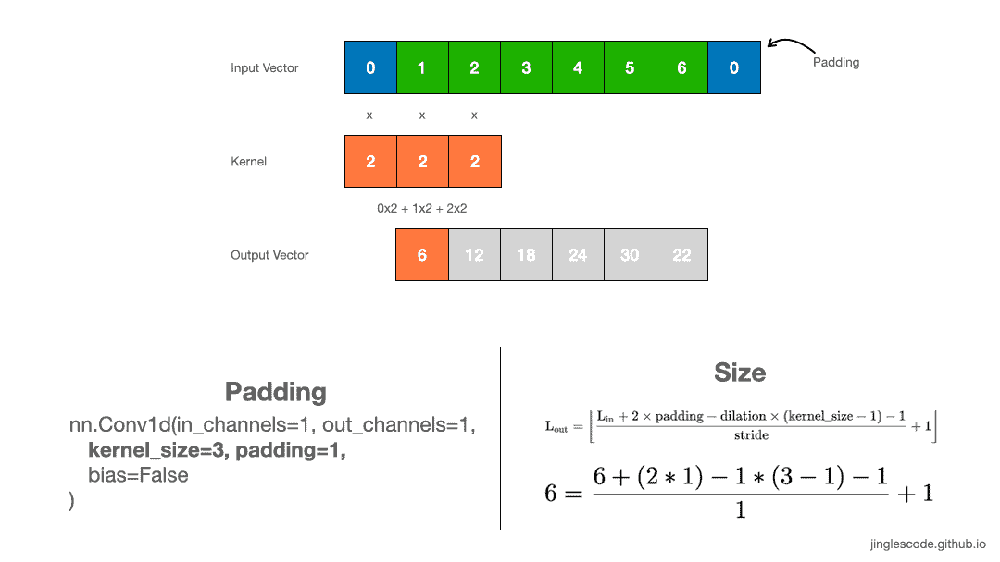
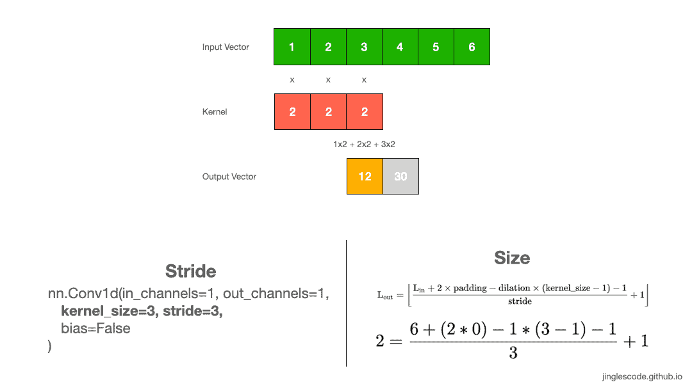
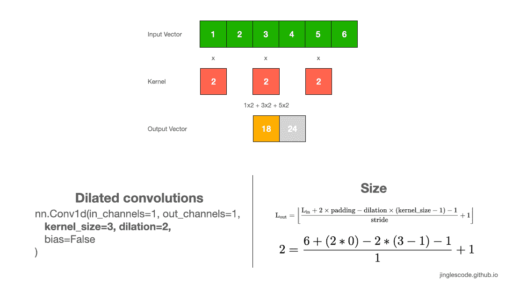
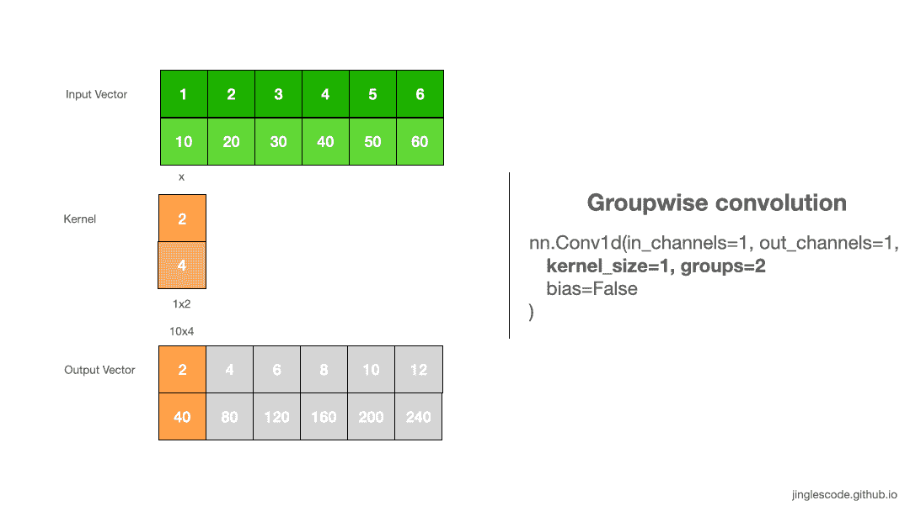

# 深度学习神经网络中卷积层是如何工作的？

> 原文：<https://towardsdatascience.com/how-convolutional-layers-work-in-deep-learning-neural-networks-2913af333b72?source=collection_archive---------47----------------------->

## [入门](https://towardsdatascience.com/tagged/getting-started)

## 理解卷积及其参数的生动方式


图片由 [stokpic](https://pixabay.com/users/stokpic-692575/?utm_source=link-attribution&utm_medium=referral&utm_campaign=image&utm_content=629726) 来自 [Pixabay](https://pixabay.com/?utm_source=link-attribution&utm_medium=referral&utm_campaign=image&utm_content=629726)

在深度学习中，卷积层是许多深度神经网络的主要构建模块。该设计的灵感来自视觉皮层，在视觉皮层中，单个神经元对视野中被称为感受野的受限区域做出反应。这些区域的集合重叠覆盖了整个可视区域。

虽然卷积层最初应用于计算机视觉，但其平移不变的特性允许卷积层应用于自然语言处理、时间序列、推荐系统和信号处理。

理解卷积的最简单方法是将其视为应用于矩阵的滑动窗口函数。本文将介绍 1D 卷积的工作原理，并探讨每个参数的影响:

*   内核大小
*   填料
*   进展
*   扩张
*   组

# 卷积是如何工作的？(内核大小= 1)

卷积是一种线性运算，涉及输入权重相乘并产生输出。乘法是在输入数据数组和权重数组(称为内核(或过滤器))之间执行的。在输入和内核之间应用的运算是元素点积的和。每个操作的结果都是一个值。

让我们从最简单的例子开始，当你有 1D 数据时，使用 1D 卷积。对 1D 数组应用卷积会将内核中的值与输入向量中的每个值相乘。

假设我们的内核(也称为“权重”)中的值是“2”，我们将输入向量中的每个元素乘以 2，一个接一个，直到输入向量的末尾，得到我们的输出向量。输出向量的大小与输入向量的大小相同。

[](https://jinglescode.github.io/2020/11/01/how-convolutional-layers-work-deep-learning-neural-networks/)

对大小为 1 的核应用卷积[[作者的图像](https://jinglescode.github.io/2020/11/01/how-convolutional-layers-work-deep-learning-neural-networks/)

首先，我们将 1 乘以权重 2，得到第一个元素的“2”。然后我们将内核移动 1 步，用 2 乘以权重，2 得到“4”。我们重复这个过程，直到最后一个元素，6，然后用 6 乘以权重，我们得到“12”。这个过程产生输出向量。

```
in_x.shape torch.Size([1, 1, 6])
tensor([[[1., 2., 3., 4., 5., 6.]]])
out_y.shape torch.Size([1, 1, 6])
tensor([[[ 2.,  4.,  6.,  8., 10., 12.]]], grad_fn=<SqueezeBackward1>)
```

# 内核大小的影响(内核大小= 2)

不同大小的内核将检测输入中不同大小的特征，并进而产生不同大小的特征图。让我们看另一个例子，其中内核大小为 1x2，权重为“2”。像以前一样，我们在每个元素的输入向量上滑动内核。我们通过将每个元素乘以核来执行卷积，并将乘积相加以获得最终的输出值。我们一个接一个地重复这个乘法和加法，直到输入向量结束，并产生输出向量。

[](https://jinglescode.github.io/2020/11/01/how-convolutional-layers-work-deep-learning-neural-networks/)

对大小为 2 的核应用卷积[ [作者的图像](https://jinglescode.github.io/2020/11/01/how-convolutional-layers-work-deep-learning-neural-networks/)

首先，我们将 1 乘以 2 得到“2”，将 2 乘以 2 得到“2”。然后，我们将 2 和 4 这两个数字相加，得到“6”，这是输出向量中的第一个元素。我们重复相同的过程，直到输入向量结束，并产生输出向量。

```
in_x.shape torch.Size([1, 1, 6])
tensor([[[1., 2., 3., 4., 5., 6.]]])
out_y.shape torch.Size([1, 1, 5])
tensor([[[ 6., 10., 14., 18., 22.]]], grad_fn=<SqueezeBackward1>)
```

# 如何计算输出向量的形状

您可能已经注意到，输出向量比以前稍微小了一些。这是因为我们增加了内核的大小，从 1x1 增加到 1x2。查看 [PyTorch 文档](https://pytorch.org/docs/stable/generated/torch.nn.Conv1d.html#torch.nn.Conv1d)，我们可以用下面的公式计算输出向量的长度:



计算输出的形状。【[来源](https://pytorch.org/docs/stable/generated/torch.nn.Conv1d.html#torch.nn.Conv1d)

如果我们将大小为 1x2 的核应用于大小为 1x6 的输入向量，我们可以相应地替换这些值，并得到 1x5 的输出长度:

[](https://jinglescode.github.io/2020/11/01/how-convolutional-layers-work-deep-learning-neural-networks/)

应用 1x2 内核后输出向量的形状。[ [作者图片](https://jinglescode.github.io/2020/11/01/how-convolutional-layers-work-deep-learning-neural-networks/)

如果要构建神经网络架构，计算输出要素的大小至关重要。

# 常见的内核大小是奇数(内核大小= 3)

在前面的例子中，内核大小为 2 有点不常见，所以让我们再举一个例子，我们的内核大小为 3，其权重为“2”。像以前一样，我们通过将每个元素乘以内核并将乘积相加来执行卷积。我们重复这个过程，直到输入向量结束，产生输出向量。

[](https://jinglescode.github.io/2020/11/01/how-convolutional-layers-work-deep-learning-neural-networks/)

使用大小为 3 的内核应用卷积。[ [作者图片](https://jinglescode.github.io/2020/11/01/how-convolutional-layers-work-deep-learning-neural-networks/) ]

同样，输出向量小于输入向量。对 1×6 输入向量应用 1×3 内核将产生大小为 1×4 的特征向量。

在图像处理中，通常使用 3×3、5×5 大小的核。有时我们可能会对较大的输入图像使用大小为 7×7 的内核。

```
in_x.shape torch.Size([1, 1, 6])
tensor([[[1., 2., 3., 4., 5., 6.]]])
out_y.shape torch.Size([1, 1, 4])
tensor([[[12., 18., 24., 30.]]])
```

# 如何产生一个同样大小的输出向量？(填充)

对 1×6 输入应用 1×3 内核的卷积，我们得到了更短的输出向量 1×4。默认情况下，内核从向量的左侧开始。然后，核一次遍历输入向量的一个元素，直到最右边的核元素位于输入向量的最后一个元素上。因此，内核越大，输出向量就越小。

什么时候使用衬垫？有时，希望产生与输入向量长度相同的特征向量。我们可以通过添加填充来实现。填充是在输入向量的开头和结尾添加零。

通过向 1x6 输入向量添加 1 个填充，我们人为地创建了一个大小为 1x8 的输入向量。这将在输入向量的开头和结尾添加一个元素。执行核大小为 3 的卷积，输出向量基本上与输入向量大小相同。添加的填充值为零；因此，当应用内核时，它对点积运算没有影响。

[](https://jinglescode.github.io/2020/11/01/how-convolutional-layers-work-deep-learning-neural-networks/)

对带有填充的内核应用卷积。[ [作者图片](https://jinglescode.github.io/2020/11/01/how-convolutional-layers-work-deep-learning-neural-networks/)

对于核大小为 5 的卷积，我们也可以通过在输入向量的前端和末端添加 2 个填充来产生相同长度的输出向量。同样，对于图像，将 3x3 内核应用于 128x128 图像，我们可以在图像外部添加一个像素的边界，以产生 128x128 大小的输出特征图。

```
in_x.shape torch.Size([1, 1, 6])
tensor([[[1., 2., 3., 4., 5., 6.]]])
out_y.shape torch.Size([1, 1, 6])
tensor([[[ 6., 12., 18., 24., 30., 22.]]])
```

```
in_x.shape torch.Size([1, 1, 6])
tensor([[[1., 2., 3., 4., 5., 6.]]])
out_y.shape torch.Size([1, 1, 6])
tensor([[[12., 20., 30., 40., 36., 30.]]])
```

# 我们可以将内核移动更多的步数(步幅)

到目前为止，我们一直在一步一步地滑动内核。内核对输入图像的移动量称为“步幅”，默认步幅值为 1。但是我们总是可以通过增加步长来移动内核任意数量的元素。

例如，我们可以用步长 3 来移动我们的内核。首先，我们将前三个元素相乘并求和。然后我们将分三步滑动内核，并对接下来的三个元素执行相同的操作。因此，我们的输出向量大小为 2。

[](https://jinglescode.github.io/2020/11/01/how-convolutional-layers-work-deep-learning-neural-networks/)

对步长为 3 的内核应用卷积。[ [作者图片](https://jinglescode.github.io/2020/11/01/how-convolutional-layers-work-deep-learning-neural-networks/)

**何时增加步幅？**在大多数情况下，我们增加步长来对输入向量进行下采样。应用步长大小 2 会将向量的长度减少一半。有时，我们可以使用更大的步幅来取代池层，以减少空间大小，减少模型的大小，提高速度。

```
in_x.shape torch.Size([1, 1, 6])
tensor([[[1., 2., 3., 4., 5., 6.]]])
out_y.shape torch.Size([1, 1, 2])
tensor([[[12., 30.]]])
```

# 增加卷积的感受野(扩张)

当你在阅读深度学习文献时，你可能已经注意到了术语“扩张的卷积”。膨胀卷积通过在内核元素之间插入空格来“膨胀”内核，并且有一个参数控制膨胀率。膨胀率为 2 意味着内核元素之间有一个空间。本质上，膨胀= 1 的卷积核对应于常规卷积。

在 DeepLab 架构中使用了膨胀卷积，这就是 atrous 空间金字塔池(ASPP)的工作方式。利用 ASPP，提取高分辨率输入特征地图，并设法以多种尺度对图像背景进行编码。在我的工作中，我还[将扩张卷积应用于信号处理，因为它可以有效地增加输出向量的感受域，而不增加核的大小(也不增加模型的大小)。](/improve-glaucoma-assessment-with-brain-computer-interface-and-machine-learning-6c3b774494f8?sk=5883c05cc3668079ef78a0b932520c3c)

[](https://jinglescode.github.io/2020/11/01/how-convolutional-layers-work-deep-learning-neural-networks/)

对膨胀率为 2 的内核应用卷积。[ [作者图片](https://jinglescode.github.io/2020/11/01/how-convolutional-layers-work-deep-learning-neural-networks/)

**什么时候使用扩张脑回？**一般来说，在 [DeepLab](https://arxiv.org/pdf/1606.00915) 和[利用膨胀卷积进行多尺度上下文聚合](https://arxiv.org/pdf/1511.07122.pdf)中，膨胀卷积表现出更好的分割性能。如果你想要感受野的指数扩展而不损失分辨率或覆盖范围，你可能想要使用扩张卷积。这允许我们在保持分辨率的同时，以相同的计算和存储成本获得更大的感受野。

```
in_x.shape torch.Size([1, 1, 6])
tensor([[[1., 2., 3., 4., 5., 6.]]])
out_y.shape torch.Size([1, 1, 2])
tensor([[[18., 24.]]])
```

# 分离重量(组)

默认情况下，“*groups”*参数设置为 1，其中所有输入通道卷积至所有输出。要使用 groupwise 卷积，我们可以增加" *groups"* 值；这将强制训练将输入向量的通道分成不同的特征分组。

当 groups=2 时，这基本上相当于并排有两个卷积层，每个卷积层只处理一半的输入通道。然后，每个组产生一半的输出声道，随后连接起来形成最终的输出矢量。

[](https://jinglescode.github.io/2020/11/01/how-convolutional-layers-work-deep-learning-neural-networks/)

应用分组卷积。[ [作者图片](https://jinglescode.github.io/2020/11/01/how-convolutional-layers-work-deep-learning-neural-networks/)

```
in_x.shape torch.Size([1, 2, 6])
tensor([[[ 1.,  2.,  3.,  4.,  5.,  6.],
         [10., 20., 30., 40., 50., 60.]]])
torch.Size([2, 1, 1])
out_y.shape torch.Size([1, 2, 6])
tensor([[[  2.,   4.,   6.,   8.,  10.,  12.],
         [ 40.,  80., 120., 160., 200., 240.]]], grad_fn=<SqueezeBackward1>)
```

**深度方向卷积。**当我们想要执行深度方向卷积时，例如，如果我们想要分别提取 R、G 和 B 通道上的图像特征，则使用组。当 groups == in_channels，out_channels == K * in_channels 时；这种运算在文献中也称为深度方向卷积。

```
in_x.shape torch.Size([1, 2, 6])
tensor([[[ 1.,  2.,  3.,  4.,  5.,  6.],
         [10., 20., 30., 40., 50., 60.]]])
torch.Size([4, 1, 1])
out_y.shape torch.Size([1, 4, 6])
tensor([[[  2.,   4.,   6.,   8.,  10.,  12.],
         [  4.,   8.,  12.,  16.,  20.,  24.],
         [ 60., 120., 180., 240., 300., 360.],
         [ 80., 160., 240., 320., 400., 480.]]], grad_fn=<SqueezeBackward1>)
```

2012 年，AlexNet 论文中引入了分组卷积，其主要动机是允许网络在两个 GPU 上进行训练。然而，这种工程黑客有一个有趣的副作用，那就是他们学会了更好的表达。训练具有和不具有分组卷积的 AlexNet 具有不同的精度和计算效率。没有分组卷积的 AlexNet 效率较低，也不太准确。

[在我的工作](/improve-glaucoma-assessment-with-brain-computer-interface-and-machine-learning-6c3b774494f8?sk=5883c05cc3668079ef78a0b932520c3c)中，我还应用分组卷积来有效地训练可扩展的多任务学习模型。我可以通过调整“组”参数来调整和扩展任意数量的任务。

# 1x1 卷积

一些论文使用 1x1 卷积，如网络中的[网络首先调查的。看到 1x1 卷积可能会令人困惑，并且看起来没有意义，因为它只是逐点缩放。](https://arxiv.org/abs/1312.4400)

然而，事实并非如此，因为，例如，在计算机视觉中，我们正在对三维体积进行操作；内核总是贯穿输入的整个深度。如果输入是 128×128×3，那么进行 1x1 卷积将有效地进行三维点积，因为输入深度是 3 个通道。

在 [GoogLeNet](https://arxiv.org/abs/1409.4842) 中，1×1 核用于降维和增加特征图的维度。1×1 内核还用于增加池化后的特征图数量；这人为地创建了更多缩减采样要素的要素地图。

在 [ResNet](https://arxiv.org/abs/1512.03385) 中，1×1 内核被用作投影技术，以在残差网络的设计中匹配输入到残差输出模块的滤波器数量。

在 [TCN](https://arxiv.org/abs/1803.01271) 中，添加了 1×1 内核以解决不同的输入-输出宽度，因为输入和输出可以有不同的宽度。1×1 核卷积确保元素加法接收相同形状的张量。

[](/improve-glaucoma-assessment-with-brain-computer-interface-and-machine-learning-6c3b774494f8) [## 利用脑-机接口和机器学习改进青光眼评估

### 我的研究使用多任务学习来提供快速的护理点诊断，以检测周边视觉损失

towardsdatascience.com](/improve-glaucoma-assessment-with-brain-computer-interface-and-machine-learning-6c3b774494f8) [](/illustrated-guide-to-transformer-cf6969ffa067) [## 变压器图解指南

### 逐个组件的细分分析

towardsdatascience.com](/illustrated-guide-to-transformer-cf6969ffa067) [](https://jinglescode.github.io/)[](https://jinglesnote.medium.com/)[](https://jingles.substack.com/subscribe)