# “复制粘贴”是如何嵌入到细胞神经网络中用于图像修复的——综述:移位网络:通过深度特征重排的图像修复

> 原文：<https://towardsdatascience.com/how-copy-and-paste-is-embedded-in-cnns-for-image-inpainting-review-shift-net-image-433a2a93c963?source=collection_archive---------27----------------------->

大家好:)欢迎回来！！今天，我们将深入研究一种更具体的深度图像修复技术，**深度特征重排**。该技术结合了现代数据驱动细胞神经网络和传统复制粘贴修复方法的优点。让我们一起学习和享受吧！

# 回忆

这是我的第五篇关于深度图像修复的文章。在[我的第一篇帖子](https://medium.com/analytics-vidhya/introduction-to-generative-models-for-image-inpainting-and-review-context-encoders-13e48df30244)中，我介绍了图像修复的目的和第一个基于 GAN 的图像修复方法。在[我的第二个帖子](https://medium.com/analytics-vidhya/review-high-resolution-image-inpainting-using-multi-scale-neural-patch-synthesis-4bbda21aa5bc)中，我们经历了第一个基于 GAN 的图像修复方法的改进版本，其中使用了纹理网络来增强局部纹理细节。在[我的第三篇文章](/a-milestone-in-deep-image-inpainting-review-globally-and-locally-consistent-image-completion-505413c300df)中，我们深入探讨了深层图像修复中的一个里程碑，其中提出的网络架构可以被视为图像修复的标准网络设计。在我的第四篇博文[中，我们修改并浏览了一个标准修复网络的变体/改进版本。如果你是这个话题的新手，我强烈建议你先看看之前的帖子。我希望你能对最近的深度图像修复的进展有一个全面的了解。我已经尽力讲好故事了:)](/revision-for-deep-image-inpainting-and-review-patch-based-image-inpainting-with-generative-4197d29c5468)

# 动机

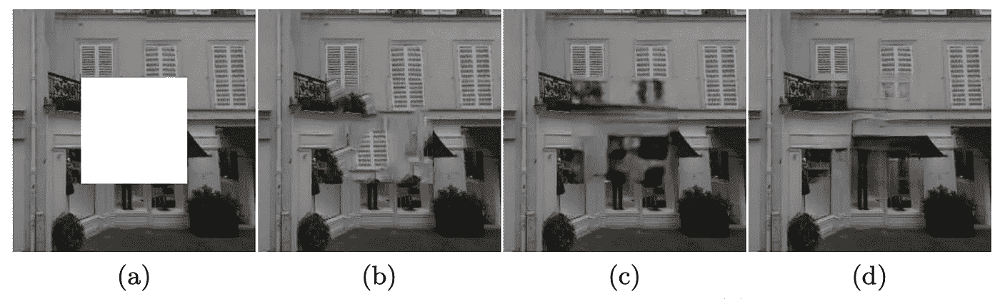

图一。不同方法修复效果的定性比较。(a)输入(b)常规方法(基于复制粘贴)(c)首先基于 GAN 的方法，上下文编码器(d)提出的方法。图片来自 Yan 等人的[论文](https://arxiv.org/pdf/1801.09392.pdf) [1]

正如我在以前的帖子中提到的，填充图像中缺失部分的传统方法是搜索最相似的图像补丁，然后直接将这些补丁复制粘贴到缺失部分(即复制粘贴方法)。这种方法提供了良好的局部细节，因为我们直接粘贴其他图像补丁在丢失的部分。然而，补丁可能不完全适合整个图像的上下文，这可能导致较差的全局一致性。请看图 1(b)为例，可以看到填充区域的局部纹理细节良好但与非缺失部分(即有效像素)不一致。

另一方面，基于深度学习的方法关注整个图像的上下文。全连接层或扩展卷积层用于捕捉整个图像的上下文。使用 L1 损失来训练深度学习模型，以确保逐像素重建精度。因此，深度学习方法提供的填充图像具有更好的全局一致性。然而，L1 损失导致模糊的修补结果，即使对抗损失(GAN 损失)可用于增强填充像素的锐度。请参见图 1(c)作为示例，您可以看到填充区域与非缺失区域更加一致，但是填充区域是模糊的。

因此，本文的作者希望利用传统的“复制粘贴”方法(良好的局部细节)和现代深度学习方法(良好的全局一致性)的优势。

# 介绍

在图像修复中，我们希望得到具有良好视觉质量的完整图像。因此，我们既需要**正确的全局语义结构**，也需要**精细的细节纹理**。正确的全局语义结构意味着生成的像素和有效的像素应该是一致的。换句话说，我们必须填充一个图像，并且必须保持它的上下文。精细的纹理意味着生成的像素应该看起来逼真，并且尽可能清晰。

在上一节中，我们提到传统的“复制粘贴”方法可以提供精细的细节纹理，而最近的深度学习方法可以提供更好的正确的全局语义结构。因此，本文引入了一个移位连接层，通过在网络内部进行“复制粘贴”的概念来实现深度功能重组。图 1(d)显示了他们提出的方法提供的修复结果。

# 解决方案(简而言之)

提出一个**引导损失**来鼓励他们的网络(**移位网**)在解码过程中学习填补缺失部分。除此之外，建议使用**移位连接层将缺失区域内的解码特征与缺失区域外的编码特征进行匹配**，然后将缺失区域外的编码特征的每个匹配位置移位到缺失区域内的相应位置。这捕获了关于在丢失区域之外找到的最相似的局部图像补片的信息，并且该信息被连接到解码的特征，用于进一步的重建。

# 贡献

如前所述，提出了一个**转换连接层，以在现代 CNN**中嵌入复制粘贴的概念，从而他们提出的模型可以提供具有正确的全局语义结构和精细细节纹理的修复结果。

除了标准 L1 和对抗性损失，他们还建议**制导损失**以端到端数据驱动的方式训练他们的移位网。

# 方法

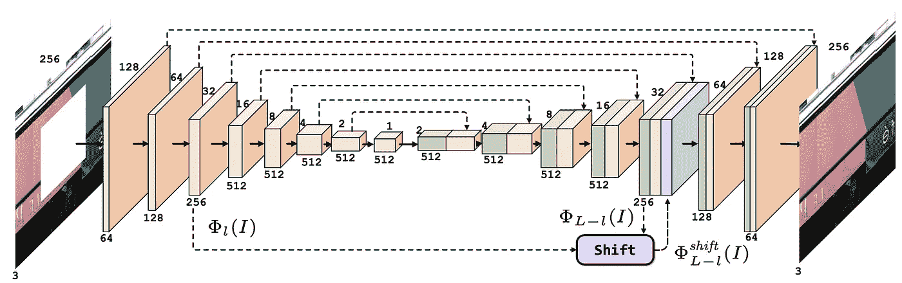

图二。移动网的网络体系结构。以 32×32 的分辨率添加移位连接层。图片来自 Yan 等人的[论文](https://arxiv.org/pdf/1801.09392.pdf) [1]

图 2 显示了移位网络的网络架构。没有移位连接层，这是一个非常**标准的 U 型网络结构，具有跳跃连接**。请注意，编码要素会连接到解码要素的相应图层。就更好的局部视觉细节和重建精度而言，这种跳过连接对于包括图像修补的低级视觉任务是有用的。

# 导向损失

提出用制导损耗来训练它们的移位网。简单来说，这个损失计算的是丢失区域内的输入屏蔽图像的解码特征和丢失区域内的基本事实的编码特征之间的**差异**。

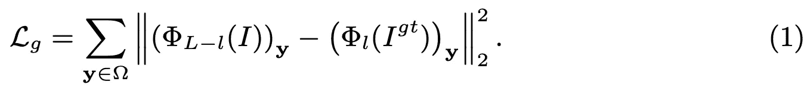

先定义一下问题。设ω为缺失区域，ω(bar)为有效区域(即非缺失区域)。对于具有 *L* 层的 u 网， **ϕ** _ *l* ( *I* )表示第*l*-层的编码特征，**ϕ**_*l*-*l*(*I*)表示第*l*-*l*-层的解码特征我们的最终目标是恢复 *I^gt* (地面真相)，因此我们可以预计**ϕ**_*l*(*I*)和**ϕ**_*l*-*l*(*I*)包含了**ϕ**_*l*(*i^gt)中几乎所有的信息如果我们考虑**y****∈**ω，(**ϕ**_*l*(*I*)_**y**应该是 0(即**一幅输入的蒙版图像中第 *l* 层缺失区域的编码特征为零**)。所以，(**ϕ**_*l*-*l*(*I*)_**y**应该包含了(**ϕ**_*l*(*i^gt*)_**y**(即【t77 这意味着解码过程应该填充丢失的区域。*

等式 1 显示了(**ϕ**_*l*-*l*(*I*)_**y**与(**ϕ**_*l*(*i^gt*)_**y**之间的关系。注意，对于**x****∈**ω(条形)(即非缺失区域)，他们假设(**ϕ**_*l*(*I*)_**x**与(**ϕ**_*l*(*i^gt*)_**x【几乎相同因此，导向损失仅定义在缺失区域。如图 2 所示将**ϕ**_*l*(*I*)和**ϕ**_*l*-*l*(*I*)串联起来，几乎可以得到**ϕ**_*l*(*i^gt*)中的所有信息。**

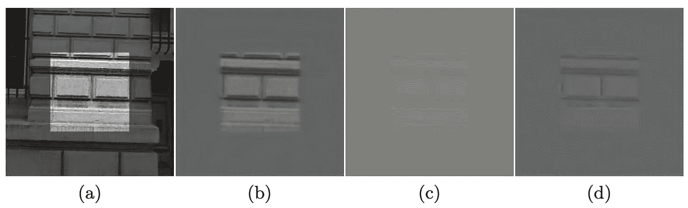

图 3。通过移位网络学习的特征的可视化。(a)输入(浅色区域表示缺失区域)(b)可视化(**ϕ**_*l*(*i^gt*)_**y**)(c)可视化(**ϕ**_*l*-*l*(*I*)_【t77

为了进一步显示(**ϕ**_*l*-*l*(*I*)_**y**)和(**ϕ**_*l*(*i^gt*)_**y**之间的关系，作者将他们的移位网学习到的特征可视化，如图所示对比图 3(b)和(c)可以看出(**ϕ**_*l*-*l*(*I*)_**y**可以合理估计(**ϕ**_*l*(*i^gt*)_**y**这导致模糊的修复结果，没有精细的纹理细节。这个问题通过他们提出的移位连接层得到解决，结果如图(d)所示。那么，我们来说说移位操作。****

对于对他们的观想方法感兴趣的读者，请参考他们的[论文](https://arxiv.org/pdf/1801.09392.pdf)或者他们的 [github 页面](https://github.com/Zhaoyi-Yan/Shift-Net_pytorch)。观想方法只是用来展示学到的特征，因此我不会在这里涵盖它。

# 移位连接层

我个人认为这是本文的核心思想。回想一下 **ϕ** _ *l* ( *I* )和**ϕ**_*l*-*l*(*I*)假设拥有**ϕ**_*l*(*i^gt*)中几乎所有的信息。从上一节我们可以看到(**ϕ**_*l*-*l*(*I*)_**y**可以合理估计(**ϕ**_*l*(*i^gt*)_**y**但是不够尖锐。让我们看看作者如何利用缺失区域外的特征来进一步增强缺失区域内的模糊估计。

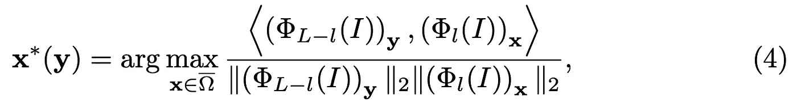

简单来说，上面的等式 4 是为了**找到丢失区域外与丢失区域内的每个解码特征最相似的编码特征**。这是一个余弦相似运算。对于每个(**ϕ**_*l*-*l*(*I*)_**y**与**y****∈**ω，我们在(**ϕ**_*l*(*I*)_**中找到它最近的邻居输出 **x** *( **y** )表示匹配特征位置的坐标，我们可以得到一个移位向量**u _ y**=**x***(**y)**-**y**。注意，该移位操作可以被公式化为[卷积层](https://arxiv.org/pdf/1601.04589.pdf)。我将在下一篇文章中详细讨论这个问题。**

得到移位向量后，我们可以重新排列(**ϕ**_*l*(*I*)_**x**)的空间位置，然后串接成**ϕ**_*l*(*I*)和**ϕ**_*l*-*l*(*I*)进一步增强(**ϕ**_*l*(*I*)_**x**的空间重排如下，

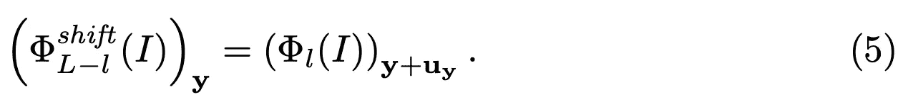

> 口头上，对于丢失区域内的每个解码特征，在找到丢失区域外最相似的编码特征之后，我们基于移位向量形成另一组特征图。这组特征映射包含关于缺失区域外的编码特征与缺失区域内的解码特征最近的信息。然后，如图 2 所示，将所有相关信息进行组合，以便进一步重建。

在这里，我想强调一下关于转换连接层的几点。 ***i)*** 传统的“复制粘贴”方法在像素或图像补片域操作，而移位连接层在深度特征域操作。 ***ii)*** 深层特征是从大量训练数据中学习的，所有组件都是以端到端数据驱动的方式学习的。因此，使用“复制-粘贴”和 CNN 的优点都被继承了。

# 损失函数

他们的损失函数非常标准。如前所述，除了我们介绍的建议**制导损耗**外，他们还采用了 **L1 损耗**和**标准对抗损耗**。总损失函数如下，

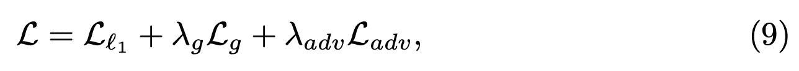

***λg***和***λadv***分别用于控制制导损耗和敌方损耗的重要性。在他们的实验中，这两个超参数分别设置为 0.01 和 0.002。

如果你熟悉 CNN 的训练过程，你可能会注意到**移位操作是一种手动修改特征图**的操作。因此，我们必须修改关于特征的第 *l* 层*f*_*l*=**ϕ**_*l*(*I*)的梯度计算。根据等式 5，**ϕ**^*shift*_*l-l*(*I*)和**ϕ**_*l*(*I*)之间的关系可以写成:

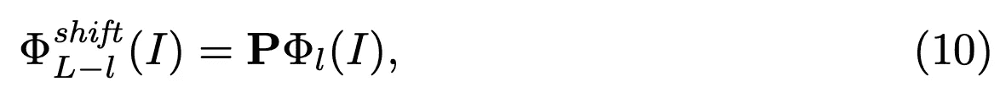

其中 **P** 为{0，1}的移位矩阵， **P** 的每一行中只有一个元素为 1。元素 1 表示最近邻居的位置。因此，相对于**ϕ**_*l*(*I*)的梯度计算如下:

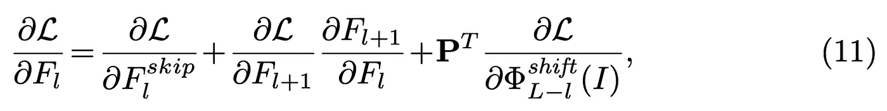

其中 *F* ^ *跳过* _ *l* 代表跳过连接后的 *F* _ *l* ，以及 *F* ^ *跳过*_*l*=*f*_*l*。除了我们必须将移位矩阵 **P** 的转置乘以最后一项以确保梯度被正确地反向传播之外，所有三项都可以被直接计算。

也许，你会发现这部分有点难以理解，因为我们必须修改梯度的计算。对于那些对作者实际上是如何实现感兴趣的读者，我强烈推荐你访问他们的 [github 页面](https://github.com/Zhaoyi-Yan/Shift-Net_pytorch)。如果你不理解这一部分，只要你能抓住移位操作的核心思想就没关系。在这里，**他们的移位操作是一种硬赋值**。这意味着**缺失区域中的每个解码特征在缺失区域之外只能有一个最近邻**。这就是为什么移位矩阵 **P** 是{0，1}的形式，以及为什么我们必须修改梯度的计算。随后，提出了类似的移位操作思想，并采用了**软赋值**。在这种情况下，**缺失区域外的所有邻居被分配权重以指示缺失区域内的每个解码特征的接近度**，并且我们不需要修改梯度的计算，因为该操作是完全可微分的。我会在下一篇文章中详细讨论这个问题:)

# 实验

作者在两个数据集上评估了他们的模型，即**Paris street view**【2】和**six scenes from places 365-Standard**【3】。Paris StreeView 包含 14，900 幅训练图像和 100 幅测试图像。对于 Places365，有来自 365 个场景的 160 万个训练图像。选择六个场景进行评估。每个场景有 5000 幅训练图像、900 幅测试图像和 100 幅验证图像。对于两个数据集，他们调整每个图像的大小，使最小尺寸为 350，然后随机裁剪一个大小为 256×256 的子图像作为模型的输入。

对于训练，他们使用 Adam optimiser，学习率为 0.0002，beta_1 = 0.5。批量大小被设置为 1，并且训练时期的总数是 30。注意，翻转被采用作为数据扩充。他们声称，在 Nvidia Titan X Pascal GPU 上训练他们的 Shift-Net 大约需要一天时间。

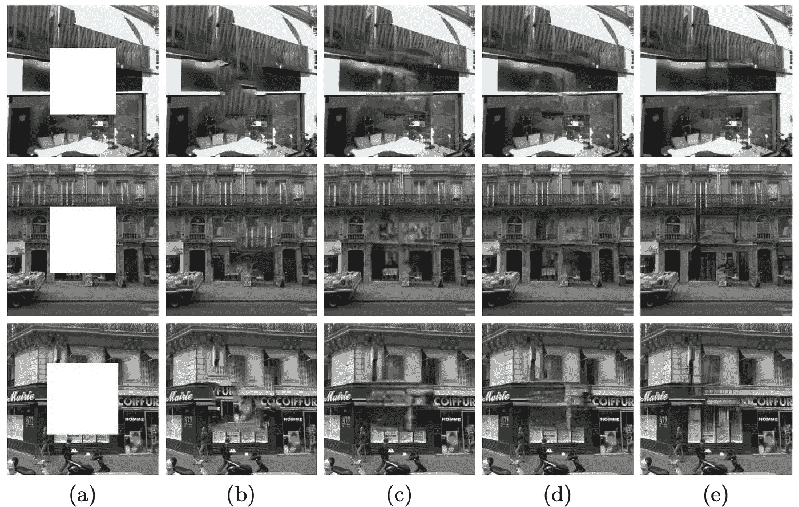

图 4。巴黎街景数据集上修复结果的可视化比较。(a)输入(b)内容感知填充(复制粘贴方法)(c)上下文编码器(d)多尺度神经补片合成(MNPS) (e)移位网。图片由严等人从他们的[论文](https://arxiv.org/pdf/1801.09392.pdf)【1】

图 4 显示了在巴黎街景数据集上最先进方法的视觉比较。内容感知填充(图 4(b))是利用复制粘贴概念的传统方法。你可以看到它提供了良好的局部纹理细节，但错误的全局语义结构。图 4(c)和(d)分别是[上下文编码器](https://medium.com/analytics-vidhya/introduction-to-generative-models-for-image-inpainting-and-review-context-encoders-13e48df30244)和[多尺度神经补片合成](https://medium.com/analytics-vidhya/review-high-resolution-image-inpainting-using-multi-scale-neural-patch-synthesis-4bbda21aa5bc)的结果。我们之前已经回顾了这两种方法。你可以看到上下文编码器的结果具有正确的全局语义结构，但它们是模糊的。MNPS 提供了比上下文编码器更好的结果，但是我们仍然可以很容易地观察到带有一点伪像的填充区域。相比之下，Shift-Net 可以提供具有正确的全局语义结构和良好的局部纹理细节的修复结果。结果如图 4(e)所示，请放大查看。

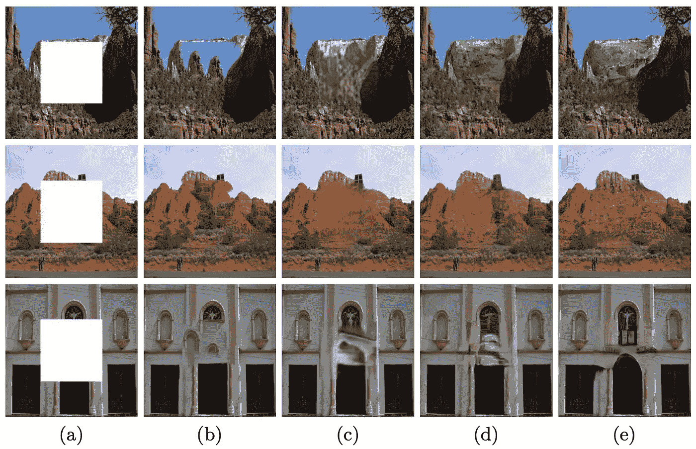

图 5。Places 数据集上修复结果的可视化比较。(a)输入(b)内容感知填充(复制粘贴方法)(c)上下文编码器(d)多尺度神经补片合成(MNPS) (e)移位网。图片来自 Yan 等人的[论文](https://arxiv.org/pdf/1801.09392.pdf) [1]

图 5 显示了在 Places 数据集上的最新方法的定性比较。进行了类似的观察，请放大以更好地查看局部纹理细节。

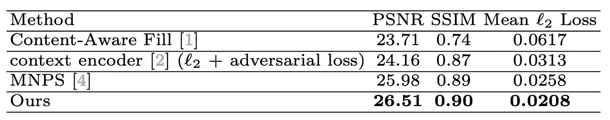

表 1。最新方法的定量比较。表由严等人从他们的论文[1]

表 1 列出了巴黎 StreeView 数据集上的一些定量评估指标数字。显然，所提出的移位网络提供了最佳的 PSNR、SSIM 和平均 l2 损失。正如我在以前的帖子中提到的，这些数字与像素重建精度(客观评估)有关。它们不能反映修复结果的视觉质量。

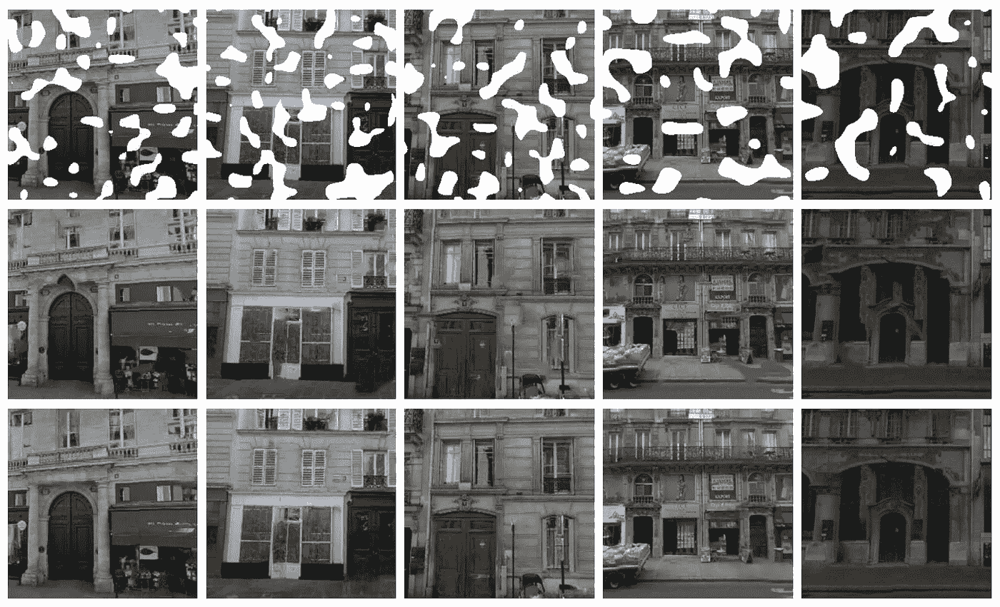

图 6。填充随机区域的示例。从上到下:输入、内容感知填充和 Shift-Net。图片由颜等人从他们的[论文](https://arxiv.org/pdf/1801.09392.pdf)【1】

图 6 显示了使用内容感知填充和提议的移位网络来填充随机区域的一些例子。Shift-Net 能够以良好的视觉质量处理随机裁剪区域。请放大以更好地查看局部纹理细节。

# 消融研究

作者还做了消融研究，以显示提出的制导损失和转移连接层的有效性。

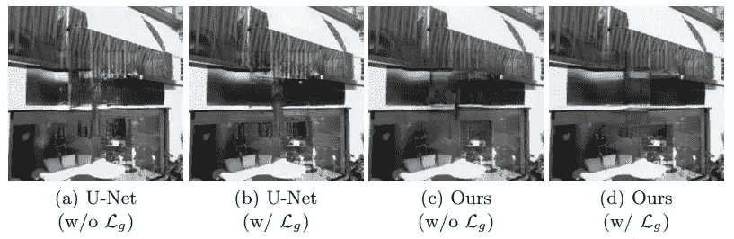

图 7。在标准 U 网和提议的移位网中提议的制导损失的影响。图片由严等人从他们的[论文](https://arxiv.org/pdf/1801.09392.pdf)【1】

图 7 显示了 U-Net 和 Shift-Net 在有和没有建议的引导损失的情况下的修复结果。很明显，引导损失对于减少视觉假象是有用的。

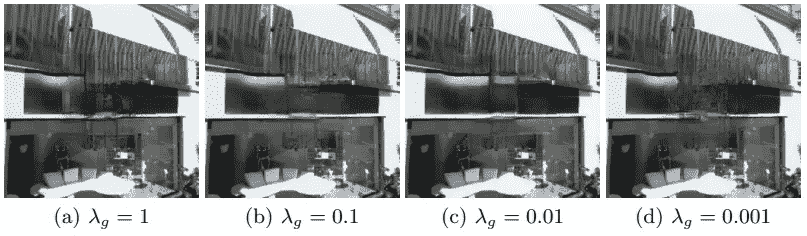

图 8。不同λg 对制导损失的影响。图片来自颜等人的[论文](https://arxiv.org/pdf/1801.09392.pdf) [1]

图 8 示出了具有不同*λ_ g*的移位网的修复结果。我们可以看到当 *lambda_g* = 0.01 时可以获得更好的修复效果。因此，他们根据经验为他们的实验设置*λ_ g*= 0.01。

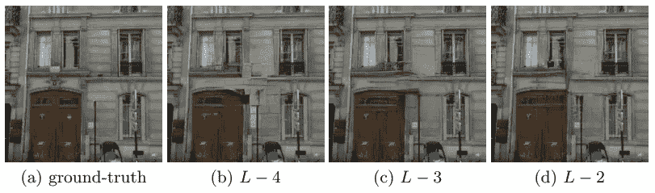

图 9。分层移位操作的效果图来自颜等人的[论文](https://arxiv.org/pdf/1801.09392.pdf) [1]

图 9 显示了不同层的移位操作的效果。回想一下，使用第 *l* 层的特征，在第( *L* - *l* )层的深度特征图上执行移位操作。**当 *l* 越小时，特征图尺寸越大，因此该层的移位操作在计算上更加昂贵。当 *l* 较大时，特征图尺寸较小，因此时间成本较低，但是随着空间尺寸较小，更多的空间信息丢失。这也可能导致修复效果不佳。**在图 9 中，我们可以看到 *L* -3 (c)和 *L* -2 (d)都给出了不错的修复效果(可能是 *L* -2 好一点)。请注意， *L* -2 处理一幅图像大约需要 400 毫秒，而 *L* -3 处理一幅图像大约需要 80 毫秒。因此，为了平衡时间成本和性能，作者决定在第( *L* -3)层执行移位操作。

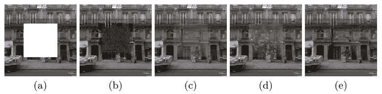

图 10。零点出来的效果(b)**ϕ**_*l*-*l*(*I*)；(c)**ϕ**_*l*(*I*)；以及(d)**ϕ**^shift_*l*-*l*(*I*)(e)是 Shift-Net 的结果，使用所有(b)、(c)、(d)。图片来自 Yan 等人的论文【1】

回想图 2，对于 Shift-Net 的架构，在 shift-connection 层之后串接了 3 个不同的特征图，分别是**ϕ**_*l*-*l*(*I*)**ϕ**_*l*(*I*)和**ϕ**^shift_*l*-*作者试图检查这些特征图对于最终重建的重要性，结果如图 10 所示。很明显，解码后的特征**ϕ**_*l*-*l*(*I*)对于最终的重建极其重要。如果我们将这个解码特征归零，重建将完全失败，如图 10 (b)所示。这样，我们就可以知道解码后的特征**ϕ**_*l*-*l*(*I*)包含了缺失区域的主要结构和内容的信息。*

图 10 (c)显示了去除编码特征 **ϕ** _ *l* ( *I* )的结果。我们可以看到，主要结构仍然可以重建，但视觉质量比全模型差，如图 10 (e)所示。这意味着，指导损失不仅有助于促进**ϕ**_*l*-*l*(*I*)_**y**和**ϕ**_*l*(*i^gt【t21)_**y**之间的关系，而且有助于促进**ϕ**_*l 之间的关系**

最后，如果我们去掉图 10 (d)所示的**ϕ**^shift_*l*-*l*(*I*)，在填充的缺失区域有明显的伪影。因此，我们可以知道，**ϕ**^shift_*l*-*l*(*I*)通过提供缺失区域外最近邻搜索的结果作为细化的参考，对于细化填充的缺失区域是有用的。

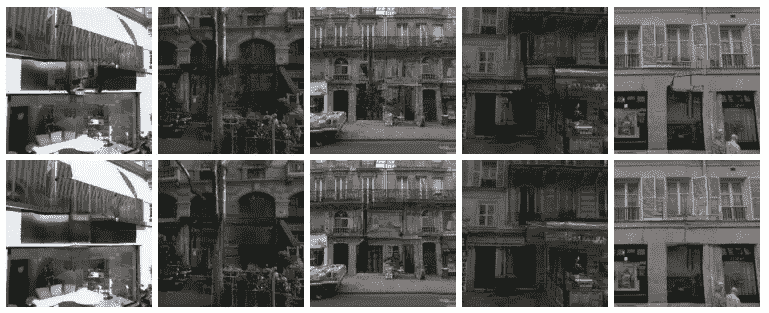

图 11。从上到下。随机移位连接和最近邻搜索的移位网修复结果。图片来自严等人的[论文](https://arxiv.org/pdf/1801.09392.pdf)【1】

为了进一步显示**ϕ**^shift_*l*-*l*(*I*)的有效性，作者比较了随机移位连接和最近邻搜索，如图 11 所示。我们可以看到，与最近邻搜索相比，随机移位连接对于改进修补结果以获得更好的全局语义结构一致性是无用的。因此，我们可以说，正确的移位操作对于获得视觉上良好的修复结果是重要的。

> 为了总结移位连接层的使用，我认为最重要的思想是我们提供对缺失区域内生成的特征的参考(假设生成的特征是缺失区域的良好估计)，以基于该参考进一步细化这些生成的特征，并且该参考是与从非缺失区域获得的每个生成的特征最相似的特征。因此，我们可以借用非缺失区域中的特征的结构和纹理来改进缺失区域中的特征。

# 其他需要注意的事项

有兴趣的读者，这里还有三点供你进一步研究。首先，您可能会对要素地图中的掩膜区域的定义感兴趣。实际上，我们只有输入遮罩图像。因此，必须定义特征地图的掩蔽区域。简单地说，作者使用与编码器具有相同架构的简单 CNN 来获得网络内部的掩蔽区域。使用简单的卷积和阈值技术来获得特征图中的掩蔽区域。如果你对此感兴趣，请阅读[论文](https://arxiv.org/pdf/1801.09392.pdf)。我在这里不再赘述，因为我们将很快介绍一种可学习的方法来获得网络内部的掩码！

第二，关于生成器和鉴别器的详细架构。[正如我在](/a-milestone-in-deep-image-inpainting-review-globally-and-locally-consistent-image-completion-505413c300df)之前提到的，我们有一个标准的图像修复网络设计，本文中的网络也非常标准。他们使用一个带有移位连接层的 U-Net 作为生成器，他们的鉴别器就是我们之前讨论过的 [PatchGAN 鉴别器](/revision-for-deep-image-inpainting-and-review-patch-based-image-inpainting-with-generative-4197d29c5468)。同样，感兴趣的读者可以参考[论文](https://arxiv.org/pdf/1801.09392.pdf)以获得架构的完整描述。

第三，关于巴黎街景和地点数据集的更多比较可以在[论文](https://arxiv.org/pdf/1801.09392.pdf)中找到。你可以看一看，你会对今天的深度图像修复算法的视觉质量有一个简单的想法。

# 结论

本文主要有两个观点。首先，所提出的引导损失促使缺失区域的解码特征(给定输入屏蔽图像)接近缺失区域的编码特征(给定地面实况)。因此，解码过程应该能够用对地面实况中丢失区域的合理估计来填充丢失区域。第二，提出的移位连接层可以有效地借用缺失区域外最近邻的信息，进一步增强全局语义结构和局部纹理细节。

# 外卖食品

这篇文章对你们中的一些人来说可能有点超前。我认为本文最重要的思想是移位操作，它可以看作是一种应用于图像修复任务的注意技术。

口头上，移位操作允许缺失区域的生成特征借用缺失区域外最相似特征的信息。由于缺失区域外的特征具有良好的全局语义结构和精细的局部纹理细节，我们可以将它们作为参考来细化生成的特征。希望你能明白这个主旨。

# 下一步是什么？

在接下来的文章中，我们将介绍另一篇论文，它也利用了从非缺失区域借用信息的思想，以保持整个图像的上下文。我还将讨论如何以卷积层的形式进行最近邻搜索。真的希望你们喜欢我的帖子:)

# 参考

[1]，闫，，，，左，，，单， [Shift-Net:基于深度特征重排的图像修复](https://arxiv.org/pdf/1801.09392.pdf)， *Proc .2018 年欧洲计算机视觉会议* ( *ECCV* )。

[2] C. Doersch、S. Singh、A. Gupta、J. Sivic 和 A. Efros。是什么让巴黎看起来像巴黎？2012 年美国计算机学会图形汇刊。

[3]周，Agata Lapedriza，Aditya Khosla，Aude Oliva，Antonio Torralba，“地点:用于场景识别的 1000 万图像数据库”， *IEEE 模式分析与机器智能汇刊*，2017。

再次感谢你阅读我的帖子！如果您有任何问题，请随时给我发电子邮件或在这里留言。下次见！:)