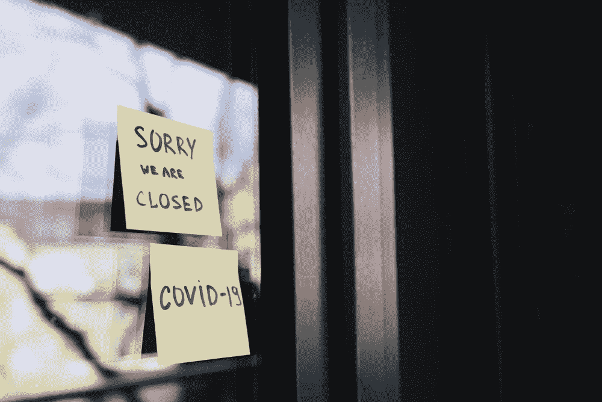
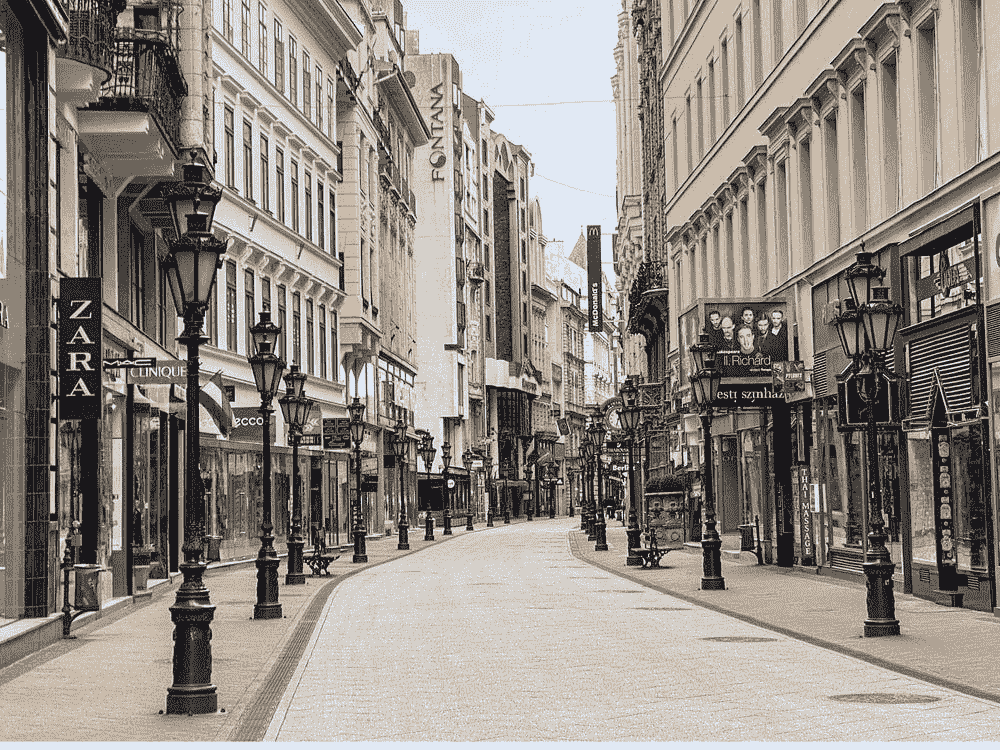
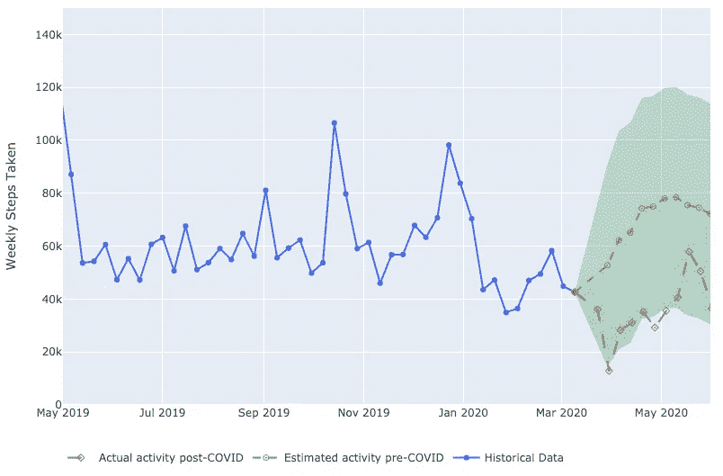
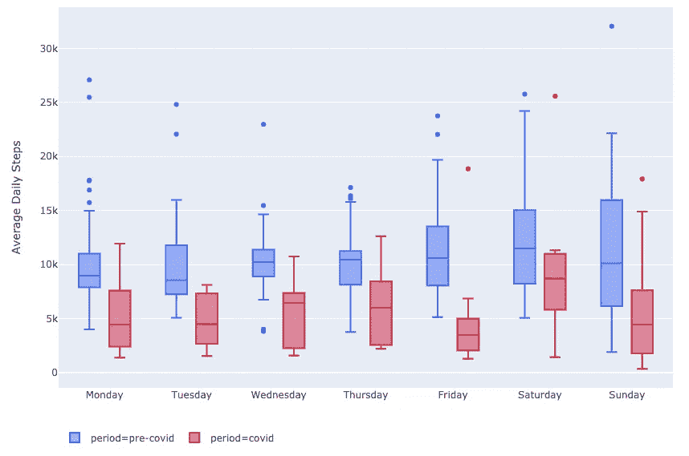
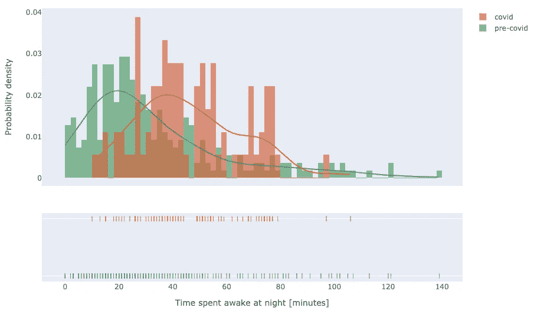
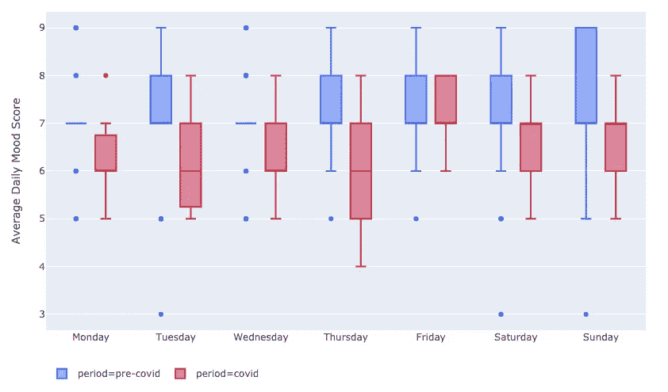
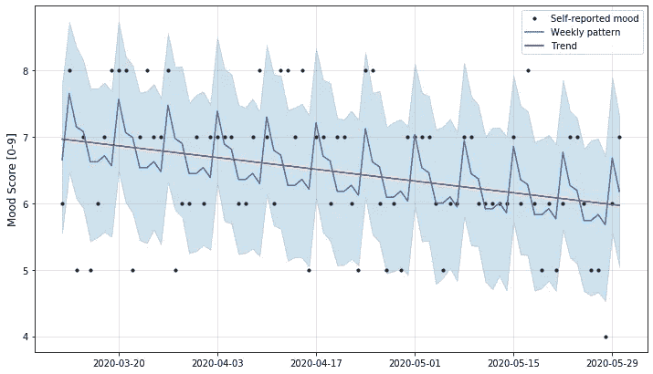

# 新冠肺炎是如何影响我的身心健康的:通过数据看

> 原文：<https://towardsdatascience.com/how-covid-19-affected-my-physical-and-mental-wellbeing-a-look-through-data-b033e262cb15?source=collection_archive---------84----------------------->

## 检查我们的个人数据可以发现新冠肺炎影响我们福祉的许多不同方式。以下是我从个人数据中得到的一些发现，可以帮助我们在这场危机中做些什么来改善我们的生活。

新冠肺炎疫情以不同的方式影响了我们每一个人，这已经不是什么新闻了。不管是失业、个人财务危机、更多的独处时间，还是住院，这个清单还在继续。

作者阿纳斯塔西娅·切平斯卡

我低估了个人幸福的一个方面——包括身体和精神上的。在听新闻更新、阅读报道和检查[疾病跟踪仪表板](https://gisanddata.maps.arcgis.com/apps/opsdashboard/index.html#/bda7594740fd40299423467b48e9ecf6)时，许多关于保持健康日常生活的建议都被忽视了。

所以，我决定挖掘一下我的个人数据(这就是我处理压力的方式！😬)，试图揭示自疫情在加拿大正式爆发以来，我的健康状况发生的重大变化。

# 我的脚步去了哪里？

我在 2016 年夏天搬到了加拿大，虽然这里的冬天绝对寒冷，但我通常会在一年中保持积极的生活方式，并在不低于零下 30 度的时候分配时间骑自行车，跑步或散步。

自从这里(三月中旬)开始了物理距离测量，我注意到我走得更少了。但我没意识到少了多少！

由[琳达·格贝克](https://unsplash.com/@lsgerbec)[Unsplash](https://unsplash.com/photos/0wvMLaScXU0)

使用 4 年前的历史活动数据(我使用一个 [Withings Steel HR](https://www.withings.com/ca/en/steel-hr) 跟踪我的每日步数)，我建立了一个预测，看看如果一切正常，过去两个月会是什么样子。随着冬天的结束，春天和夏天的到来，我的步数有望超过推荐的 10 公里/天(顺便问一下，你知道这个推荐最初来自一个营销活动吗？一个有趣的[阅读这里](https://www.mcgill.ca/oss/article/health/10000-steps-myth-or-fact)！)，如下图绿色部分所示。

现实大不相同。

疫情袭击加拿大前后一段时间内每周步数的总和。绿色虚线表示如果疫情没有开始，正常每周步数的估计预测。红色虚线显示了疫情击中现实。

自从疫情爆发以来，我的活动水平已经下降到甚至低于冬季水平。自我强制留在家里的命令产生了影响，超长的冬天也产生了影响，我的活动量刚刚达到每周 4 万步。

深入挖掘，我想看看每年的这个时候与前几年相比，每天的情况如何。

比较 2017-2019 年 3 月和 5 月以及 2020 年 3 月至 5 月的每日步数，当时新冠肺炎重创北美。

不言自明的是，在 COVID 期间，我一周中每天的步数明显低于疫情爆发前。很可能是由于 100%在家工作的政策，工作日显示出比疫情袭击前更少的活动。我似乎在周六恢复了一些运动(可能是在意识到整个星期都非常静止之后)，但这不会延续到周日，在周日静态行为再次占据主导地位。

在工作中，我们试图鼓励一种 [***散步*** 的心态](https://blog.locallogic.co/working-from-home-how-the-team-at-local-logic-is-making-the-best-of-it/):人们在#wfh Slack 频道上宣布他们要去散步，然后去街区或公园散步。数据清楚地表明，我需要更好地把握这一点，并重新利用我的周末。我所居住的蒙特利尔市最近承诺增加 327 公里的自行车道和人行走廊，以允许人们在室外安全的距离内移动，许多其他城市也在采用类似的方法。如果可以的话好好利用这一点！如果在安全的距离内进行，这对你的健康大有裨益，对你的社区也大有裨益。

# 失去了我的鼾声💤

我将是第一个承认现代生活正在打乱我们理想中的睡眠时间表的人:我们在日落后早早上床睡觉，日出后醒来，很少能有规律地获得急需的睡眠时间。

资料来源: [GIPHY](https://gph.is/2foC1JI)

在疫情袭击之前，我有时会努力睡个好觉。这通常会表现在夜间多次醒来，或者花很长时间才能入睡。在家里，我设置了一个床下睡眠跟踪器( [Withings Sleep](https://www.withings.com/ca/en/sleep) )，当我不在家时，我用手表跟踪我的睡眠，这给了我一个相当不错的睡眠模式。

我检查了过去 3-4 年的睡眠数据，以检测大流行前后的任何重大差异。具体来说，我观察了睡眠有多深，以及我每晚花多少时间醒着，试图入睡。

非睡眠时间的分布:醒着的时间，在床上试图入睡的时间(入睡前或半夜醒来的结果)。

上图捕捉到了一个关键的发现:现在每个晚上都比以前更加失眠。事实上，我几乎从来没有在每晚少于 10-20 分钟的时间里睡着或醒来，有很大的偏差是每晚躺在床上醒着 60-80 分钟。

我一直感觉这些不眠之夜，更多的时候，导致我辗转反侧，试图摆脱无尽的想法，最终保持任何和平的睡眠。正如过去许多研究表明的那样，我们必须让我们的大脑和身体得到休息，以使身体和精神得到恢复，这是我们日常幸福的一个关键部分。点击这里和[这里](https://www.dana.org/article/the-sleep-deprived-brain/)了解更多信息。

对于那些经历类似情况的人，我建议尝试冥想(例如，[平静](https://app.www.calm.com/meditate)或[顶部空间](https://www.headspace.com/meditation/guided-meditation)进行一些有指导的练习)，并在睡前一两个小时避免任何[蓝光](https://www.health.harvard.edu/staying-healthy/blue-light-has-a-dark-side)。虽然这不是一个神奇的解决方案，但睡前放下烦恼是帮助你在醒来时处理任何烦恼或问题的关键。

# 如果你不开心并且你知道…鼓掌？

还有一件事与睡眠质量和身体活动直接相关，那就是心理健康——或者说我们感觉有多幸福。被不断的新闻报道、全球危机和鲁莽的世界领导人疯狂的推特活动包围着，常常很难想到隧道尽头的光明。

作为我量化自我努力的一部分，我也在跟踪我的日常情绪。我发现这是一种记录方法，有助于记录我的感受，并简要回顾我的一天，在这一天，我会挖掘我的感受。这比一个完整的日志更容易维护(我确实这么做了，但是更多的是每月一次)。我会推荐给任何想和自己的感觉保持联系的人，也许偶尔回顾一下就能明白是什么驱动了他们的情绪。

我给自己的心情打分，1-9 分，1 分是非常不开心的一天，9 分是我能拥有的最开心的一天。

下面，你可以看到疫情开始前一段时间的平均每日情绪与疫情开始后的平均每日情绪的比较。

情绪得分，比较疫情大流行前(蓝色)和大流行后的每日平均水平。

显然，几乎一周中的每一天都显示出明显的下降，其中只有星期五保持着某种类似的状态。这种情绪确实受到了病毒的打击！

当检查自疫情开始以来情况如何变化时，趋势非常明显。

自疫情开始以来，每日情绪趋势，说明任何周模式。

虽然在我的情绪量表上，我确实有过 8/9 的快乐日子，但数据显示有明显的下降趋势。这种情况持续的时间越长，对我个人的幸福来说就越“危险”,注意并承认这一点很重要，如果可能的话，尝试并面对这一点。

我不是医疗保健专业人员，这只是一个来自人类同胞的常识性建议，但如果你确实感到自己的幸福受到影响，一定要寻求帮助:与家人、朋友、伴侣交谈，甚至利用众多资源中的一种，如 [Bell 的“让我们谈谈”](https://letstalk.bell.ca/en/)。

这篇文章的目标有两个:

1.  让人们意识到，除了感染病毒和陷入金融危机的风险之外，我们的福祉可能并不好，我们应该意识到并承认这一点。
2.  有很多方法可以量化、跟踪和衡量你的幸福，无论是通过个人跟踪设备自动进行，还是通过自我报告和记录(是的，你也可以记录你睡觉和醒来的时间！).

虽然我不喜欢分享我的个人数据，但我很乐意回答您对方法或代码的任何问题。欢迎在评论中或在[推特](http://twitter.com/itsguyts)上提问。

考虑到这一点，我希望你保持安全，远离他人，并照顾好自己的健康，包括精神和身体❤️.