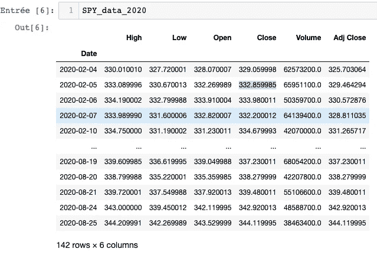
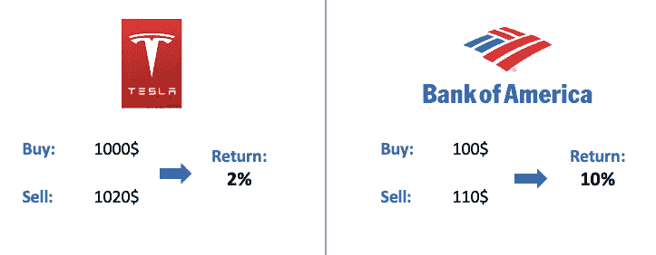
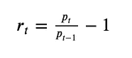
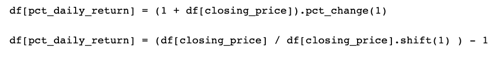
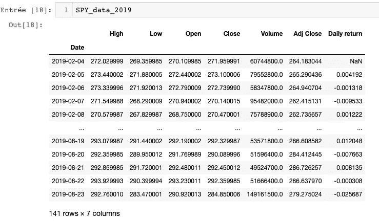
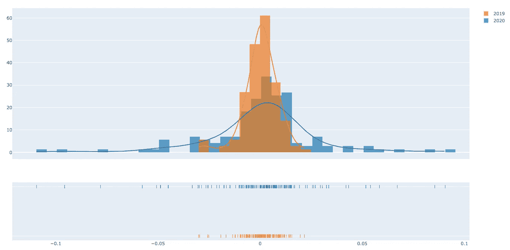
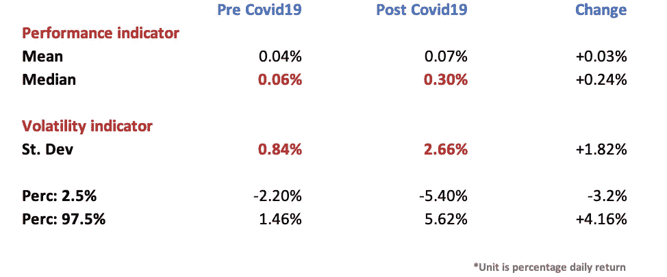
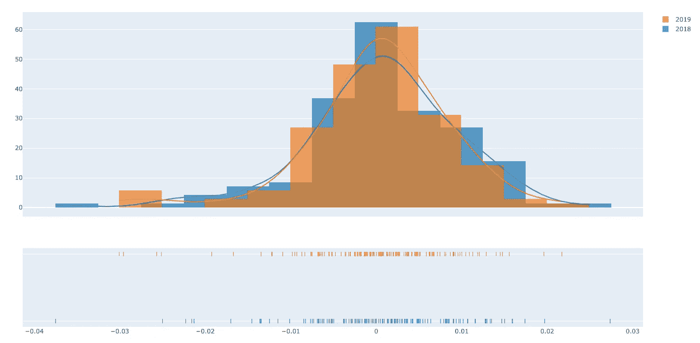
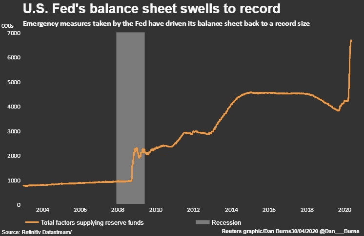

# 关于新冠肺炎如何影响美国证券交易所的数据分析，这是我无法预料的。

> 原文：<https://towardsdatascience.com/how-covid19-has-impacted-the-us-stock-exchange-and-it-is-not-what-you-can-expect-edd2d43407ef?source=collection_archive---------22----------------------->


Roberto Junior-Unsplash 拍摄的照片

***注来自《走向数据科学》的编辑:*** *虽然我们允许独立作者根据我们的* [*规则和指导方针*](/questions-96667b06af5) *发表文章，但我们不认可每个作者的贡献。你不应该在没有寻求专业建议的情况下依赖一个作者的作品。详见我们的* [*读者术语*](/readers-terms-b5d780a700a4) *。*

在本文中，我们将定量分析 Covid19 如何影响美国证券交易所以及交易方式。结果令人惊讶。

分析将集中在市场波动上。

## 先决条件

如果你热衷于和我一起逐步开发这个分析，你将需要 Python3 和三个不同的 Python 包:

*   PandasDataReader 和雅虎财务模块
*   日期时间包
*   Plotly

另外，通常的熊猫和熊猫。

好，我们开始吧

## 方法学

先说方法论。我们将要遵循的流程将分为 3 个部分。

首先，我们将确保获得正确的市场数据。我的意思是通过这一点，避免有偏见的输入和初始假设，但这一点将在本文稍后展开。

第二次，创建计算字段，这将有助于我们绘制我们想要比较的内容。

最后，作为最后一步，比较市场回报并了解**对交易策略**的影响。潜在的原因是什么，我们如何利用它。

## 输入数据

为了比较纽约证券交易所(NYSE)在 COVID 之前和之后的表现，我们必须确保避免有偏见的假设。为此，我们不打算比较一只具体的股票。例如，如果你比较 2019 年和 2020 年特斯拉的份额价值，你很容易理解这些数据会有偏差。事实上，不依赖于 Covid19 的其他残差可能会影响这一份额，仅在 Covid19 上输入它在科学上是不可接受的。

> 例如，2020 年 6 月，苹果公司宣布了一项特别的主题演讲，并在 2 天内将苹果公司的股票价值提高了 5%。

为了避免这些残差，我们将选择(而不是仅仅比较 Covid19 前后的股价变动)来分析 S&P500。事实上，S&P500 是一个股票市场指数，衡量在美国证券交易所上市的 500 家大公司的股票表现。它是最受关注的股票指数之一，许多人认为它是美国股票市场的最佳代表之一。指数的平均年总回报和复合年增长率，包括股息。(1).

你可以通过阅读 Lou Cardozo 的这篇文章来了解为什么 S&P500 是投资者和交易者的有效工具，他是美国银行管理研究所的现任执行主编。(2)

[](https://money.usnews.com/investing/investing-101/articles/2018-10-02/why-investors-love-the-s-p-500) [## 为什么投资者喜欢标准普尔 500

### 或者也许是时候改变首字母“S&P”来代表成功和利润了。这个股票市场指数来源于…

money.usnews.com](https://money.usnews.com/investing/investing-101/articles/2018-10-02/why-investors-love-the-s-p-500) 

现在我们已经定义了输入数据，让我们使用 Python 导入它。

```
#Import Pandas, Numpy and PlotLy for Data visualization.
import numpy as np
import pandas as pd
import plotly.graph_objs as go
from pandas_datareader import data, wb
from datetime import date#Uploading market data for 2019 and 2020
SPY_data_2019 = data.DataReader('SPY','yahoo' ,start=pd.to_datetime('2019-02-04'), end=pd.to_datetime('2019-08-25'))
SPY_data_2020 = data.DataReader('SPY','yahoo' ,start=pd.to_datetime('2020-02-04'), end=pd.to_datetime('2020-08-25'))
```

您可以在下面找到我们将用于分析的 2020 年 dataframe 输出的屏幕截图:



## 计算每日回报

现在我们已经上传了市场数据，我们将需要计算每日回报，以便能够分析我们的波动性。在这篇文章中，我不打算深入探讨为什么获得每日回报是必不可少的。但是让我们想象一下这个例子。

例如，你在特斯拉上投资了 1000 美元，两周后，股票价格从 1000 美元涨到了 1020 美元；这意味着你的投资组合中有 20 美元的收益。

*另一方面，在同一时期(2 周)，你在美洲银行购买了 100 美元的股票。这种股票的价格从 100 美元涨到了 110 美元。*

从第一个角度来看，你似乎从特斯拉获得了更多的利润(这在某种程度上是正确的)；然而，如果你用同样的尺度来衡量你的收益，投资美国银行的利润将是你的五倍。因为这将意味着，如果你投入了相同的金额，你可以多赚五倍的钱。

事实上，如果您计算本案例研究的双周回报率，您将得到以下结果:



我相信你可以通过这个故事理解，为什么计算你的每日回报，得到一个更敏锐和公正的波动分析是如此重要。

我们可以用以下公式计算该磁场:



为了对不同价格的股票的每日股票回报进行准确的比较，将每日股票回报除以原价，然后将结果乘以 100。

在 Python 上，该字段可以通过两种不同的方式计算，一种是使用 pct_change 函数，另一种是将时间段定义为 1，因为我们的数据集每天都被拆分。否则，应用详细的公式并使用一天的班次来获得前一行:



让我们将这些代码行应用于我们的数据帧(SPY_2019_data，SPY_2020_data)。

```
SPY_data_2019['Daily return'] = SPY_data_2019['Close'].pct_change(1)
SPY_data_2020['Daily return'] = SPY_data_2020['Close'].pct_change(1)
```

您可以在下面找到使用新计算字段更新的 2019 年 dataframe 输出的屏幕截图:



## 分析

现在我们已经计算了我们的每日回报，让我们分析一下 Covid19 对交易者和投资者的影响。

我们将开始进行视觉分析。让我们绘制 2019 年每日回报分布与 2020 年每日回报分布，并可视化市场波动。

```
# Add histogram data
x1 = SPY_data_2020[‘Daily return’].fillna(0)
x2 = SPY_data_2019[‘Daily return’].fillna(0)# Group data together
hist_data = [x1, x2]
group_labels = [‘2020’, ‘2019’]# Create distplot with custom bin_size (set bin size = 0.5% return)
fig = ff.create_distplot(hist_data, group_labels, bin_size=.005)
fig.show()
```



这张图代表了 2019 年和 2020 年之间的日收益率正态分布。x 轴代表每箱 0.5%的每日百分比。Y 轴表示包含在先前定义的这些仓中的天数。

根据这个图表，我们可以注意到三个现象。

首先，**方差**和**日收益率的标准差看起来已经爆发**。第二，你一天可以获得的**最小和最大回报也在飙升**。第三点，**与去年相比，这一时期的平均回报今年看起来更有利可图**，这可以被认为是牛市**的信号**。

可以提出两个问题:

> 如果整个行业都停滞不前，股市怎么可能表现良好？

我相信这里的每一个人都听到了美国失业率暴跌的每日新闻。根据美国劳工部的数据，它从 2020 年 2 月的 4.4%下降到 14.7%，甚至在内华达州的 COVID 后达到 30%(3)，或电视新闻公告聚焦 Covid19 如何摧毁了几个行业。

就我个人而言，我已经看到家人和朋友受到这场危机的影响。例如，我的姐姐，她经营一家保安公司，四个月没有签任何合同，我的一些好朋友已经失业了…

然而，如果你看看市场，投资股票赚钱从来没有这么容易。

这让我提出第二个问题:

> 市场是否变得与实际经济状况无关？

答案是肯定的，也是否定的，但我们稍后会在更深入的分析后回答这个问题。让我们从事实开始，计算一些数学指标，如平均值、中位数、标准差、2.5%的百分位和 97.5%。

应用以下代码行后:

```
#Mean calculation
SPY_data_2019['Daily return'].mean()
SPY_data_2020['Daily return'].mean()
#Median calculation
SPY_data_2019['Daily return'].median()
SPY_data_2020['Daily return'].median()
#Standard Deviation calculation
SPY_data_2019['Daily return'].std()
SPY_data_2020['Daily return'].std()
#Percentile at 2.5% and 97.5%
SPY_data_2019['Daily return'].quantile(.025)
SPY_data_2019['Daily return'].quantile(.975)
SPY_data_2020['Daily return'].quantile(.025)
SPY_data_2020['Daily return'].quantile(.975)
```

我们得到了这些输出:



我们可以注意到我们最初的假设是有效的。首先，今年的市场更加富裕，你每天可以赚取的中值回报从 0.06%提高到 0.3%的利润，这证实了第一个假设。

其次，如果你看看标准差，它从 2019 年标准普尔 500 市场数据的 0.84%上升到 Covid19 期间的 2.66%，这意味着波动性也出现了爆炸式增长。

让我们直观地比较 2019 年和 2018 年，以确认这种类型的变化并不常见。



这个图表代表了 2019 年和 2018 年之间的每日回报，正态分布。x 轴代表每箱 0.5%的每日百分比。Y 轴表示包含在先前定义的这些仓中的天数。

基于以上几点，我们可以确认一些不寻常的事情正在发生。

## 如何解释经济形势和市场价值之间的这种差距？

这种差异可以用美联储(FED)的实际政策来解释。自 2007 年危机以来，在干旱时期实施了两种主要方法来抑制经济增长:

*   降低[贴现率](https://www.federalreserve.gov/monetarypolicy/discountrate.htm#:~:text=The%20discount%20rate%20is%20the,lending%20facility%E2%80%94the%20discount%20window.)
*   [量化宽松](https://www.investopedia.com/terms/q/quantitative-easing.asp#:~:text=Quantitative%20easing%20(QE)%20is%20a,and%20encourage%20lending%20and%20investment.&text=Instead%2C%20a%20central%20bank%20can,amounts%20of%20assets%20to%20purchase.) (QE)

例如，如果我们分析美联储的资产负债表，我们可以注意到市场上的大规模投资，以对抗潜在的衰退。**这意味着美联储正在购买垃圾债券以避免全面崩溃。**



来源:路透社(4)

如果你看看上面的图表，美联储从未投入这么多资金来拯救市场。相比之下，美联储在 6 个月内购买的资产是整个 2007—2010 年衰退期间的 3 倍。

如果你想了解量化宽松(QE)政策和 S&P500 之间的相关性，我推荐路透社的这篇精彩文章。

[](https://www.reuters.com/article/us-usa-fed-portfolio/feds-first-hurdle-in-2020-dispensing-with-qe-lite-idUSKBN1ZQ19E) [## 美联储在 2020 年的第一个障碍:放弃“QE 精简版”

### 美联储的债券投资组合正以自上世纪 90 年代“量化宽松”全盛时期以来从未有过的速度再次膨胀

www.reuters.com](https://www.reuters.com/article/us-usa-fed-portfolio/feds-first-hurdle-in-2020-dispensing-with-qe-lite-idUSKBN1ZQ19E) 

让我们回到我们最初的主题，作为一个交易者/投资者，这意味着什么，我如何利用这种情况？

作为交易者，这段时间是幸运的，但你必须保持警惕。如果你从数学和算法的角度来看，市场从来没有显示出如此多的财富。在这个月(2020 年 8 月)，纳斯达克在 19 个交易日中打破了 11 个最高纪录。根据市场观察，这是 36 年来最好的一个月。(5)

与此同时，市场从未如此波动。

**两个简单的推荐:**

*   投资 VIX 等波动指数
*   使用止损来避免异常值和市场修正

如果你有另外的观点或者你想完成这个分析，欢迎在下面评论。

如果你想了解更多的算法交易，请关注我。

赛义德·莱萨尼

## 完整的 Python 代码:

```
#Import Pandas, Numpy and PlotLy for Data visualization.
import numpy as np
import pandas as pd
import plotly.graph_objs as go
from pandas_datareader import data, wb
from datetime import date#Uploading market data for 2019 and 2020
SPY_data_2019 = data.DataReader('SPY','yahoo' ,start=pd.to_datetime('2019-02-04'), end=pd.to_datetime('2019-08-25'))
SPY_data_2020 = data.DataReader('SPY','yahoo' ,start=pd.to_datetime('2020-02-04'), end=pd.to_datetime('2020-08-25'))SPY_data_2019['Daily return'] = SPY_data_2019['Close'].pct_change(1)
SPY_data_2020['Daily return'] = SPY_data_2020['Close'].pct_change(1)# Add histogram data
x1 = SPY_data_2020[‘Daily return’].fillna(0)
x2 = SPY_data_2019[‘Daily return’].fillna(0)# Group data together
hist_data = [x1, x2]
group_labels = [‘2020’, ‘2019’]# Create distplot with custom bin_size (set bin size = 0.5% return)
fig = ff.create_distplot(hist_data, group_labels, bin_size=.005)
fig.show()#Mean calculation
SPY_data_2019['Daily return'].mean()
SPY_data_2020['Daily return'].mean()
#Median calculation
SPY_data_2019['Daily return'].median()
SPY_data_2020['Daily return'].median()
#Standard Deviation calculation
SPY_data_2019['Daily return'].std()
SPY_data_2020['Daily return'].std()
#Percentile at 2.5% and 97.5%
SPY_data_2019['Daily return'].quantile(.025)
SPY_data_2019['Daily return'].quantile(.975)
SPY_data_2020['Daily return'].quantile(.025)
SPY_data_2020['Daily return'].quantile(.975)
```

来源:

①维基百科:[https://en.wikipedia.org/wiki/S%26P_500_Index](https://en.wikipedia.org/wiki/S%26P_500_Index)

(2)美国新闻:[https://money . US News . com/investing/investing-101/articles/2018-10-02/why-investors-love-the-s-p-500](https://money.usnews.com/investing/investing-101/articles/2018-10-02/why-investors-love-the-s-p-500)

(3)《卫报:[https://www . The Guardian . com/business/2020/may/28/unjobless-America-losing-coronavirus-in-figures](https://www.theguardian.com/business/2020/may/28/jobless-america-unemployment-coronavirus-in-figures)

(4)路透社:[https://www . Reuters . com/article/us-USA-fed-assets/feds-balance-sheet-at-6-7 万亿-但增长速度大幅下降-idUSKBN22C3RA](https://www.reuters.com/article/us-usa-fed-assets/feds-balance-sheet-at-6-7-trillion-but-growth-pace-down-sharply-idUSKBN22C3RA)

(5)market watch:[https://www . market watch . com/story/Dow-ends-Friday-around-3-off-record-closing-high-as-stock-market-wraps-up-best-August-in-36-years-2020-08-28](https://www.marketwatch.com/story/dow-ends-friday-around-3-off-record-closing-high-as-stock-market-wraps-up-best-august-in-36-years-2020-08-28)