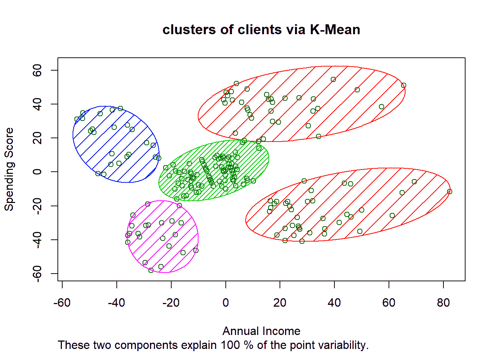

# 以客户为中心的营销人员如何使用机器学习

> 原文：<https://towardsdatascience.com/how-customer-centric-marketers-use-machine-learning-387df1a33850?source=collection_archive---------31----------------------->

## 在你的营销策略中利用 ML 不再是一种奢侈，而是一种必需

在 [Unsplash](https://unsplash.com?utm_source=medium&utm_medium=referral) 上由 [Austin Distel](https://unsplash.com/@austindistel?utm_source=medium&utm_medium=referral) 拍摄的照片

营销是任何成功公司的一个重要方面。简单地说，市场营销是指与购买和销售产品或服务相关的业务活动。

# **以客户为中心**

“以客户为中心”是将客户放在第一位，放在业务的核心位置，以提供最佳体验并建立长期关系。

一个以客户为中心的组织**将客户体验作为核心价值，这有助于领导层的决策过程，反映员工支持的信念，并为当前和潜在的客户提供清晰度。**

# **以客户为中心的营销**

以客户为中心的营销是一种在所有与广告、销售和推广产品和服务相关的决策中优先考虑客户需求和利益的方法。

对于成功的以客户为中心的营销，你需要深刻理解这个问题:为什么你的客户需要你的产品或服务？目标不仅仅是业务增长；它是由说服客户相信无论你的公司提供什么都能改善他们工作或生活的某个方面而驱动的增长。

# **机器学习——人工智能的子集**

**人工智能(AI)** —是一个计算机科学领域，专注于让机器看起来像拥有人类智能。之所以称之为“人造”，是因为人类创造了它，它不是自然存在的。

**机器学习(ML)** 是 AI 的一个子集。ML 算法是以数据集作为输入的计算机可实现的指令。他们在数据集中找出以前未被发现的模式。

**有监督的 ML** 是当这些模式导致数据上的一些标签，你的 ML 模型学习如何将每个唯一的模式映射到最合适的标签。这种类型的 ML 用于预测无标签数据的标签。

**无监督 ML** 是你的模型把发现的模式呈现给用户，提供洞察。

随着时间的推移，当遇到越来越多的数据时，ML 模型会提高其性能。他们通过经验提高，就像一个人通过仔细观察和自我纠正沉迷于一项新活动时一样。

# **以客户为中心营销的机器学习**

随着竞争变得越来越激烈，消费者现在有更多的业务选择，使 ML 评估有效地接触和吸引您的客户。

所有的企业主都注意到了在营销中围绕人工智能的越来越多的炒作。人工智能在市场营销中的应用包括聊天机器人、内容创建、程序化广告等等。

市场营销中有如此多的人工智能应用，你永远不应该忽视实施有效和优化的市场营销策略的关键，即深入和清晰地了解你的客户。

一旦你的 ML 模型训练有素，它可以快速地对任何新的数据输入进行分类，并预测可能的结果。您可以获得更深入的客户洞察，并做出更好的行为预测。

这些可能与您的潜在客户和客户在某些活动中转化的可能性、增加他们的购买频率、流失或失效，或者更具体的事情有关。

在你的营销策略中利用 ML 不再是一种奢侈。相反，它已经成为一种必然。

让我们来看看营销人员利用 ML 驱动的洞察力来制定以客户为中心的最佳营销策略。

# **行为洞察和预测**

您的客户的哪些行为模式导致他们在过去采取了特定的行动？

结束与你的关系的客户是否与那些仍然忠诚于你的客户形成了明显不同的行为模式？

对于一个人来说，想弄清楚并研究所有这些模式并不容易。这一切背后的数学非常复杂。

因此，您的 ML 模型负责这项任务。它可以检测出客户的哪条信息对他们采取特定行动(如搅动)的决定产生了多大影响。

在客户采取行动之前预测他们的行动是很重要的，尤其是当行动是**不可逆转的**时。失去客户是不可逆转的损失。你永远不应该开始面对损失，然后开始考虑减少和防止它。

监督 ML 算法可以发现隐藏在客户数据深处的预测模式。

您可以使用它们来找出哪些潜在客户最有可能成为您的客户，方法是根据以前成功转化为客户的潜在客户和失去的潜在客户的数据来训练您的模型。

一旦您的模型经过训练，您的模型就可以将潜在客户的数据作为输入，并预测新线索与过去成功转化为客户的线索的最佳“外观”程度。

同样，你可以使用监督 ML 来预测客户是否有可能[流失](https://ai.inqline.com/ml-for-marketing-customer-churn/)。您可以根据那些已经流失的客户和那些仍然活跃的客户的数据来训练您的模型。

然后，您的模型可以将当前客户的数据作为输入，并计算出是否有任何客户的数据显示出与流失客户的数据相似的模式。

对客户行为的预测可以让你根据他们在客户之旅中所处的阶段，想出最有效的营销活动。

# **基于人物角色的洞察和预测**

尽管预测客户的下一步行动非常有助于在正确的时间接触到正确的人，但这并不是真正优化营销之路的终点。

为了有效地与你的客户互动，你需要把他们当成真实的人来了解。然后，你将能够提供超个性化的体验，唤起情感反应。

如果你能向你的观众展示你非常了解他们与你互动的原因，无论他们是早期潜在客户还是忠实客户，你和你的客户之间的关系和信任都会变得更加牢固。

# **市场细分**

[客户细分](https://ai.inqline.com/machine-learning-for-marketing-customer-segmentation/)就是把你的客户进行细分。基于用于执行细分过程的数据，来自一个细分市场的客户与来自另一个细分市场的客户显著不同。

无人监管的 ML 在这里发挥作用。聚类算法，如 K-Means，是无监督 ML 的一部分，用于发现未标记数据集中的隐藏模式，并对非常相似的数据点进行分组。

[图像信用](https://www.andreaperlato.com/mlpost/customer-segmentation/)

上图展示了一个非常简单的使用 ML 形成集群的例子。数据集包括关于每个客户的两条信息(属性)。

基于这些属性的值，每个客户在上面的二维表示中占据其独特的位置。它是二维的，因为有两个属性。

该算法的任务是找出如何将这些数据点分组到由该算法的用户明确提供的数字中。

由此产生的群体或集群，可以形成公正的、真正数据驱动的人物角色的基础。随着您继续工作并收集更多数据，重新运行聚类算法可能会在您的客户中发现新的群体。

因此，您将能够更新您的知识，更新您的消息传递、创意和其他个性化工作，以始终与您的客户群保持相关。

让我们告诉你一个有趣的例子，它将阐明聚类如何在营销中实现以客户为中心。颠覆性的直接面向消费者的家具品牌 Burrow 采用 ML 驱动的人物角色来识别其受众群体在定向广告中看到的颜色。

他们发现，住在独栋住宅、带着孩子的老年顾客更倾向于购买深色沙发。

住在公寓里、很少或没有孩子的年轻顾客可能会购买浅色沙发。

这些见解使陋居能够向拥有这些属性的观众推出反映这些属性的创意。

# **结论—机器学习的使用为公司节省了数百万美元**

尽管许多复杂的人工智能应用程序需要更多年甚至几十年才能完全开发出来，但 ML 的民主化使营销团队能够产生预测性的客户洞察，而无需花费数百万美元聘请昂贵的顾问或雇佣大型数据科学团队。

现在是你探索这个选择的时候了。